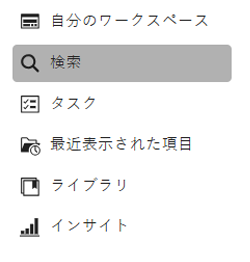
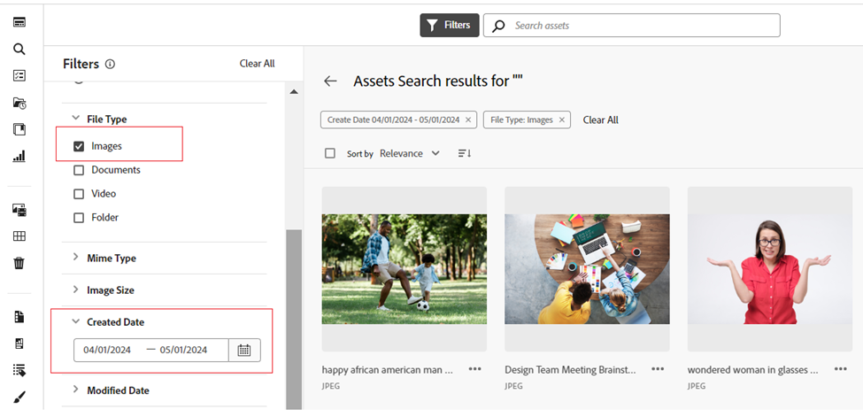

# [!DNL Assets view] でアセットを検索 {#search-assets}

>[!CONTEXTUALHELP]
>id="assets_search"
>title="アセットの検索"
>abstract="検索バーでキーワードを指定するか、ステータス、ファイルタイプ、MIME タイプ、サイズ、作成日、変更日および有効期限に基づいてアセットをフィルタリングして、アセットを検索します。標準フィルターに加えて、カスタムフィルターを適用することもできます。フィルタリングした結果は、保存した検索条件またはスマートコレクションとして保存できます。"
>additional-url="https://experienceleague.adobe.com/docs/experience-manager-assets-essentials/help/manage-collections.html?lang=ja#manage-smart-collection" text="スマートコレクションを作成"

[!DNL Assets view] では効果的な検索が可能です。この検索はデフォルトで機能します。フルテキスト検索なので、網羅的に検索できます。この強力な検索機能を使用すると、適切なアセットをすばやく発見できるので、コンテンツベロシティ（コンテンツ創出の速度）の向上に役立ちます。[!DNL Assets view] では、フルテキスト検索を行えるほか、スマートタグ、タイトル、作成日、著作権などのメタデータを検索することもできます。

アセットを検索するには：

* ページ上部の検索ボックスをクリックします。デフォルトでは、現在参照しているフォルダー内を検索します。次のいずれかの操作を行います。

  

   * キーワードを使用して検索します。オプションで、フォルダーを変更することもできます。Return キーを押します。

   * 最近表示されたアセットを直接検索して、操作を開始します。検索ボックス内をクリックし、最近表示されたアセットを候補から選択します。

## 検索結果のフィルタリング {#refine-search-results}

以下のパラメーターに基づいて検索結果をフィルタリングできます。

*図：検索したアセットを様々なパラメーターに基づいてフィルタリング*

* アセットステータス：`Approved`、`Rejected`、または `No Status` アセットステータスを使用した検索結果のフィルタリング。

* ファイルタイプ：サポートされているファイルタイプ（`Images`、`Documents`、`Videos`）で検索結果をフィルタリングします。
* MIME タイプ：サポートされている 1 つ以上のファイル形式でフィルタリングします。<!-- TBD:  [supported file formats](/help/using/supported-file-formats.md). -->
* 画像サイズ：画像をフィルタリングするための最小サイズと最大サイズのどちらか一方または両方を指定します。サイズはピクセル単位で指定され、画像のファイルサイズではありません。
* 作成日：アセットの作成日（メタデータで指定されたもの）。標準の日付形式は `yyyy-mm-dd` です。
* 変更日：アセットの最終変更日。標準の日付形式は `yyyy-mm-dd` です。

* 有効期限：アセットの `Expired` ステータスに基づいて検索結果をフィルタリングできます。また、アセットの有効期限の日付範囲を指定して、検索結果をさらにフィルタリングすることもできます。

* カスタムフィルター：アセットビューのユーザーインターフェイスに[カスタムフィルターを追加](#custom-filters)します。標準フィルターに加えて、カスタムフィルターを適用し、検索結果を絞り込むことができます。

検索したアセットを、`Name`、`Relevance`、`Size`、`Modified` および `Created` の昇順または降順に並べ替えることができます。デフォルトでは、検索したアセットは `Relevance` に基づいて並べ替えられます。

## カスタムフィルターの管理 {#custom-filters}

**必要な権限：** `Can Edit`、`Owner` または管理者。

アセットビューでは、ユーザーインターフェイスにカスタムフィルターを追加することもできます。[標準フィルター](#refine-search-results)に加えて、カスタムフィルターを適用し、検索結果を絞り込むことができます。

アセットビューが提供するカスタムフィルターは次のとおりです。

<table>
    <tbody>
     <tr>
      <th><strong>カスタムフィルター名</strong></th>
      <th><strong>説明</strong></th>
     </tr>
     <tr>
      <td>タイトル</td>
      <td>アセットタイトルを使用してアセットをフィルタリングします。大文字と小文字を区別する検索条件で指定するタイトルは、結果に表示されるアセットの正確なタイトルと一致する必要があります。</td>
     </tr>
     <tr>
      <td>名前</td>
      <td>アセットファイル名を使用してアセットをフィルタリングします。大文字と小文字を区別する検索条件で指定する名前は、結果に表示されるアセットの正確なファイル名と一致する必要があります。</td>
     </tr>
     <tr>
      <td>アセットサイズ</td>
      <td>アセットをフィルタリングするには、検索条件でアセットに表示するサイズ範囲をバイト単位で指定します。</td>
     </tr>
     <tr>
      <td>予測されるタグ</td>
      <td>アセットスマートタグを使用してアセットをフィルタリングします。大文字と小文字を区別する検索条件で指定するスマートタグ名は、結果に表示されるアセットの正確なスマートタグ名と一致する必要があります。検索条件に複数のスマートタグを指定することはできません。</td>
     </tr>    
    </tbody>
   </table>

<!--
   You can use a wildcard operator (*) to enable Assets view to display assets in the results that partially match the search criteria. For example, if you define <b>ma*</b> as the search criteria, Assets view displays assets with title, such as, market, marketing, man, manchester, and so on in the results.

   You can use a wildcard operator (*) to enable Assets view to display assets in the results that partially match the search criteria.

   You can use a wildcard operator (*) to enable Assets view to display assets in the results that partially match the search criteria. You can specify multiple smart tags separated by a comma in the search criteria.

   -->

### カスタムフィルターの追加 {#add-custom-filters}

カスタムプロパティを追加する手順は次のとおりです。

1. 「**[!UICONTROL フィルター]**」をクリックします。

1. 「**[!UICONTROL カスタムフィルター]**」セクションで、「**[!UICONTROL 編集]**」または「**[!UICONTROL フィルターを追加]**」をクリックします。

   

1. **[!UICONTROL カスタムフィルター管理]**&#x200B;ダイアログボックスで、既存のフィルターのリストに追加するフィルターを選択します。「**[!UICONTROL カスタムフィルター]**」を選択して、すべてのフィルターを選択します。

1. 「**[!UICONTROL 確認]**」をクリックして、ユーザーインターフェイスにフィルターを追加します。

### カスタムフィルターの削除 {#remove-custom-filters}

カスタムフィルターを削除する手順は次のとおりです。

1. 「**[!UICONTROL フィルター]**」をクリックします。

1. 「**[!UICONTROL カスタムフィルター]**」セクションで、「**[!UICONTROL 編集]**」をクリックします。

1. **[!UICONTROL カスタムフィルター管理]**&#x200B;ダイアログボックスで、既存のフィルターのリストから削除するフィルターを選択解除します。

1. 「**[!UICONTROL 確認]**」をクリックして、ユーザーインターフェイスからフィルターを削除します。

## セマンティック検索 {#semantic-search}

セマンティック検索は、キーワードの完全一致に依存するのではなく、ユーザーのクエリの背後にある意味と意図を理解する高度な検索機能です。人工知能（AI）、自然言語処理（NLP）、機械学習を使用して、より正確でコンテキストに対応した結果を提供します。

正確な用語を検索する従来のキーワードベースの検索とは異なり、セマンティック検索は、単語、概念、ユーザーの意図の関係を解釈します。これにより、クエリの表現が異なる場合や、入力ミスが含まれる場合、別の言語である場合でも、ユーザーが探しているものを確実に見つけることができます。

主なメリットには、次のようなものがあります。

* **多言語サポート**：正確な翻訳を必要とせずに複数の言語をまたいで検索します。ユーザーは、クエリ言語に関係なく、関連するコンテンツを見つけることができます。

* **スペルミスの処理**：入力ミスやスペルエラーを自動的に修正または解釈し、不完全な入力でも正確な結果が得られるようにします。

* **同義語の理解**：関連する用語やフレーズの結果を提供するので、ユーザーは正しいキーワードを推測する必要がありません。

* **コンテキスト対応検索**：単語だけでなく、クエリの背後にある意図を認識します。

* **テキストベースのプロンプトに基づく検索**：Experience Manager Assets では、コンテンツにフィルターを適用し、シンプルなテキストベースのプロンプトに基づいて適切な結果を自動的に表示します。

>[!IMPORTANT]
>
> セマンティック検索では、3 つ以上の単語を指定することで適切な結果が表示されます。

### セマンティック検索の例 {#examples-semantic-search}

**プロンプトの例**：*コーヒーを飲む女性*

従来のキーワードベースの検索では、女性、コーヒーなど、アセットメタデータの完全一致が検索され、これらのキーワードを含むアセットが返されます。

一方、セマンティック検索では、`Woman` の場合は `Girl`、`Lady`、`Coffee` の場合は `Cappuccino`、`Latte` など、類似の単語が検索されます。

同様に、このプロンプトをスペイン語で指定したり、`Woman` を `Wman` とスペルミスしたりしても、同じ結果が得られます。

## [!DNL Adobe Firefly] を使用したアセット検索 {#search-firefly}

[!DNL Experience Manager Assets] 内の [!DNL Adobe Firefly] アセット検索機能を利用して、どのアセットフォルダーにもないアセットを検索できます。これにより、アセットフォルダーに保存されていないアセットをリアルタイムで効率的に生成できます。

### 事前準備 {#search-assets-firefly-prereqs}

アクティブな [!DNL Adobe Express] サブスクリプションが必要です。

### アセットの生成 {#generate-assets-firefly}

[!DNL Adobe Firefly] を使用して新しいアセットを生成するには、次の手順に従います。

1. [!DNL AEM Assets] ワークスペースに移動します。

1. 検索バーにアセット名を入力します。例えば、キーワード `Bugatti Type 57` を使用してアセットを検索できます。アセットを検索する際に、どのアセットフォルダーにもアセットが存在しないので、結果は見つかりません。AI を使用してアセットを生成するには、「**[!UICONTROL Firefly を使用して生成]**」をクリックします。[!DNL Adobe Firefly] 画面が表示されます。

   

   新しいアセットが正常に生成されました。さらに、説明ボックスに新しいテキストプロンプトを入力して、画像の説明を変更できます。[優れた AI プロンプトを記述して、高品質で関連性の高いコンテンツを生成する方法を説明します](https://helpx.adobe.com/jp/firefly/using/tips-and-tricks.html)。または、[スタイルの変更や画像のサイズの変更など、他の様々な機能を使用して画像を編集](https://helpx.adobe.com/jp/firefly/using/text-to-image.html)できます。

   

1. 保存する画像を選択します。**[!UICONTROL 保存]**&#x200B;をクリックして、アクセスしやすいようにアセットを目的のフォルダーに保存します。

1. アセットを保存フォームが表示されます。次のフィールドを指定します。

   * 「**名前を付けて保存**」フィールドにファイルの名前を入力します。
   * 宛先フォルダーを選択します。
   * プロジェクトまたはキャンペーンの名前、キーワード、チャネル、時間枠、地域などの詳細を入力します。

   

1. 「**新しいアセットとして保存**」をクリックして、アセットを保存します。

### アセットのアップロード {#upload-assets-firefly}

生成したアセットをアセットリポジトリにアップロードするには、次の手順に従います。

1. 「**[!UICONTROL アップロード]**」をクリックします。
1. アセットをアップロードする必要があるアセットフォルダーを選択し、「**[!UICONTROL フォルダーを選択]**」をクリックします。
   

## 保存済みの検索 {#saved-search}

[!DNL Assets view] の検索機能は非常に使いやすくなっています。検索ボックス内に、キーワードを入力し、Return キーを押して結果を表示できるだけでなく、最近検索したキーワードを 1 回クリックするだけですばやく再検索することもできます。

また、アセットのメタデータやタイプに関する特定の条件に基づいて検索結果をフィルタリングすることもできます。特定のフィルターを頻繁に使用する場合、[!DNL Assets view] では、検索性を向上させるために、検索パラメーターを保存できます。その場合、保存済みの検索を選択し、1 回クリックするだけで検索してフィルターを適用することができます。

保存した検索条件を作成するには、アセットを検索し、1 つ以上のフィルターを適用して、[!UICONTROL フィルター]パネルの&#x200B;**[!UICONTROL 別名で保存]**／**[!UICONTROL 保存した検索条件]**&#x200B;をクリックします。また、「**[!UICONTROL 別名で保存]**」をクリックし、「**[!UICONTROL スマートコレクション]**」を選択して、結果をスマートコレクションとして保存することもできます。詳しくは、[スマートコレクションの作成](manage-collections.md#create-a-smart-collection)を参照してください。

<!-- TBD: Search behavior. Full-text search. Ranking and rank boosts. Hidden assets.
Report poor UX that users can only save a filtered search and not a simple search.
.
Are other supported files fully indexed and support full-text search? Eg. audio/videos files can at best have metadata indexed.
Anything about ranking of assets displayed in search results?

What about temporarily hiding an asset (suspending search on it) from the search results? If an asset is undergoing review collaboration, should it be used by others? Should it be hidden in search?

When userA is searching and userB add an asset that matches search results, will the asset display in search as soon as userA refreshes the page? Assuming indexing is near real-time. May not be so for bulk uploads.
-->

## 検索結果の操作 {#work-with-search-results}

検索結果に表示するアセットを選択し、次の操作を実行できます。

* **類似の画像を検索**：Assets UI で、メタデータとスマートタグに基づいて類似の画像アセットを検索します。

* **詳細**：アセットのプロパティを表示および編集します。

* **ダウンロード**：アセットをダウンロードします。

* **コレクションに追加**：選択したアセットをコレクションに追加します。

* **クイックアクセスにピン留め**：[アセットをピン留め](my-workspace-assets-view.md)すると、後で必要になった際に、すばやくアクセスできるようになります。ピン留めしたすべての項目は、マイワークスペースの「**クイックアクセス**」セクションに表示されます。

* **Adobe Express で開く**：Experience Manager Assets 画面から統合された Adobe Express で画像を編集します。

* **編集**：Adobe Express を使用して画像を編集します。

* **リンクを共有**：他のユーザーとアセットの[リンクを共有](share-links-for-assets-view.md)して、アセットにアクセスしてダウンロードできるようにします。

* **削除**：アセットを削除します。

* **コピー**：別のフォルダーの場所にアセットをコピーします。

* **移動**：アセットを別のフォルダーの場所に移動します。

* **名前を変更**：アセットの名前を変更します。

* **ライブラリにコピー**：アセットをライブラリに追加します。

* **タスクを割り当て**：アセットのユーザーにタスクを割り当てます。

* **監視**：アセットに対して実行される[操作を監視](https://experienceleague.adobe.com/ja/docs/experience-manager-cloud-service/content/assets/manage/search-assets)します。

## 最初に検索するホームページの設定 {#configuring-search-first-homepage}

アセットビューを使用すると、組織のデフォルトのランディングページを選択できます。最初に検索をホームページとして使用する場合、ブランドに合わせて背景画像とロゴ画像を設定し、ページのブランディングを調整するオプションもあります。

最初に検索するホームページを設定するには、次の手順を実行します。

1. **[!UICONTROL 設定]**／**[!UICONTROL 一般設定]**&#x200B;に移動します。
1. 「**[!UICONTROL 最初に検索]**」を選択します。これにより、「最初に検索」に関連する設定が開きます。ホームページの[位置](#setting-alignment-search-bar)または[背景画像とロゴ画像の設定](#setting-background-image-and-logo)を設定できます。

### 検索バーの位置の設定 {#setting-alignment-search-bar}

[!DNL Assets view] を使用すると、検索バーの位置を変更できます。検索バーは中央または上部に表示できます。適切な位置を選択し、「**[!UICONTROL 保存]**」をクリックします。

### ホームページの背景画像とロゴ画像の設定 {#setting-background-image-and-logo}

最初に検索するホームページにブランドのロゴ画像と背景画像を追加できます。次の手順を実行します。

1. **[!UICONTROL ホームページ]**&#x200B;の「**[!UICONTROL 背景画像とロゴ画像]**」セクションに移動します。
1. 「**[!UICONTROL 置換]**」をクリックして、既存のアセットリポジトリから画像を参照します。
1. 「**[!UICONTROL 保存]**」をクリックします。変更を[プレビュー](#preview-configured-homepage)して、変更内容を確認します。

### 設定済みのホームページのプレビュー {#preview-configured-homepage}

最初に検索するホームページのレイアウトと書式設定をプレビューして確認できます。**[!UICONTROL プレビュー]**&#x200B;を使用すると、レイアウトを修正したり、要件に応じて変更を加えたりできます。設定済みのホームページをプレビューするには、次の手順を実行します。

1. 「**[!UICONTROL 一般設定]**」をクリックし、「**[!UICONTROL 最初に検索]**」を選択します。
1. **[!UICONTROL 最初に検索するホームページをカスタマイズ]**&#x200B;に移動し、「**[!UICONTROL プレビュー]**」をクリックします。「**[!UICONTROL ダークテーマ]**」ボタンを切り替えて、ダークテーマまたはライトテーマでホームページをプレビューします。
1. 「**[!UICONTROL 閉じる]**」をクリックし、プレビュー画面を閉じます。

   

## コンテキスト検索 {#contextual-search}

また、テキストプロンプトを定義して、リポジトリで使用可能なアセットを検索することもできます。Experience Manager Assets は、これらのテキストプロンプトを検索フィルターに自動変換し、検索結果を表示します。フィルターペインを使用して自動フィルターを表示および変更すると、検索結果をさらに絞り込むことができます。

### コンテキスト検索へのアクセス {#access-contextual-search}

Experience Manager Assets でコンテキスト検索にアクセスするには、次の手順に従います。

1. 左側のペインで「**[!UICONTROL 検索]**」をクリックします。

   

1. 検索テキストボックスでテキストプロンプトを定義し、「**[!UICONTROL コンテキスト検索]**」をクリックします。

   

   [!DNL Experience Manager Assets] に検索結果が表示されます。

### サポートされるフィルター {#supported-filters}

コンテキスト検索では、すぐに使用できる次のフィルターをサポートしています。これらのフィルターに基づいてテキストプロンプトを作成し、適切な検索結果を表示します。

* 画像の高さ

* 画像の幅

* ファイルタイプ：画像、ドキュメント、ビデオまたはフォルダー。

* MIME タイプ：JPG、PNG、TIFF、GIF、MP4、PDF、PPTX、DOCX または XLSX

* 作成日

* 変更日

* 有効期限

* アセットステータス：承認済み、却下またはすべて

* 有効期限切れのアセット

### テキストプロンプトの例 {#text-prompts-examples}

**例 1**

**テキストプロンプト**：今月作成された画像。

[!DNL Experience Manager Assets] は次のフィルターを自動的に適用し、検索結果を表示します。

**例 2**

**テキストプロンプト**：高さ 200 ピクセル、幅 100 ピクセル以上で、ビーチと澄んだ空の画像。

[!DNL Experience Manager Assets] は、次のフィルターを自動的に適用し、検索結果を表示します。

**例 3**

**テキストプロンプト**：高さが 1500 および 2500 ピクセルで、過去 1 か月以内に作成された、期限内の承認された青空の画像が必要です。

[!DNL Experience Manager Assets] は、次のフィルターを自動的に適用し、検索結果を表示します。

次のビデオでは、コンテキスト検索ユーザーインターフェイスへのアクセスから、テキストプロンプトの定義、検索結果の表示までのエンドツーエンドのプロセスを説明します。

>[!VIDEO](https://video.tv.adobe.com/v/3428407)

### コンテキスト検索を無効にする {#disable-contextual-search}

管理者には、組織内のユーザーのコンテキスト検索を無効にするオプションも用意しています。これを行うには、次の手順を実行します。

1. **[!UICONTROL 設定]**／**[!UICONTROL 一般設定]**&#x200B;に移動します。

1. 「[!UICONTROL コンテキスト検索]」セクションで、**[!UICONTROL 組織のコンテキスト検索を有効にする]**&#x200B;切替スイッチをオフにして、組織内のすべてのユーザーに対してコンテキスト検索機能を無効にします。

### コンテキスト検索のフィードバック {#contextual-search-feedback}

コンテキスト検索機能に関するフィードバックを提供する必要がある場合は、、フィードバックアイコンの順にクリックします。フィードバックの種類を選択し、件名と説明を指定して、「**[!UICONTROL 送信]**」をクリックします。

## 次の手順 {#next-steps}

* [ビデオを試聴してアセットビューでのアセットの検索を学ぶ](https://experienceleague.adobe.com/docs/experience-manager-learn/assets-essentials/basics/using.html?lang=ja)

* アセットビューのユーザーインターフェイスの「[!UICONTROL フィードバック]」オプションを使用して製品に関するフィードバックを提供する

* 右側のサイドバーにある「[!UICONTROL このページを編集]」  または「[!UICONTROL イシューを記録]」  を使用してドキュメントのフィードバックを提供する。

* [カスタマーケア](https://experienceleague.adobe.com/?support-solution=General&lang=ja#support)に問い合わせる

