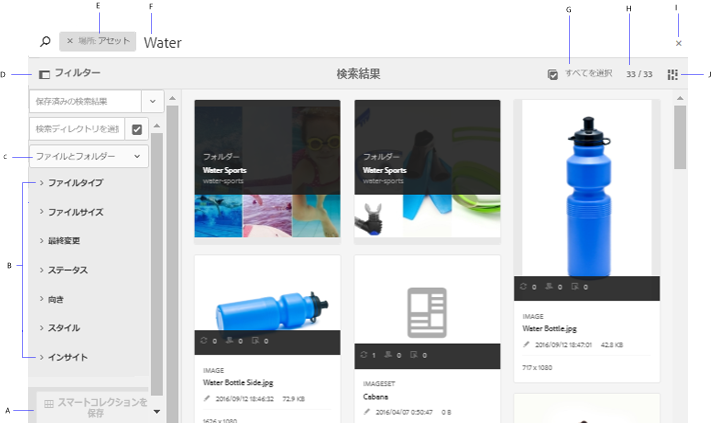
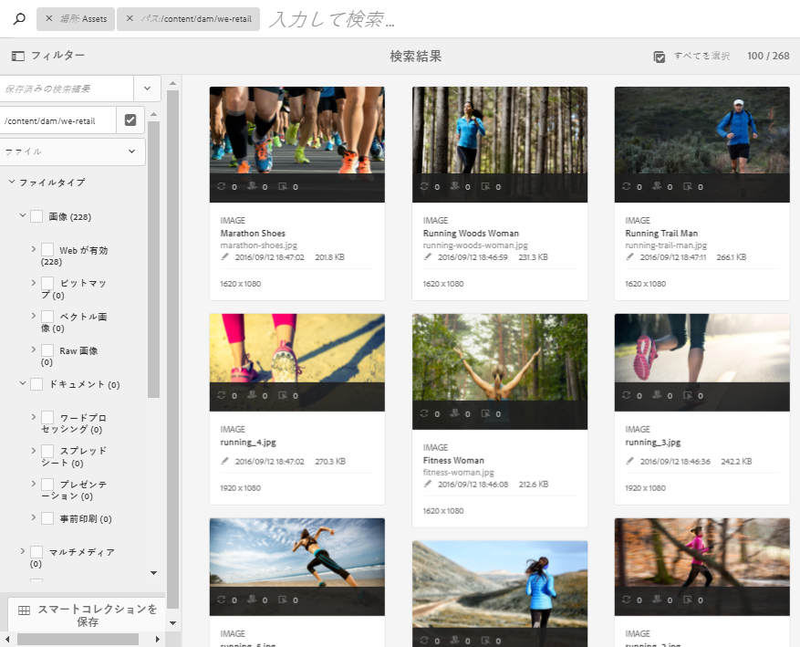
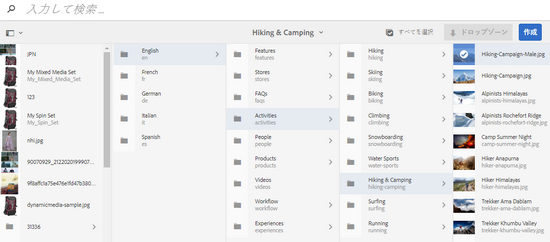

# [!DNL Adobe Experience Manager] {#search-assets-in-aem}内のアセットを検索

[!DNL Adobe Experience Manager Assets] は、高いコンテンツ速度を達成するのに役立つ堅牢なアセット検出方法を提供します。標準搭載の機能とカスタム方法を使用すると、シームレスでインテリジェントな検索エクスペリエンスでチームが市場投入までの時間を短縮できます。アセットの検索は、デジタルアセット管理システムの利用の中核を成します。用途は、クリエイティブ担当者によるさらなる利用、ビジネスユーザーやマーケティング担当者によるアセットの堅牢な管理、DAM 管理者による管理などです。[!DNL Assets]ユーザーインターフェイスや他のアプリケーションやサーフェスを介して実行できる、シンプル、高度、カスタムの検索を使用して、これらの使用例を満たすことができます。

[!DNL Experience Manager Assets] は次の使用例をサポートしています。ここでは、これらの使用例での使用法、概念、設定、制限事項、トラブルシューティングについて説明します。

| アセットの検索 | 設定と管理 | 検索結果の操作 |
|---|---|---|
| [基本検索](#searchbasics) | [検索インデックス](#searchindex) | [結果の並べ替え](#sort) |
| [検索 UI について](#searchui) |  | [アセットのプロパティとメタデータの確認](#checkinfo) |
| [検索候補](#searchsuggestions) | [必須メタデータ](#mandatorymetadata) | [ダウンロード](#download) |
| [検索結果および動作について](#searchbehavior) | [検索ファセットの変更](#searchfacets) | [メタデータの一括更新](#metadataupdates) |
| [検索ランキングおよびブースト](#searchrank) | [テキスト抽出](#extracttextupload) | [スマートコレクション](#collections) |
| [詳細検索：検索のフィルタリングと範囲](#scope) | [カスタム述語](#custompredicates) | [予期しない結果の把握とトラブルシューティング](#unexpectedresults) |
| [他のソリューションおよびアプリから検索](#beyondomnisearch):<ul><li>[Adobe Asset Link](#aal)</li><li>[Brand Portal](#brandportal)</li><li>[Experience Managerデスクトップアプリ](#desktopapp)</li><li>[Adobe Stock 画像](#adobestock)</li><li>[Dynamic Media アセット](#dynamicmedia)</li></ul> |  |  |
| [アセットセレクター](#assetselector) |  |  |
| [制限事項](#tips)と[ヒント](#limitations) |  |  |
| [例を使った説明](#samples) |  |  |

[!DNL Experience Manager] Webインターフェイスの上部にあるOmnisearchフィールドを使用してアセットを検索します。 [!DNL Experience Manager]の&#x200B;**[!UICONTROL アセット]**/**[!UICONTROL ファイル]**&#x200B;に移動し、上部のバーのをクリックし、検索キーワードを入力して、Returnキーを押します。 または、キーワードショートカット `/`（スラッシュ）を使用して、オムニサーチフィールドを開きます。`Location:Assets` が事前に選択されており、DAM アセットの検索に制限されています。[!DNL Experience Manager] 開始が検索キーワードを入力する際に、サーチクエリを表示します。

アセット、フォルダー、タグおよびメタデータを検索するには、**[!UICONTROL フィルター]**&#x200B;パネルを使用します。ファイルタイプ、ファイルサイズ、最終変更日、アセットのステータス、インサイトデータ、Adobe Stock ライセンスなどの、様々なオプション（述部）に基づいて検索結果をフィルタリングできます。フィルターパネルをカスタマイズし、[検索ファセット](/help/assets/search-facets.md)を使用して、検索述語を追加または削除できます。 [!UICONTROL フィルター]パネルの[!UICONTROL ファイルタイプ]フィルターには、混在状態のチェックボックスがあります。 したがって、すべてのネストされた述語（またはフォーマット）を選択しない限り、第1レベルのチェックボックスは部分的にチェックされます。

[!DNL Experience Manager] 検索機能では、コレクションの検索とコレクション内のアセットの検索をサポートしています。詳しくは、[コレクションの検索](/help/assets/manage-collections.md)を参照してください。

## 検索インターフェイスについて {#searchui}

検索インターフェイスと使用可能なアクションについて理解します。

*図：検索結果インター [!DNL Experience Manager Assets] フェイスを理解する。*

**A.検索をスマートコレクションとして** 保存します。**B.検索結果を絞り込むための** フィルターまたは予測&#x200B;**C.** 表示ファイル、フォルダ、またはその両方。**D：**「フィルター」をクリックすると、左側のパネルが開くまたは閉じます。**E：** DAM が検索場所になります。**F.** Omnisearchフィールドにユーザが入力する検索キーワードを入力します。**G.ロードされた検索結果を** 選択します。**H.検索結果の合計** 数の中で検索結果が表示される回数&#x200B;**I.検索を** 閉じます。**J.カードの表示とリストの表示を** 切り替えます。

### 動的検索ファセット {#dynamicfacets}

検索ファセット内で予想される検索結果の数は動的に更新されますが、この数を使用して、検索結果ページから目的のアセットをより迅速に見つけることができます。検索フィルターを適用する前であっても、予想されるアセット数は更新されます。フィルターに対して予想されるアセット数を確認すると、検索結果をすばやく効率的にナビゲートすることができます。

*図：検索結果を検索ファセットでフィルタリングせずに、およそのアセット数を確認します。*

## 入力に応じて提示される検索候補 {#searchsuggestions}

キーワードの入力を開始すると、可能な検索キーワードまたは語句が候補として提示されます。候補は AEM 内のアセットに基づいています。AEM では、検索に役立つすべてのメタデータフィールドのインデックスを作成します。検索候補を提示するために、以下のいくつかのメタデータフィールドの値が使用されます。検索候補の提示をおこなう場合は、次のフィールドに適切なキーワードを入力することを検討してください。

* アセットのタグ（`jcr:content/metadata/cq:tags` にマッピングされます）
* アセットのタイトル（`jcr:content/metadata/dc:title` にマッピングされます）
* アセットの説明（`jcr:content/metadata/dc:description` にマッピングされます）
* JCR リポジトリ内でのタイトル。この値はアセットのタイトルにマッピングされる可能性があります（`jcr:content/jcr:title` にマッピングされます）
* JCR リポジトリ内での説明。この値はアセットの説明にマッピングされる可能性があります（`jcr:content/jcr:description` にマッピングされます）

## 検索結果および動作について {#searchbehavior}

### 基本的な検索用語と検索結果 {#searchbasics}

オムニサーチフィールドからキーワード検索を実行できます。キーワード検索は、大文字と小文字が区別されません。また、（よく使用されるメタデータフィールド全体にわたる）フルテキスト検索です。 複数のキーワードを使用する場合は、`AND` がキーワード間のデフォルトの演算子になります。

結果は、最も近い一致を先頭に関連性の高い順に並べ替えられます。複数のキーワードがある場合は、メタデータに含まれるキーワードが多いアセットが、より関連性の高い結果になります。メタデータ内では、スマートタグとして表示されるキーワードは、他のメタデータフィールドに表示されるキーワードより高くランク付けされます。[!DNL Experience Manager] では、特定の検索用語に、より高い重みを付けることができます。また、特定の検索用語に対して、ターゲットアセットの一部のランク[を&lt;a0/>上げることもできます。](#searchrank)

関連性の高いアセットをすばやく見つけるために、この機能豊富なインターフェイスには、フィルタリング、並べ替え、選択のメカニズムが用意されています。複数の条件に基づいて結果をフィルタリングし、検索されたアセットの数を様々なフィルター別に確認できます。または、オムニサーチフィールドのクエリを変更して検索を再実行することもできます。検索用語やフィルターを変更しても、その他のフィルターは依然として適用され、検索のコンテキストが保たれます。

結果が多数のアセットである場合、[!DNL Experience Manager]は最初の100をカード表示に、200をリスト表示に表示します。 ユーザがスクロールすると、読み込まれるアセットが増えます。 これは、パフォーマンスを向上させるためです。 [表示されるアセット数](https://www.youtube.com/watch?v=LcrGPDLDf4o)のデモビデオをご覧ください。

時には、予期しないアセットが検索結果に表示される場合があります。詳しくは、[予期しない検索結果](#unexpectedresults)を参照してください。

AEM では様々なファイル形式を検索でき、ビジネス要件に合わせて検索フィルターをカスタマイズできます。DAM リポジトリの場合に使用できる検索オプションとログイン時の制限事項については、管理者に問い合わせてください。

<!-- 
### Results with and without Enhanced Smart Tags {#withsmarttags}

By default, AEM search combines the search terms with an AND clause. For example, consider searching for keywords woman running. Only the assets with both woman and running keywords in the metadata appear in the search results by default. The same behavior is retained when special characters (periods, underscores, or dashes) are used with the keywords. The following search queries return the same results:

* `woman running`
* `woman.running`
* `woman-running`

However, the query `woman -running` returns assets without `running` in their metadata.
Using smart tags adds an extra `OR` clause to find any of the search terms as the applied smart tags. An asset tagged with either `woman` or `running` using Smart Tags also appear in such a search query. So the search results are a combination of,

* Assets with `woman` and `running` keywords in the metadata (default behavior).

* Assets smart tagged with either of the keywords (Smart Tags behavior).
-->

### 検索ランキングおよびブースト {#searchrank}

メタデータフィールド内のすべての検索用語に一致する検索結果が最初に表示され、スマートタグ内の検索用語のいずれかに一致する検索結果はその後に表示されます。上記の例の場合、検索結果が表示される順序はおおよそ次のようになります。

1. 各種メタデータフィールド内の「`woman running`」に一致するもの。
1. スマートタグ内の「`woman running`」に一致するもの。
1. スマートタグ内の「`woman`」または「`running`」に一致するもの。

特定のアセットに対するキーワードの有効性を高めることで、キーワードに基づいた検索を強化できます。つまり、特定のキーワードを昇格させた場合、それらのキーワードに基づいて検索すると、それらのキーワードの対象となる画像が検索結果の最上部に表示されます。

1. [!DNL Assets]ユーザーインターフェイスから、アセットのプロパティページを開きます。 「**[!UICONTROL 詳細設定]**」をクリックし、「**[!UICONTROL 検索キーワード]**&#x200B;を昇格する」の下の追加「****」をクリックします。
1. 「**[!UICONTROL プロモートを検索]**」ボックスで、画像の検索をブーストするキーワードを指定し、「**[!UICONTROL 追加]**」をクリックします。 同じ方法で複数のキーワードを指定できます。
1. 「**[!UICONTROL 保存して閉じる]**」をクリックします。昇格したこのキーワードの対象となるアセットが、検索結果の上位に表示されます。

ターゲットを絞ったキーワードの検索結果で一部のアセットのランクを上げることで、この機能をうまく利用できます。以下の例（ビデオ）を参照してください。詳しくは、Experience Manager](https://experienceleague.adobe.com/docs/experience-manager-learn/assets/search-and-discovery/search-boost.html)の[検索を参照してください。

>[!VIDEO](https://video.tv.adobe.com/v/16766/?quality=6)

*ビデオ：検索結果のランク付けの方法とランクへの影響について*

## 詳細検索 {#scope}

AEM には、検索したアセットに適用されるフィルターなど、目的のアセットをすばやく見つけるのに役立つ様々な方法が用意されています。一般的に使用されるいくつかの方法を以下で説明します。[動作例](#samples)もいくつか以下に示します。

**ファイルまたはフォルダーの検索**：検索結果には、ファイル、フォルダーまたはその両方が表示されます。**[!UICONTROL フィルター]**&#x200B;パネルから、適切なオプションを選択できます。詳しくは、[検索インターフェイス](#searchui)を参照してください。

**フォルダー内のアセットの検索**：検索対象を特定のフォルダーに限定できます。**[!UICONTROL フィルター]**&#x200B;パネルで、フォルダーのパスを追加します。一度に 1 つのフォルダーのみ選択できます。

フィルターパネルにフォルダーパスを追加して検索結果を特定のフォルダーに限定

<!--
### Find similar images {#visualsearch}

To find images that are visually similar to a user-selected image, click **[!UICONTROL Find Similar]** option from the card view of an image or from the toolbar. AEM displays the smart tagged images from the DAM repository that are similar to a user-selected image. See [how to configure similarity search](#configvisualsearch).

*Figure: Find similar images using the option in the card view*
-->

### Adobe Stock 画像 {#adobestock}

AEM のユーザーインターフェイス内から [Adobe Stock アセット](/help/assets/aem-assets-adobe-stock.md)を検索し、必要なアセットのライセンスを取得できます。オムニサーチバーに「`Location: Adobe Stock`」を追加します。また、フィルターパネルを使用して、ライセンス取得済みまたはライセンス未取得のアセットをすべて検索したり、Adobe Stock ファイル番号を使用して特定のアセットを検索したりすることもできます。

### Dynamic Media アセット {#dmassets}

**[!UICONTROL フィルター]**&#x200B;パネルから **[!UICONTROL Dynamic Media／セット]**&#x200B;を選択して、Dynamic Media 画像をフィルタリングすることができます。画像セット、カルーセル、混在メディアセット、スピンセットなどのアセットがフィルタリングされて表示されます。

### メタデータフィールドの特定の値を使用した検索 {#gqlsearch}

タイトル、説明、作成者など、特定のメタデータフィールドの正確な値に基づいてアセットを検索できます。GQL 全文検索機能では、メタデータ値が検索クエリと完全に一致するアセットのみを取得できます。プロパティの名前（author や title など）と値は、大文字と小文字が区別されます。

| メタデータフィールド | ファセット値と使用法 |
|---|---|
| タイトル | title:John |
| 作成者 | creator:John |
| 場所 | location:NA |
| 説明 | description:&quot;Sample Image&quot; |
| 作成ツール | creatortool:&quot;Adobe Photoshop CC 2015&quot; |
| 著作権の所有者 | copyrightowner:&quot;Adobe Systems&quot; |
| 投稿者 | contributor:John |
| 使用条件 | usageterms:&quot;CopyRights Reserved&quot; |
| 作成日 | created:YYYY-MM-DDTHH |
| 有効期限 | expires:YYYY-MM-DDTHH |
| オンタイム | ontime:YYYY-MM-DDTHH |
| オフタイム | offtime:YYYY-MM-DDTHH |
| 時間の範囲（有効期限、オンタイム、オフタイム） | facet field : lowerbound..upperbound |
| パス | /content/dam/&lt;folder name> |
| PDF タイトル | pdftitle:&quot;Adobe Document&quot; |
| 件名 | subject:&quot;Training&quot; |
| タグ | tags:&quot;Location And Travel&quot; |
| タイプ | type:&quot;image\png&quot; |
| 画像の幅 | width:lowerbound..上の |
| 画像の高さ | height:lowerbound..上の |
| 人 | person:John |

path、limit、size および orderby の各プロパティを他のプロパティと OR で結合することはできません。

ユーザー生成プロパティのキーワードは、プロパティエディターにおけるフィールドラベルからスペースを削除して小文字で表記したものです。

複雑なクエリの検索形式の例：

* 複数のファセットフィールドを持つアセットをすべて表示する（例：title=John Doe および creatortool=Adobe Photoshop）：  `title:"John Doe" creatortool : Adobe*`
* ファセット値が 1 語でなく文になっているアセットをすべて表示する（例：title=Scott Reynolds）：`title:"Scott Reynolds"`
* 1 つのプロパティに複数の値が指定されているアセットを表示する（例：title=Scott Reynolds または John Doe）：`title:"Scott Reynolds" OR "John Doe"`
* プロパティ値が特定の文字列で始まるアセットを表示する（例：title=Scott Reynolds）：`title:Scott*`
* プロパティ値が特定の文字列で終わるアセットを表示する（例：title=Scott Reynolds）：`title:*Reynolds`
* プロパティ値に特定の文字列が含まれるアセットを表示する（例：title=Basel Meeting Room）：`title:*Meeting*`
* 特定の文字列が含まれ、特定のプロパティ値を持つアセットを表示する（例：title=John Doe のアセットで文字列「Adobe」を検索する）：`*Adobe* title:"John Doe"`

## 他の AEM ソリューションまたはインターフェイスからのアセットの検索 {#beyondomnisearch}

Adobe Experience Manager（AEM）では、DAM リポジトリを他の様々な AEM ソリューションに接続して、デジタルアセットにすばやくアクセスできるようにし、クリエイティブワークフローを効率化します。アセットの検出は、参照または検索で始まります。異なるサーフェスやソリューションでも、検索の動作はほとんど同じです。ターゲットオーディエンス、使用例、ユーザーインターフェイスは AEM ソリューションによって異なるので、一部の検索方法はそれに応じて変わります。個々のソリューションの具体的な方法については、以下のリンクを参照してください。ここでは、一般に当てはまるヒントや動作について説明しています。

### Adobe Asset Link パネルからのアセットの検索 {#aal}

クリエイティブプロフェッショナルは、Adobe Asset Link を使用して、サポートされている Adobe Creative Cloud アプリケーション内から、AEM Assets に保存されているコンテンツにアクセスできるようになりました。また、Photoshop、Illustrator、InDesign などの Creative Cloud アプリ内のパネルを使用して、アセットをシームレスに参照、検索、チェックアウトおよびチェックインすることができます。また、Asset Link を使用すると、視覚的に類似した結果を検索できます。ビジュアル検索の表示結果は、Adobe Sensei の機械学習アルゴリズムを活用しており、見た目に類似した画像を見つけやすくなっています。詳しくは、[Adobe Asset Link を使用したアセットの検索と参照](https://helpx.adobe.com/jp/enterprise/using/manage-assets-using-adobe-asset-link.html#UseAdobeAssetLink)を参照してください。

### AEM デスクトップアプリケーションでのアセットの検索 {#desktopapp}

デスクトップアプリケーションを使用すると、クリエイティブプロフェッショナルは、ローカルデスクトップ（Windows または Mac）で AEM Assets を容易に検索および利用できるようになります。目的のアセットを Mac Finder や Windows エクスプローラーで表示し、デスクトップアプリケーションで開き、ローカルで変更することが容易にできます。変更内容は AEM に書き戻され、リポジトリ内に新しいバージョンが作成されます。1 つ以上のキーワード、ワイルドカード * および ？、AND 演算子を使用した基本検索がサポートされています。[デスクトップアプリケーションでのアセットの参照、検索、プレビュー](https://experienceleague.adobe.com/docs/experience-manager-desktop-app/using/using.html#browse-search-preview-assets)を参照してください。

### Brand Portal でのアセットの検索 {#brandportal}

マーケティング担当者や事業部門のユーザーは、Brand Portal を使用して、承認済みのデジタルアセットを、広範な社内チーム、パートナーおよび販売店と効率的かつ安全に共有します。詳しくは、[Brand Portal でのアセットの検索](https://experienceleague.adobe.com/docs/experience-manager-brand-portal/using/search-capabilities/brand-portal-searching.html)を参照してください。

### Adobe Stock 画像の検索 {#adobestock-1}

AEM のユーザーインターフェイス内から Adobe Stock アセットを検索し、必要なアセットのライセンスを取得できます。オムニサーチフィールドに「`Location: Adobe Stock`」を追加します。また、**[!UICONTROL フィルター]**&#x200B;パネルを使用して、ライセンス取得済みまたはライセンス未取得のアセットをすべて検索したり、Adobe Stock ファイル番号を使用して特定のアセットを検索したりすることもできます。詳しくは、[AEM での Adobe Stock 画像の管理](/help/assets/aem-assets-adobe-stock.md#usemanage)を参照してください。

### Dynamic Media アセットの検索 {#dynamicmedia}

**[!UICONTROL フィルター]**&#x200B;パネルから **[!UICONTROL Dynamic Media]**／**[!UICONTROL セット]**&#x200B;を選択して、Dynamic Media 画像をフィルタリングすることができます。画像セット、カルーセル、混在メディアセット、スピンセットなどのアセットがフィルタリングされて表示されます。Web ページの作成時に、作成者はコンテンツファインダー内でセットを検索できます。セットのフィルターは、ポップアップメニューで使用できます。

### Web ページ作成時のコンテンツファインダーでのアセットの検索 {#contentfinder}

作成者は、コンテンツファインダーを使用して関連アセットを DAM リポジトリで検索し、作成中の Web ページで使用できます。

<!-- Authors can also use the Connected Assets functionality to search for assets that are available on a remote AEM deployment. Authors can then use these assets in web pages on a local AEM deployment. See [use remote assets](use-assets-across-connected-assets-instances.md#use-remote-assets).
-->

### コレクションの検索 {#collections}

AEM 検索機能では、コレクションの検索とコレクション内のアセットの検索をサポートしています。詳しくは、[コレクションの検索](/help/assets/manage-collections.md)を参照してください。

## アセットセレクター {#assetselector}

アセットセレクターを使用すると、DAM アセットを特別な方法で検索、フィルタリングおよび参照できます。アセットセレクターは、`https://[aem_server]:[port]/aem/assetpicker.html` で利用できます。アセットセレクターを使用して選択したアセットのメタデータを取得できます。アセットタイプ（画像、ビデオ、テキスト）や選択モード（単一選択または複数選択）など、サポートされているリクエストパラメーターを使用して、アセットセレクターを起動できます。これらのパラメーターは、特定の検索インスタンスのアセットセレクターのコンテキストを設定し、選択がおこなわれている間、変わりません。

アセットセレクターは、HTML5 `Window.postMessage` メッセージを使用して、選択したアセットのデータを受信者に送信します。アセットセレクターは、Granite の基盤ピッカーのボキャブラリに基づいています。デフォルトでは、アセットセレクターは、参照モードで動作します。

次のリクエストパラメーターを URL で渡して、特定のコンテキストでアセットセレクターを起動できます。

| 名前 | 値 | 例 | 目的 |
|---|---|---|---|
| resource suffix (B) | URL のリソースサフィックスとしてのフォルダーパス：[https://localhost:4502/aem/assetpicker.html/&lt;folder_path>](https://localhost:4502/aem/assetpicker.html) | 特定のフォルダーが選択された状態でアセットセレクターを起動するには、例えば、フォルダー /content/dam/we-retail/jp/activities の場合、URL は [https://localhost:4502/aem/assetpicker.html/content/dam/we-retail/en/activities?assettype=images](https://localhost:4502/aem/assetpicker.html/content/dam/we-retail/en/activities?assettype=images) のような形式になります。 | アセットセレクターの起動時に特定のフォルダーを選択する必要がある場合、そのフォルダーをリソースサフィックスとして渡します。 |
| mode | single、multiple | [https://localhost:4502/aem/assetpicker.html?mode=multiplehttps://localhost:4502/aem/assetpicker.html?mode=single](https://localhost:4502/aem/assetpicker.html?mode=multiplehttps://localhost:4502/aem/assetpicker.html?mode=single) | 複数モードでは、アセットセレクターを使用して、いくつかのアセットを同時に選択できます。 |
| mimetype | アセットの MIME タイプ（`/jcr:content/metadata/dc:format`）（ワイルドカードもサポートされています） | <ul><li>[https://localhost:4502/aem/assetpicker.html?mimetype=image/png](https://localhost:4502/aem/assetpicker.html?mimetype=image/png)</li><li>[https://localhost:4502/aem/assetpicker.html?mimetype=*png](https://localhost:4502/aem/assetpicker.html?mimetype=*png)</li><li>[https://localhost:4502/aem/assetpicker.html?mimetype=*presentation](https://localhost:4502/aem/assetpicker.html?mimetype=*presentation)</li><li>[https://localhost:4502/aem/assetpicker.html?mimetype=*presentation&amp;mimetype=*png](https://localhost:4502/aem/assetpicker.html?mimetype=*presentation&amp;mimetype=*png)</li></ul> | MIME タイプに基づいてアセットをフィルタリングするために使用します |
| dialog | true、false | [https://localhost:4502/aem/assetpicker.html?dialog=true](https://localhost:4502/aem/assetpicker.html?dialog=true) | アセットセレクターを Granite ダイアログとして開くには、これらのパラメーターを使用します。このオプションは、Granite パスフィールドを使用してアセットセレクターを起動し、pickerSrc URL として設定する場合にのみ適用できます。 |
| assettype (S) | images、documents、multimedia、archives | <ul><li>[https://localhost:4502/aem/assetpicker.html?assettype=images](https://localhost:4502/aem/assetpicker.html?assettype=images)</li><li>[https://localhost:4502/aem/assetpicker.html?assettype=documents](https://localhost:4502/aem/assetpicker.html?assettype=documents)</li><li>[https://localhost:4502/aem/assetpicker.html?assettype=multimedia](https://localhost:4502/aem/assetpicker.html?assettype=multimedia)</li><li>[https://localhost:4502/aem/assetpicker.html?assettype=archives](https://localhost:4502/aem/assetpicker.html?assettype=archives)</li></ul> | 渡された値に基づいてアセットタイプをフィルタリングするには、このオプションを使用します。 |
| root | &lt;folder_path> | [https://localhost:4502/aem/assetpicker.html?assettype=images&amp;root=/content/dam/we-retail/en/activities](https://localhost:4502/aem/assetpicker.html?assettype=images&amp;root=/content/dam/we-retail/en/activities) | アセットセレクターのルートフォルダーを指定するには、このオプションを使用します。この場合、アセットセレクターを使用すると、ルートフォルダーの下の子アセット（直接／間接）のみを選択できます。 |

アセットセレクターインターフェイスにアクセスするには、`https://[aem_server]:[port]/aem/assetpicker` に移動します。目的のフォルダーに移動して、1 つまたは複数のアセットを選択します。または、オムニサーチボックスから目的のアセットを検索し、必要に応じてフィルターを適用して選択します。

*図：アセットピッカーでのアセットの参照と選択*

## 制限事項 {#limitations}

[!DNL Experience Manager Assets]の検索機能には次の制限があります。

* 検索クエリの先頭にスペースを入れないでください。スペースを入れると、検索が機能しません。
* [!DNL Experience Manager] は、検索結果からアセットのプロパティを選択し、検索をキャンセルした後も、検索語を引き続き表示する場合があります。  <!-- (CQ-4273540) -->
* フォルダーまたはファイルとフォルダーを検索する場合、どのパラメーターでも検索結果を並べ替えることはできません。
* Omnisearchバーに入力せずにReturnキーを押すと、[!DNL Experience Manager]はファイルのみのリストを返し、フォルダーは返しません。 キーワードを使用せずに特にフォルダを検索した場合、[!DNL Experience Manager]は結果を返しません。

ビジュアル検索または類似検索には、次の制限事項があります。

* ビジュアル検索は、より大きなリポジトリで最も有効に機能します。良好な結果を得るために最低限必要な画像数はありませんが、画像の数が少ないと、一致の精度が大きなリポジトリの場合ほど良くない可能性があります。
* モデルを変更したり、[!DNL Experience Manager]をトレーニングして類似の画像を見つけることはできません。 例えば、一部のアセットにスマートタグを追加または削除しても、モデルは変更されません。それらのアセットは、視覚的に類似した検索結果から除外されます。

次のシナリオでは、検索機能のパフォーマンスに制限がある場合があります。

* カード表示の読み込み時間は、検索結果を表示するリスト表示と比較して高速です。

## 検索のヒント {#tips}

* アセットのレビューステータスを監視する場合は、該当するオプションを使用して、承認されているアセットまたは承認待ちのアセットを検索します。
* 様々な Creative アプリから取得した使用状況の統計に基づいて、サポートされるアセットを検索するには、インサイトの述語を使用します。使用状況データが、使用状況スコア、インプレッション数、クリック数およびメディアチャネルでグループ化され、アセットがカテゴリ別に表示されます。
* 「**[!UICONTROL すべて選択]**」チェックボックスを使用して、検索したアセットを選択します。 [!DNL Experience Manager] 最初は、100アセットをカード表示で、200アセットをリスト表示で表示します。検索結果をスクロールすると、読み込まれるアセットが増えます。 読み込まれたアセットより多くのアセットを選択できます。 選択したアセットの数が、検索結果ページの右上隅に表示されます。 選択範囲に対して操作を実行できます。例えば、選択したアセットのダウンロード、選択したアセットのメタデータプロパティの一括更新、選択したアセットのコレクションへの追加などが可能です。 表示されている数よりも多くのアセットが選択されている場合は、選択したすべてのアセットにアクションが適用されるか、ダイアログにアセットが適用されている数が表示されます。 読み込まれなかったアセットにアクションを適用するには、すべてのアセットが明示的に選択されていることを確認します。
* 必須メタデータを含んでいないアセットを検索する場合は、[必須メタデータ](#mandatorymetadata)を参照してください。
* 検索では、すべてのメタデータフィールドが使用されます。12 の検索などの一般的な検索では通常、多数の結果が返されます。より良い結果を得るには、（一重引用符ではなく）二重引用符を使用するか、特殊文字のない単語に番号が続いている（例：`shoe12` など）ようにします。
* フルテキスト検索では、`-` および `^` などの演算子がサポートされます。これらの文字を文字列リテラルとして検索するには、検索式を二重引用符で囲みます。例えば、`Notebook - Beauty` の代わりに `"Notebook - Beauty"` を使用します。
* 検索結果が多すぎる場合は、[検索範囲](#scope)を制限して、目的のアセットを絞り込みます。これは、特定のファイルタイプ、特定の場所、特定のメタデータなど、目的のアセットを検索する良い方法がある程度わかっている場合に最も効果的です。

* **タグ付け**:タグを使用すると、閲覧や検索が効率的に行えるアセットを分類できます。タグ付けは、適切な分類を他のユーザーやワークフローに伝播するうえで役に立ちます。[!DNL Experience Manager] では、使用状況データやトレーニングでアセットのタグ付けを絶えず改善する、Adobe Sensei の AI サービスを活用して、アセットに自動的にタグを付ける手段を提供しています。この機能がアカウントで有効な場合は、アセットを検索する際にスマートタグが考慮されます。これは組み込みの検索機能と連携して機能します。[検索動作](#searchbehavior)を参照してください。検索結果の表示順序を最適化するには、選択した一部のアセットの[検索ランキングを上げる](#searchrank)ことができます。

* **インデックス作成**：インデックスが作成されたメタデータおよびアセットのみが検索結果に返されます。検索範囲とパフォーマンスを向上させるには、適切なインデックス作成をおこない、ベストプラクティスに従ってください。詳しくは、[インデックス作成](#searchindex)を参照してください。

## 検索の例 {#samples}

ユーザーが指定したとおりの語句を含んだアセットを検索するには、キーワードを二重引用符で囲みます。

*図：引用符がある場合とない場合の検索動作*

**アスタリスクワイルドカードを使用した検索**：検索の範囲を広げるには、検索語の前後にアスタリスクを使用して任意の数の文字に一致するようにします。例えば、アスタリスクを付けずに「run」を検索しても、（メタデータ内も含め）検索語のバリエーションを含んだアセットは返されません。アスタリスクは任意の数の文字に置き換わります。例：

* `run`：キーワード「run」を含んだアセットを返します。
* `run*`：「running」、「run」、「runaway」などを含んだアセットを返します。
* `*run`：「outrun」、「rerun」などを含んだアセットを返します。
* `*run*`：可能なあらゆる組み合わせを含んだアセットを返します。

*図：アセット検索でのアスタリスクワイルドカードの使用例*

**疑問符ワイルドカードを使用した検索**：検索の範囲を広げるには、1 つ以上の「?」文字を使用して正確な数の文字に一致するようにします。例えば、次の例では、

* `run???` クエリはどのアセットとも一致しません。

* `run????` クエリは、`run` の後に 4 文字がある単語 `running` と一致します。

* `??run` クエリは、`run` の前に 2 文字がある単語 `rerun` と一致します。

*図：アセット検索での疑問符ワイルドカードの使用例*

**キーワードの除外**：ダッシュを使用すると、キーワードを含まないアセットを検索できます。例えば、`running -shoe` クエリでは、`running` を含み `shoe` を含まないアセットを返します。同様に、`camp -night` クエリでは `camp` を含み `night` を含まないアセットを返します。クエリ`camp-night`は、`camp`と`night`の両方を含むアセットを返します。

*図：ダッシュを使用して、除外されたキーワードを含まないアセットを検索します。*

<!--
## Configuration and administration tasks related to search functionality {#configadmin}

### Search index configurations {#searchindex}

Asset discovery relies on indexing of DAM contents, including the metadata. Faster and accurate asset discovery relies on optimized indexing and appropriate configurations. See [indexing](/help/operations/indexing.md).
-->

<!--
### Visual or similarity search {#configvisualsearch}

Visual search uses smart tags. After configuring smart tagging functionality, follow these steps.

1. In AEM CRXDE, in `/oak:index/lucene` node, add the following properties and values and save the changes.

    * `costPerEntry` property of type `Double` with the value `10`.

    * `costPerExecution` property of type `Double` with the value `2`.

    * `refresh` property of type `Boolean` with the value `true`.

   This configuration allows searches from the appropriate index.

1. To create Lucene index, in CRXDE, at `/oak:index/damAssetLucene/indexRules/dam:Asset/properties`, create node named `imageFeatures` of type `nt-unstructured`. In `imageFeatures` node,

    * Add `name` property of type `String` with the value `jcr:content/metadata/imageFeatures/haystack0`.

    * Add `nodeScopeIndex` property of type `Boolean` with the value of `true`.

    * Add `propertyIndex` property of type `Boolean` with the value of `true`.

    * Add `useInSimilarity` property of type `Boolean` with the value `true`.

   Save the changes.

1. Access `/oak:index/damAssetLucene/indexRules/dam:Asset/properties/predictedTags` and add `similarityTags` property of type `Boolean` with the value of `true`.
1. Apply Smart Tags to the assets in your AEM repository. See [how to configure smart tags](https://experienceleague.adobe.com/docs/experience-manager-learn/assets/configuring/tagging.html?lang=en#configuring).
1. In CRXDE, in `/oak-index/damAssetLucene` node, set the `reindex` property to `true`. Save the changes.
1. (Optional) If you have customized search form then copy the `/libs/settings/dam/search/facets/assets/jcr%3Acontent/items/similaritysearch` node to `/conf/global/settings/dam/search/facets/assets/jcr:content/items`. Save all the changes.

For related information, see [understand smart tags in AEM](https://helpx.adobe.com/experience-manager/kt/help/assets/smart-tags-feature-video-understand.html) and [how to manage smart tags](/help/assets/smart-tags.md).
-->

<!--
### Mandatory metadata {#mandatorymetadata}

Business users, administrators, or DAM librarians can define some metadata as mandatory metadata that is a must for the business processes to work. For various reasons, some assets may be missing this metadata, such as legacy assets or assets migrated in bulk. Assets with missing or invalid metadata are detected and reported based on the indexed metadata property. To configure it, see [mandatory metadata](/help/assets/metadata-schemas.md#defining-mandatory-metadata).

### Modify search facets {#searchfacets}

To improve the speed of discovery, AEM Assets offers search facets using which you can filter the search results. The Filters panel includes a few standard facets by default. Administrators can customize the Filters panel to modify the default facets using the in-built predicates. AEM provides a good collection of in-built predicates and an editor to customize the facets. See [search facets](/help/assets/search-facets.md).

### Extract text when uploading assets {#extracttextupload}

You can configure AEM to extract the text from the assets when users upload assets, such as PSD or PDF files. AEM indexes the extracted text and helps users search these assets based on the extracted text. See [upload assets](/help/assets/manage-digital-assets.md#uploading-assets).
-->

<!-- TBD: Check with gklebus and engineering if these customization are possible in CS.

### Custom predicates to filter search results {#custompredicates}

Predicates are used to create facets. Administrators can customize the search facets in the Filters panel using pre-configured predicates. These predicates can be customized using overlays. See [create custom predicates](/help/assets/searchx.md).

You can search for digital assets based on one or more of the following properties. Filters that apply on some of these properties are available by default and some other filters can be custom-created to apply on the other properties.

| Search field | Search property values |
|---|---|
| Approved Status | Approved or Rejected. |
| Audio Bitrate | Specified as a minimum and maximum value. Value is stored in the metadata of video renditions only. |
| Audio Codec | Libvorbis, Lame MP3, AAC Encoding. Value is stored in the metadata of video renditions only. |
| File Size | Small, Medium, or Large. |
| Last Modified | Hour, Day, Week, Month, or Year. |
| MIME Types | Images, Documents, Multimedia, Archives, or Other. |
| Orientation | Horizontal, Vertical, or Square. |
| Publish Status | Published or Unpublished. |
| Style | Color, or Black & White. |
| Video Bitrate | Specified as a minimum and maximum value. Value is stored in the metadata of video renditions only. |
| Video Codec | x264. Value is stored in the metadata of video renditions only. |
| Video Format | DVI, Flash, MPEG4, MPEG, OGG Theora, QuickTime, Windows Media. Value is stored in the metadata of the source video and any renditions. |
| Video Height | Specified as a minimum and maximum value. Value is stored in the metadata of video renditions only. |
| Video Width | Specified as a minimum and maximum value. Value is stored in the metadata of video renditions only. |

-->

## アセット検索結果の操作 {#aftersearch}

[!DNL Experience Manager]で検索したアセットを使用して、次の操作を行うことができます。

* メタデータプロパティなどの情報を表示する。
* 1 つ以上のアセットをダウンロードする。
* デスクトップアクションを使用してデスクトップアプリケーションでアセットを開く。
* スマートコレクションを作成する。

### 検索結果の並べ替え {#sort}

検索結果を並べ替えて、必要なアセットをすばやく見つける。 リスト表示で検索結果を並べ替えることができます。並べ替えができるのは、**[!UICONTROL フィルター]**&#x200B;パネルで「**[[!UICONTROL ファイル]](#searchui)**」を選択した場合のみです。 [!DNL Assets] では、サーバー側の並べ替え機能を使用して、フォルダー内のすべてのアセット（どれだけ多くても対応可能）や検索クエリの結果をすばやく並べ替えます。サーバー側の並べ替えにより、クライアント側の並べ替えよりも高速で正確な結果が得られます。

リスト表示では、任意のフォルダー内のアセットを並べ替える場合と同じように、検索結果を並べ替えることができます。並べ替えは、「名前」、「タイトル」、「ステータス」、「寸法」、「サイズ」、「評価」、「使用状況」、「作成日」、「変更日」、「公開日」、「ワークフロー」、「チェックアウト済み」の各列でおこなわれます。

並べ替え機能の制限事項については、[制限事項](#limitations)を参照してください。

### アセットの詳細情報の確認 {#checkinfo}

検索したアセットの詳細情報を検索結果ページで確認できます。

アセットのすべてのメタデータを表示するには、アセットを選択し、ツールバーの「**[!UICONTROL プロパティ]**」をクリックします。

アセットへのコメントやアセットのバージョン履歴を確認するには、アセットをクリックして大きいサイズのプレビューを開きます。左側のパネルでタイムラインを開き、「**[!UICONTROL コメント]**」または「**[!UICONTROL バージョン]**」を選択します。また、コメントやバージョンなどのタイムラインアクティビティを時系列順に並べ替えることもできます。

*図：検索アセットのタイムラインエントリを並べ替えます。*

### 検索したアセットのダウンロード {#download}

フォルダーから通常のアセットをダウンロードする場合と同じように、検索したアセットとそのレンディションをダウンロードできます。検索結果から 1 つ以上のアセットを選択し、ツールバーの「**[!UICONTROL ダウンロード]**」をクリックします。

### メタデータプロパティの一括更新 {#metadataupdates}

複数アセットの共通のメタデータフィールドに対して一括更新をおこなうことができます。検索結果から、1 つ以上のアセットを選択します。ツールバーの「**[!UICONTROL プロパティ]**」をクリックし、必要に応じてメタデータを更新します。完了したら、「**[!UICONTROL 保存して閉じる]**」をクリックします。更新されたフィールド内の既存のメタデータが上書きされます。

単一のフォルダーまたはコレクションで使用できるアセットの場合は、検索機能を使用せずに、メタデータを一括[で&lt;a0/>更新すると簡単です。 ](/help/assets/manage-metadata.md#manage-assets-metadata)複数のフォルダーをまたぐアセットや共通の条件に一致するアセットについては、検索を通じてメタデータを一括更新するほうが手軽です。

### スマートコレクション {#collections-1}

コレクションとは、様々な場所から得られるアセットを含むことができる順序付きアセットセットです。これが可能なのは、コレクションにはこれらのアセットへの参照のみが含まれるからです。コレクションには次の 2 つのタイプがあります。

* アセット、フォルダーおよび他のコレクションの静的な参照リスト
* 検索条件に基づいてコレクション内のアセットが決まる動的リスト（スマートコレクション）。

検索条件に基づいて、スマートコレクションを作成できます。**[!UICONTROL フィルター]**&#x200B;パネルで「**[!UICONTROL ファイル]**」を選択し、「**[!UICONTROL スマートコレクションを保存]**」をクリックします。詳しくは、[コレクションの管理](/help/assets/manage-collections.md)を参照してください。

## 予期しない検索結果と問題{#unexpectedresults}

<!--
**Partially related or unrelated search results**: AEM may display seemingly partially related or unrelated assets, alongside the desired assets in the search results. If you enable Enhanced Smart Tags, the search behavior changes slightly. See how it changes [after smart tagging](#withsmarttags).
-->

| エラー、問題、症状 | 考えられる理由 | 問題の修正または理解 |
|---|---|---|
| メタデータが見つからないアセットを検索する場合に、誤った結果が返される。 | 必須のメタデータがないアセットを検索すると、[!DNL Experience Manager]によって有効なメタデータを持つアセットが表示される場合があります。 結果は、インデックス付きメタデータプロパティに基づきます。 | メタデータが更新された後、アセットメタデータの正しい状態を反映するために、再インデックス化が必要です。 詳しくは、[必須メタデータ](metadata-schemas.md#define-mandatory-metadata)を参照してください。 |
| 検索結果が多すぎます。 | 部分一致検索パラメータ。 | [検索範囲](#scope)を制限することを検討。 スマートタグを使用すると、予想以上に多くの検索結果が得られる場合があります。 [スマートタグ](#withsmarttags)による検索動作を参照してください。 |
| 検索結果が無関係か、一部関連している。 | スマートタグによって検索動作が変わります。 | [スマートタグ](#withsmarttags)後の検索の変化を理解します。 |
| アセットに対するオートコンプリートの提案はありません。 | 新しくアップロードしたアセットのインデックスはまだ作成されていません。 開始がOmnisearchバーで検索キーワードを入力した場合、そのメタデータは提案としてすぐには使用できません。 | [!DNL Assets] では、タイムアウト期間（デフォルトは 1 時間）が経過してから、新しくアップロードまたは更新されたすべてのアセットのメタデータにインデックスを付けるバックグラウンドジョブを実行し、その後でメタデータを候補のリストに追加します。 |
| 検索結果はありません. | <ul><li>クエリに一致するアセットが存在しません。 </li><li> 検索クエリの前に空白が追加されました。 </li><li> サポートされていないメタデータフィールドに、検索したキーワードが含まれています。</li><li> アセットのオフタイム中に行われた検索。 </li></ul> | <ul><li>別のキーワードを使用した検索。 または、スマートタグ付け検索または類似性検索を使用して、検索結果を改善します。 </li><li>[既知の制限](#limitations)。</li><li>すべてのメタデータフィールドが検索対象と見なされません。 詳しくは、[検索範囲](#scope)を参照してください。</li><li>後で検索するか、必要なアセットのオンタイムとオフタイムを変更します。</li></ul> |
| 検索フィルターまたは述語が使用できません。 | <ul><li>検索フィルターが設定されていない。</li><li>ログインに使用できません。</li><li>（おそらく）検索オプションは、使用しているデプロイメントに合わせてカスタマイズされません。</li></ul> | <ul><li>検索のカスタマイズが使用可能かどうかを管理者に問い合わせて確認してください。</li><li>管理者に問い合わせて、お使いのアカウントに、カスタマイズを使用する権限または権限があるかどうかを確認してください。</li><li>管理者に問い合わせて、使用している[!DNL Assets]展開で使用可能なカスタマイズを確認してください。</li></ul> |
| 視覚的に類似した画像を検索する場合、期待された画像が見つかりません。 | <ul><li>[!DNL Experience Manager]では画像を使用できません。</li><li>画像のインデックスが作成されていません。 通常、最近アップロードされた日時。</li><li>画像にスマートタグは付きません。</li></ul> | <ul><li>追加[!DNL Assets]に画像を送信します。</li><li>リポジトリのインデックスを再作成するには、管理者に問い合わせてください。 また、適切なインデックスを使用していることを確認してください。</li><li>管理者に問い合わせて、関連アセットのスマートタグを付けます。</li></ul> |
| 視覚的に類似した画像を検索する場合、無関係な画像が表示されます。 | 視覚検索の動作。 | [!DNL Experience Manager] では、関連する可能性のあるアセットをできるだけ多く表示します。関連性の低い画像がある場合は、結果には追加されますが、検索のランキングは低くなります。検索結果を下にスクロールするにつれて、検索されたアセットの一致精度と関連性が低くなります。 |
| 検索結果を選択して操作する場合、検索されたすべてのアセットは操作されません。 | 「[!UICONTROL すべてを選択]」オプションは、カード表示の最初の100件の検索結果と、リスト表示の最初の200件の検索結果のみを選択します。 |  |

>[!MORELIKETHIS]
>
>* [[!DNL Experience Manager] 検索導入ガイド](https://experienceleague.adobe.com/docs/experience-manager-learn/sites/developing/search-tutorial-develop.html)
>* [検索結果を高めるための詳細設定](https://experienceleague.adobe.com/docs/experience-manager-learn/assets/search-and-discovery/search-boost.html)
>* [スマート翻訳検索の設定](https://experienceleague.adobe.com/docs/experience-manager-learn/assets/translation/smart-translation-search-technical-video-setup.html)

