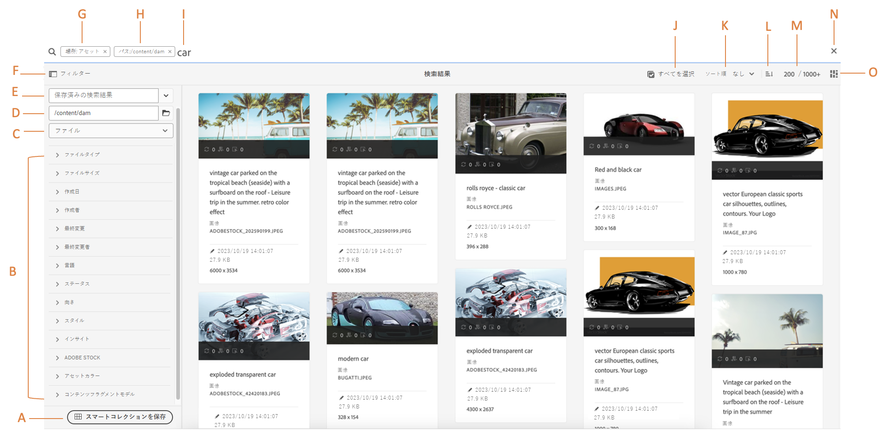
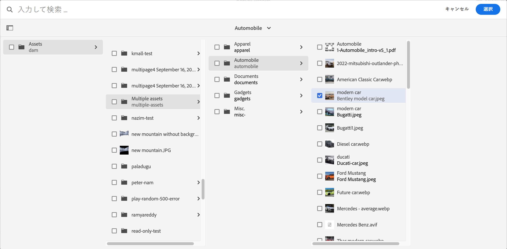

# AEM でのアセットの検索 {#search-assets-in-aem}

<table>
    <tr>
        <td>
            <i> 新規 </i>Dynamic Media Prime<a href="/help/assets/dynamic-media/dm-prime-ultimate.md"><b>Ultimate</b></a>
        </td>
        <td>
            <i> 新規 </i> <a href="/help/assets/assets-ultimate-overview.md"><b>AEM AssetsUltimate</b></a>
        </td>
        <td>
            <i> 新規 </i> <a href="/help/assets/integrate-aem-assets-edge-delivery-services.md"><b>AEM AssetsとEdge Delivery Servicesの統合 </b></a>
        </td>
        <td>
            <i> 新規 </i><a href="/help/assets/aem-assets-view-ui-extensibility.md"><b>UI 拡張機能 </b></a>
        </td>
          <td>
            <i>Dynamic Media Prime</i>Ultimateの新 <a href="/help/assets/dynamic-media/enable-dynamic-media-prime-and-ultimate.md"><b> 能 </b></a>
        </td>
    </tr>
    <tr>
        <td>
            <a href="/help/assets/search-best-practices.md"><b>検索のベストプラクティス</b></a>
        </td>
        <td>
            <a href="/help/assets/metadata-best-practices.md"><b>メタデータのベストプラクティス</b></a>
        </td>
        <td>
            <a href="/help/assets/product-overview.md"><b>コンテンツハブ</b></a>
        </td>
        <td>
            <a href="/help/assets/dynamic-media-open-apis-overview.md"><b>OpenAPI 機能を備えた Dynamic Media</b></a>
        </td>
        <td>
            <a href="https://developer.adobe.com/experience-cloud/experience-manager-apis/"><b>AEM Assets 開発者向けドキュメント</b></a>
        </td>
    </tr>
</table>

| バージョン | 記事リンク |
| -------- | ---------------------------- |
| AEM 6.5 | [ここをクリックしてください](https://experienceleague.adobe.com/docs/experience-manager-65/assets/using/search-assets.html?lang=ja) |
| AEM as a Cloud Service | この記事 |

[!DNL Adobe Experience Manager Assets] は、コンテンツ速度の向上に役立つ堅牢なアセット検索方法を備えています。標準搭載の機能とカスタムメソッドを使用したシームレスでインテリジェントなアセットの検索エクスペリエンスにより、チームは市場投入までの時間を短縮できます。アセットの検索機能は、デジタルアセット管理システムの利用の中核を成します。クリエイティブ担当者によるさらなる利用、ビジネスユーザーやマーケティング担当者によるアセットの堅牢な管理、DAM 管理者による管理などの用途があります。[!DNL Assets] ユーザーインターフェイスまたはその他のアプリやサーフェスで実行できる簡易検索、詳細検索、カスタム検索は、これらのユースケースを達成するのに役立ちます。

AEM は次のユースケースをサポートしています。この記事では、これらのユースケースの使用法、概念、設定、制限事項、トラブルシューティングについて説明します。

| アセットを検索 | 検索機能の設定と管理 | アセット検索結果の操作 |
|---|---|---|
| [基本検索](#searchbasics) | [検索インデックス](#searchindex) | [結果の並べ替え](#sort) |
| [検索 UI について](#searchui) | [テキスト抽出](#extracttextupload) | [アセットのプロパティとメタデータの確認](#checkinfo) |
| [検索候補](#searchsuggestions) | [必須メタデータ](#mandatorymetadata) | [ダウンロード](#download) |
| [検索結果および動作について](#searchbehavior) | [検索ファセットの変更](#searchfacets) | [メタデータの一括更新](#metadata-updates) |
| [検索ランキングおよびブースト](#searchrank) | [カスタム述語](#custompredicates) | [スマートコレクション](#collections) |
| [詳細検索：検索のフィルタリングと範囲](#scope) | | [予期しない結果の理解とトラブルシューティング](#unexpected-results) |
| [他のソリューションおよびアプリから検索](#search-assets-other-surfaces)：<ul><li>[Adobe Asset Link](#aal)</li><li>[Brand Portal](#brand-portal)</li><li>[Experience Manager デスクトップアプリ](#desktop-app)</li><li>[Adobe Stock 画像](#adobe-stock)</li><li>[Dynamic Media アセット](#search-dynamic-media-assets)</li></ul> | | |
| [アセットセレクター](#asset-picker) | | |
| [制限事項](#limitations)と[ヒント](#tips) | | |
| [例を使った説明](#samples) | | |

[!DNL Experience Manager] Web インターフェイスの上部にあるオムニサーチフィールドを使用して、アセットを検索します。[!DNL Experience Manager] で&#x200B;**[!UICONTROL アセット]**／**[!UICONTROL ファイル]**&#x200B;に移動し、上部バーの検索アイコン  をクリックし、検索キーワードを入力して、`Return` を選択します。または、キーワードショートカット `/`（スラッシュ）を使用して、オムニサーチフィールドを開きます。`Location:Assets` が事前に選択されており、DAM アセットの検索に制限されています。`Path:/content/dam` は、**[!UICONTROL ファイル]**&#x200B;フォルダー内においてルートレベルで検索を実行する際に表示されます。他のフォルダーに移動する場合は、`Path:/content/dam/<folder name>` を「オムニサーチ」フィールドに表示して、検索範囲を現在のフォルダーに制限します。検索キーワードの入力を開始すると、[!DNL Experience Manager] によって検索候補が表示されます。

アセット、フォルダー、タグおよびメタデータを検索するには、**[!UICONTROL フィルター]**&#x200B;パネルを使用します。ファイルタイプ、ファイルサイズ、最終変更日、アセットのステータス、インサイトデータ、Adobe Stock ライセンスなどの、様々なオプション（述部）に基づいて検索結果をフィルタリングできます。フィルターパネルをカスタマイズし、[検索ファセット](/help/assets/search-facets.md)を使用して検索述語を追加したり、削除したりすることができます。[!UICONTROL フィルター]パネルの[!UICONTROL ファイルタイプ]フィルターには、状態が混在したチェックボックスがあります。したがって、すべてのネストされた述語（またはフォーマット）を選択しない限り、第 1 レベルのチェックボックスは部分的にチェックされています。

[!DNL Experience Manager] 検索機能では、コレクションの検索とコレクション内のアセットの検索をサポートしています。詳しくは、[コレクションの検索](/help/assets/manage-collections.md)を参照してください。

## アセット検索インターフェイスについて {#searchui}

アセット検索インターフェイスと使用可能なアクションについて確認します。
<!--

-->

*図：[!DNL Experience Manager Assets] 検索結果インターフェイスについて理解する。*

**A：**検索をスマートコレクションとして保存。
**B：**検索結果を絞り込むフィルターまたは述語。
**C：**ファイル、フォルダー、またはその両方を表示。
**D.** 検索場所は DAM です。
**E.** 保存済みの検索結果にアクセスします。
**F.** 「フィルター」をクリックして、左側のパネルを開閉します。
**G.** アセットをデフォルトの検索として表示します。
**H.** 検索場所は DAM です。
**I.** ユーザが検索キーワードを入力するオムニサーチフィールドです。
**J.** 読み込まれた検索結果を選択します。
**K.** 作成日、変更日、名前、なしで並べ替えます。
**L.** 昇順または降順で並べ替えます。
**M.** 検索結果の合計数の中で表示される検索結果数です。**N.** 検索を閉じます。
**O.** カード表示とリスト表示を切り替えます。

### 動的検索ファセット {#dynamicfacets}

検索ファセット内で予想される検索結果の数が動的に更新されるので、検索結果ページから目的のアセットをより迅速に見つけることができます。検索フィルターを適用する前にも、予想されるアセット数は更新されます。フィルターに対して予想されるアセット数を確認すると、検索結果をすばやく効率的にナビゲートすることができます。

*図：検索ファセットで検索結果をフィルタリングしない場合のアセット概数の表示*

Experience Manager Assets には、デフォルトで 2 つのプロパティのファセット数が表示されます。

* アセットタイプ（jcr:content/metadata/dc:format）

* 承認ステータス（jcr:content/metadata/dam:status）

2023年8月の時点で、Experience Manager Assets には `damAssetLucene` インデックスの新しいバージョン 9 が含まれています。以前のバージョンの `damAssetLucene-8` と以下では、`statistical` モードを使用して各検索ファセット数の項目のサンプルに対するアクセス制御を確認していました。

`damAssetLucene-9` が Oak クエリファセットのカウントの動作を変更し、基になる検索インデックスによって返されるファセット数のアクセス制御を評価しなくなるため、検索応答時間が短縮されます。その結果、アクセス権のないアセットが含まれるファセット数の値がユーザーに表示される場合があります。これらのユーザーは、これらのアセットのその他の詳細（パスを含む）に対してアクセス、ダウンロードまたは読み取りを行ったり、アセットに関する詳細情報を取得したりすることはできません。

以前の動作（`statistical` モード）に切り替える必要がある場合は、[コンテンツの検索とインデックス作成](https://experienceleague.adobe.com/docs/experience-manager-cloud-service/content/operations/indexing.html?lang=ja)を参照し、`damAssetLucene-9` インデックスのカスタムバージョンを作成します。結果セットの数が多いと検索応答に長い時間がかかるため、`secure` モードに切り替えることはお勧めしません。

これらのモードの詳細な説明を含む、Oak のファセット機能について詳しくは、[ファセット - Oak のドキュメント - Lucene インデックス](https://jackrabbit.apache.org/oak/docs/query/lucene.html#facets)を参照してください。

## 入力に応じた検索候補 {#searchsuggestions}

キーワードの入力を開始すると、可能な検索キーワードまたは語句が候補として提示されます。候補は Experience Manager 内のアセットに基づいています。Experience Manager では、検索に役立つすべてのメタデータフィールドのインデックスを作成します。検索候補を提示するために、以下のいくつかのメタデータフィールドの値が使用されます。検索候補の提示を行う場合は、次のフィールドに適切なキーワードを入力することを検討してください。

* アセットのタグ（`jcr:content/metadata/cq:tags` にマッピングされます）
* アセットのタイトル（`jcr:content/metadata/dc:title` にマッピングされます）
* アセットの説明（`jcr:content/metadata/dc:description` にマッピングされます）
* JCR リポジトリー内でのタイトル。この値はアセットのタイトルにマッピングされる可能性があります（`jcr:content/jcr:title` にマッピングされます）
* JCR リポジトリー内での説明。この値はアセットの説明にマッピングされる可能性があります（`jcr:content/jcr:description` にマッピングされます）

## 検索結果および動作について {#searchbehavior}

### 基本的な検索用語と検索結果 {#searchbasics}

オムニサーチフィールドからキーワード検索を実行できます。キーワード検索は、（一般的に使用されるすべてのメタデータフィールドの）全文検索で、大文字と小文字が区別されません。複数のキーワードを使用する場合は、`AND` がキーワード間のデフォルトの演算子になります。

結果は、最も近い一致を先頭に関連性の高い順に並べ替えられます。複数のキーワードがある場合は、メタデータに含まれるキーワードが多いアセットが、より関連性の高い結果になります。メタデータ内では、スマートタグとして表示されるキーワードは、他のメタデータフィールドに表示されるキーワードより高くランク付けされます。[!DNL Experience Manager] では、特定の検索用語に、より高い重みを付けることができます。また、特定の検索用語について、対象となるいくつかのアセットの[ランクを上げる](#searchrank)こともできます。

関連性の高いアセットをすばやく見つけるために、この機能豊富なインターフェイスには、フィルタリング、並べ替え、選択のメカニズムが用意されています。複数の条件に基づいて結果をフィルタリングし、検索されたアセットの数を様々なフィルター別に確認できます。または、オムニサーチフィールドのクエリを変更して検索を再実行することもできます。検索用語やフィルターを変更しても、その他のフィルターは依然として適用され、検索のコンテキストが保たれます。

結果が多数のアセットである場合、[!DNL Experience Manager] では最初の 100 件がカードで、200 件がリストで表示されます。ユーザーがスクロールすると、アセットがさらに読み込まれます。これは、パフォーマンスの向上のためです。[表示されるアセット数](https://www.youtube.com/watch?v=LcrGPDLDf4o)のデモビデオをご覧ください。

時には、予期しないアセットが検索結果に表示される場合があります。詳しくは、[予期しない検索結果](#unexpected-results)を参照してください。

[!DNL Experience Manager] では様々なファイル形式を検索でき、ビジネス要件に合わせて検索フィルターをカスタマイズできます。DAM リポジトリーで使用できる検索オプションとアカウントの制限事項については、管理者に問い合わせてください。

<!-- 
### Results with and without enhanced Smart Tags {#withsmarttags}

By default, [!DNL Experience Manager] search combines the search terms with an AND clause. For example, consider searching for keywords woman running. Only the assets with both woman and running keywords in the metadata appear in the search results by default. The same behavior is retained when special characters (periods, underscores, or dashes) are used with the keywords. The following search queries return the same results:

* `woman running`
* `woman.running`
* `woman-running`

However, the query `woman -running` returns assets without `running` in their metadata.
Using Smart Tags adds an extra `OR` clause to find any of the search terms as the applied smart tags. An asset tagged with either `woman` or `running` using Smart Tags also appear in such a search query. So the search results are a combination of,

* Assets with `woman` and `running` keywords in the metadata (default behavior).

* Assets smart tagged with either of the keywords (Smart Tags behavior).
-->

### 検索ランキングおよびブースト {#searchrank}

メタデータフィールド内のすべての検索語句に一致する検索結果がまず表示され、次にスマートタグ内のいずれかの検索語句に一致する検索結果が表示されます。上記の例では、検索結果の表示順序は次のようになります。

1. 各種メタデータフィールド内の「`woman running`」に一致するもの。
1. スマートタグ内の「`woman running`」に一致するもの。
1. スマートタグ内の「`woman`」または「`running`」に一致するもの。

特定のアセットに対するキーワードの関連性を高めることで、キーワードに基づいた検索を強化できます。つまり、特定のキーワードに基づいて検索すると、それらのキーワードの対象となる画像が検索結果の最上部に表示されます。

1. [!DNL Assets] のユーザーインターフェイスから、アセットのプロパティページを開きます。「**[!UICONTROL 詳細]**」をクリックし、「**[!UICONTROL 検索キーワードに採用]**」の下の「**[!UICONTROL 追加]**」をクリックします。
1. 「**[!UICONTROL 昇格を検索]**」ボックスで、画像検索時の強化の対象となるキーワードを指定し、「**[!UICONTROL 追加]**」をクリックします。同じ方法で複数のキーワードを指定できます。
1. 「**[!UICONTROL 保存して閉じる]**」をクリックします。指定したキーワードに対して昇格したアセットが、検索結果の上位に表示されます。

ターゲットを絞ったキーワードの検索結果で一部のアセットのランクを上げることで、この機能をうまく利用できます。以下の例（ビデオ）を参照してください。詳しくは、「[ での検索](https://experienceleague.adobe.com/docs/experience-manager-learn/assets/search-and-discovery/search-boost.html?lang=ja)」を参照してください。 [!DNL Experience Manager]

>[!VIDEO](https://video.tv.adobe.com/v/16766/?quality=6)

*ビデオ：検索結果のランク付けの方法とランクへの影響について*

## 検索結果を表示するためのアセットのバッチサイズを設定 {#configure-asset-batch-size}

管理者が、検索の実行時に表示されるアセットのバッチサイズを設定できるようになりました。アセット検索結果をさらに下にスクロールして結果を読み込むと、設定したバッチサイズの倍数でアセット検索結果が表示されます。200、500、1,000 個のアセットの使用可能なバッチサイズから選択できます。バッチサイズを小さく設定すると、検索応答時間が短縮されます。

例えば、結果数の上限を 200 個のアセットのバッチサイズに設定した場合、Experience Manager Assets で検索を開始すると、検索結果に 200 個のアセットのバッチが表示されます。下にスクロールして検索結果を移動すると、200 個のアセットの次のバッチが表示されます。検索クエリに一致するすべてのアセットが表示されるまで、このプロセスは続行されます。

アセットのバッチサイズを設定するには：

1. **[!UICONTROL ツール]**／**[!UICONTROL アセット]**／**[!UICONTROL アセットの設定]**／**[!UICONTROL アセットのオムニサーチの設定]**&#x200B;に移動します。

1. 結果数の制限を選択し、「**[!UICONTROL 保存]**」をクリックします。

   

## 詳細検索 {#scope}

[!DNL Experience Manager] には、検索したアセットに適用されるフィルターなど、目的のアセットをすばやく見つけるのに役立つ様々な方法が用意されています。一般的に使用されるいくつかの方法を以下で説明します。[動作例](#samples)もいくつか以下に示します。

**ファイルまたはフォルダーの検索**：検索結果には、ファイル、フォルダーまたはその両方が表示されます。**[!UICONTROL フィルター]**&#x200B;パネルから、適切なオプションを選択できます。詳しくは、[検索インターフェイス](#searchui)を参照してください。

**フォルダー内のアセットの検索**：検索対象を特定のフォルダーに限定できます。**[!UICONTROL フィルター]**&#x200B;パネルで、フォルダーのパスを追加します。一度に 1 つのフォルダーのみ選択できます。

<!--

-->

*図：フィルターパネルにフォルダーパスを追加して検索結果を特定のフォルダーに限定する*

### 類似画像の検索 {#visualsearch}

ユーザーが選択した画像と視覚的に類似した画像を検索するには、画像のカード表示またはツールバーから「**[!UICONTROL 類似を検索]**」オプションをクリックします。[!DNL Experience Manager] は、ユーザーが選択した画像に類似した、DAM リポジトリーのスマートタグ付き画像を表示します。

*図：カード表示のオプションを使用して、類似した画像を検索する*

### Adobe Stock 画像 {#adobe-stock}

[!DNL Experience Manager] のユーザーインターフェイス内から [Adobe Stock アセット](/help/assets/aem-assets-adobe-stock.md)を検索し、必要なアセットのライセンスを取得できます。オムニサーチバーに「`Location: Adobe Stock`」を追加します。また、フィルターパネルを使用して、ライセンス取得済みまたはライセンス未取得のアセットをすべて検索したり、Adobe Stock ファイル番号を使用して特定のアセットを検索したりすることもできます。

### Dynamic Media アセット {#dmassets}

**[!UICONTROL フィルター]**&#x200B;パネルから **[!UICONTROL Dynamic Media]**／**[!UICONTROL セット]**&#x200B;を選択して、Dynamic Media 画像をフィルタリングすることができます。画像セット、カルーセル、混在メディアセット、スピンセットなどのアセットがフィルタリングされて表示されます。

### GQL メタデータフィールドの特定の値を使用した検索 {#gql-search}

タイトル、説明、作成者など、メタデータフィールドの正確な値に基づいてアセットを検索できます。GQL 全文検索機能では、メタデータ値が検索クエリと完全に一致するアセットのみを取得できます。プロパティの名前（Creator や Title など）と値は、大文字と小文字が区別されます。

| メタデータフィールド | ファセット値と使用法 |
|---|---|
| タイトル | title:John |
| 作成者 | creator:John |
| 場所 | location:NA |
| 説明 | description:&quot;Sample Image&quot; |
| 作成ツール | creatortool:&quot;Adobe Photoshop&quot; |
| 著作権の所有者 | copyrightowner:&quot;Adobe Systems&quot; |
| 投稿者 | contributor:John |
| 使用条件 | usageterms:&quot;CopyRights Reserved&quot; |
| 作成日 | created:YYYY-MM-DDTHH |
| 有効期限 | expires:YYYY-MM-DDTHH |
| オンタイム | ontime:YYYY-MM-DDTHH |
| オフタイム | offtime:YYYY-MM-DDTHH |
| 時間の範囲（有効期限、オンタイム、オフタイム） | facet field : lowerbound..upperbound |
| パス | /content/dam/&lt;folder name> |
| PDF タイトル | pdftitle:&quot;Adobe Document&quot; |
| 件名 | subject:&quot;Training&quot; |
| タグ | tags:&quot;Location And Travel&quot; |
| タイプ | type:&quot;image\png&quot; |
| 画像の幅 | width:lowerbound..upperbound |
| 画像の高さ | height:lowerbound..upperbound |
| Person | person:John |

`path`、`limit`、`size`、`orderby` プロパティは、`OR` 演算子を使用して他のプロパティと組み合わせることはできません。

<!-- TBD: Where are the limit, size, orderby properties defined?
-->

ユーザー生成プロパティのキーワードは、プロパティエディターにおけるフィールドラベルからスペースを削除して小文字で表記したものです。

複雑なクエリの検索形式の例：

* 複数のファセットフィールドを持つアセットをすべて表示する（例：タイトル = John Doe、作成ツール = Adobe Photoshop）：`title:"John Doe" creatortool:Adobe*`
* ファセット値が 1 語でなく文になっているアセットをすべて表示する（例：title=Scott Reynolds）：`title:"Scott Reynolds"`
* 1 つのプロパティに複数の値が指定されているアセットを表示する（例：title=Scott Reynolds または John Doe）：`title:"Scott Reynolds" OR "John Doe"`
* プロパティ値が特定の文字列で始まるアセットを表示する（例：title=Scott Reynolds）：`title:Scott*`
* プロパティ値が特定の文字列で終わるアセットを表示する（例：title=Scott Reynolds）：`title:*Reynolds`
* プロパティ値に特定の文字列が含まれるアセットを表示する（例：title=Basel Meeting Room）：`title:*Meeting*`
* 特定の文字列が含まれ、特定のプロパティ値を持つアセットを表示する（例：title=John Doe のアセットで文字列「Adobe」を検索する）：`*Adobe* title:"John Doe"`

## 他の [!DNL Experience Manager] ソリューションまたはインターフェイスからのアセットの検索 {#search-assets-other-surfaces}

[!DNL Adobe Experience Manager]では、DAM リポジトリーを他の様々な [!DNL Experience Manager] ソリューションに接続することで、デジタルアセットにすばやくアクセスできるようにし、クリエイティブワークフローを効率化します。アセットの検出は、参照または検索で始まります。異なるサーフェスやソリューションでも、検索の動作はほとんど同じです。ターゲットオーディエンス、ユースケース、ユーザーインターフェイスは [!DNL Experience Manager] ソリューションによって異なるので、一部の検索方法はそれに応じて変わります。個々のソリューションの具体的な方法については、以下のリンクを参照してください。ここでは、一般に当てはまるヒントや動作について説明しています。

### Adobe Asset Link パネルからのアセットの検索 {#aal}

クリエイティブ担当者は、Adobe Asset Link を使用することで、サポートされている Adobe Creative Cloud アプリケーション内から、[!DNL Experience Manager Assets] に保存されているコンテンツにアクセスできるようになりました。[!DNL Adobe Creative Cloud] アプリの [!DNL Adobe Photoshop]、[!DNL Adobe Illustrator]、[!DNL Adobe InDesign] のパネルを使用して、アセットをシームレスに参照、検索、チェックアウトおよびチェックインすることができます。また、Asset Link を使用すると、視覚的に類似した結果を検索できます。ビジュアル検索の表示結果は、Adobe Sensei の機械学習アルゴリズムを活用しており、見た目に類似した画像を見つけやすくなっています。詳しくは、[Adobe Asset Link を使用したアセットの検索と参照](https://helpx.adobe.com/jp/enterprise/using/manage-assets-using-adobe-asset-link.html#UseAdobeAssetLink)を参照してください。

### [!DNL Experience Manager] デスクトップアプリケーションでのアセットの検索  {#desktop-app}

デスクトップアプリケーションを使用することで、クリエイティブ担当者はは、ローカルデスクトップ（Windows または Mac）で [!DNL Experience Manager Assets] を容易に検索および利用できるようになります。目的のアセットを Mac Finder や Windows エクスプローラーで表示し、デスクトップアプリケーションで開き、ローカルで変更することができます。変更内容は [!DNL Experience Manager] に書き戻され、リポジトリー内に新しいバージョンが作成されます。1 つ以上のキーワード、ワイルドカード `*` および `?`、`AND` 演算子を使用した基本検索がサポートされています。[デスクトップアプリケーションでのアセットの参照、検索、プレビュー](https://experienceleague.adobe.com/docs/experience-manager-desktop-app/using/using.html?lang=ja#browse-search-preview-assets)を参照してください。

### [!DNL Brand Portal] でのアセットの検索  {#brand-portal}

マーケターや事業部門のユーザーは、Brand Portal を使用して、承認済みのデジタルアセットを、広範な社内チーム、パートナーおよび販売店と効率的かつ安全に共有します。詳しくは、[Brand Portal でのアセットの検索](https://experienceleague.adobe.com/docs/experience-manager-brand-portal/using/search-capabilities/brand-portal-searching.html?lang=ja)を参照してください。

### [!DNL Adobe Stock] 画像の検索 {#adobe-stock1}

[!DNL Experience Manager] のユーザーインターフェイス内から Adobe Stock アセットを検索し、必要なアセットのライセンスを取得できます。オムニサーチフィールドに「`Location: Adobe Stock`」を追加します。また、**[!UICONTROL フィルター]**&#x200B;パネルを使用して、ライセンス取得済みまたはライセンス未取得のアセットをすべて検索したり、Adobe Stock ファイル番号を使用して特定のアセットを検索したりすることもできます。「[ [!DNL Experience Manager]](/help/assets/aem-assets-adobe-stock.md#usemanage) の  [!DNL Adobe Stock]  画像の管理」を参照してください。

### [!DNL Dynamic Media] アセットの検索  {#search-dynamic-media-assets}

**[!UICONTROL フィルター]**&#x200B;パネルから **[!UICONTROL Dynamic Media]**／**[!UICONTROL セット]**&#x200B;を選択して、Dynamic Media 画像をフィルタリングすることができます。画像セット、カルーセル、混在メディアセット、スピンセットなどのアセットがフィルタリングされて表示されます。Web ページの作成時に、作成者はコンテンツファインダー内でセットを検索できます。セットのフィルターは、ポップアップメニューで使用できます。

### Web ページ作成時のコンテンツファインダーでのアセットの検索 {#content-finder}

作成者は、コンテンツファインダーを使用して関連アセットを DAM リポジトリーで検索し、作成中の Web ページで使用できます。作成者は、Connected Assets 機能を使用して、リモート [!DNL Experience Manager] デプロイメントで使用可能なアセットを検索することもできます。作成者は、ローカルの [!DNL Experience Manager] デプロイメント上の Web ページで、これらのアセットを使用できます。「[リモートアセットの使用](/help/assets/use-assets-across-connected-assets-instances.md#use-remote-assets)」を参照してください。

### コレクションの検索 {#collections}

[!DNL Experience Manager] 検索機能では、コレクションの検索とコレクション内のアセットの検索をサポートしています。詳しくは、[コレクションの検索](/help/assets/manage-collections.md)を参照してください。

## アセットセレクター {#asset-picker}

アセットセレクター（以前のバージョンの [!DNL Adobe Experience Manager] ではアセットピッカーと呼ばれていました）を使用すると、DAM アセットの検索、フィルタリングおよび参照を特別な方法で行えます。アセットセレクターは、`https://[aem_server]:[port]/aem/assetpicker.html` で利用できます。アセットセレクターを使用して選択したアセットのメタデータを取得できます。アセットタイプ（画像、ビデオ、テキスト）や選択モード（単一選択または複数選択）など、サポートされているリクエストパラメーターを使用して、アセットセレクターを起動できます。これらのパラメーターは、特定の検索インスタンスのアセットセレクターのコンテキストを設定し、選択中もそのままの状態を維持します。

アセットセレクターは、HTML5 `Window.postMessage` メッセージを使用して、選択したアセットのデータを受信者に送信します。参照モードのオムニサーチ結果ページでのみ機能します。

次のリクエストパラメーターを URL で渡して、特定のコンテキストでアセットセレクターを起動します。

| 名前 | 値 | 例 | 目的 |
|---|---|---|---|
| リソースサフィックス（B） | URL のリソースサフィックスとしてのフォルダーパス：[https://localhost:4502/aem/assetpicker.html/&lt;folder_path>](https://localhost:4502/aem/assetpicker.html) | 特定のフォルダーが選択された状態でアセットセレクターを起動するには、例えば、フォルダー `/content/dam/we-retail/en/activities` を選択した場合、URL は次のような形式になります。`https://localhost:4502/aem/assetpicker.html/content/dam/we-retail/en/activities?assettype=images` | アセットセレクターの起動時に特定のフォルダーを選択する必要がある場合、そのフォルダーをリソースサフィックスとして渡します。 |
| `mode` | single、multiple | <ul><li>`https://localhost:4502/aem/assetpicker.html?mode=single`</li><li>`https://localhost:4502/aem/assetpicker.html?mode=multiple`</li></ul> | 複数モードでは、アセットセレクターを使用して、いくつかのアセットを同時に選択できます。 |
| `dialog` | true、false | [https://localhost:4502/aem/assetpicker.html?dialog=true](https://localhost:4502/aem/assetpicker.html?dialog=true) | アセットセレクターを Granite ダイアログとして開くには、これらのパラメーターを使用します。このオプションは、Granite パスフィールドを使用してアセットセレクターを起動し、pickerSrc URL として設定する場合にのみ適用できます。 |
| `root` | &lt;folder_path> | `https://localhost:4502/aem/assetpicker.html?assettype=images&root=/content/dam/we-retail/en/activities` | このオプションを使用して、アセットセレクターのルートフォルダーを指定します。この場合、アセットセレクターを使用すると、ルートフォルダーの下の子アセット（直接／間接）のみを選択できます。 |
| `viewmode` | 検索 | | `assettype` パラメーターと `mimetype` パラメーターを指定して、アセットセレクターを検索モードで起動します。 |
| `assettype` | 画像、ドキュメント、マルチメディア、アーカイブ。 | <ul><li>`https://localhost:4502/aem/assetpicker.html?viewmode=search&assettype=images`</li><li> `https://localhost:4502/aem/assetpicker.html?viewmode=search&assettype=documents` </li><li> `https://localhost:4502/aem/assetpicker.html?viewmode=search&assettype=multimedia` </li><li> `https://localhost:4502/aem/assetpicker.html?viewmode=search&assettype=archives` </li></ul> | 渡された値に基づいてアセットタイプをフィルタリングするには、このオプションを使用します。 |
| `mimetype` | アセットの MIME タイプ（`/jcr:content/metadata/dc:format`）（ワイルドカードもサポートされています）。 | <ul><li>`https://localhost:4502/aem/assetpicker.html?mimetype=image/png`</li><li>`https://localhost:4502/aem/assetpicker.html?mimetype=*png`</li><li>`https://localhost:4502/aem/assetpicker.html?mimetype=*presentation`</li><li>`https://localhost:4502/aem/assetpicker.html?mimetype=*presentation&mimetype=*png`</li></ul> | MIME タイプに基づいてアセットをフィルタリングするために使用します。 |

アセットセレクターインターフェイスにアクセスするには、`https://[aem_server]:[port]/aem/assetpicker` に移動します。目的のフォルダーに移動して、1 つまたは複数のアセットを選択します。または、オムニサーチボックスから目的のアセットを検索し、必要に応じてフィルターを適用して選択します。

<!---->

*図：アセットピッカーでのアセットの参照と選択*

## 制限事項 {#limitations}

[!DNL Experience Manager Assets] の検索機能には、次の制限事項があります。

* 検索クエリの先頭にスペースを入れないでください。スペースを入れると、検索が機能しません。
* 検索結果からアセットのプロパティを選択すると、検索をキャンセルした後も、検索用語が [!DNL Experience Manager] に引き続き表示される場合があります。<!-- (CQ-4273540) -->
* フォルダーまたはファイルとフォルダーを検索する場合、どのパラメーターでも検索結果を並べ替えることはできません。
* オムニサーチバーで何も入力せずに `Return` を選択すると、[!DNL Experience Manager] はファイルのみのリストを返し、フォルダーは返しません。キーワードを使用せずに特定のフォルダーを検索した場合は、[!DNL Experience Manager] は結果をかえしません。
* フォルダーに対して全文検索を実行することができます。検索が機能するための検索語句を指定します。

ビジュアル検索または類似検索には、次の制限事項があります。

* ビジュアル検索は、大規模なリポジトリーで最も適しています。良好な結果を得るために最低限必要な画像数はありませんが、画像の数が少ないと、一致の精度が大きなリポジトリーの場合ほど良くありません。
* モデルを変更したり、[!DNL Experience Manager] をトレーニングして類似の画像を見つけることはできません。例えば、一部のアセットにスマートタグを追加または削除しても、モデルは変更されません。それらのアセットは、視覚的に類似した検索結果から除外されます。

次のシナリオでは、検索機能のパフォーマンスに制限がある場合があります。

* 検索結果を表示際に、カード表示の読み込むは、リスト表示と比較して高速です。

## 検索のヒント {#tips}

* アセットのレビューステータスを監視する場合は、該当するオプションを使用して、承認されているアセットまたは承認待ちのアセットを検索します。
* 様々な Creative アプリから取得した使用状況の統計に基づいて、サポートされるアセットを検索するには、インサイトの述語を使用します。使用状況データが、使用状況スコア、インプレッション数、クリック数およびメディアチャネルでグループ化され、アセットがカテゴリ別に表示されます。
* 「**[!UICONTROL すべて選択]**」チェックボックスを使用して、検索したアセットを選択します。[!DNL Experience Manager] では、最初の 100 件のアセットがカードで、200 件のアセットがリストで表示されます。検索結果をスクロールすると、アセットがさらに読み込まれます。読み込まれたアセットより多くのアセットを選択できます。選択したアセットの数が、検索結果ページの右上隅に表示されます。選択範囲に対して操作を実行できます。例えば、選択したアセットのダウンロード、選択したアセットのメタデータプロパティの一括更新、選択したアセットのコレクションへの追加などが可能です。表示されている数よりも多くのアセットが選択されている場合は、選択したすべてのアセットにアクションが適用されるか、ダイアログにアセットが適用されている数が表示されます。読み込まれなかったアセットにアクションを適用するには、すべてのアセットが明示的に選択されていることを確認します。
* 必須メタデータを含んでいないアセットを検索する場合は、[必須メタデータ](#mandatorymetadata)を参照してください。
* 検索では、すべてのメタデータフィールドが使用されます。12 の検索などの一般的な検索では通常、多数の結果が返されます。より良い結果を得るには、（一重引用符ではなく）二重引用符を使用するか、特殊文字のない単語に番号が続く（例：`shoe12` など）ようにします。
* フルテキスト検索では、`-` および `^` などの演算子がサポートされます。これらの文字を文字列リテラルとして検索するには、検索式を二重引用符で囲みます。例えば、`Notebook - Beauty` の代わりに `"Notebook - Beauty"` を使用します。
* 検索結果が多すぎる場合は、[検索範囲](#scope)を制限して、目的のアセットを絞り込みます。これは、特定のファイルタイプ、特定の場所、特定のメタデータなど、目的のアセットを検索する良い方法がある程度わかっている場合に最も効果的です。

* **タグ付け**：タグを使用すると、アセットを分類して参照や検索をより効率的に行えるようになります。タグ付けは、適切な分類を他のユーザーやワークフローに伝播するうえで役に立ちます。[!DNL Experience Manager] では、使用状況データやトレーニングでアセットのタグ付けを絶えず改善する、Adobe Sensei の AI サービスを活用して、アセットに自動的にタグを付ける手段を提供しています。アセットを検索する際、スマートタグは考慮されます。これは組み込みの検索機能と連携して機能します。[検索動作](#searchbehavior)を参照してください。検索結果の表示順序を最適化するには、選択した一部のアセットの[検索ランキングを上げる](#searchrank)ことができます。

* **インデックス作成**：インデックスが作成されたメタデータおよびアセットのみが検索結果に返されます。検索範囲とパフォーマンスを向上させるには、適切なインデックス作成を行い、ベストプラクティスに従ってください。詳しくは、[インデックス作成](#searchindex)を参照してください。

## 検索の例 {#samples}

ユーザーが指定したとおりの語句を含んだアセットを検索するには、キーワードを二重引用符で囲みます。

*図：引用符がある場合とない場合の検索動作*

**アスタリスクワイルドカードを使用した検索**：検索の範囲を広げるには、検索語の前後にアスタリスクを使用して任意の数の文字に一致するようにします。例えば、アスタリスクを付けずに「run」を検索しても、（メタデータ内も含め）検索語のバリエーションを含んだアセットは返されません。アスタリスクは任意の数の文字に置き換わります。例：

* `run`：キーワード「run」を含んだアセットを返します。
* `run*` は、`running`、`run`、`runaway` などを含んだアセットを返します。
* `*run` は、`outrun`、`rerun` などを含んだアセットを返します。
* `*run*`：可能なあらゆる組み合わせを含んだアセットを返します。

*図：アセット検索でのアスタリスクワイルドカードの使用例*

**疑問符ワイルドカードを使用した検索**：検索の範囲を広げるには、1 つ以上の「?」文字を使用して正確な数の文字に一致するようにします。例えば、次の例では、

* `run???` クエリはどのアセットとも一致しません。

* `run????` クエリは、`run` の後に 4 文字がある単語 `running` と一致します。

* `??run` クエリは、`run` の前に 2 文字がある単語 `rerun` と一致します。

*図：アセット検索での疑問符ワイルドカードの使用例*

**キーワードの除外**：ダッシュを使用すると、キーワードを含まないアセットを検索できます。例えば、`running -shoe` クエリでは、`running` を含み `shoe` を含まないアセットを返します。同様に、`camp -night` クエリでは `camp` を含み `night` を含まないアセットを返します。`camp-night` クエリは `camp` と `night` の両方を含むアセットを返します。

*図：ダッシュを使用して、除外されたキーワードを含まないアセットを検索する*

<!--
## Configuration and administration tasks related to search functionality {#configadmin}

### Search index configurations {#searchindex}

Asset discovery relies on indexing of DAM contents, including the metadata. Faster and accurate asset discovery relies on optimized indexing and appropriate configurations. See [indexing](/help/operations/indexing.md).
-->

<!--
### Visual or similarity search {#configvisualsearch}

Visual search uses Smart Tags. After configuring smart tagging functionality, follow these steps.

1. In [!DNL Experience Manager] CRXDE, in `/oak:index/lucene` node, add the following properties and values and save the changes.

    * `costPerEntry` property of type `Double` with the value `10`.

    * `costPerExecution` property of type `Double` with the value `2`.

    * `refresh` property of type `Boolean` with the value `true`.

   This configuration allows searches from the appropriate index.

1. To create Lucene index, in CRXDE, at `/oak:index/damAssetLucene/indexRules/dam:Asset/properties`, create node named `imageFeatures` of type `nt-unstructured`. In `imageFeatures` node,

    * Add `name` property of type `String` with the value `jcr:content/metadata/imageFeatures/haystack0`.

    * Add `nodeScopeIndex` property of type `Boolean` with the value of `true`.

    * Add `propertyIndex` property of type `Boolean` with the value of `true`.

    * Add `useInSimilarity` property of type `Boolean` with the value `true`.

   Save the changes.

1. Access `/oak:index/damAssetLucene/indexRules/dam:Asset/properties/predictedTags` and add `similarityTags` property of type `Boolean` with the value of `true`.
1. Apply Smart Tags to the assets in your [!DNL Experience Manager] repository. See [how to configure smart tags](https://experienceleague.adobe.com/docs/experience-manager-learn/assets/configuring/tagging.html#configuring).
1. In CRXDE, in `/oak-index/damAssetLucene` node, set the `reindex` property to `true`. Save the changes.
1. (Optional) If you have customized search form then copy the `/libs/settings/dam/search/facets/assets/jcr%3Acontent/items/similaritysearch` node to `/conf/global/settings/dam/search/facets/assets/jcr:content/items`. Save the changes.

For related information, see [understand smart tags in Experience Manager](https://experienceleague.adobe.com/docs/experience-manager-learn/assets/metadata/image-smart-tags.html) and [how to manage smart tags](/help/assets/smart-tags.md).
-->

<!--
### Mandatory metadata {#mandatorymetadata}

Business users, administrators, or DAM librarians can define some metadata as mandatory metadata that is a must for the business processes to work. For various reasons, some assets may be missing this metadata, such as legacy assets or assets migrated in bulk. Assets with missing or invalid metadata are detected and reported based on the indexed metadata property. To configure it, see [mandatory metadata](/help/assets/metadata-schemas.md#defining-mandatory-metadata).

### Modify search facets {#searchfacets}

To improve the speed of discovery, [!DNL Experience Manager Assets] offers search facets using which you can filter the search results. The Filters panel includes a few standard facets by default. Administrators can customize the Filters panel to modify the default facets using the in-built predicates. [!DNL Experience Manager] provides a good collection of in-built predicates and an editor to customize the facets. See [search facets](/help/assets/search-facets.md).

### Extract text when uploading assets {#extracttextupload}

You can configure [!DNL Experience Manager] to extract the text from the assets when users upload assets, such as PSD or PDF files. [!DNL Experience Manager] indexes the extracted text and helps users search these assets based on the extracted text. See [upload assets](/help/assets/manage-digital-assets.md#uploading-assets).
-->

### 検索結果を絞り込むためのカスタム述語 {#custompredicates}

述語はファセットの作成に使用されます。管理者は、事前設定済みの述語を使用して、フィルターパネルで検索ファセットをカスタマイズできます。これらの述語は、オーバーレイを使用してカスタマイズできます。「[カスタム述語の作成](/help/assets/search-facets.md)」を参照してください。

次に示す 1 つ以上のプロパティに基づいてデジタルアセットを検索できます。これらのプロパティの一部に適用されるフィルターは、デフォルトで使用でき、他のフィルターはカスタム作成して他のプロパティに適用できます。

| 検索フィールド | 検索プロパティの値 |
|-----------------|----------------------------------------------------------------------------------------------------------------------------------------|
| MIME タイプ | 画像、ドキュメント、マルチメディア、アーカイブ、その他。 |
| 最終変更日 | 時間、日、週、月、年。 |
| ファイルサイズ | 小、中、大。 |
| 公開ステータス | 公開済みまたは非公開。 |
| 承認済みステータス | 承認済みまたは却下。 |
| 向き | 水平方向、垂直方向、正方形。 |
| スタイル | カラーまたは白黒。 |
| ビデオの高さ | 最小値と最大値として指定。値はビデオレンディションのメタデータにのみ保存されます。 |
| ビデオの幅 | 最小値と最大値として指定。値はビデオレンディションのメタデータにのみ保存されます。 |
| ビデオ形式 | DVI、Flash、MPEG4、MPEG、OGG Theora、QuickTime、Windows Media。値はソースビデオとレンディションのメタデータに保存されます。 |
| ビデオコーデック | x264。値はビデオレンディションのメタデータにのみ保存されます。 |
| ビデオビットレート | 最小値と最大値として指定。値はビデオレンディションのメタデータにのみ保存されます。 |
| オーディオコーデック | Libvorbis、Lame MP3、AAC エンコーディング。値はビデオレンディションのメタデータにのみ保存されます。 |
| オーディオビットレート | 最小値と最大値として指定。値はビデオレンディションのメタデータにのみ保存されます。 |

## アセット検索結果の操作 {#aftersearch}

[!DNL Experience Manager] で検索したアセットを使用して、次の操作をおこなうことができます。

* メタデータプロパティなどの情報を表示する。
* 1 つ以上のアセットをダウンロードする。
* デスクトップアクションを使用してデスクトップアプリケーションでアセットを開く。
* スマートコレクションを作成する。
* バージョンを作成
* ワークフローを開始
* アセットの関連付けまたは関連付けを解除
* 検索を実行した後に自動的に表示されるフィルターパネルを使用してフィルターを適用し、検索結果を絞り込みます。
* アセットの場所に移動します

### 検索結果の並べ替え {#sort}

検索結果を並べ替えると、必要なアセットをすばやく見つけることができます。検索結果の並べ替えはリスト表示で機能し、**[!UICONTROL フィルター]**&#x200B;パネルで「**[[!UICONTROL ファイル]](#searchui)**」を選択した場合のみ行えます。[!DNL Assets] では、サーバー側の並べ替え機能を使用して、フォルダー内のすべてのアセット（どれだけ多くても対応可能）や検索クエリの結果をすばやく並べ替えます。サーバー側の並べ替えにより、クライアント側の並べ替えよりも高速で正確な結果が得られます。

リスト表示では、任意のフォルダー内のアセットを並べ替える場合と同じように、検索結果を並べ替えることができます。並べ替えは、「名前」、「タイトル」、「ステータス」、「寸法」、「サイズ」、「評価」、「使用状況」、「作成日」、「変更日」、「公開日」、「ワークフロー」、「チェックアウト済み」の各列で行われます。

並べ替え機能の制限事項については、[制限事項](#limitations)を参照してください。

### アセットの詳細情報の確認 {#checkinfo}

検索したアセットの詳細情報を検索結果ページで確認できます。

アセットのすべてのメタデータを表示するには、アセットを選択し、ツールバーの「**[!UICONTROL プロパティ]**」をクリックします。

アセットへのコメントやアセットのバージョン履歴を確認するには、アセットをクリックして大きいサイズのプレビューを開きます。左側のパネルでタイムラインを開き、「**[!UICONTROL コメント]**」または「**[!UICONTROL バージョン]**」を選択します。また、コメントやバージョンなどのタイムラインアクティビティを時系列順に並べ替えることもできます。

*図:検索アセットのタイムラインエントリの並べ替え*

### 検索したアセットのダウンロード {#download}

フォルダーから通常のアセットをダウンロードする場合と同じように、検索したアセットとそのレンディションをダウンロードできます。検索結果から 1 つ以上のアセットを選択し、ツールバーの「**[!UICONTROL ダウンロード]**」をクリックします。

### メタデータプロパティの一括更新 {#metadata-updates}

複数アセットの共通のメタデータフィールドに対して一括更新を行うことができます。検索結果から、1 つ以上のアセットを選択します。ツールバーの「**[!UICONTROL プロパティ]**」をクリックし、必要に応じてメタデータを更新します。完了したら、「**[!UICONTROL 保存して閉じる]**」をクリックします。更新されたフィールド内の既存のメタデータが上書きされます。

単一のフォルダーまたはコレクションで入手できるアセットの場合は、検索機能を使用せずに[メタデータを一括更新](/help/assets/manage-metadata.md#manage-assets-metadata)するほうが簡単です。複数のフォルダーをまたぐアセットや共通の条件に一致するアセットについては、検索を通じてメタデータを一括更新するほうが手軽です。

### スマートコレクション {#smart-collections}

コレクションとは、様々な場所から得られるアセットを含むことができる順序付きアセットセットです。これが可能なのは、コレクションにはこれらのアセットへの参照のみが含まれるからです。コレクションには次の 2 つのタイプがあります。

* アセット、フォルダーおよび他のコレクションの静的な参照リスト
* 検索条件に基づいてコレクション内のアセットが決まる動的リスト（スマートコレクション）。

検索条件に基づいて、スマートコレクションを作成できます。**[!UICONTROL フィルター]**&#x200B;パネルで「**[!UICONTROL ファイル]**」を選択し、「**[!UICONTROL スマートコレクションを保存]**」をクリックします。詳しくは、[コレクションの管理](/help/assets/manage-collections.md)を参照してください。

### バージョンを作成 {#create-version}

検索結果に表示されるアセットのバージョンを作成します。アセットを選択し、**[!UICONTROL 作成]**／**[!UICONTROL バージョン]**&#x200B;をクリックします。オプションのラベルまたはコメントを追加し、「**[!UICONTROL 作成]**」をクリックします。また、複数のアセットを選択し、それらのアセットのバージョンを同時に作成することもできます。

### ワークフローの作成 {#create-workflow}

バージョンの作成機能と同様に、検索結果に表示されるアセットのワークフローを作成することもできます。アセット（複数も可）を選択し、**[!UICONTROL 作成]**／**[!UICONTROL ワークフロー]**&#x200B;をクリックします。ワークフローモデルを選択し、ワークフローのタイトルを指定して、「**[!UICONTROL 開始]**」をクリックします。

### 関連付けと関連付けを解除 {#relate-unrelate-assets}

検索結果に表示されるアセットの関連付けと関連付けを解除を実行します。アセット（複数も可）を選択し、「**[!UICONTROL 関連付け]**」または「**[!UICONTROL 関連付け解除]**」をクリックします。

### アセットフォルダーの場所に移動します {#navigate-asset-folder-location}

検索結果に表示されるアセットのフォルダーの場所へ移動します。アセットを選択し、「**[!UICONTROL ファイルの場所を表示]**」をクリックします。

## 予期しない検索結果と問題 {#unexpected-results}

<!--
**Partially related or unrelated search results**: Experience Manager may display seemingly partially related or unrelated assets, alongside the desired assets in the search results. If you enable Enhanced Smart Tags, the search behavior changes slightly. See how it changes [after smart tagging](#withsmarttags).
-->

| エラー、問題、症状 | 考えられる理由 | 問題の修正または理解 |
|---|---|---|
| メタデータが見つからないアセットを検索する場合に、誤った結果が返される | 必須メタデータがないアセットを検索すると、[!DNL Experience Manager] によって有効なメタデータを持つ一部のアセットが表示される場合があります。結果は、インデックス付きメタデータプロパティに基づきます。 | メタデータが更新された後、アセットメタデータの正しい状態を反映するために、再インデックス化が必要です。詳しくは、「[必須メタデータ](metadata-schemas.md#define-mandatory-metadata)」を参照してください。 |
| 検索結果が多すぎる | 広範な検索パラメーター。 | [検索範囲](#scope)を制限することを検討します。スマートタグを使用すると、予想以上に多くの検索結果が得られる場合があります。「[スマートタグによる検索動作](#withsmarttags)」を参照してください。 |
| 検索結果が無関係か、一部関連している | スマートタグによって検索動作が変わります。 | [スマートタグによる検索の変化](#withsmarttags)を理解します。 |
| アセットに対するオートコンプリートの提案がない | 新しくアップロードしたアセットのインデックスがまだ作成されていません。オムニサーチバーで検索キーワードを入力し始めても、メタデータはすぐにはサジェストとしては表示されません。 | [!DNL Experience Manager] では、タイムアウト期間（デフォルトは 1 時間）が経過してから、新しくアップロードまたは更新されたすべてのアセットのメタデータにインデックスを付けるバックグラウンドジョブを実行し、その後でメタデータを候補のリストに追加します。 |
| 検索結果がない | <ul><li>クエリに一致するアセットが存在しません。 </li><li> 検索クエリの前に空白が追加されました。 </li><li> サポートされていないメタデータフィールドに、検索しているキーワードが含まれています。</li><li> アセットのオフタイム中に検索が行われました。 </li></ul> | <ul><li>別のキーワードを使用して検索します。または、スマートタグ検索または類似性検索を使用して、検索結果を改善します。 </li><li>[既知の制限](#limitations)</li><li>すべてのメタデータフィールドが検索の際に考慮されるわけではありません。詳しくは、「[検索範囲](#scope)」を参照してください。</li><li>後で検索するか、必要なアセットのオンタイムとオフタイムを変更します。</li></ul> |
| 検索フィルターまたは述語が使用できない | <ul><li>検索フィルターが設定されていません。</li><li>ログインで使用できません。</li><li>（可能性は低い）使用しているデプロイメントで検索オプションがカスタマイズされていません。</li></ul> | <ul><li>管理者に問い合わせて、検索のカスタマイズが使用可能かどうかを確認します。</li><li>管理者に問い合わせて、使用中のアカウントに、カスタマイズを使用する権限があるかどうかを確認します。</li><li>管理者に問い合わせて、使用中の [!DNL Assets] デプロイメントで使用可能なカスタマイズを確認します。</li></ul> |
| 視覚的に類似した画像を検索する場合、期待された画像が見つからない | <ul><li>[!DNL Experience Manager] では画像を使用できません。</li><li>画像のインデックスが作成されていません（通常、最近アップロードされた場合）。</li><li>画像がスマートタグ付けされていません。</li></ul> | <ul><li>[!DNL Assets] に画像を追加します。</li><li>管理者に問い合わせて、リポジトリーのインデックスを再作成してもらいます。また、適切なインデックスを使用していることを確認します。</li><li>管理者に問い合わせて、関連アセットのスマートタグ付けをしてもらいます。</li></ul> |
| 視覚的に類似した画像を検索する場合、無関係な画像が表示される | 視覚検索の動作。 | [!DNL Experience Manager] では、関連する可能性のあるアセットをできるだけ多く表示します。関連性の低い画像がある場合は、結果には追加されますが、検索のランキングは低くなります。検索結果を下にスクロールするにつれて、検索されたアセットの一致精度と関連性が低くなります。 |
| 検索結果を選択して操作する場合、検索されたすべてのアセットが操作されない | 「[!UICONTROL すべてを選択]」オプションでは、カード表示の最初の 100 件の検索結果とリスト表示の最初の 200 件の検索結果のみが選択されます。 | |

**関連情報**

* [検索のベストプラクティス](search-best-practices.md)
* [アセットを翻訳](translate-assets.md)
* [Assets HTTP API](mac-api-assets.md)
* [AEM Assets as a Cloud Service でサポートされているファイル形式](file-format-support.md)
* [接続されたアセット](use-assets-across-connected-assets-instances.md)
* [アセットレポート](asset-reports.md)
* [メタデータスキーマ](metadata-schemas.md)
* [アセットをダウンロード](download-assets-from-aem.md)
* [メタデータを管理](manage-metadata.md)
* [検索ファセット](search-facets.md)
* [コレクションを管理](manage-collections.md)
* [メタデータの一括読み込み](metadata-import-export.md)
* [AEM および Dynamic Media へのアセットの公開](/help/assets/publish-assets-to-aem-and-dm.md)

>[!MORELIKETHIS]
>
>* [[!DNL Experience Manager] 検索実装ガイド](https://experienceleague.adobe.com/docs/experience-manager-learn/sites/developing/search-tutorial-develop.html?lang=ja)
>* [検索結果を高めるための詳細設定](https://experienceleague.adobe.com/docs/experience-manager-learn/assets/search-and-discovery/search-boost.html?lang=ja)
>* [スマート翻訳検索の設定](https://experienceleague.adobe.com/docs/experience-manager-learn/assets/translation/smart-translation-search-technical-video-setup.html?lang=ja)
