# AEM Assets 検索のベストプラクティス

[!DNL Adobe Experience Manager Assets] は、コンテンツ速度の向上に役立つ堅牢なアセット検索方法を備えています。適切なアセットの検索が困難で時間がかかる場合があります。したがって、[!DNL Adobe Experience Manager Assets] におけるアセットの検索機能は、デジタルアセット管理システムの利用の中核を成します。クリエイティブ担当者によるさらなる利用、ビジネスユーザーやマーケティング担当者によるアセットの堅牢な管理、DAM 管理者による管理などの用途があります。

このヘルプドキュメントには、AEM ユーザーが基本レベルから高度なレベルの検索を実行するのに役立つ様々なシナリオに役立つ、AEM の検索についてベストプラクティスが含まれています。

## Experience Manager 検索へアクセス {#access-experience-manager-search}

検索を開始する前に Experience Manager で実行する基本的な手順は次のとおりです。

* **管理ビュー**で、アセット／Experience Manager 内のファイルに移動し、上部のバーにある検索アイコンをクリックします。または、スラッシュ（/）を使用してオムニサーチフィールドを開きます。
**Assets ビュー**&#x200B;の場合、検索バーは上部に表示され、直接アクセスできます。
* `Location:Assets` および `Path:/content/dam` は検索範囲を Experience Manager Assets リポジトリに制限するように事前に選択されています。他のフォルダーに移動する場合は、`Path:/content/dam/<folder name>` をオムニサーチフィールドに表示して、検索範囲を現在のフォルダーに制限します。

## 基本検索 {#basic-search}

**シナリオ 1：`classic car` を検索キーワードとして使用する。**

キーワード検索は、大文字と小文字が区別されず、アセットの&#x200B;*全文検索*&#x200B;インデックス（インデックス定義で設定可能）に含まれているメタデータフィールド全体の全文検索です。複数のキーワードを使用する場合、**AND はキーワード間のデフォルトの演算子です。そのため、「クラシックカー」と検索すると、「クラシック AND カー」と見なします**。

メタデータフィールド内のすべての検索語句に一致する検索結果がまず表示され、次にスマートタグ内のいずれかの検索語句に一致する検索結果が表示されます。検索結果の表示順は、次のとおりです。

1. 各種メタデータフィールド内の「`Classic Car`」に一致するもの。
2. スマートタグ内の「`Classic Car`」に一致するもの。
3. スマートタグ内の「`Classic`」または「`Car`」に一致するもの。

`classic car` を検索キーワードとして指定し、「検索」をクリックします。検索候補は、キーワードを入力するとドロップダウンリストに表示されます。検索候補は、Experience Manager デプロイメント上の検索インデックスの内容に基づいて表示されます。ドロップダウンメニューに適切なアセットが表示されない場合は、Enter キーを押して結果のリストを表示します。結果は、最も近い一致を先頭に関連性の高い順に並べ替えられます。

<!--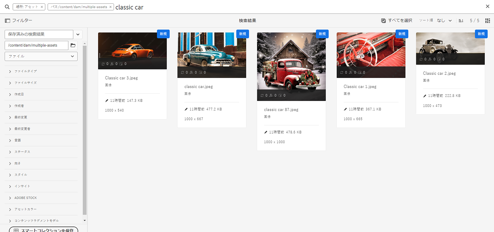-->

検索キーワードを二重引用符（&quot; &quot;）で囲むと、より具体的に検索できます。この検索には、指定した用語をまとめて含むアセットのみが含まれます。検索条件は「`"classic car"`」のようになります。したがって、`classic` および `car` の両方の語句で検索結果が表示されます。

<!--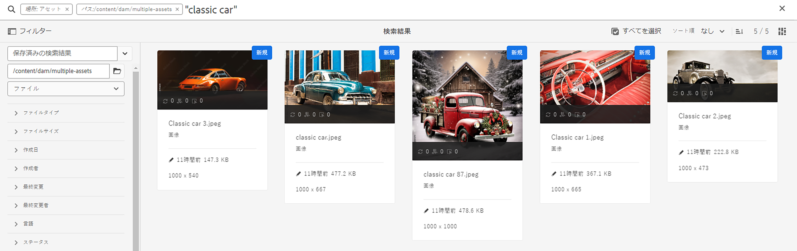-->

**[!UICONTROL Assets ビュー]**&#x200B;でも作業している場合、検索結果は同様になります。

>[!VIDEO](https://video.tv.adobe.com/v/3425489)

## ファイルとフォルダー {#files-folders}

**シナリオ 2：`automobile` フォルダー内で `classic car` キーワードを使ってすべてのファイルを検索する。**

ファイルとフォルダーのフィルターを使用して、検索を絞り込むことができます。必要に応じて、ドロップダウンリストの「ファイル」、「フォルダー」、「ファイルとフォルダー」オプションを使用します。「ファイル」、「フォルダー」、「ファイルとフォルダー」から選ぶオプションは、**[!UICONTROL 管理ビュー]**&#x200B;でのみ提供されています。**[!UICONTROL Assets ビュー]**&#x200B;で、[!UICONTROL パス]に移動し、検索を実行するフォルダーを参照します。

* レポジトリー内の特定のパスにある具体的なファイルを検索する必要がある場合、**[!UICONTROL ファイル]**&#x200B;オプションを使用します。定義されたパス内でフォルダーを検索する必要はありません。
* 特定のパスにあるフォルダーの検索を制限する必要がある場合は、**[!UICONTROL フォルダー]**&#x200B;オプションを使用します。
* レポジトリー内の特定のパスにあるすべてのアセットを検索する必要がある場合、「**[!UICONTROL ファイルとフォルダー]**」オプションを使用します。

このシナリオを実現するには、次の手順を実行します。

1. `classic car` を検索キーワードとして選択し、「検索」をクリックします。
2. 「フィルター」をクリックし、`automobile`フォルダーのフォルダーパスを定義します。例：`/content/dam/multiple-assets/automobile`
パスからフォルダーを選択し、特定のフォルダー内を検索する場合は必要なフォルダーに移動します。
3. ドロップダウンリストから「ファイル」を選択して、キーワード `classic car` を含むすべてのファイルを表示します。

<!--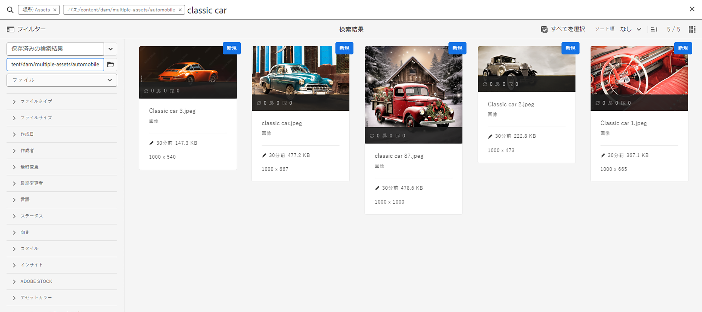-->

>[!VIDEO](https://video.tv.adobe.com/v/3425487)

## 演算子 {#operators}

**シナリオ 3：各種演算子コンビネーションを使って `Classic Car` または `Car` キーワードを検索し、検索を絞り込む。**

上記のシナリオを **[!UICONTROL 管理ビュー]**&#x200B;で使用すると、様々な演算子を組み合わせて検索エクスペリエンスを強化できます。サポートされる演算子は以下の通りです。

### AND 演算子 {#and-operator}

AND 演算子は、オムニサーチの 2 つのキーワード間のデフォルトの演算子です。例えば、検索バーで`classic car` を入力すると、`classic` および `car` キーワードを持つ結果は、デフォルトで検索結果に表示されます。

### OR 演算子 {#or-operator}

検索結果をより具体的にしたい場合や検索結果にオプションを含める場合は、OR 演算子を使用できます。例えば、`classic OR car` キーワードは、検索結果のメタデータにキーワードのいずれかを含めて表示します。

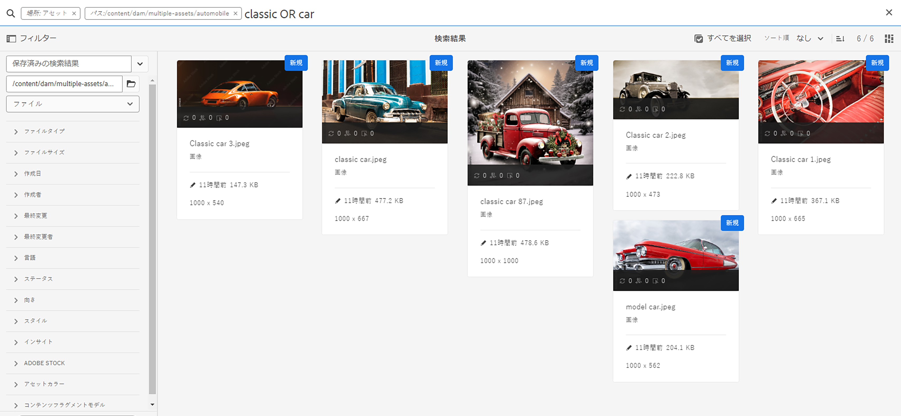

### NOT 演算子 {#not-operator}

一部のキーワードを除く結果を取得する場合は、NOT 演算子を使用できます。NOT 演算子は、ハイフン (-) 記号を使用して、検索結果から何を除外するかを AEM 検索に指示します。例えば、`car` を含むが `classic` を除外するメタデータを指定する `car - classic` 検索クエリがあります。

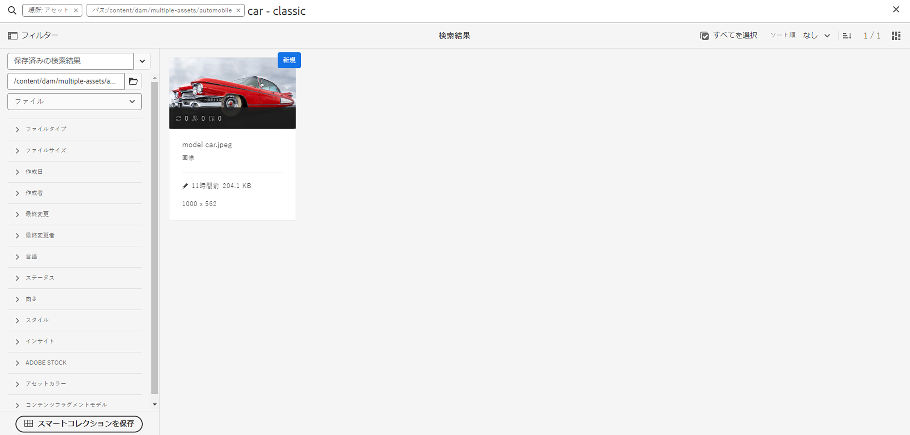

同様に、ジープ以外のすべての車を検索できます。クエリは `car - jeep` となります。メタデータ `car` を含むすべてのアセットが表示されますが、メタデータ `jeep` を含むアセットは除外されます。

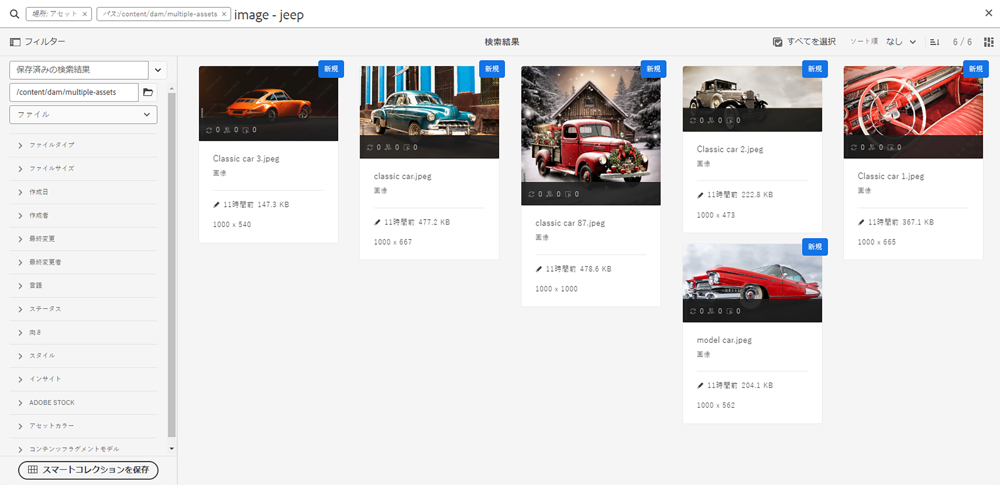

**[!UICONTROL Assets ビュー]**&#x200B;は演算子の使用をサポートしていません。

## ワイルドカード {#wildcards}

検索で 1 つ以上の文字を置き換える場合は、ワイルドカードが使用できます。上記のシナリオを **[!UICONTROL 管理ビュー]**&#x200B;で実行する場合は、様々なワイルドカードを組み合わせて使用し、検索機能を強化できます。検索の実行に使用するワイルドカードは、疑問符（?）とアスタリスク（*）の 2 つあります。疑問符記号は 1 文字、アスタリスク記号は複数の文字を検索するために使用されます。

### 疑問符（?） {#question-mark}

疑問符記号を条件演算子として使用することで、Experience Managerでの検索が容易になります。

* `car?` クエリは、car の後の 1 文字の単語と一致します。例：cart。
* `?car` クエリは、car の前に 1 文字ある単語と一致します。例：scar。
* `car????` クエリは、carの後に 4 文字がある単語と一致します。例：carwash。

### アスタリスク（*） {#asterisk}

アスタリスクは、少ない入力文字数で検索の範囲を広げるワイルドカード演算子です。検索するアセットの開始文字がわかっていて、その他の文字がわからない場合は、検索でアスタリスク演算子を使用できます。例えば、`*car` クエリは、メタデータで利用可能な、末尾に car が付くすべてのアセットを返します。結果は、classic car、sports car、 classic and sports car などになります。次に、様々な方法でアスタリスク演算子を使用した例をいくつか示します。

* `*car*`：可能なあらゆる組み合わせを含むアセットを返します。
* `car*` は、carwash、carrier、carriage などを含むアセットを返します。
* `*car` は、modern car、sports ca rなどを含むアセットを返します。

>[!VIDEO](https://video.tv.adobe.com/v/3425488)

**[!UICONTROL Assets ビュー]**&#x200B;では、ワイルドカードの使用はサポートされていません。

## フィルター {#filters}

Adobe Experience Manager には様々な検索フィルターが用意されており、スコープクエリを使用して検索を絞り込み、セグメント化できます。アセットのタイトルやメタ説明が不明な場合は、様々な検索フィルターを使用して、より関連性の高い検索を行うことができます。検索フィルターは、キーワードを入力した場合と入力しなかった場合でも使用できます。**[!UICONTROL 管理ビュー]**&#x200B;でフィルターパネルを開くには、**GlobalNav** アイコンをクリックし、**[!UICONTROL フィルター]**&#x200B;を選択します。一方、**[!UICONTROL Assets ビュー]**&#x200B;でフィルターパネルを開くには、検索バージョンの横にある「[!UICONTROL フィルター]」をクリックします。

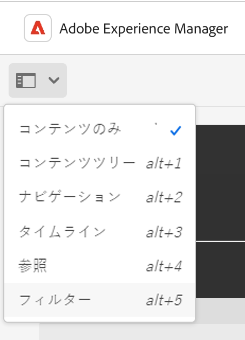

1 つまたは複数のフィルターを選択して、Adobe Experience Managerでの検索を絞り込むことができます。
<!--The following filters are available out of the box for all the users of Experience Manager:

* File Type Search Filters  
* File Size Search Filters 
* Date of Creation 
* Created by 
* Last Modified date 
* Last Modified by 
* Search by Language 
* Search by Status 
* Search based on Orientation 
* Search by Style 
* Search based on insights 
* Search by Adobe Stock 
* Color specific Asset search 
* Content fragment model 
 -->

<!--**Scenario 5: Search for an Asset named 'classic car' in Black color which has either meta description or a similar asset in Japanese language.**  
 
To perform a search on such a requirement, type 'classic car' in the search bar.  Navigate to the filters panel and expand the language search filter drop-down. Type "ja-jp", which represents the Japanese language. Expand the 'Asset Color' filter and select black color or add the hexadecimal code for the black color (#000000).

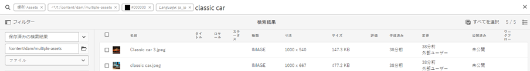
-->

**シナリオ 4：`classic car` キーワードを使用して、非公開の PDF ファイルタイプドキュメントを検索する。**

**[!UICONTROL 管理ビュー]**&#x200B;で次の手順を実行します。

1. 検索バーに「`classic car`」と入力します。
1. 「フィルター」に移動します。[!UICONTROL ファイルタイプ]の下で、「[!UICONTROL ドキュメント]」、「[!UICONTROL ワードプロセッシング]」の順に展開します。
1. 「[!UICONTROL PDF]」を選択します。
1. [!UICONTROL ステータス]／[!UICONTROL 公開]／[!UICONTROL 非公開]に移動します。

<!--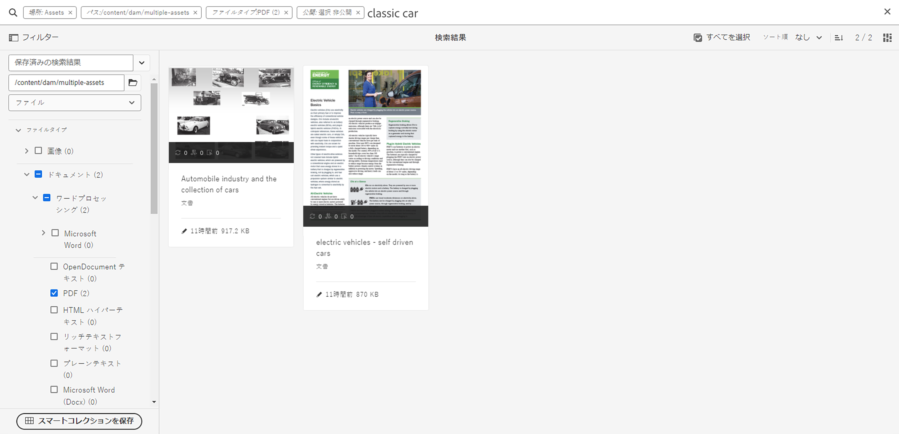-->

**[!UICONTROL Assets ビュー]**&#x200B;で次の手順を実行します。

1. 検索バーに「`classic car`」と入力します。
1. 「フィルター」に移動します。[!UICONTROL MIME タイプ]の下で「[!UICONTROL PDF]」を選択します。
1. 「[!UICONTROL アセットステータス]」に移動し、「[!UICONTROL すべて]」を選択して、公開済みおよび非公開のアセットをすべて含めます。

**シナリオ 5：PNG を除くすべての画像を検索する**

アセットのタイトルやメタ説明が不明な場合は、様々な検索フィルターを使用して、より関連性の高い検索を行うことができます。例えば、**[!UICONTROL 管理ビュー]**&#x200B;でアセットを検索するには、次の手順に従います。

1. 検索フィルターに移動します。
1. 「フィルター」に移動します。[!UICONTROL ファイルタイプ]の下で、「[!UICONTROL 画像]」を展開し、「[!UICONTROL Web 対応]」を選択します。
1. 「PNG」の選択を解除します。

<!--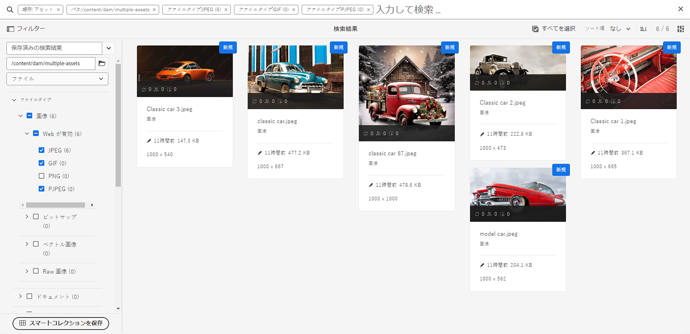-->

**[!UICONTROL Assets ビュー]**&#x200B;で述べられているシナリオを使ってアセットを検索するには、次の手順に従います。

1. 検索フィルターに移動します。
1. 「フィルター」に移動します。[!UICONTROL MIME タイプ]の下で「PNG の選択を解除」を除くすべての指定 MIME タイプを選択します。

>[!VIDEO](https://video.tv.adobe.com/v/3425486)

## 詳細検索 {#advanced-search}

AEM 検索を使用すると、手間をかけずに複雑な検索クエリを作成できます。複雑な検索クエリを作成する際に役立つ様々な例を次に示します。

**シナリオ 6：メタデータの `classic car` で、Experience Manager リポジトリ内のすべてのドキュメントを検索する。ドキュメントのコンテンツは、中に `classic car`キーワードを含める必要がある。**

Adobe Experience Manager では、検索に複数の条件を追加できます。キーワード、演算子およびフィルターを組み合わせて使用して、検索結果を絞り込むことができます。

シナリオ 6 の検索を実行するには：

1. 検索バーに `classic car` キーワードを入力します。
2. フィルターパネルに移動し、「ファイルタイプ」の下の「ドキュメント」を選択します。
3. アスタリスクワイルドカードを使用して検索を絞り込みます。「`"classic car"`」と入力して、`classic car` キーワードを含むすべてのアセットを検索します。

<!--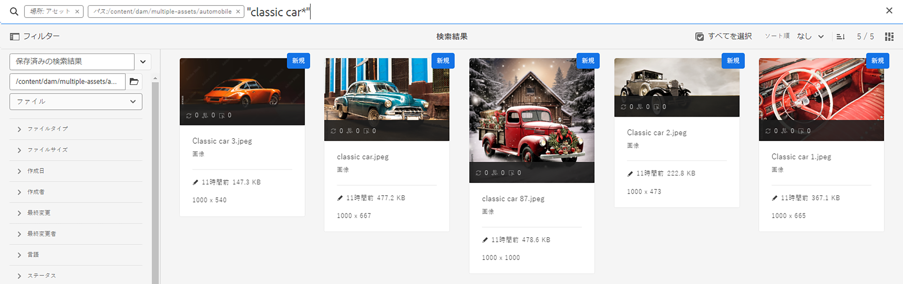-->

**[!UICONTROL Assets ビュー]**&#x200B;ではワイルドカードの使用はサポートされていないので、シナリオ 6 を実行できません。

**シナリオ 7：ドキュメントのコンテンツに `car` を含むが `classic` を除外する、Experience Manager リポジトリ内のすべてのドキュメントを検索する。同じ条件がアセットのメタデータにも当てはまる。**

シナリオ 7 の検索を実行するには：

検索バーに `car - classic` キーワードを入力します。フィルターパネルに移動し、「ファイルタイプ」の下の「ドキュメント」を選択します。検索の優先順位は、次の順序に基づきます。
優先度 1：メタデータ
優先度 2：スマートタグ

<!--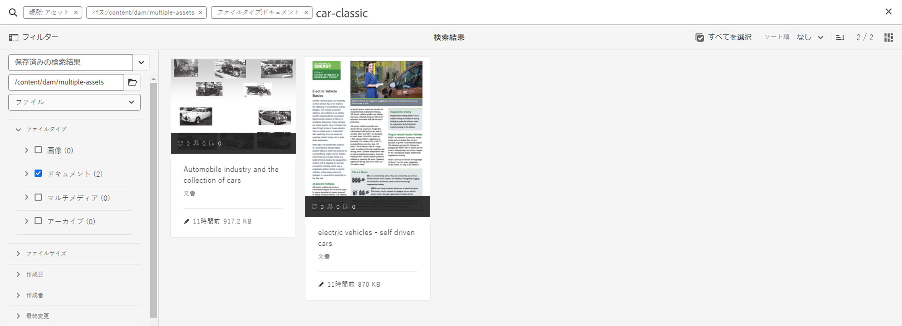-->

**[!UICONTROL Assets ビュー]** ではワイルドカードの使用がサポートされていないので、シナリオ 7 は実行できません。

<!--
**Scenario 9: Search for all images except PNG**

When you are unsure about the title or meta description of an asset, you can use various search filters to make your search more relevant. Follow the steps below:

1. Go to search filters. 
1. Under [!UICONTROL File Type], expand [!UICONTROL Images] and select [!UICONTROL Web enabled]
1. Deselect PNG.

**Method 1:** Go to search bar and type `images - PNG`. All the images appear excluding PNG.

**Method 2:** Go to search filters. Under [!UICONTROL File Type], expand [!UICONTROL Images] > select [!UICONTROL Web enabled] > deselect PNG.

-->

**シナリオ 8：メタデータ「jeeo」を使用してメタデータタグを検索**

様々な検索フィルターを使用して、特定の条件をキャプチャできます。タグとは、多数のアセットの中で識別可能にするためにアセットに割り当てられるキーワードです。例えば、このシナリオでは、「*jeep*」タグを含むアセットを検索します。これを行うには、検索バーに「`tags:jeep`」と入力します。この条件を満たすアセットのみが検索結果に表示されます。

<!--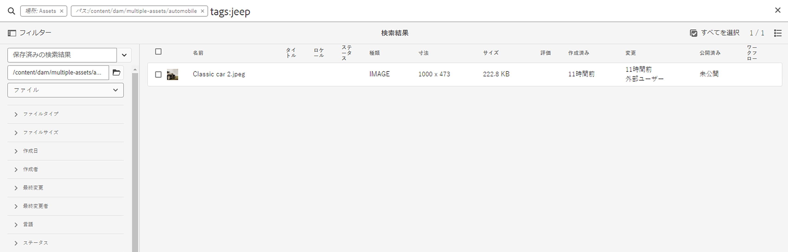-->

**[!UICONTROL Assets ビュー]**&#x200B;でも作業している場合、検索は同じような結果を表示します。

>[!VIDEO](https://video.tv.adobe.com/v/3425490)

**シナリオ 9：「red color car（赤色の車）」に類似した一致を見つける**

AEM で検索を実行する際に、選択したアセットに類似したアセットを表示することで、結果をフィルタリングできます。「**類似検索**」オプションを使用して、検索したアセットの完全一致または類似一致に検索を絞り込みます。これは、選択したアセットと類似したスマートタグを持つアセットを検索するのに役立ちます。例えば、類似アセットを検索する場合は、次の手順を実行します。

1. 必要に応じてアセットを検索します。
1. アセットの上にマウスポインターを置き、省略記号をクリックし、「[!UICONTROL 類似検索]」を選択します。
または、
アセットを選択し、右上の省略記号に移動して、「[!UICONTROL 類似検索]」を選択します。

   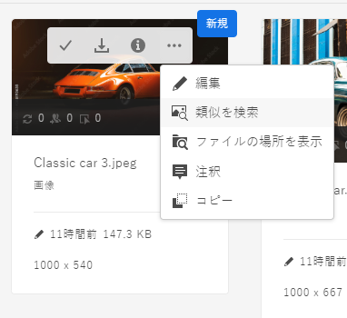

1. 検索バーを見ると、選択したアセットのサムネールが、検索要件を示す検索バーに表示されます。その結果、類似したスマートタグを持つアセットが返されます。

**[!UICONTROL Assets ビュー]**&#x200B;で次の手順を実行します。

1. 必要に応じてアセットを検索します。
1. 画像を選択し、トップにあるナビゲーションバーの「[!UICONTROL 類似画像検索]」オプションに移動します。
同様の色とメタデータを持つアセットのコレクションに移動します。

## カスタム検索ファセット {#custom-search-facets}

Adobe Experience Manager の検索ファセットを使用すると、事前に決定された単一の検索や分類上の順序ではなく、複数の方法でアセットを検索できます。必要に応じて、検索ファセットをカスタマイズし、述語を追加できます。カスタム述語の追加手順を説明するガイドとして[検索ファセット](https://experienceleague.adobe.com/docs/experience-manager-cloud-service/content/assets/admin/search-facets.html?lang=ja#)を読んでください。

<!--**Scenario 10: Search assets based on Sku ID**
to be added later
-->

**シナリオ 10：最終変更日または有効期限に基づいて特定のアセットを検索する**

日付制約を使用すると、例えば期間検索フィルターを使用して、カスタム検索を特定の期間に絞り込むことができます。上記の要件を検索するには、検索バーに「`classic car`」と入力します。[!UICONTROL 作成日]および[!UICONTROL 最終変更日]日付フィルターで日付範囲を選択します。

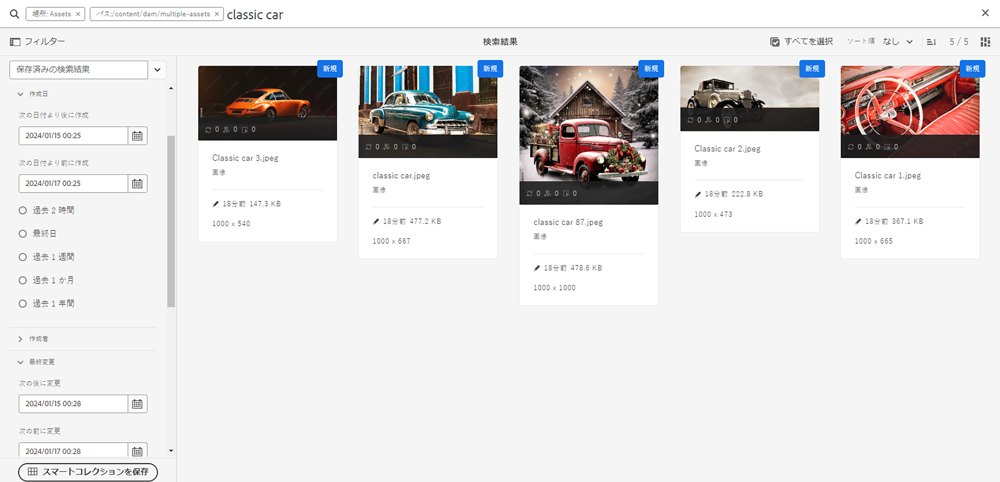

[!UICONTROL Assets ビュー]でも作業している場合、検索は類似した結果を表示します。

## キーワードの関連性の向上 {#boosting-keywords}

特定のアセットに対するキーワードの関連性を高めることで、キーワードに基づいた検索を強化できます。つまり、特定のキーワードに基づいて検索すると、それらのキーワードの対象となる画像が検索結果の最上部に表示されます。

1. Assets ユーザーインターフェイスから、アセットのプロパティページを開きます。「[!UICONTROL 詳細]」をクリックし、[!UICONTROL 検索キーワードに採用]の下で「[!UICONTROL 追加]」をクリックします。
2. 「昇格を検索」ボックスで、画像検索時の強化の対象となるキーワードを指定し、「[!UICONTROL 追加]」をクリックします。同じ方法で複数のキーワードを指定できます。
3. 「[!UICONTROL 保存して閉じる]」をクリックします。指定したキーワードに対して昇格したアセットが、検索結果の上位に表示されます。

## Experience Manager で検索を実行している間の注目すべきこと {#notable-things}

* アセットのメタデータ情報を提供し、オムニサーチアルゴリズムで検索可能なアセットを準備します。アセットのメタデータ情報が更新されていることを確認します。
* 二重引用符（&quot; &quot;）を使用して、検索を正確に絞り込みます。
* 調べているパスをクロスチェックします。フォルダー、ファイル、またはファイルとフォルダーの中から適切なオプションを選択し、適切な場所で検索クエリを実行します。
* オムニサーチバーで、検索に適用するフィルターを確認できます。
* 結果が得られない場合は、調べているパスをクロスチェックします。また、検索元のフォルダーを確認します。例えば、「自動車のフォルダー」内で検索を実行しているが、使用しているキーワードが「アパレル」に関連している場合、検索結果は不適切になります。
* 検索するキーワードの前に空白がある場合はチェックしてください。
* キーワード、演算子、フィルターを組み合わせて使用すると、検索操作を容易にし、レベルアップできます。

<!--
* Use stemming search approach while searching for the asset. It means using an exact keyword that you are looking for.
* Specify Smart tags to the asset properties to boost the ranking of the search results.
The newly added assets are not indexed.
-->

## [!UICONTROL 管理ビュー]検索および[!UICONTROL アセットビュー]検索の違い {#differences-asset-and-admin-view}

<table>
    <tr>
        <th> パラメーター </th>
        <th> 管理ビュー </th>
        <th> アセットビュー </th>
    </tr>
    <tr>
        <td> カスタムファセット </td>
        <td> 必要に応じて、<a href="https://experienceleague.adobe.com/docs/experience-manager-cloud-service/content/assets/admin/search-facets.html?lang=ja">カスタム検索ファセットを追加できます。</td>
        <td> カスタムファセットはアセットビューで部分的にサポートされています。サポートされているファセットは以下の通りです。
            <ul>
            <li> 予測されたタグ
            <li> 名前
            <li> 予測されたタグの信頼性
            <li> アセットサイズ
            <li> タイトル
            </ul>
        </td>
    </tr>
    <tr>
        <td> 演算子 </td>
        <td> AND、OR、NOT をサポート </td>
        <td> サポート対象外 </td>
    </tr>
    <tr>
        <td> ワイルドカード </td>
        <td> 疑問符（?）およびアスタリスク（*）をサポート</td>
        <td> サポート対象外 </td>
    </tr>
    <tr>
        <td> 検索結果の向上 </td>
        <td> サポート対象 </td>
        <td> サポート対象外 </td>
    </tr>
     <tr>
        <td> すべてのフィルターを一度にクリア </td>
        <td> サポート対象外 </td>
        <td> サポート対象</td>
    </tr>
     <tr>
        <td> ファイル／フォルダー／ファイルとフォルダー </td>
        <td> サポート対象 </td>
        <td> フォルダーを選択するオプションは、「ファイルの種類」の下に表示されます。 </td>
    </tr>
     <tr>
        <td> アセットのステータス </td>
        <td> 
            次のオプションがサポートされています。
            <ul>
            <li> 公開
            <li> 公開日
            <li> 最終公開者
            <li> 承認 
            <li> チェックアウト
            <li> 有効期限
            <li> Dynamic Media
            </ul>
        </td>
        <td>
        次のオプションがサポートされています。
            <ul>
            <li> すべて
            <li> 承認済み
            <li> 却下
            <li> ステータスなし
            </ul> 
        </td>
    </tr>
     <tr>
        <td> ファイルタイプ </td>
        <td>
        次のオプションがサポートされています。
            <ul>
            <li> 画像
            <li> ドキュメント
            <li> マルチメディア
            <li> アーカイブ 
            </ul>
            これらには、さらに階層的なオプションがあります。
        </td>
        <td>
        次のオプションがサポートされています。
            <ul>
            <li> 画像
            <li> ドキュメント
            <li> ビデオ
            <li> フォルダー 
            </ul> 
        その他のオプションは、「MIME タイプ」の下に表示されます。
        </td>
    </tr>
     <tr>
        <td> ファイルサイズ </td>
        <td>
        次のオプションがサポートされています。
            <ul>
            <li> From - To
            <li> サイズ（バイト、KB、MB、GB）
            </ul> 
        </td>
        <td> サポート対象外 </td>
    </tr>
     <tr>
        <td> その他のフィルター </td>
        <td>
            <ul>
            <li> 言語
            <li> ステータス
            <li> 向き
            <li> スタイル 
            <li> インサイト
            <li> Stock
            <li> アセットカラー
            <li> コンテンツフラグメントモデル
            </ul> 
        </td>
        <td> サポート対象外 </td>
    </tr>
</table>

>[!MORELIKETHIS]
>
>* [アセット検索](https://experienceleague.adobe.com/docs/experience-manager-cloud-service/content/assets/manage/search-assets.html?lang=ja)
>* [ファセット検索](https://experienceleague.adobe.com/docs/experience-manager-cloud-service/content/assets/admin/search-facets.html?lang=ja)
