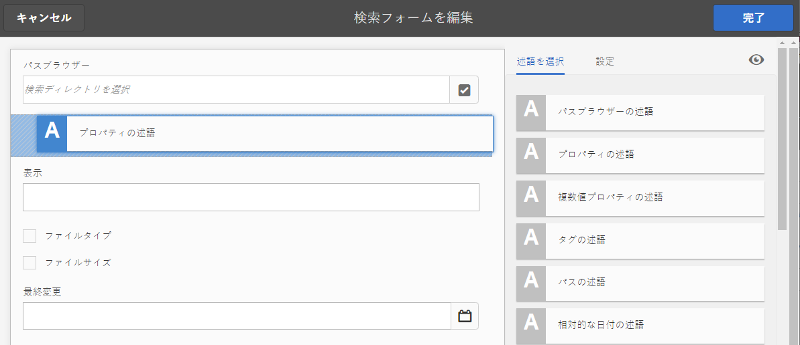
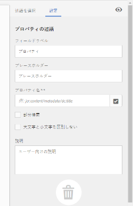
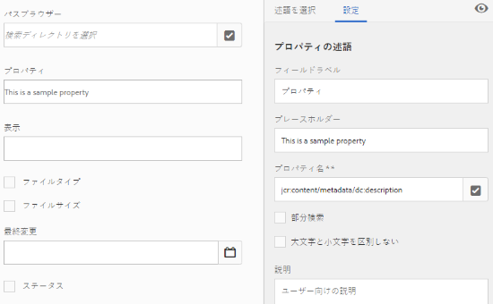
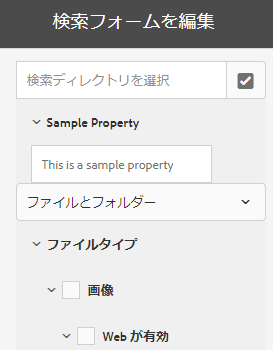
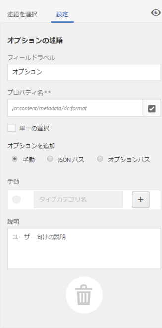
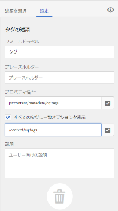

# 検索ファセット {#search-facets}

Adobe Experience Manager (AEM) Assets の企業全体のデプロイメントには、多くのアセットが格納されています。AEM の一般的な検索機能だけでは、正しいアセットを見つけることが困難で時間がかかる場合があります。

フィルターパネルの検索ファセットを使用すると、より詳細な検索が可能になり、検索機能がより効率的で柔軟になります。検索ファセットは、複数のディメンション（述語）を追加するので、ユーザーはより複雑な検索を実行できます。フィルターパネルには、いくつかの標準ファセットが含まれます。カスタム検索ファセットを追加することもできます。

つまり、検索ファセットを使用すると、事前に決定された単一の分類上の順序ではなく、複数の方法でアセットを検索できます。より焦点を絞った検索のために、目的の詳細レベルまで簡単にドリルダウンできます。

例えば、画像を検索する場合、ビットマップとベクトル画像のどちらを検索するかを選択できます。画像の MIME タイプを指定して、検索の範囲をさらに絞り込むことができます。同様に、ドキュメントを検索する場合は、PDF や MS Word などの形式を指定できます。

## 述語の追加 {#adding-a-predicate}

フィルターパネルに表示される検索ファセットは、述語を使用した基盤となる検索フォームで定義されます。より多くのファセットや別のファセットを表示するには、述語をデフォルトフォームに追加するか、選択したファセットを含むカスタムフォームを使用します。

フルテキスト検索の場合は、`Fulltext` 述語をフォームに追加します。「プロパティの述語」を使用すると、ユーザーが指定した 1 つのプロパティと一致するアセットが検索されます。「オプションの述語」を使用すると、特定のプロパティについて 1 つ以上の値と一致するアセットが検索されます。「日付の範囲の述語」を追加すると、指定した期間内に作成されたアセットが検索されます。

1. AEM のロゴをタップまたはクリックし、**[!UICONTROL ツール]**／**[!UICONTROL 一般]**／**[!UICONTROL 検索フォーム]**&#x200B;に移動します。
1. 検索フォームページで、「**[!UICONTROL アセット管理者の検索レール]**」を選択し、「**編集**」 をタップします。

   

1. 検索フォームを編集ページで、「**[!UICONTROL 述語を選択]**」タブからメインウィンドウに述語をドラッグします。例えば、「**[!UICONTROL プロパティの述語]**」をドラッグします。

   

   *図：述語を押して移動し、検索フィルターをカスタマイズ。*

1. 「設定」タブで、その述語のフィールドラベル、プレースホルダーテキストおよび説明を入力します。述語に関連付けるメタデータプロパティの有効な名前を指定します。「設定」タブのヘッダーラベルは、選択した述語のタイプを示します。

   

   *図:「設定」タブを使用した述語の必須オプションの指定。*

1. 「**[!UICONTROL プロパティ名]**」フィールドで、述語に関連付けるメタデータプロパティの有効な名前を指定します。実行される検索に基づく名前です。例えば、`jcr:content/metadata/dc:description` や `./jcr:content/metadata/dc:description` を入力します。選択ダイアログから既存のノードを選択することもできます。

   

   *図:「プロパティ名」フィールドでのメタデータプロパティと述語の関連付け。*

1. 「**[!UICONTROL プレビュー]**」をクリックして、述語追加後のフィルターパネルの表示に関するプレビューを生成します。
1. プレビューモードで述語のレイアウトを確認します。

   

   変更送信前の検索フォームのプレビュー

1. プレビューを閉じるには、プレビューの右上隅にある「**[!UICONTROL 閉じる]**」 をクリックします。
1. 「**[!UICONTROL 完了]**」をタップして、設定を保存します。
1. Assets ユーザーインターフェイスの検索パネルに移動します。プロパティの述語がパネルに追加されています。
1. 検索するアセットの説明をテキストボックスに入力します。例えば、&quot;Adobe&quot; と入力します。検索を実行すると、「Adobe」に一致する説明を含むアセットが検索結果に表示されます。

## オプションの述語の追加 {#adding-an-options-predicate}

オプションの述語を使用すると、フィルターパネルに複数の検索オプションを追加できます。フィルターパネルで 1 つ以上のオプションを選択して、アセットを検索できます。例えば、ファイルタイプに基づいてアセットを検索するには、検索フォームに「画像」、「マルチメディア」、「ドキュメント」、「アーカイブ」などのオプションを設定します。これらのオプションを設定後、フィルターパネルで「画像」オプションを選択すると、GIF、JPEG、PNG などのタイプのアセットに対して検索が実行されます。

オプションをそれぞれのプロパティにマップするには、オプション用のノード構造を作成し、「オプションの述語」の「プロパティ名」プロパティに親ノードのパスを指定します。親ノードのタイプは `sling`:`OrderedFolder` とする必要があります。オプションのタイプは `nt:unstructured` とする必要があります。オプションノードには、`jcr:title` プロパティと `value` プロパティを設定する必要があります。

`jcr:title` プロパティは、フィルターパネルに表示される、オプションのわかりやすい名前です。`value` フィールドは、指定されたプロパティと照合するためにクエリで使用されます。

オプションを選択すると、検索がオプションノードの `value` プロパティとその子ノード（存在する場合）に基づいて実行されます。オプションノード以下のツリー全体がトラバースされ、各子ノードの `value` プロパティが OR 演算子によって結合されて、検索クエリが作成されます。

例えば、ファイルタイプとして「画像」を選択した場合、アセットの検索クエリは OR 演算子によって `value` プロパティを結合することで作成されます。例として、画像の検索クエリは、プロパティ `jcr:content/metadata/dc:format` に対して *image/jpeg*、*image/gif*、*image/png*、*image/pjpeg*、*image/tiff* として一致する結果を OR 演算で結合することにより作成されます。

CRXDE に見られるように、ファイルタイプの値プロパティは、検索クエリが機能するために使用されます。

CRX リポジトリのオプションでノード構造を手動で作成する代わりに、対応するキーと値のペアを指定することで JSON ファイルでオプションを定義することもできます。JSON ファイルのパスを「**[!UICONTROL プロパティ名]**」フィールドに指定します。例えば、キーと値のペア `image/bmp`、`image/gif`、`image/jpeg`、`image/png` を定義し、次の JSON ファイルのサンプルに示すように、それらの値を指定します。「**[!UICONTROL プロパティ名]**」フィールドで、このファイルの CRX パスを指定できます。

```json
{
    "options" :
 [
          {"value" : "image/bmp","text" : "BMP"},
          {"value" : "image/gif","text" : "GIF"},
          {"value" : "image/jpeg","text" : "JPEG"},
          {"value" : "image/png","text" : "PNG"}
 ]
}
```

既存のノードを使用する場合は、選択ダイアログを使用して指定します。

>[!NOTE]
>
>オプションの述語は、求める動作を実行するためにプロパティの述語を組み合わせたカスタムのラッパーです。現時点で、この機能をネイティブにサポートする REST エンドポイントは存在しません。

1. AEM ロゴをタップし、**[!UICONTROL ツール／一般／検索フォーム]**&#x200B;に移動します。
1. **[!UICONTROL 検索フォーム]**&#x200B;ページで、「**[!UICONTROL アセット管理者の検索レール]**」を選択し、「編集」アイコンをタップします。
1. **[!UICONTROL 検索フォームを編集]**&#x200B;ページで、「**[!UICONTROL 述語を選択]**」タブからメインウィンドウに&#x200B;**[!UICONTROL オプションの述語]**&#x200B;をドラッグします。
1. 「**[!UICONTROL 設定]**」タブで、プロパティのラベルと名前を入力します。例えば、アセットの形式に基づいてアセットを検索するには、ラベルに対してわかりやすい名前（例：**[!UICONTROL ファイルタイプ]**）を指定します。検索実行の基準となるプロパティをプロパティフィールドに指定します（例：`jcr:content/metadata/dc:format.`）。
1. 次のいずれかの操作をおこないます。

   * 「**[!UICONTROL プロパティ名]**」フィールドで、オプションのノードを定義する JSON ファイルのパスを指定し、対応するキーと値のペアを指定します。
   * Tap  next to the Options field to specify the display text and value for the options you want to supply in the Filters panel. To add another option, tap/click  and repeat the step.

1. ユーザーが一度に複数のファイルタイプのオプション（例：「画像」、「ドキュメント」、「マルチメディア」、「アーカイブ」）を選択可能にするには、「**[!UICONTROL 単一の選択]**」チェックボックスをオフにします。「**[!UICONTROL 単一の選択]**」をオンにすると、ユーザーは一度に 1 つのファイルタイプのオプション選択できます。

   

   オプションの述語で使用可能なフィールド

1. 「**説明**」フィールドに説明を任意で入力し、「**[!UICONTROL 完了]**」をクリックします。
1. 検索パネルに移動します。オプションの述語が&#x200B;**検索**&#x200B;パネルに追加されています。**[!UICONTROL ファイルタイプ]**&#x200B;のオプションがチェックボックスとして表示されます。

## 複数値プロパティの述語の追加 {#adding-a-multi-value-property-predicate}

`Multi Value Property` の述語では、複数の値でアセットを検索できます。AEM Assets で複数の製品の画像があり、各画像のメタデータには製品の SKU 番号が含まれているとします。この述語を利用すれば、複数の SKU 番号で製品の画像を検索できます。

1. AEM のロゴをクリックし、**[!UICONTROL ツール]**／**[!UICONTROL 一般]**／**[!UICONTROL 検索フォーム]**&#x200B;の順に移動します。
1. 検索フォームページで、「**[!UICONTROL アセット管理者の検索レール]**」を選択し、「**編集**」 をタップします。
1. 検索フォームを編集ページで、「**[!UICONTROL 述語を選択]**」タブからメインウィンドウに&#x200B;**[!UICONTROL 複数値プロパティの述語]**&#x200B;をドラッグします。
1. 「**[!UICONTROL 設定]**」タブで、述語のラベルとプレースホルダーテキストを入力します。プロパティフィールドに検索したいプロパティ名を指定します（例：`jcr:content/metadata/dc:value`）。選択ダイアログを使用してノードを選択することもできます。
1. 「**[!UICONTROL 区切り文字サポート]**」が選択されていることを確認します。「**[!UICONTROL 入力区切り文字]**」フィールドで、それぞれの値を区切る文字を指定します。デフォルトでは、コンマが区切り文字に指定されています。別の区切り文字を指定できます。
1. 「**説明**」フィールドに説明を任意で入力し、「**[!UICONTROL 完了]**」をタップします。
1. Assets ユーザーインターフェイスのフィルターパネルに移動します。**[!UICONTROL 複数値プロパティ]**&#x200B;の述語がパネルに追加されています。
1. 「複数値」フィールドに、複数の値を区切り文字で区切って検索します。述語は、指定した値とテキストが完全に一致するものを返します。

## タグ用述語の追加 {#adding-a-tags-predicate}

`Tags` の述語では、タグに基づいたアセットの検索が実行できます。デフォルトでは、AEM Assets は指定したタグに基づいて、1 つまたは複数のタグと一致するアセットを検索します。言い換えれば、検索クエリは指定したタグを用いて OR 演算を実行します。ただし、「すべてのタグに一致」オプションを使用すれば、すべての指定したタグを含むアセットを検索することも可能です。

1. AEM のロゴをクリックし、**[!UICONTROL ツール]**／**[!UICONTROL 一般]**／**[!UICONTROL 検索フォーム]**&#x200B;の順に移動します。
1. 検索フォームページで、「**[!UICONTROL アセット管理者の検索レール]**」を選択し、「**編集**」 をタップします。
1. 検索フォームを編集ページで、「**[!UICONTROL 述語を選択]**」タブからメインウィンドウにタグの述語をドラッグします。
1. 「設定」タブで、述語のプレースホルダーテキストを入力します。プロパティフィールドに検索したいプロパティ名を指定します（例：`jcr:content/metadata/cq:tags`）。または、選択ダイアログから CRXDE のノードを選択することもできます。
1. この述語の「ルートタグ」の「パス」プロパティを設定して、「タグ」リストに様々なタグを表示させます。
1. すべての指定したタグを含むアセットを検索するには、「**[!UICONTROL すべてのタグに一致オプションを表示]**」を選択します。

   

1. 「**[!UICONTROL 説明]**」フィールドに説明を任意で入力し、「**[!UICONTROL 完了]**」をクリックまたはタップします。
1. 検索パネルに移動します。**[!UICONTROL タグ]**&#x200B;の述語が検索パネルに追加されています。
1. アセットの検索に使用するタグを指定または表示されたリストから選択します。
1. すべての指定したタグに一致するアセットを検索するには、「**[!UICONTROL すべてに一致]**」を選択します。

## その他の述語の追加 {#adding-other-predicates}

プロパティの述語やオプションの述語の追加と同様の手順で、検索パネルにその他の次の述語を追加できます。

<table>
 <tbody>
  <tr>
   <td><p><strong>述語名</strong></p> </td>
   <td><p><strong>説明</strong></p> </td>
   <td><p><strong>プロパティ</strong></p> </td>
  </tr>
  <tr>
   <td><p>フルテキスト</p> </td>
   <td>アセットノード全体に対してフルテキスト検索を実行する検索用述語。これは <code>jcr</code>:<code>contains</code> 演算子と共にマッピングされます。アセットノードの特定の部分に対してフルテキスト検索を実行する場合は、相対パスを指定できます。</td>
   <td>
    <ul>
     <li>ラベル</li>
     <li>プレースホルダー</li>
     <li>プロパティ名</li>
     <li>説明</li>
    </ul> </td>
  </tr>
  <tr>
   <td>パスブラウザー</td>
   <td>事前設定されたルートパスのフォルダーとサブフォルダーのアセットを検索するための検索用述語。</td>
   <td>
    <ul>
     <li>プレースホルダー</li>
     <li>ルートパス</li>
     <li>説明</li>
    </ul> </td>
  </tr>
  <tr>
   <td><p>パス</p> </td>
   <td><p>場所で結果をフィルタリングするために使用します。オプションとして複数のパスを指定できます。</p> </td>
   <td>
    <ul>
     <li>ラベル</li>
     <li>パス</li>
     <li>説明</li>
    </ul> </td>
  </tr>
  <tr>
   <td><p>公開ステータス</p> </td>
   <td><p>公開ステータスに基づいてアセットを検索するための検索用述語。</p> </td>
   <td>
    <ul>
     <li>ラベル</li>
     <li>プロパティ名</li>
     <li>説明</li>
    </ul> </td>
  </tr>
  <tr>
   <td><p>相対的な日付</p> </td>
   <td><p>アセットの相対的な作成日に基づいてアセットを検索するための検索用述語。例えば、2 ヶ月前、3 週間前などのようにオプションを設定できます。 </p> </td>
   <td>
    <ul>
     <li>ラベル</li>
     <li>プロパティ名</li>
     <li>相対的な日付</li>
    </ul> </td>
  </tr>
  <tr>
   <td><p>範囲</p> </td>
   <td><p>指定した範囲内にあるアセットを検索するための検索用述語。検索パネルで、範囲の最小値と最大値を指定できます。</p> </td>
   <td>
    <ul>
     <li>ラベル</li>
     <li>プロパティ名</li>
     <li>説明</li>
    </ul> </td>
  </tr>
  <tr>
   <td><p>日付範囲</p> </td>
   <td><p>指定した日付プロパティの範囲内で作成されたアセットを検索するための検索用述語。検索パネルで、日付選択を使用して開始日と終了日を指定できます。</p> </td>
   <td>
    <ul>
     <li>ラベル</li>
     <li>プレースホルダー</li>
     <li>プロパティ名</li>
     <li>範囲テキスト (開始)</li>
     <li>範囲テキスト (終了)</li>
     <li>説明</li>
    </ul> </td>
  </tr>
  <tr>
   <td><p>日付</p> </td>
   <td><p>日付プロパティに基づいて、スライダーを使用してアセットを検索するための検索用述語。</p> </td>
   <td>
    <ul>
     <li>ラベル</li>
     <li>プロパティ名</li>
     <li>説明</li>
    </ul> </td>
  </tr>
  <tr>
   <td><p>ファイルサイズ</p> </td>
   <td><p>サイズに基づいてアセットを検索するための検索用述語。スライダーベースの述語で、設定可能なノードからスライダーのオプションを選択します。デフォルトのオプションは、CRX リポジトリの /libs/dam/options/predicates/filesize で定義されています。ファイルサイズはバイト単位で示します。</p> </td>
   <td>
    <ul>
     <li>ラベル</li>
     <li>プロパティ名</li>
     <li>パス</li>
     <li>説明</li>
    </ul> </td>
  </tr>
  <tr>
   <td>最終変更アセット</td>
   <td>最近変更されたアセットを検索するための検索用述語。 </td>
   <td>
    <ul>
     <li>プロパティ名</li>
     <li>プロパティ値</li>
     <li>説明</li>
    </ul> </td>
  </tr>
  <tr>
   <td>公開ステータス</td>
   <td>公開ステータスに基づいてアセットを検索するための検索用述語。 </td>
   <td>
    <ul>
     <li>ラベル</li>
     <li>プロパティ名</li>
     <li>説明</li>
    </ul> </td>
  </tr>
  <tr>
   <td>評価</td>
   <td>平均評価に基づいてアセットを検索するための検索用述語。 </td>
   <td>
    <ul>
     <li>ラベル</li>
     <li>プロパティ名</li>
     <li>オプションパス</li>
     <li>説明</li>
    </ul> </td>
  </tr>
  <tr>
   <td>有効期限ステータス</td>
   <td>有効期限に基づいてアセットを検索するための検索用述語。 </td>
   <td>
    <ul>
     <li>ラベル</li>
     <li>プロパティ名</li>
     <li>説明</li>
    </ul> </td>
  </tr>
  <tr>
   <td>非表示</td>
   <td>非表示のフィールドプロパティを定義してアセットを検索するための検索用述語。</td>
   <td>
    <ul>
     <li>プロパティ名</li>
     <li>プロパティ値</li>
     <li>説明</li>
    </ul> </td>
  </tr>
 </tbody>
</table>

## デフォルトの検索ファセットを復元 {#restoring-default-search-facets}

デフォルトでは、ロックアイコンは&#x200B;**[!UICONTROL 検索フォーム]**&#x200B;ページの「**[!UICONTROL アセット管理者の検索レール]**」の前に表示されます。フォームに検索ファセットを追加した場合、ロックアイコンが表示されなくなります。これはデフォルトのフォームが変更されたことを示します。

検索フォームページのオプションに対するロックアイコンは、デフォルト設定がそのままになっており、カスタマイズされていないことを示します。

デフォルトの検索ファセットを復元するには、次の手順を実行します。

1. **[!UICONTROL 検索フォーム]**&#x200B;ページで「**[!UICONTROL アセット管理者の検索レール]**」を選択します。
1. ツールバーの「**[!UICONTROL 削除]**」 をタップします。
1. 確認ダイアログで、「**[!UICONTROL 削除]**」をタップして、カスタムの変更を削除します。

   検索ファセットへのカスタムの変更を削除すると、**[!UICONTROL 検索フォーム]**&#x200B;ページの「**[!UICONTROL アセット管理者の検索レール]**」の前にロックアイコンが再び表示されるようになります。

## ユーザーの権限 {#user-permissions}

管理者の役割が割り当てられていない場合に、検索ファセットに関連する編集、削除およびプレビューアクションを実行するために必要な権限を次に示します。

| アクション | 権限 |
|---|---|
| 編集 | CRX の `/apps` ノードに対する読み取りおよび書き込み権限。 |
| 削除 | CRX の `/apps` ノードに対する読み取り、書き込みおよび削除権限。 |
| プレビュー | CRX の `/var/dam/content` ノードに対する読み取り、書き込みおよび削除権限。また、`/apps` ノ＾ドの読み取りおよび書き込み権限。 |

>[!MORELIKETHIS]
>
>* [デジタルアセットの検索](search-assets.md)。

