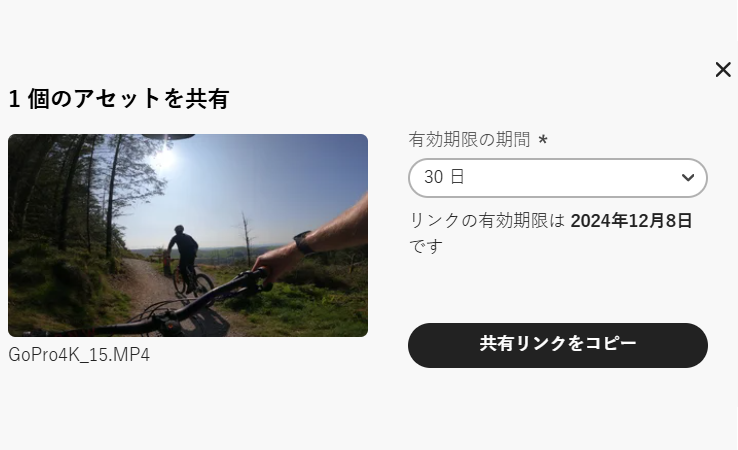
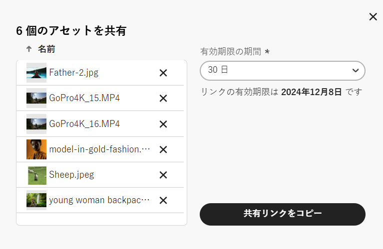
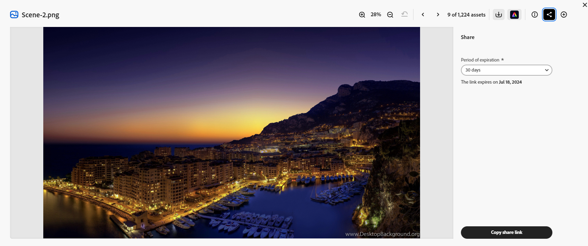

# コンテンツハブでのアセットの共有 {#search-assets-as-a-link}

<table>
    <tr>
        <td>
            <i> 新規 </i>Dynamic Media Prime<a href="/help/assets/dynamic-media/dm-prime-ultimate.md"><b>Ultimate</b></a>
        </td>
        <td>
            <i> 新規 </i> <a href="/help/assets/assets-ultimate-overview.md"><b>AEM AssetsUltimate</b></a>
        </td>
        <td>
            <i> 新規 </i> <a href="/help/assets/integrate-aem-assets-edge-delivery-services.md"><b>AEM AssetsとEdge Delivery Servicesの統合 </b></a>
        </td>
        <td>
            <i> 新規 </i><a href="/help/assets/aem-assets-view-ui-extensibility.md"><b>UI 拡張機能 </b></a>
        </td>
          <td>
            <i>Dynamic Media Prime</i>Ultimateの新 <a href="/help/assets/dynamic-media/enable-dynamic-media-prime-and-ultimate.md"><b> 能 </b></a>
        </td>
    </tr>
    <tr>
        <td>
            <a href="/help/assets/search-best-practices.md"><b>検索のベストプラクティス</b></a>
        </td>
        <td>
            <a href="/help/assets/metadata-best-practices.md"><b>メタデータのベストプラクティス</b></a>
        </td>
        <td>
            <a href="/help/assets/product-overview.md"><b>コンテンツハブ</b></a>
        </td>
        <td>
            <a href="/help/assets/dynamic-media-open-apis-overview.md"><b>OpenAPI 機能を備えた Dynamic Media</b></a>
        </td>
        <td>
            <a href="https://developer.adobe.com/experience-cloud/experience-manager-apis/"><b>AEM Assets 開発者向けドキュメント</b></a>
        </td>
    </tr>
</table>

>[!AVAILABILITY]
>
>コンテンツハブガイドを PDF 形式で利用できるようになりました。ガイド全体をダウンロードし、Adobe Acrobat AI アシスタントを使用して質問に答えてください。
>
>[!BADGE コンテンツハブガイドの PDF]{type=Informative url="https://helpx.adobe.com/content/dam/help/en/experience-manager/aem-assets/content-hub.pdf"}

リンクを通じたアセットの共有は、[!DNL the Content Hub] ユーザーがリソースを利用できるようにする便利な方法です。この機能を使用すると、許可されたユーザーは、自分と共有されているアセットにアクセスしてダウンロードできます。共有リンクからアセットをダウンロードする場合、[!DNL the Content Hub] は、より高速で中断のないダウンロードを提供する非同期サービスを使用します。

## 前提条件 {#prerequisites}

[コンテンツハブユーザー](deploy-content-hub.md#onboard-content-hub-users)は、この記事で説明されているアクションを実行できます。

## 1 つのアセットの共有 {#share-a-single-asset}

1 つのアセットを共有するには、次の手順を実行します。

1. アセットを選択し、 アイコンをクリックして、アセットを共有します。

   

1. 「**[!UICONTROL 有効期限]**」フィールドを使用して、リンクの有効期限を指定します。24 時間、1 週間、30 日、90 日、1 年などの使用可能なオプションの 1 つを選択するか、カスタム日付を指定します。

1. 「**[!UICONTROL 共有リンクをコピー]**」をクリックします。コピーしたリンクを受信者と共有できます。

## 複数のアセットの共有 {#share-multiple-assets}

[!DNL The Content Hub] では、共有リンクを通じて複数のアセットを共有できます。次の手順を実行します。

1. 承認済み受信者と共有する必要があるアセットを選択します。複数のアセットを 1 つずつ選択することも、「**[!UICONTROL すべて選択]**」をクリックして使用可能なすべてのアセットを一度に選択することもできます。「**[!UICONTROL すべて選択]**」オプションは、1 つ以上のアセットを選択した場合にのみ表示されます。

1.  アイコンをクリックします。

   

1. プレビューセクションでは、要件に応じてアセットを削除することもできます。「**[!UICONTROL 有効期限]**」フィールドを使用して、リンクの有効期限を指定します。24 時間、1 週間、30 日、90 日、1 年などの使用可能なオプションの 1 つを選択するか、カスタム日付を指定します。

1. 「**[!UICONTROL 共有リンクをコピー]**」をクリックします。コピーしたリンクを受信者と共有できます。

## アセットのプレビューと共有 {#preview-assets}

リンクの受信者と共有する前に、共有するデジタルアセットの外観をプレビューして確認できます。プレビューする必要があるアセットをクリックします。[!DNL Content Hub] には、[アセットの詳細ビュー](asset-properties-content-hub.md)が表示されます。

 アイコンをクリックして、アセットを共有します。「**[!UICONTROL 有効期限]**」フィールドを使用して、リンクの有効期限を指定します。24 時間、1 週間、30 日、90 日、1 年などの使用可能なオプションの 1 つを選択するか、カスタム日付を指定します。「**[!UICONTROL 共有リンクをコピー]**」をクリックします。コピーしたリンクを受信者と共有できます。

## 共有アセットにアクセス {#access-shared-assets}

許可された受信者は、アセットのリンクを共有した後、リンクをクリックし、web ブラウザーで共有アセットをプレビューまたはダウンロードできます。

共有リンクをクリックし、アセットカードにあるダウンロードアイコンをクリックして、アセットをダウンロードします。また、複数のアセットを選択して、「**[!UICONTROL ダウンロード]**」をクリックすることもできます。<!--You can either download original assets or Original+Renditions of an asset.--> [!DNL The Content Hub] では、各アセットを 1 つずつローカルファイルシステムにダウンロードします。

