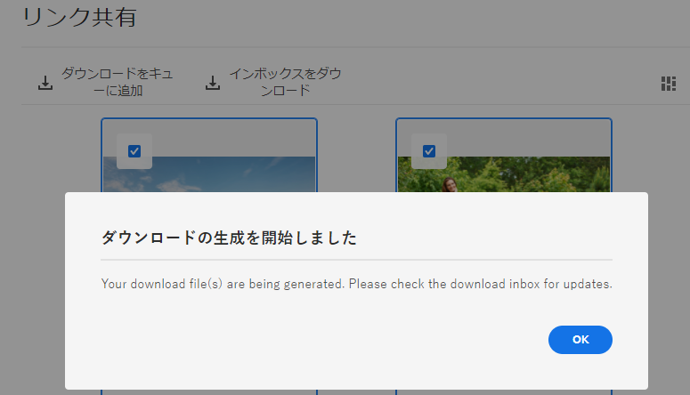

# Adobe [!DNL Experience Manager] で管理されるアセットの共有と配布  {#share-assets-from-aem}

| バージョン | 記事リンク |
| -------- | ---------------------------- |
| AEM 6.5 | [ここをクリックしてください](https://experienceleague.adobe.com/docs/experience-manager-65/assets/administer/link-sharing.html?lang=ja) |
| AEM as a Cloud Service | この記事 |

[!DNL Adobe Experience Manager Assets] では、アセット、フォルダー、コレクションを組織内や外部（パートナーやベンダーなど）のメンバーと共有できます。Adobe [!DNL Experience Manager Assets] as a [!DNL Cloud Service] のアセットを共有するには、次の方法を使用します。

* [リンクとして共有](#sharelink).
* [アセットをダウンロードし、個別に共有します。](/help/assets/download-assets-from-aem.md)
* [[!DNL Experience Manager]  デスクトップアプリケーション](https://experienceleague.adobe.com/docs/experience-manager-desktop-app/using/introduction.html?lang=ja)を使用して共有します。
* [[!DNL Adobe Asset Link] を使用して共有します](https://www.adobe.com/jp/creativecloud/business/enterprise/adobe-asset-link.html)。
* [[!DNL Brand Portal] を使用して共有します](https://experienceleague.adobe.com/docs/experience-manager-brand-portal/using/introduction/brand-portal.html?lang=ja)。

## 前提条件 {#prerequisites}

[アセットをリンクとして共有するための設定](#config-link-share-settings)を行うには、管理者権限が必要です。

## リンク共有設定の指定 {#config-link-share-settings}

[!DNL Experience Manager Assets] では、デフォルトのリンク共有設定を指定できます。

1. [!DNL Experience Manager] ロゴをクリックし、**[!UICONTROL ツール]**／**[!UICONTROL Assets]**／**[!UICONTROL Assets 設定]**／**[!UICONTROL リンク共有]**&#x200B;に移動します。
1. 初期設定：

   * **オリジナルを含める：**

      * `Select Include Originals` を選択し、デフォルトでリンク共有ダイアログに表示される `Include Originals` オプションを選択します。
      * リンク共有ダイアログで「`Include Originals`」オプションがどのように表示されるかを選択します。「[!UICONTROL 編集可能]」の場合は、「初期設定」で定義した設定をユーザーが変更できます。「`Read-only`」の場合は、設定は表示されますが、変更できません。「`Hidden`」の場合は、設定が非表示になり、「初期設定」で設定した値が使用されます。
   * **レンディションを含める：**
      * `Select Include Renditions` オプションを選択して、デフォルトでリンク共有ダイアログに表示される `Include Renditions` オプションを選択します。
      * リンク共有ダイアログで「`Include Renditions`」オプションがどのように表示されるかを選択します。「[!UICONTROL 編集可能]」の場合は、「初期設定」で定義した設定をユーザーが変更できます。「`Read-only`」の場合は、設定は表示されますが、変更できません。「`Hidden`」の場合は、設定が非表示になり、「初期設定」で設定した値が使用されます。

1. 「`Expiration date`」セクションの `Validity Period` フィールドに、リンクのデフォルトの有効期間を指定します。

1. アクションバーの&#x200B;**[!UICONTROL リンク共有]**&#x200B;ボタン：
   * `jcr:modifyAccessControl` 権限を持つすべてのユーザーは、[!UICONTROL リンク共有]オプションを表示できます。デフォルトでは、すべての管理者に表示されます。[!UICONTROL リンク共有]ボタンは、デフォルトでは全員に表示されます。このオプションを定義済みのグループに対してのみ表示するようにを設定することも、特定のグループからこのオプションを拒否することもできます。特定のグループに対して `Share Link` オプションを表示する場合は、`Allow only for groups` を選択します。`Deny from groups` を選択して、特定のグループから `Share Link` オプションを拒否します。これらのオプションのいずれかを選択したら、`Select Groups` フィールドを使用してグループ名を指定し、許可または拒否するグループ名を追加します。

メール設定に関する設定について詳しくは、[メールサービスドキュメント](https://experienceleague.adobe.com/docs/experience-manager-learn/cloud-service/networking/examples/email-service.html?lang=ja)を参照してください


## アセットをリンクとして共有 {#sharelink}

リンクを通じたアセットの共有は、外部の関係者、マーケター、その他の [!DNL Experience Manager] ユーザーがリソースを利用できるようにする便利な方法です。この機能を使用すると、匿名ユーザーは、自分と共有されているアセットにアクセスしてダウンロードできます。 共有リンクからアセットをダウンロードする場合、[!DNL Experience Manager Assets] は、より高速で中断のないダウンロードを提供する非同期サービスを使用します。ダウンロードされるアセットは、バックグラウンドで、管理可能なファイルサイズの ZIP アーカイブのキューに入れられます。大容量のダウンロードの場合、ファイルサイズあたり 100 GB の複数のファイルにバンドルされます。

<!--
Users with administrator privileges or with read permissions at `/var/dam/share` location are able to view the links shared with them. 
-->

>[!NOTE]
>
>* リンクとして共有するフォルダーやアセットに対する ACL 編集権限が必要です。
>* ユーザーとリンクを共有する前に、[送信メールを有効にします](/help/implementing/developing/introduction/development-guidelines.md#sending-email)。

リンク共有機能を使用してアセットを共有するには、次の 2 つの方法があります。

1. 共有リンクを生成し、[コピーして、他のユーザーとアセットリンク](#copy-and-share-assets-link) を共有します。
1. 共有リンクを生成し、[メールでアセットリンクを共有します](#share-assets-link-through-email)。有効期限の日時などのデフォルト値を変更し、元のアセットとそのレンディションをダウンロードできます。メールアドレスを追加することで、複数のユーザーにメールを送信できます。

   

どちらの場合も、有効期限の日時などのデフォルト値を変更し、元のアセットとそのレンディションをダウンロードできます。

### アセットリンクをコピーして共有{#copy-and-share-asset-link}

アセットを公開 URL として共有するには：

1. [!DNL Experience Manager Assets] にログインし、「**[!UICONTROL ファイル]**」に移動します。
1. アセットまたはアセットを含むフォルダーを選択します。ツールバーで「**[!UICONTROL リンクを共有]**」をクリックします。
1. **[!UICONTROL リンク共有]** ダイアログが表示され、 **[!UICONTROL 共有リンク]** フィールドに自動生成されたアセットリンクが含まれます。
1. 必要に応じて、共有リンクの有効期限を設定します。
1. **[!UICONTROL リンク設定]**&#x200B;で、`Include Originals` または `Include Renditions` をチェックまたはチェック解除して、2 つのいずれかを含めるか除外します。少なくともオプションの選択は必須です。
1. 選択したアセットの名前は [!DNL Share Link] ダイアログボックスの右の列に表示されます。
1. アセットリンクをコピーしてユーザーと共有します。

### メール通知によるアセットリンクの共有 {#share-assets-link-through-email}

メールでアセットを共有するには：

1. アセットまたはアセットを含むフォルダーを選択します。ツールバーで「**[!UICONTROL リンクを共有]**」をクリックします。
1. **[!UICONTROL リンク共有]** ダイアログが表示され、 **[!UICONTROL 共有リンク]** フィールドに自動生成されたアセットリンクが含まれます。

   * 「メールアドレス」ボックスに、リンクを共有するユーザーのメールアドレスを入力します。リンクは複数のユーザーと共有できます。ユーザーが組織のメンバーの場合は、ドロップダウンリストに表示される候補の中からメールアドレスを選択します。メールアドレスのテキストフィールドに、リンクを共有するユーザーのメールアドレスを入力し、[!UICONTROL Enter] をクリックします。リンクは複数のユーザーと共有できます。

   * **[!UICONTROL 件名]** ボックスに、共有するアセットの目的を指定する件名を入力します。
   * 「**[!UICONTROL メッセージ]**」ボックスに、必要に応じてメッセージを入力します。
   * 「**[!UICONTROL 有効期限]**」フィールドに、日付選択を使用して、リンクの有効期限を指定します。
   * 「**[!UICONTROL 元のファイルのダウンロードを許可]**」チェックボックスをオンにして、受信者が元のレンディションをダウンロードできるようにします。

1. 「**[!UICONTROL 共有]**」をクリックします。リンクをユーザーと共有することを確認するメッセージが表示されます。共有リンクを含むメールがユーザーに届きます。

   

### メールテンプレートのカスタマイズ {#customize-email-template}

適切に設計されたテンプレートは、プロフェッショナリズムと能力を伝え、メッセージと組織の信頼性を高めます。[!DNL Adobe Experience Manager] を使用すると、共有リンクを含むメールを受信する受信者に送信されるメールテンプレートをカスタマイズできます。また、カスタマイズされたメールテンプレートを使用すると、受信者に名前を指定して、受信者に関連する特定の詳細を参照することで、メールコンテンツをパーソナライズすることもできます。これによってメールに温かみが加わり、自身が尊重されていると受信者に感じてもらい、エンゲージメントを高めることができます。それだけでなく、カスタマイズされたテンプレートを使用することで、ロゴ、カラー、フォントなど、ブランドアイデンティティとメールに一貫性を持たせます。一貫性があることで、受信者間のブランド認知と信頼が強化されます。

#### カスタマイズされたメールテンプレートの形式 {#format-of-custom-email-template}

メールテンプレートは、プレーンテキストまたは HTML を使用してカスタマイズできます。デフォルトの編集可能なテンプレートリンクは、`/libs/settings/dam/adhocassetshare/en.txt` にあります。ファイル `/apps/settings/dam/adhocassetshare/en.txt` を作成してテンプレートを上書きできます。メールテンプレートは、必要に応じて何度でも変更できます。

| プレースホルダー | 説明 |
|---|-----|
| `${emailSubject}` | メールの件名 |
| `${emailInitiator}` | メールを作成したユーザーのメール ID |
| `${emailMessage}` | メール本文 |
| `${pagePath}` | 共有リンクの URL |
| `${linkExpiry}` | 共有リンクの有効期限 |

<!--| `${host.prefix}` | Origin of the [!DNL Experience Manager] instance, for example `http://www.adobe.com"` |-->

#### カスタマイズされたメールテンプレートの例 {#custom-email-template-example}

```
subject: ${emailSubject}

<!DOCTYPE html>
<html><body>
<p><strong>${emailInitiator}</strong> invited you to review assets.</p>
<p>${emailMessage}</p>
<p>The shared link will be available until ${linkExpiry}.
<p>
    <a href="${pagePath}" target="_blank"><strong>Open</strong></a>
</p>

</body></html>
```

<!--Sent from instance: ${host.prefix}-->

### アセットリンクを使用したアセットのダウンロード {#download-assets-using-asset-link}

共有アセットリンクへのアクセス権を持つユーザーは誰でも、zip フォルダーにバンドルされたアセットをダウンロードできます。 コピーしたアセットリンクにアクセスしても、メールで共有されたアセットリンクを使用しても、ダウンロードプロセスは同じです。

* アセットリンクをクリックするか、ブラウザーに URL を貼り付けます。[!UICONTROL リンク共有] インターフェイスが開き、 [!UICONTROL カード表示] または [!UICONTROL リスト表示] に切り替えることができます。

* [!UICONTROL カード表示] では、共有アセットまたは共有アセットフォルダーにマウスを置くと、アセットを選択したり、ダウンロードのためにキューに入れたりできます。

* デフォルトでは、ユーザーインターフェイスに **[!UICONTROL インボックスのダウンロード]** オプションが表示されます。ダウンロードのためにキューに入れたすべての共有アセットまたは共有フォルダーのリストとそのステータスが反映されます。

* アセットまたはフォルダーを選択すると、 「**[!UICONTROL キューのダウンロード]**」オプションが画面に表示されます。「**[!UICONTROL キューのダウンロード]** 」オプションをクリックして、ダウンロードプロセスを開始します。

  

* ダウンロードファイルの準備が整ったら、「**[!UICONTROL インボックスのダウンロード]**」オプションをクリックして、ダウンロードのステータスを表示します。大容量のダウンロードの場合は、「**[!UICONTROL 更新]**」ボタンをクリックしてステータスを更新します。

  

* 処理が完了したら、「**[!UICONTROL ダウンロード]**」ボタンをクリックして zip ファイルをダウンロードします。

<!--
You can also copy the auto-generated link and share it with the users. The default expiration time for the link is one day.
-->

>[!NOTE]
>
>共有アセットが別の場所に移動されると、そのリンクは機能しなくなります。リンクを再作成し、ユーザーと再共有します。


<!--
## Share assets as a link {#sharelink}

To generate the URL for assets you want to share with users, use the Link Sharing dialog. Users with administrator privileges or with read permissions at `/var/dam/share` location are able to view the links shared with them. Sharing assets through a link is a convenient way of making resources available to external parties without them having to first log in to Experience Manager Assets.

>[!NOTE]
>
>* You need Edit ACL permission on the folder or the asset that you want to share as a link.
>* Before you share a link with users, ensure that Day CQ Mail Service is configured. Otherwise, an error occurs.

1. In the Assets user interface, select the asset to share as a link.
1. From the toolbar, click/tap the **[!UICONTROL Share Link]**.

   An asset link is auto-created in the **[!UICONTROL Share Link]** field. Copy this link and share it with the users. The default expiration time for the link is one day.

   Alternatively, proceed to perform steps 3-7 of this procedure to add email recipients, configure the expiration time for the link, and send it from the dialog.

   >[!NOTE]
   >
   >If a shared asset is moved to a different location, its link stops working. Re-create the link and re-share with the users.

1. From the web console, open the **[!UICONTROL Day CQ Link Externalizer]** configuration and modify the following properties in the **[!UICONTROL Domains]** field with the values mentioned against each:

    * local
    * author
    * publish

   For the local and author properties, provide the URL for the local and author instance respectively. Both local and author properties have the same value if you run a single Experience Manager author instance. For publish, provide the URL for the publish instance.

1. In the email address box of the **[!UICONTROL Link Sharing]** dialog, type the email ID of the user you want to share the link with. You can also share the link with multiple users.

   If the user is a member of your organization, select the user's email ID from the suggested email IDs that appear in the list below the typing area. For an external user, type the complete email ID and then select it from the list.

   To enable emails to be sent out to users, configure the SMTP server details in [Day CQ Mail Service](/help/assets/configure-asset-sharing.md#configmailservice).

   >[!NOTE]
   >
   >If you enter an email ID of a user that is not a member of your organization, the words "External User" are prefixed with the email ID of the user.

1. In the **[!UICONTROL Subject]** box, enter a subject for the asset you want to share.
1. In the **[!UICONTROL Message]** box, enter an optional message.
1. In the **[!UICONTROL Expiration]** field, specify an expiration date and time for the link using the date picker. By default, the expiration date is set for a week from the date you share the link.
1. To let users download the original image along with the renditions, select **[!UICONTROL Allow download of original file]**.

   >[!NOTE]
   >
   >By default, users can only download the renditions of the asset that you share as a link.

1. Click **[!UICONTROL Share]**. A message confirms that the link is shared with the users through an email.
1. To view the shared asset, click/tap the link in the email that is sent to the user. The shared asset is displayed in the **[!UICONTROL Adobe Marketing Cloud]** page.

   To toggle to the list view, click/tap the layout icon in the toolbar.

1. To generate a preview of the asset, click/tap the shared asset. To close the preview and return to the **[!UICONTROL Marketing Cloud]** page, click/tap **[!UICONTROL Back]** in the toolbar. If you have shared a folder, click/tap **[!UICONTROL Parent Folder]** to return to the parent folder.

   >[!NOTE]
   >
   >Experience Manager supports generating the preview of assets of these MIME types: JPG, PNG, GIF, BMP, INDD, PDF, and PPT. You can only download the assets of the other MIME types.

1. To download the shared asset, click/tap **[!UICONTROL Select]** from the toolbar, click/tap the asset, and then click/tap **[!UICONTROL Download]** from the toolbar.
1. To view the assets you shared as links, go to the Assets user interface and click/tap the GlobalNav icon. Choose **[!UICONTROL Navigation]** from the list to display the Navigation pane.
1. From the Navigation pane, choose **[!UICONTROL Shared Links]** to display a list of shared assets.
1. To un-share an asset, select it and tap/click **[!UICONTROL Unshare]** from the toolbar.

A message confirms that you unshared the asset. In addition, the entry for the asset is removed from the list.
-->

## アセットをダウンロードし、個別に共有 {#download-and-share-assets}

ユーザーは、必要なアセットをダウンロードして、[!DNL Experience Manager] の外部で共有することができます。詳しくは、[アセットの検索方法](/help/assets/search-assets.md)、[アセットのダウンロード方法](/help/assets/download-assets-from-aem.md)、[コレクションのダウンロード方法](manage-collections.md#download-a-collection)を参照してください。

## クリエイティブプロフェッショナルとのアセットの共有 {#share-with-creatives}

マーケターや事業部門のユーザーは、次のいずれかを使用して、承認済みアセットをクリエイティブプロフェッショナルと容易に共有できます。

* **Adobe Experience Manager デスクトップアプリケーション**：このアプリケーションは Windows と Mac で動作します。[AEM デスクトップアプリケーションの概要](https://experienceleague.adobe.com/docs/experience-manager-desktop-app/using/introduction.html?lang=ja)を参照してください。承認済みのデスクトップユーザーが共有アセットに容易にアクセスできる方法については、[アセットの参照、検索、プレビュー](https://experienceleague.adobe.com/docs/experience-manager-desktop-app/using/using.html?lang=ja#browse-search-preview-assets)を参照してください。デスクトップユーザーは、アセットを作成し、新しい画像をアップロードするなどして、Experience Manager ユーザーである相手とアセットを共有することができます。[デスクトップアプリを使用したアセットのアップロード](https://experienceleague.adobe.com/docs/experience-manager-desktop-app/using/using.html?lang=ja#upload-and-add-new-assets-to-aem)を参照してください。

* **Adobe Asset Link**：クリエイティブプロフェッショナルは、[!DNL Adobe InDesign]、[!DNL Adobe Illustrator]、[!DNL Adobe Photoshop] 内から直接アセットを検索および使用できます。

## アセット共有の設定 {#configure-sharing}

アセットを共有する様々なオプションには、特定の設定が必要で、特定の前提条件があります。

### アセットリンク共有の設定 {#asset-link-sharing}

<!-- TBD: Web Console is not there so how to configure Day CQ email service? Or is it not required now? -->

ユーザーと共有するアセットの URL を生成するには、リンク共有ダイアログを使用します。`/var/dam/share` の場所への管理者特権または読み取り権限を持つユーザーが、共有されたリンクを表示することができます。リンクによるアセットの共有は、外部の関係者が [!DNL Assets] にログインせずにリソースを利用できる便利な方法です。

>[!NOTE]
>
>オーサーインスタンスから外部エンティティへのリンクを共有する場合は、`GET` リクエストに対する次の URL のみ公開するようにします。オーサーインスタンスの安全性を確保するために、その他の URL はブロックします。
>
>* `[aem_server]:[port]/linkshare.html`
>* `[aem_server]:[port]/linksharepreview.html`
>* `[aem_server]:[port]/linkexpired.html`

<!--
1. From the list of services, locate **[!UICONTROL Day CQ Mail Service]**.
1. Click the **[!UICONTROL Edit]** icon beside the service, and configure the following parameters for **Day CQ Mail Service** with the details mentioned against their names:

    * SMTP server host name: email server host name
    * SMTP server port: email server port
    * SMTP user: email server user name
    * SMTP password: email server password
-->

<!-- TBD: Commenting as Web Console is not available. Document the appropriate OSGi config method if available in CS.
### Configure maximum data size {#maxdatasize}

When you download assets from the link shared using the Link Sharing feature, Experience Manager compresses the asset hierarchy from the repository and then returns the asset in a ZIP file. However, in the absence of limits to the amount of data that can be compressed in a ZIP file, huge amounts of data is subjected to compression, which causes out of memory errors in JVM. To secure the system from a potential denial of service attack due to this situation, you can configure the maximum size of the downloaded files. If uncompressed size of the asset exceeds the configured value, asset download requests are rejected. The default value is 100 MB.

1. Click/Tap the Experience Manager logo and then go to **[!UICONTROL Tools]** &gt; **[!UICONTROL Operations]** &gt; **[!UICONTROL Web Console]**.
1. From the web console, locate the **[!UICONTROL Day CQ DAM Adhoc Asset Share Proxy Servlet]** configuration.
1. Open the configuration in edit mode, and modify the value of the **[!UICONTROL Max Content Size (uncompressed)]** parameter.
1. Save the changes.
-->

<!--
Add content or link about how to configure sharing via BP, DA, AAL, etc.
-->

### デスクトップアクションのデスクトップアプリでの有効化 {#desktop-actions}

ブラウザーの [!DNL Assets] ユーザーインターフェイスから、アセットの場所を参照したり、アセットをチェックアウトしてデスクトップアプリケーションで編集用に開いたりできます。これらのオプションはデスクトップアクションと呼ばれます。これを有効にするには、[ [!DNL Assets] Web インターフェイスでのデスクトップアクションの有効化](https://experienceleague.adobe.com/docs/experience-manager-desktop-app/using/using.html?lang=ja#desktopactions-v2)を参照してください。


### [!DNL Adobe Asset Link] の使用設定  {#configure-asset-link}

Adobe Asset Link を使用すると、コンテンツ作成プロセスにおいてクリエイターとマーケターのコラボレーションを効率化できます。[!DNL Adobe Experience Manager Assets] を [!DNL Creative Cloud] デスクトップアプリ、[!DNL Adobe InDesign]、[!DNL Adobe Photoshop]、[!DNL Adobe Illustrator] に接続します。[!DNL Adobe Asset Link] パネルを使用すると、[!DNL Assets] に保存されているコンテンツに対して、クリエイターが最もなじみのあるクリエイティブアプリケーションからアクセスして変更を加えることができます。

[ [!DNL Adobe Asset Link] と併用できるように [!DNL Assets] を設定する方法](https://helpx.adobe.com/jp/enterprise/using/configure-aem-assets-for-asset-link.html)を参照してください。

## ベストプラクティスとトラブルシューティング {#bestpractices}

* 名前に空白を含むアセットフォルダーまたはコレクションは共有されない可能性があります。
* ユーザーが共有アセットをダウンロードできない場合は、Experience Manager 管理者にダウンロード制限を確認してください。デフォルト値は 100 MB です。
* リンク共有を使用して共有されているビデオをプレビューするには、リポジトリー内でそのビデオノードの場所 `/jcr:content/renditions` に静的ビデオレンディションが必要です。プレビューは、[!DNL Dynamic Media] レンディションの有無には依存しません。
* リンク共有を介してビデオアセットをダウンロードする場合、ダウンロードされたアーカイブに [!DNL Dynamic Media] レンディションは含まれません。

<!--
* If you cannot send email with links to shared assets or if the other users cannot receive your email, check with your Experience Manager administrator if the [email service](/help/assets/configure-asset-sharing.md#configmailservice) is configured or not. 
* If you cannot share assets using link sharing functionality, ensure that you have the appropriate permissions. See [share assets](#sharelink).
-->

<!-- TBD: Add content or link about how to share using Brand Portal when it is available on [!DNL Cloud Service].
-->

**関連情報**

* [アセットを翻訳](translate-assets.md)
* [Assets HTTP API](mac-api-assets.md)
* [AEM Assets as a Cloud Service でサポートされているファイル形式](file-format-support.md)
* [アセットを検索](search-assets.md)
* [接続されたアセット](use-assets-across-connected-assets-instances.md)
* [アセットレポート](asset-reports.md)
* [メタデータスキーマ](metadata-schemas.md)
* [アセットをダウンロード](download-assets-from-aem.md)
* [メタデータを管理](manage-metadata.md)
* [検索ファセット](search-facets.md)
* [コレクションを管理](manage-collections.md)
* [メタデータの一括読み込み](metadata-import-export.md)
* [AEM および Dynamic Media へのアセットの公開](/help/assets/publish-assets-to-aem-and-dm.md)

