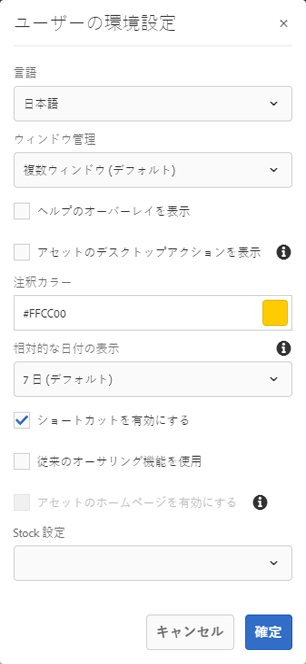

# Experience Managerで管理されるアセットの共有と配布 {#share-assets-from-aem}

Adobe Experience Manager (AEM)Assetsを使用すると、アセット、フォルダーおよびコレクションを組織のメンバーや外部エンティティ（パートナーやベンダーを含む）と共有できます。 次の方法を使用して、Experience Manager Assetsのアセットをクラウドサービスとして共有できます。

* リンクとして共有
* アセットのダウンロード
* AEMデスクトップアプリで共有
* Adobe Assetリンクを使用して共有
* （今後の機能）Brand Portalを使用した共有

## アセットをリンクとして共有 {#sharelink}

ユーザーと共有するアセットの URL を生成するには、リンク共有ダイアログを使用します。Users with administrator privileges or with read permissions at `/var/dam/share` location are able to view the links shared with them. リンクを通じてアセットを共有すると、最初にAEM Assetsにログインしなくても、外部のユーザーがリソースを利用できるようにする便利な方法です。

>[!NOTE]
>
>* リンクとして共有するフォルダまたはアセットに対するACLの編集権限が必要です。
>* リンクをユーザーと共有する前に、Day CQ Mail Service が設定されていることを確認してください。そうしないと、エラーが発生します。

1. Assets のユーザーインターフェイスで、リンクとして共有するアセットを選択します。
1. From the toolbar, click/tap the **[!UICONTROL Share Link]**. An asset link is auto-created in the **[!UICONTROL Share Link]** field. このリンクをコピーしてユーザーと共有します。リンクのデフォルトの有効期間は 1 日です。

   >[!NOTE]
   >
   >共有アセットが別の場所に移動されると、そのリンクは機能しなくなります。リンクを再作成し、ユーザーと再共有します。

<!--
## Share assets as a link {#sharelink}

To generate the URL for assets you want to share with users, use the Link Sharing dialog. Users with administrator privileges or with read permissions at `/var/dam/share` location are able to view the links shared with them. Sharing assets through a link is a convenient way of making resources available to external parties without them having to first log in to AEM Assets.

>[!NOTE]
>
>* You need Edit ACL permission on the folder or the asset that you want to share as a link.
>* Before you share a link with users, ensure that Day CQ Mail Service is configured. Otherwise, an error occurs.

1. In the Assets user interface, select the asset to share as a link.
1. From the toolbar, click/tap the **[!UICONTROL Share Link]**.

   An asset link is auto-created in the **[!UICONTROL Share Link]** field. Copy this link and share it with the users. The default expiration time for the link is one day.

   Alternatively, proceed to perform steps 3-7 of this procedure to add email recipients, configure the expiration time for the link, and send it from the dialog.

   >[!NOTE]
   >
   >If a shared asset is moved to a different location, its link stops working. Re-create the link and re-share with the users.

1. From the web console, open the **[!UICONTROL Day CQ Link Externalizer]** configuration and modify the following properties in the **[!UICONTROL Domains]** field with the values mentioned against each:

    * local
    * author
    * publish

   For the local and author properties, provide the URL for the local and author instance respectively. Both local and author properties have the same value if you run a single AEM author instance. For publish, provide the URL for the publish instance.

1. In the email address box of the **[!UICONTROL Link Sharing]** dialog, type the email ID of the user you want to share the link with. You can also share the link with multiple users.

   If the user is a member of your organization, select the user's email ID from the suggested email IDs that appear in the list below the typing area. For an external user, type the complete email ID and then select it from the list.

   To enable emails to be sent out to users, configure the SMTP server details in [Day CQ Mail Service](/help/assets/configure-asset-sharing.md#configmailservice).

   >[!NOTE]
   >
   >If you enter an email ID of a user that is not a member of your organization, the words "External User" are prefixed with the email ID of the user.

1. In the **[!UICONTROL Subject]** box, enter a subject for the asset you want to share.
1. In the **[!UICONTROL Message]** box, enter an optional message.
1. In the **[!UICONTROL Expiration]** field, specify an expiration date and time for the link using the date picker. By default, the expiration date is set for a week from the date you share the link.
1. To let users download the original image along with the renditions, select **[!UICONTROL Allow download of original file]**.

   >[!NOTE]
   >
   >By default, users can only download the renditions of the asset that you share as a link.

1. Click **[!UICONTROL Share]**. A message confirms that the link is shared with the users through an email.
1. To view the shared asset, click/tap the link in the email that is sent to the user. The shared asset is displayed in the **[!UICONTROL Adobe Marketing Cloud]** page.

   To toggle to the list view, click/tap the layout icon in the toolbar.

1. To generate a preview of the asset, click/tap the shared asset. To close the preview and return to the **[!UICONTROL Marketing Cloud]** page, click/tap **[!UICONTROL Back]** in the toolbar. If you have shared a folder, click/tap **[!UICONTROL Parent Folder]** to return to the parent folder.

   >[!NOTE]
   >
   >AEM supports generating the preview of assets of these MIME types: JPG, PNG, GIF, BMP, INDD, PDF, and PPT. You can only download the assets of the other MIME types.

1. To download the shared asset, click/tap **[!UICONTROL Select]** from the toolbar, click/tap the asset, and then click/tap **[!UICONTROL Download]** from the toolbar.
1. To view the assets you shared as links, go to the Assets user interface and click/tap the GlobalNav icon. Choose **[!UICONTROL Navigation]** from the list to display the Navigation pane.
1. From the Navigation pane, choose **[!UICONTROL Shared Links]** to display a list of shared assets.
1. To un-share an asset, select it and tap/click **[!UICONTROL Unshare]** from the toolbar.

A message confirms that you unshared the asset. In addition, the entry for the asset is removed from the list.
-->

## アセットのダウンロードと共有 {#download-and-share-assets}

ユーザーは、一部のアセットをダウンロードして、Experience Manager の外部で共有できます。詳しくは、アセットの検索方法、ア [セットのダウンロード方法](/help/assets/search-assets.md)、コ [レクションのダウンロード方法](/help/assets/download-assets-from-aem.md)[を参照してください。](manage-collections.md#download-a-collection)

## クリエイティブプロフェッショナルとのアセットの共有 {#share-with-creatives}

マーケターや基幹業務ユーザーは、承認されたアセットをクリエイティブプロフェッショナルと簡単に共有できます。

* **AEMデスクトップアプリ**:アプリケーションはWindowsとMacで機能します。 デスクトップア [プリの概要を参照してくださ](https://docs.adobe.com/content/help/en/experience-manager-desktop-app/using/introduction.html)い。 権限を持つデスクトップユーザーが共有アセットに簡単にアクセスできる方法については、アセットの参照、 [検索およびプレビューを参照してくださ](https://docs.adobe.com/content/help/en/experience-manager-desktop-app/using/using.html#browse-search-preview-assets)い。 デスクトップユーザーは、新しいアセットを作成し、例えば、新しい画像をアップロードすることで、AEMユーザーである対応するユーザーとアセットを共有できます。 詳しくは、デスク [トップアプリを使用したアセットのアップロードを参照してくださ](https://docs.adobe.com/content/help/en/experience-manager-desktop-app/using/using.html#upload-and-add-new-assets-to-aem)い。

* **Adobe Asset Link**:クリエイティブプロフェッショナルは、Adobe InDesign、Adobe IllustratorおよびAdobe Photoshop内から直接アセットを検索して使用できます。

## アセット共有の設定 {#configure-sharing}

### アセットリンクの共有の設定 {#asset-link-sharing}

<!-- TBD: Web Console is not there so how to configure Day CQ email service? Or is it not required now? -->

ユーザーと共有するアセットの URL を生成するには、リンク共有ダイアログを使用します。Users with administrator privileges or with read permissions at `/var/dam/share` location are able to view the links shared with them. リンクを通じてアセットを共有すると、最初にAEM Assetsにログインしなくても、外部のユーザーがリソースを利用できるようにする便利な方法です。

>[!NOTE]
>
>AEM作成者インスタンスから外部エンティティへのリンクを共有する場合は、リクエストに対して次のURLのみを公開するようにし `GET` ます。 他のURLをブロックして、AEM作成者インスタンスが安全であることを確認します。
>* `[aem_server]:[port]/linkshare.html`
>* `[aem_server]:[port]/linksharepreview.html`
>* `[aem_server]:[port]/linkexpired.html`

<!--
## Configure Day CQ mail service {#configmailservice}

Before you can share assets as links, configure the email service.

1. Click or tap the AEM logo, and then navigate to **[!UICONTROL Tools]** &gt; **[!UICONTROL Operations]** &gt; **[!UICONTROL Web Console]**.
1. From the list of services, locate **[!UICONTROL Day CQ Mail Service]**.
1. Click the **[!UICONTROL Edit]** icon beside the service, and configure the following parameters for **Day CQ Mail Service]** with the details mentioned against their names:

    * SMTP server host name: email server host name
    * SMTP server port: email server port
    * SMTP user: email server user name
    * SMTP password: email server password

1. Click/tap **[!UICONTROL Save]**.
-->

### 最大データサイズの設定 {#maxdatasize}

リンク共有機能を使用して共有されているリンクからアセットをダウンロードすると、AEM は、リポジトリのアセットの階層を圧縮して、ZIP ファイルにしてアセットを返します。ただし、ZIP ファイルとして圧縮できるデータ量に制限がないと、膨大なデータが圧縮の対象となり、JVM のメモリ不足エラーの原因となります。この状況によるサービス拒否攻撃からシステムを保護するには、ダウンロードするファイルの最大サイズを設定します。 アセットの未圧縮時のサイズが設定値を超えていると、アセットのダウンロード要求は拒否されます。デフォルト値は 100 MB です。

1. AEM のロゴをクリックまたはタップし、**[!UICONTROL ツール]**／**[!UICONTROL 操作]**／**[!UICONTROL Web コンソール]**&#x200B;に移動します。
1. From the web console, locate the **[!UICONTROL Day CQ DAM Adhoc Asset Share Proxy Servlet]** configuration.
1. Open the configuration in edit mode, and modify the value of the **[!UICONTROL Max Content Size (uncompressed)]** parameter.
1. 変更内容を保存します。

<!--
Add content or link about how to configure sharing via BP, DA, AAL, etc.
-->

### デスクトップアクションをデスクトップアプリで使用できるようにする {#desktop-actions}

ブラウザーの Assets ユーザーインターフェイスから、アセットの場所を参照したり、アセットをチェックアウトしてデスクトップアプリケーションで編集用に開くことができます。これらのオプションは「Desktop Actions」と呼ばれ、有効になっていない場合は、AEM Webインターフェイスでのデ [スクトップアクションの有効化を参照してくださ](https://docs.adobe.com/help/en/experience-manager-desktop-app/using/using.html#desktopactions-v2)い。

### Adobe Asset Linkを使用する設定 {#configure-asset-link}

Adobe Asset Linkを使用すると、コンテンツ作成プロセスでのクリエイティブとマーケティング担当者のコラボレーションが合理化されます。 Adobe Experience Manager(AEM)AssetsをCreative Cloudデスクトップアプリケーション、Adobe InDesign、Adobe PhotoshopおよびAdobe Illustratorに接続します。 Adobe Asset Linkパネルを使用すると、AEM Assetsに保存されたコンテンツに対して、クリエイティブが最もなじみのあるクリエイティブアプリケーションからアクセスし、変更を加えることができます。

Adobe Asset Link [で使用するAEMの設定方法を参照してください](https://helpx.adobe.com/enterprise/using/configure-aem-assets-for-asset-link.html)。

## ベストプラクティスとトラブルシューティング {#bestpractices}

* 名前に空白が含まれるアセットフォルダーまたはコレクションは共有されない場合があります。
* ユーザーが共有アセットをダウンロードできない場合は、AEM 管理者に[ダウンロード制限](#maxdatasize)を確認してください。

<!--
* If you cannot send email with links to shared assets or if the other users cannot receive your email, check with your AEM administrator if the [email service](/help/assets/configure-asset-sharing.md#configmailservice) is configured or not. 
* If you cannot share assets using link sharing functionality, ensure that you have the appropriate permissions. See [share assets](#sharelink).
-->

<!--
Add content or link about how to share using Brand Portal when it is available on Cloud Service.
-->
