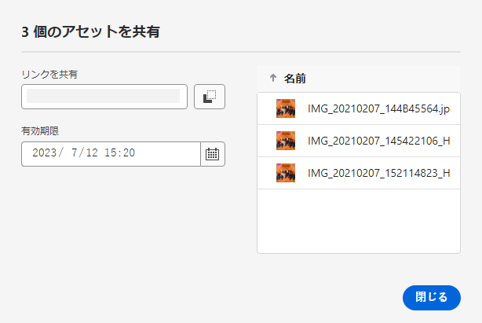
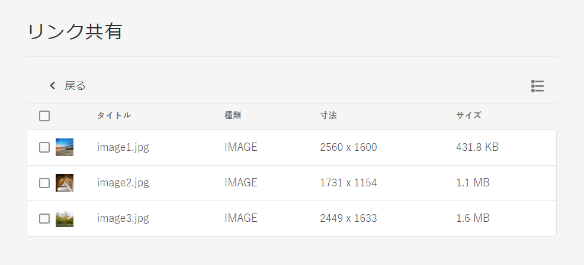

# アセットへのリンクの共有 {#share-links-assets}

[!DNL Assets view] を使用すると、[!DNL Assets view] アプリケーションに対するアクセス権を持たない外部の関係者と、リンクを生成してアセットを共有できます。リンクの有効期限を定義し、メールやメッセージングサービスなどの好みの通信方法を使用して、他のユーザーとリンクを共有できます。 リンクの受信者は、アセットをプレビューし、ダウンロードできます。

## アセットのリンクを生成 {#generate-link-for-assets}

アセットまたはアセットを含むフォルダーのリンクを生成するには：

1. アセットを含むアセット、フォルダーまたはその両方を選択し、「**[!UICONTROL リンクを共有]**」をクリックします。

1. 調整したい場合は、カレンダーアイコンをクリックし、「**[!UICONTROL 有効期限]**」フィールドを使用してリンクの有効期限を定義します。 また、`yyyy-mm-dd` 形式で日付を直接指定することもできます。デフォルトでは、リンクの有効期限は共有日から 2 週間に設定されています。

1. 「**[!UICONTROL リンクを共有]**」フィールドからリンクをコピーします。

   

1. 「**[!UICONTROL 閉じる]**」をクリックし、メールや他の共同作業ツールを使用してリンクを共有します。

## 共有アセットにアクセス {#access-shared-assets}

受信者は、アセットの公開リンクを共有した後、リンクをクリックし、[!DNL Assets view] にログインしなくても web ブラウザーで共有アセットをプレビューまたはダウンロードできます。

リンクをクリックし、フォルダーをクリックしてアセットに移動し、アセットをクリックしてプレビューします。リスト表示またはカード表示で共有アセットを表示するように選択できます。

共有アセットまたは共有アセットフォルダーにマウスポインターを置くと、アセットを選択するか、ダウンロードできます。

複数のアセットを選択して、「**[!UICONTROL ダウンロード]**」をクリックすることもできます。[!DNL Assets view] は、選択したアセットを zip ファイルとしてダウンロードします。[!DNL Assets view] は、ダウンロードするように選択した各アセットに対し、アセットと同じ名前のサブフォルダーを親 zip ファイルに作成します。

すべてのアセットを一度にダウンロードするには、「**[!UICONTROL リスト表示]**」に切り替え、「**[!UICONTROL すべてを選択]**」をクリックしてから「**[!UICONTROL ダウンロード]**」をクリックします。

## 次の手順 {#next-steps}

* [ビデオを視聴してアセットビュー内のアセットのリンクを共有する方法を学ぶ](https://experienceleague.adobe.com/docs/experience-manager-learn/assets-essentials/basics/link-sharing.html?lang=ja)

* アセットビューユーザーインターフェイスの「[!UICONTROL フィードバック]」オプションを使用して製品に関するフィードバックを提供する

* 右側のサイドバーにある「[!UICONTROL このページを編集]」（）または「[!UICONTROL 問題を記録] 」（）を使用してドキュメントに関するフィードバックを提供する

* [カスタマーケア](https://experienceleague.adobe.com/?support-solution=General&lang=ja#support)に問い合わせる
