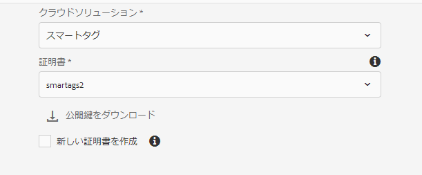
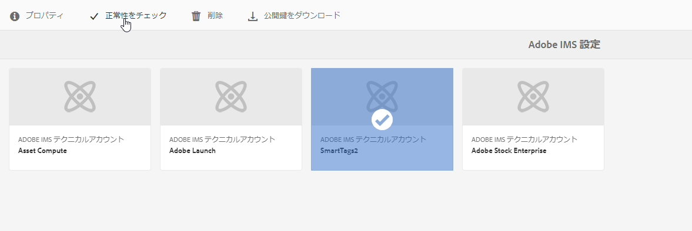
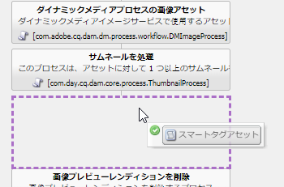
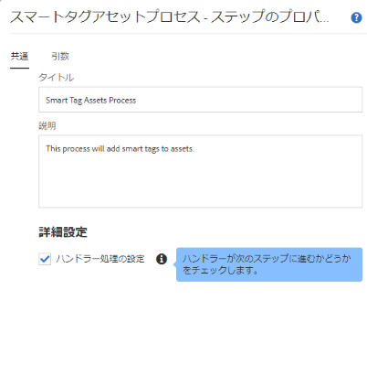

# アセットのスマートタグのための Experience Manager の設定 {#configure-aem-for-smart-tagging}

分類に基づく統制語彙を使用してアセットをタグ付けすると、タグベースの検索でアセットを特定し、取得することが容易になります。アドビでは、人工知能と機械学習アルゴリズムを使用して画像をトレーニングするスマートタグを提供しています。スマートタグは、[Adobe Sensei](https://www.adobe.com/jp/sensei/experience-cloud-artificial-intelligence.html) の人工知能フレームワークを使用して、タグ構造とビジネス上の分類に基づいて画像認識アルゴリズムのトレーニングをおこないます。

スマートタグ機能は、[!DNL Experience Manager] のアドオンとして購入できます。購入後、Adobe 開発者コンソールへのリンクを記載した電子メールが組織の管理者に送信されます。管理者はリンクにアクセスし、Adobe 開発者コンソールを使用してスマートタグと [!DNL Experience Manager] を統合します。

<!-- TBD: 
1. Can a similar flowchart be created about how training works in CS? 
2. Is there a link to buy SCS or initiate a sales call.
3. Keystroke all steps and check all screenshots.
-->

>[!IMPORTANT]
>
>新しい [!DNL Experience Manager Assets] 配置は、既定でと統合 [!DNL Adobe Developer Console] されます。 これにより、スマートタグ機能の設定を迅速に行うことができます。 既存の配置では、管理者は次の手順に従って環境を設定します。

## Adobe 開発者コンソールとの統合 {#aio-integration}

SCS を使用して画像にタグ付けする前に、Adobe 開発者コンソールを使用して [!DNL Adobe Experience Manager] とスマートタグサービスを統合します。バックエンドでは、サービスに要求を転送する前に、[!DNL Experience Manager] サーバーが Adobe 開発者コンソールのゲートウェイでサービスの資格情報を認証します。

* 公開鍵を生成する設定を [!DNL Experience Manager] に作成します。OAuth 統合用の[公開証明書を取得します](#obtain-public-certificate)。
* [Adobe 開発者コンソールで統合を作成](#create-aio-integration)し、生成した公開鍵をアップロードします。
* API キーやその他の Adobe 開発者コンソールの資格情報を使用して、[!DNL Experience Manager] インスタンスで[スマートタグを設定](#configure-smart-content-service)します。
* [設定をテストします](#validate-the-configuration)。
* [証明書の有効期限が切れた後に再設定します](#certrenew)。

### Adobe 開発者コンソール統合の前提条件 {#prerequisite-for-aio-integration}

Adobe 開発者コンソールで統合を作成してスマートタグを使用する前に、以下の事項を確認します。

* 組織の管理者権限を持つ Adobe ID アカウントがあること。
* お客様の組織でスマートタグが有効になっていること。

### 公開証明書の取得 {#obtain-public-certificate}

公開証明書により、Adobe 開発者コンソールでプロファイルを認証できます。証明書は、[!DNL Experience Manager] にて作成します。

1. [!DNL Experience Manager] ユーザーインターフェイスで、**[!UICONTROL ツール]**／**[!UICONTROL セキュリティ]**／**[!UICONTROL Adobe IMS 設定]**&#x200B;にアクセスします。

1. [!UICONTROL Adobe IMS 設定]ページで、「**[!UICONTROL 作成]**」をクリックします。**[!UICONTROL クラウドソリューション]**&#x200B;メニューから、「**[!UICONTROL スマートタグ]**」を選択します。

1. 「**[!UICONTROL 新しい証明書を作成]**」を選択します。名前を入力し、「**[!UICONTROL 証明書を作成]**」をクリックします。「**[!UICONTROL OK]**」をクリックします。

1. 「**[!UICONTROL 公開鍵をダウンロードする]**」をクリックします。

   

### 統合の作成 {#create-aio-integration}

スマートタグを使用するには、Adobe 開発者コンソールで統合を作成して、API キー、テクニカルアカウント ID、組織 ID およびクライアントの秘密鍵を生成します。

1. ブラウザーで [https://console.adobe.io](https://console.adobe.io／) にアクセスします。適切なアカウントを選択し、関連付けられた組織の役割がシステム管理者であることを確認します。
1. 任意の名前でプロジェクトを作成します。「**[!UICONTROL API を追加]**」をクリックします。
1. **[!UICONTROL API を追加]**&#x200B;ページで、「**[!UICONTROL Experience Cloud]**」を選択し、「**[!UICONTROL スマートコンテンツ]**」を選択します。「**[!UICONTROL 次へ]**」をクリックします。
1. 「**[!UICONTROL 公開鍵をアップロード]**」を選択します。[!DNL Experience Manager]からダウンロードした証明書ファイルを指定します。[!UICONTROL 公開鍵が正常にアップロード]されたというメッセージが表示されます。「**[!UICONTROL 次へ]**」をクリックします。
1. [!UICONTROL 新しいサービスアカウント（JWT）秘密鍵証明書を作成]ページには、設定したサービスアカウントの公開鍵が表示されます。「**[!UICONTROL 次へ]**」をクリックします。
1. **[!UICONTROL 製品プロファイルを選択]**&#x200B;ページで、「**[!UICONTROL スマートコンテンツサービス]**」を選択します。「**[!UICONTROL 設定済み API を保存]**」をクリックします。設定に関する詳細情報がページに表示されます。[!DNL Experience Manager] でスマートタグをさらに設定する場合は、このページを開いたままにして、これらの値をコピーし、Experience Manager に追加します。

   

### スマートタグの設定 {#configure-smart-content-service}

統合を設定するには、Adobe 開発者コンソール統合のペイロード、クライアントの秘密鍵、認証サーバーおよび API キーフィールドの値を使用します。

1. [!DNL Experience Manager] ユーザーインターフェイスで、**[!UICONTROL ツール]**／**[!UICONTROL セキュリティ]**／**[!UICONTROL Adobe IMS 設定]**&#x200B;にアクセスします。
1. **[!UICONTROL Adobe IMS テクニカルアカウント設定]**&#x200B;ページにアクセスし、必要な&#x200B;**[!UICONTROL タイトル]**&#x200B;を入力します。
1. 「**[!UICONTROL 認証サーバー]**」フィールドに `https://ims-na1.adobelogin.com` URL を入力します。
1. 「**[!UICONTROL API キー]**」フィールドに、[!DNL Adobe Developer Console] から&#x200B;**[!UICONTROL クライアント ID]** を入力します。
1. 「**[!UICONTROL クライアントの秘密鍵]**」フィールドに、[!DNL Adobe Developer Console] から&#x200B;**[!UICONTROL クライアントの秘密鍵]**&#x200B;を入力します。「**[!UICONTROL クライアントの秘密鍵を取得]**」オプションをクリックして表示します。
1. [!DNL Adobe Developer Console]のご自身のプロジェクトで、左側の余白から「**[!UICONTROL サービスアカウント（JWT）]**」をクリックします。「**[!UICONTROL JWT を生成]**」タブをクリックします。「**[!UICONTROL コピー]**」をクリックして、表示された **[!UICONTROL JWT ペイロード]**&#x200B;をコピーします。この値を、[!DNL Experience Manager] の「**[!UICONTROL ペイロード]**」フィールドに指定します。「**[!UICONTROL 作成]**」をクリックします。

### 設定の検証 {#validate-the-configuration}

設定が完了したら、次の手順に従って設定を検証します。

1. [!DNL Experience Manager] ユーザーインターフェイスで、**[!UICONTROL ツール]**／**[!UICONTROL セキュリティ]**／**[!UICONTROL Adobe IMS 設定]**&#x200B;にアクセスします。

1. 「スマートタグ設定」を選択します。ツールバーの「**[!UICONTROL ヘルスチェック]**」をクリックします。「**[!UICONTROL チェック]**」をクリックします。[!UICONTROL Healthy configuration] というメッセージを含むダイアログが表示されることで、設定が機能していることが確認できます。

### 証明書の有効期限が切れた場合の再設定 {#certrenew}

証明書の有効期限が切れると、証明書は信頼されなくなります。新しい証明書を追加するには、以下の手順に従います。期限切れの証明書は更新できません。

1. [!DNL Experience Manager] デプロイメントに管理者としてログインします。**[!UICONTROL ツール]**／**[!UICONTROL セキュリティ]**／**[!UICONTROL ユーザー]**&#x200B;をクリックします。

1. **[!UICONTROL dam-update-service]** ユーザーを見つけてクリックします。「**[!UICONTROL キーストア]**」タブをクリックします。
1. 証明書の有効期限が切れた既存の **[!UICONTROL similaritysearch]** キーストアを削除します。「**[!UICONTROL 保存して閉じる]**」をクリックします。

   

   *図：キーストアの既存の`similaritysearch`エントリを削除して新しいセキュリティ証明書を追加.*

1. [!DNL Experience Manager] ユーザーインターフェイスで、**[!UICONTROL ツール]**／**[!UICONTROL セキュリティ]**／**[!UICONTROL Adobe IMS 設定]**&#x200B;にアクセスします。使用可能なスマートタグ設定を開きます。公開証明書をダウンロードするには、「**[!UICONTROL 公開証明書をダウンロード]**」をクリックします。

1. [https://console.adobe.io](https://console.adobe.io) にアクセスし、プロジェクト内の既存のサービスに移動します。新しい証明書をアップロードし、設定します。設定について詳しくは、[Adobe 開発者コンソール統合の作成](#create-aio-integration)の手順を参照してください。

## 新しくアップロードされたアセットに対するスマートタグの有効化（オプション） {#enable-smart-tagging-for-uploaded-assets}

1. [!DNL Experience Manager] で、**[!UICONTROL ツール／ワークフロー／モデル]**&#x200B;に移動します。
1. **[!UICONTROL ワークフローモデル]**&#x200B;ページで、「**[!UICONTROL DAM アセットの更新]**」ワークフローモデルを選択します。
1. ツールバーの「**[!UICONTROL 編集]**」をクリックします。
1. サイドパネルを展開して、ステップを表示します。「DAM ワークフロー」セクションの「**[!UICONTROL スマートタグアセット]**」ステップをドラッグして、「**[!UICONTROL サムネールを処理]**」ステップの後に配置します。

   

   *図：「DAM アセットの更新」ワークフローで「サムネールを処理」ステップの後に「スマートタグアセット」ステップを追加。*

1. 設定する手順を開きます。「**[!UICONTROL 詳細設定]**」で、「**[!UICONTROL ハンドラー処理の設定]**」オプションが選択されていることを確認します。

   

1. タグの予測時にエラーを無視する場合は、「**[!UICONTROL 引数]**」タブで「**[!UICONTROL エラーを無視]**」を選択します。フォルダーでスマートタグが有効になっているかに関わらずアップロード時にアセットをタグ付けするには、「**[!UICONTROL スマートタグフラグを無視]**」を選択します。

1. 「**[!UICONTROL OK]**」をクリックして、プロセスステップを閉じ、ワークフローを保存します。「**[!UICONTROL 同期]**」をクリックします。

>[!MORELIKETHIS]
>
>* [スマートサービスを使用したアセットのタグ付け](smart-tags.md)

