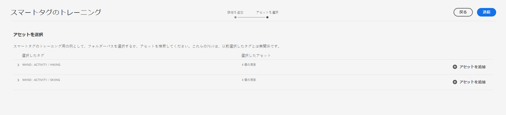

# スマートタグのトレーニング

スマートタグトレーニングを使用すると、関連するタグがない場合に詳細を指定できるようにタグをトレーニングできます。 [Adobe Sensei](https://business.adobe.com/jp/why-adobe/experience-cloud-artificial-intelligence.html) の人工知能フレームワークを使用して、タグ構造とビジネス上の分類に基づいて画像認識アルゴリズムのトレーニングを行います。 その後、このコンテンツインテリジェンスを使用して、アセットの個々のセットに関連性の高いタグが適用されます。デフォルトでは、[!DNL Experience Manager Assets] は、アップロードされたアセットにスマートタグを自動的に適用します。

## スマートタグトレーニングの要件の決定 {#smart-tag-training-requirement}

スマートタグのトレーニングは、次のシナリオで必要です。

* 自動ラベラーを追加して、同じアセットをアップロードするたびにラベルの追加を繰り返す手間を省きます。
* アセットによる関連タグの適用機能を向上させる。
* アセットに対して出現するタグの精度を高める。
* 使用できないラベルや不足しているラベルを追加します。

>[!NOTE]
>
>トレーニングのスマートタグは、アセットの ***画像タイプ*** でのみ使用できます。

## スマートタグのトレーニングに関する手順

[!DNL Experience Manager] as a [!DNL Cloud Service] は、デフォルトでテキストベースのアセットとビデオへのスマートタグを自動生成します。 画像へのスマートタグのトレーニングを実行するには、次のタスクを実行します。

* [タグモデルとガイドラインの理解](#understand-tag-models-guidelines)
* [モデルのトレーニング](#train-model)
* [デジタルアセットのタグ付け](#tag-assets)
* [タグと検索の管理](#manage-smart-tags-and-searches)

## タグモデルとガイドラインの理解 {#understand-tag-models-guidelines}

タグモデルは、タグ付けされる画像の様々な視覚要素に関連付けられた、関連タグのグループです。タグは、画像の明確に異なる視覚的要素と関連付けられるので、タグを適用すると、特定のタイプの画像を検索するのに役立ちます。例えば、靴のコレクションは異なるタグを持つことができますが、すべてのタグは靴に関連し、同じタグモデルに属します。タグを適用すると、デザイン別や使用方法別など、様々なタイプの靴を見つけるのに役立ちます。

タグモデルを作成してサービスをトレーニングする前に、自社ビジネスのコンテキストでイメージ内のオブジェクトを最もよく説明する一意のタグのセットを特定します。キュレーション後のセット内のアセットが [ トレーニングガイドライン ](#training-guidelines) に一致していることを確認してください。

### トレーニングガイドライン {#training-guidelines}

トレーニングセット内の画像が次のガイドラインに従っていることを確認します。

<table>
   <tr>
      <th> 指標 </th>
      <th> 説明 </th>
   </tr>
   <tr>
      <td> <b> 数量及び大きさ </b></td>
      <td> タグ 1 つにつき画像は最小 10 個、最大 50 個。 </td>
   </tr>
   <tr>
      <td> <b> 一貫性 </b> </td>
      <td> タグの画像の見た目が似ていることを確認します。 同じ視覚的要素（画像内の同じタイプのオブジェクトなど）に関するタグを 1 つのタグモデルにまとめるのが最適です。例えば、これらの画像は視覚的に似ていないので、すべてに <i> マイパーティ </i> （トレーニング用）というタグを付けることはお勧めしません。 </td>
   </tr>
   <tr>
      <td colspan="2">  <i> 図：トレーニングガイドラインの例を示すコヒーレンスのイラスト </i>
      </td>
   </tr>
   <tr>
      <td> <b> 対象範囲 </b></td>
      <td> トレーニングの画像には十分な多様性が必要です。 が適切に焦点を当てることを学習できるよう、数は少なくても多様性の高い例を提供します。 見た目が大きく異なる画像に同じタグを適用する場合は、それぞれの種類に 5 つ以上の例を含めてください。例えば、<i>model-down-pose</i> というタグの場合、タグ付け時、類似する画像をより正確に識別できるよう、以下のハイライト表示された画像に似たトレーニング画像を増やします。</td>
   </tr>
   <tr>
   <td colspan="2">  <i> 図：トレーニングガイドラインの例を示すカバレッジのイラスト </i>
   </td>
   </tr>
   <tr>
      <td><b> 気をそらす/閉塞 </b> </td>
      <td> サービスのトレーニングには、障害物（目立つ背景、メインとなる対象と一緒に含まれる物や人物などの関連性のない付随物）が少ない画像のほうが効果的です。 例えば、<i>casual-shoe</i> というタグの場合、2 つ目の画像はトレーニングの候補として適切ではありません。 </td>
   </tr>
   <tr>
      <td colspan="2">  <i> 図：トレーニングガイドラインの例となる障害物のイラスト </i>
      </td>
   </tr>
   <tr>
      <td> <b> 完全性 </b> </td>
      <td> 画像が複数のタグの対象となる場合は、適用可能なすべてのタグを追加してから、画像をトレーニングに含めます。 例えば、<i>raincoat</i> と <i>model-side-view</i> などのタグの場合、対象となるアセットに両方のタグを追加してから、そのアセットをトレーニングに含めます。 </td>
   </tr>
   <tr>
      <td colspan="2">  <i> 図：トレーニングガイドラインの例を示す「完全性」のイラスト </i>
      </td>
   </tr>
   <tr>
      <td> <b> タグ数 </b> </td>
      <td> Adobeでは、各タグに少なくとも 2 つの個別タグと、少なくとも 10 の異なる画像を使用して、モデルのトレーニングをおこなうことをお勧めします。 単一のタグモデルでは、50 個を超えるタグを追加しないでください。 </td>
   </tr>
   <tr>
      <td> <b> 例の数 </b> </td>
      <td> 各タグに対して、少なくとも 10 個の例を追加します。 ただし、アドビでは約 30 個の例を使用することをお勧めしています。1 つのタグにつき最大 50 個の例がサポートされます。 </td>
   </tr>
   <tr>
      <td> <b> 誤検出と競合の防止 </b> </td>
      <td> Adobeでは、単一の視覚的側面に対して単一のタグモデルを作成することをお勧めします。 モデル間でタグが重なり合うのを避けるように、タグモデルを構築します。例えば、2 つの異なるタグモデルの名前 <i>shoes</i> と <i>footwear</i> で、<i> スニーカー </i> などの一般的なタグを使用しないでください。 トレーニングプロセスは、共通のキーワードに関して、トレーニングを受けた 1 つのタグモデルをもう 1 つで上書きします。 </td>
   </tr>
</table>

**例**：ガイダンスのさらなる例を以下に示します。

* 以下のみを含むタグモデルを作成します。

   * 車種に関するタグ
   * 大人と子供のジャケットに関するタグ

* 次のようなタグモデルは作成しません。

   * 2019 年と 2020 年にリリースされた車種を含むタグモデル
   * 同じ車種をいくつか含む複数のタグモデル

>[!NOTE]
>
>同じ画像を使用して、異なるタグモデルをトレーニングできます。 ただし、画像をタグモデル内の複数のタグに関連付けることはできません。異なるタグモデルに属する異なるタグを、同じ画像にタグ付けすることができます。
>&#x200B;>トレーニングを取り消すことはできません。上記のガイドラインは、トレーニングに適した画像を選択する際に役立ちます。

## カスタムタグに合わせたモデルのトレーニング {#train-model}

ビジネス固有のタグに合わせてモデルを作成してトレーニングするには、次の手順に従います。

1. 必要なタグと適切なタグ構造を作成します。DAM リポジトリーに関連する画像をアップロードします。
1. [!DNL Experience Manager Cloud Service] ユーザーインターフェイスで、**[!UICONTROL Assets]**／**[!UICONTROL スマートタグトレーニング]**&#x200B;にアクセスします。
1. 「**[!UICONTROL 作成]**」をクリックします。「**[!UICONTROL タイトル]**」、「**[!UICONTROL 説明]**」を入力します。
1. 「**[!UICONTROL タグ]**」フィールドのフォルダーアイコンをクリックします。ポップアップウィンドウが開きます。
1. モデルに追加する適切なタグを検索するか、`cq-tags` 内の既存のタグから選択します。「**[!UICONTROL 次へ]**」をクリックします。

   >[!NOTE]
   >
   >タグの構造は、**[!UICONTROL 名前]**（アルファベット順）、**[!UICONTROL 作成]**&#x200B;日、**[!UICONTROL 変更]**&#x200B;日を基準に、昇順または降順に並べ替えることができます。

1. **[!UICONTROL アセットを選択]**&#x200B;ダイアログで、各タグに対して「**[!UICONTROL アセットを追加]**」をクリックします。DAM リポジトリー内を検索するか、リポジトリーを参照して、画像を 10 個以上、最大で 50 個選択します。フォルダーではなくアセットを選択します。画像を選択したら、「**[!UICONTROL 選択]**」をクリックします。

   

1. 選択した画像のサムネールをプレビューするには、タグの前にあるアコーディオンをクリックします。「**[!UICONTROL アセットを追加]**」をクリックして、選択内容を変更できます。選択が完了したら、「**[!UICONTROL 送信]**」をクリックします。ユーザーインターフェイスに、トレーニングが開始されたことを示す通知がページの下部に表示されます。
1. 各タグモデルの「**[!UICONTROL ステータス]**」列で、トレーニングのステータスを確認します。可能なステータスは、「[!UICONTROL 保留]」、「[!UICONTROL トレーニング済み]」、「[!UICONTROL 失敗]」です。

*図：タグ付けモデルをトレーニングするトレーニングワークフロー手順。*

### トレーニングのステータスとレポートの表示 {#training-status}

アセットのトレーニングセット内のタグに関するスマートタグサービスのトレーニングが実施されたかどうかを確認するには、レポートコンソールでトレーニングワークフローレポートを調べます。

1. [!DNL Experience Manager Cloud Service] インターフェイスで、**[!UICONTROL ツール]**／**[!UICONTROL アセット]**／**[!UICONTROL レポート]**&#x200B;に移動します。
1. **[!UICONTROL アセットレポート]**&#x200B;ページで、「**[!UICONTROL 作成]**」をクリックします。
1. 「**[!UICONTROL スマートタグトレーニング]**」レポートを選択し、ツールバーで「**[!UICONTROL 次へ]**」をクリックします。
1. レポートのタイトルと説明を指定します。「**[!UICONTROL レポートをスケジュール]**」で、「**[!UICONTROL 今すぐ]**」オプションを選択したままにします。レポートを後で生成するようにスケジュールするには、「**[!UICONTROL 後で]**」を選択し、日時を指定します。次に、ツールバーの「**[!UICONTROL 作成]**」をクリックします。
1. **[!UICONTROL アセットレポート]**&#x200B;ページで、生成したレポートを選択します。レポートを表示するには、ツールバーの「**[!UICONTROL 表示]**」アイコンをクリックします。
1. レポートの詳細をレビューします。レポートには、トレーニングしたタグのトレーニングステータスが表示されます。「**[!UICONTROL トレーニングステータス]**」列の緑色は、そのタグについてスマートタグサービスのトレーニングが実施されたことを示します。黄色は、特定のタグに関するサービスのトレーニングが部分的に実施されていることを示します。タグに関するサービスのトレーニングを完全に実施するには、特定のタグを含む画像をさらに追加し、トレーニングワークフローを実行します。このレポートにタグが表示されない場合は、それらのタグに関するトレーニングワークフローを再度実行してください。
1. レポートをダウンロードするには、リストから対象のレポートを選択し、ツールバーの「**[!UICONTROL ダウンロード]**」をクリックします。レポートはスプレッドシートとしてダウンロードされます。

>[!NOTE]
>
>スマートタグのトラッキングを、書き出しを使用してあるインスタンスから別のインスタンスに転送する場合はどうすればよいですか？
>&#x200B;>環境が同じ IMS 組織に属している場合は、スマートタグトレーニングを書き出す必要はありません。 自動的に共有されます。 環境が IMS 組織をまたぐ場合、スマートタグトレーニングを共有または書き出す方法はありません。

## スマートタグに関する制限事項とベストプラクティス {#limitations-smart-tags-training}

* モデルをトレーニングするには、最も適切な画像を使用します。トレーニング状態を元に戻すことも、トレーニングモデルを削除することもできません。タグ付けの精度は現在のトレーニングによって決まるので、慎重に行います。
* 特定のビデオを使用して、ビデオにスマートタグを適用するサービスをトレーニングすることはできません。デフォルトの [!DNL Adobe Sensei] 設定で機能します。

>[!NOTE]
>
>スマートタグでタグのトレーニングを実施し、それらのタグを他の画像に適用できるかどうかは、トレーニングで使用する画像の質によって決まります。
>&#x200B;>最適な結果を得るには、視覚的に似ている画像を使用し、それぞれのタグについてサービスのトレーニングを実施することをお勧めします。
