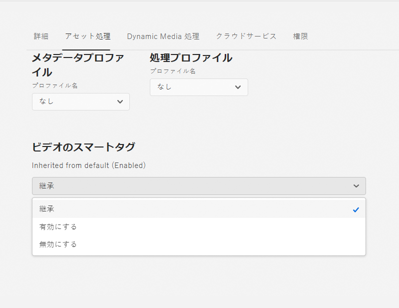

# Smart tag your video assets {#video-smart-tags}

新しいコンテンツに対するニーズが高まる中で、人手による作業を減らし、人を惹きつけるデジタルエクスペリエンスをすぐに届ける必要があります。 [!DNL Adobe Experience Manager] のCloud Serviceは、人工知能によって支援されたビデオアセットの自動タグ付けをサポートしています。 ビデオの手動タグ付けには時間がかかる場合があります。 ただし、Adobe Senseiのビデオスマートタグ機能では、人工知能モデルを使用してビデオコンテンツを分析し、ビデオアセットにタグを追加します。 これにより、DAMユーザーが顧客に豊富なエクスペリエンスを提供する時間を短縮できます。 Adobeの機械学習サービスは、ビデオに対して2組のタグを生成します。 一方、1つのセットは、そのビデオ内のオブジェクト、シーンおよび属性に対応します。もう1つのセットは、飲用、走行、ジョギングなどのアクションに関する。

スマートタグ付けでサポートされるビデオファイル形式（およびそのコーデック）は、MP4(H264/AVC)、MKV(H264/AVC)、MOV(H264/AVC、Motion JPEG)、AVI(indeo4)、FLV（H2です。64/AVC、vp6f）、およびWMV(WMV2)。 また、この機能により、300 MBまでのビデオのタグ付けも可能です。 ビデオアセットの自動タグ付けは、ビデオがアップロードされた後、または再処理がトリガーされた後、標準のアセット処理(サムネールの作成とメタデータ抽出と共に)として行われます。 スマートタグは、アセットの [プロパティで、](#confidence-score-video-tag) 信頼性スコアの降順で表示され [!UICONTROL ます]。 ビデオタグ付けは、Cloud Serviceとして初期設定で有効 [!DNL Adobe Experience Manager] になっています。 ただし、フォルダー上のビデオスマートタグを [オプトアウトできます](#opt-out-video-smart-tagging) 。

## アップロード時のビデオのスマートタグ付け {#smart-tag-assets-on-ingestion}

ビデオアセットを [Cloud Serviceとしてに](add-assets.md#upload-assets) アップロードする場合 [!DNL Adobe Experience Manager] 、ビデオは 。 処理が完了したら、アセットの [!UICONTROL プロパティ] ページの「基本  」タブを参照します。 スマートタグは、「 [!UICONTROL スマートタグ]」の下のビデオに自動的に追加されます。 Asset Compute Serviceは、Adobe Senseiを利用してこれらのスマートタグを作成します。


適用されたスマートタグは、 [信頼性スコアの降順で並べ替えられます](#confidence-score-video-tag)。スマートタグ内では、オブジェクトタグとアクションタグが組み合わされて [!UICONTROL 、]信頼性スコアの降順で並べ替えられます。

>[!IMPORTANT]
>
>これらの自動生成タグを確認して、ブランドとその値に適合するようにしてください。

## DAM内の既存のビデオのスマートタグ付け {#smart-tag-existing-videos}

DAM内の既存のビデオアセットに対して、スマートタグが自動的に付けられません。 アセットのスマートタグを生成するには  、手動でアセットを再処理する必要があります。

アセットリポジトリに既に存在するビデオアセット、またはアセットのフォルダ（サブフォルダも含む）にスマートタグを付けるには、次の手順に従います。

1. ロゴを選択し、 [!DNL Adobe Experience Manager] ナビゲーション [!UICONTROL ページからアセットを選択します] 。

1. Select [!UICONTROL Files] to display the Assets interface.

1. スマートタグを適用するフォルダーに移動します。

1. フォルダー全体または特定のビデオアセットを選択します。

1. 「  「 [!UICONTROL Reprocess Assets] 」アイコンを選択し、「 [!UICONTROL Full Process] 」オプションを選択します。


処理が完了したら、フォルダー内の任意のビデオアセットの [!UICONTROL プロパティ] ページに移動します。 自動的に追加されたタグは、「 [!UICONTROL 基本] 」タブの「スマートタグ  」セクションに表示されます。 適用されたこれらのスマートタグは、 [信頼性スコアの降順で並べ替えられます](#confidence-score-video-tag)。

## タグ付きビデオの検索 {#search-smart-tagged-videos}

自動生成されたスマートタグに基づいてビデオアセットを検索するには、 [Omnisearch](search-assets.md#search-assets-in-aem):

1. 検索アイコン  、Omnisearchフィールドを表示します。

1. ビデオに明示的に追加していないタグをOmnisearchフィールドに指定します。

1. タグに基づいて検索します。

検索結果には、指定したタグに基づいてビデオアセットが表示されます。

検索結果は、メタデータ内の検索されたキーワードを含むビデオアセットと、検索されたキーワードでスマートタグ付けされたビデオアセットを組み合わせたものです。 ただし、メタデータフィールド内のすべての検索用語に一致する検索結果が最初に表示され、その後スマートタグ内の任意の検索用語に一致する検索結果が続けて表示されます。 詳しくは、「スマートタグを使用した検索 [ [!DNL Experience Manager] 結果について](smart-tags.md#understandsearch)」を参照してください。

## ビデオスマートタグのモデレート {#moderate-video-smart-tags}

[!DNL Adobe Experience Manager] スマートタグをキュレーションして次の操作を行うことができます。

* ブランドビデオに割り当てられている不正確なタグを削除します。

* タグベースでビデオを検索する場合は、最も関連性の高いタグの検索結果にビデオが表示されるように調整します。 したがって、関連のないビデオが検索結果に表示される可能性を排除します。

* タグに高いランクを割り当てて、ビデオに対する関連性を高めます。 ビデオのタグを昇格させると、そのタグに基づいて検索を行った場合に、ビデオが検索結果に表示される確率が高くなります。

アセットのスマートタグをモデレートする方法について詳しくは、スマートタグの [管理を参照してください](smart-tags.md#manage-smart-tags-and-searches)。


>[!NOTE]
>
>スマートタグの [管理の手順でモデレートされたタグは、アセットの再処理時に記憶されません](smart-tags.md#manage-smart-tags-and-searches) 。 元のタグセットが再び表示されます。

## ビデオプトアウトオのスマートタグ付け {#opt-out-video-smart-tagging}

ビデオの自動タグ付けは、サムネールの作成やメタデータの抽出など、他のアセット処理タスクと並行して実行されるので、時間がかかる場合があります。 アセットの処理を迅速に行うために、フォルダーレベルでのアップロード時にビデオのスマートタグ付けオプトアウトを行うことができます。

特定のフォルダーにアップロードされたアセットに対して自動化されたビデオスマートタグオプトアウトを生成するには、次の手順に従います。

1. フォルダーの [!UICONTROL プロパティの「] アセット処理 [!UICONTROL 」タブを開き]ます。

1. 「ビデオの [!UICONTROL スマートタグ] 」メニューの「 [!UICONTROL 継承] 」オプションはデフォルトで選択され、ビデオスマートタグは有効です。

   「 [!UICONTROL 継承] 」オプションを選択すると、継承されたフォルダーのパスが、「 [!UICONTROL 有効] 」または「無効 」のどちらに設定されているかに関する情報と共に表示されます。

   

1. フォルダーにアップロードされたビデオのスマートタグ付けを無効に  すオプトアウトるを選択します。

>[!IMPORTANT]
>
>アップロード時にビデオのタグ付けをオプトアウトし、アップロード後にビデオにスマートタグを付ける場合は、スマートタグを追加するために、フォルダPropertiesのAsset Processing **** タブで、スマートタグ [!UICONTROL を][](#smart-tag-existing-videos) 追加します。

## 信頼性スコア {#confidence-score-video-tag}

[!DNL Adobe Experience Manager] オブジェクトとアクションのスマートタグに対して最小信頼性しきい値を適用し、各ビデオアセットに対してタグが多すぎるのを回避します。これにより、インデックス作成が遅くなります。 アセット検索結果は、信頼性スコアに基づいてランク付けされるので、一般に、ビデオアセットの割り当てられたタグが示唆する範囲を超えて検索結果が向上します。 不正確なタグは信頼性スコアが低いので、アセットのスマートタグリストの上部にほとんど表示されません。

のアクションタグとオブジェクトタグのデフォルトのしきい値 [!DNL Adobe Experience Manager] は0.7です（0 ～ 1の値を指定する必要があります）。 一部のビデオアセットが特定のタグでタグ付けされない場合、これは、アルゴリズムが予測されるタグに対する信頼性が70%未満であることを示します。 デフォルトのしきい値は、すべてのユーザーに最適な値ではない場合があります。 したがって、OSGI設定で信頼性スコアの値を変更できます。

Cloud Managerを使用して、Cloud Serviceとしてデプロイされるプロジェクトに信頼性スコアOSGI設定 [!DNL Adobe Experience Manager] を追加するには：

* プ [!DNL Adobe Experience Manager] ロジェクト(Archetype 24以`ui.config` 前 `ui.apps`以降)で `config.author` は、 `com.adobe.cq.assetcompute.impl.senseisdk.SenseiSdkImpl.cfg.json` OSGi設定を含め、次の内容を含む名前の設定ファイルを含めます。

```json
{
  "minVideoActionConfidenceScore":0.5,
  "minVideoObjectConfidenceScore":0.5,
}
```

>[!NOTE]
>
>手動のタグには、100%の信頼性（最大信頼性）が割り当てられます。 したがって、検索クエリに一致する手動タグを持つビデオアセットがある場合は、検索クエリに一致するスマートタグの前に表示されます。

## 制限事項 {#video-smart-tagging-limitations}

* ビデオアセットのタグ付けに関するスマートタグサービス（拡張スマートタグ）のトレーニングは、まだサポートされていません。

* タグ付けの進行状況は表示されません。

* タグ付けに適したビデオのサイズは、300 MB以下です。 Adobe Senseiサービスは、この条件を満たすビデオにスマートタグを付け、フォルダー内の他のビデオのタグ付けをスキップします。

* MP4(H264/AVC)、MKV(H264/AVC)、MOV(H264/AVC、Motion JPEG)、AVI(Indeo4)、FLV(H22)のファイル形式のビデオのみ64/AVC、vp6f)、WMV(WMV2)はタグ付けが可能です。

>[!MORELIKETHIS]
>
>* [スマートタグとアセット検索の管理](smart-tags.md#manage-smart-tags-and-searches)
>* [スマートタグサービスのトレーニングと画像のタグ付け](smart-tags.md)

