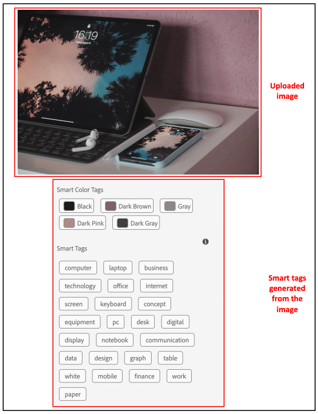
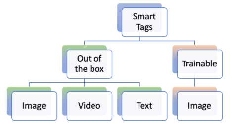
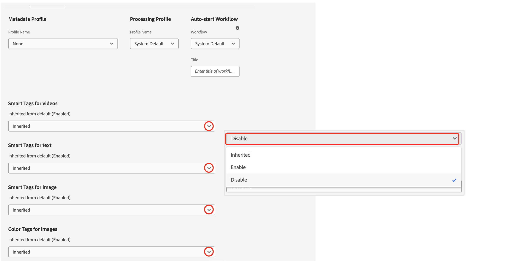

# AEM Assets のスマートタグ {#using-smart-tags}

組織は数多くのデジタルアセットを保有しており、その数は急速に増加し続けています。 これほど膨大なデータの中から特定のアセットを検索するのは、大きな課題となります。この問題に対処するために、`metadata` と `tags` を使用して、デジタルアセットの検索性を向上させます。組織は、アセットのメタデータに分類に基づく統制語彙を使用します。これらは通常、従業員、パートナー、顧客がデジタルアセットを参照し見つける際によく使うキーワードリストで構成されています。

スマートタグは、テキスト内に表示されるだけでなく、アセットを最も的確に表現するキーワードです。分類に基づく統制語彙を使用してアセットをタグ付けすると、検索でアセットを特定し、取得することが容易になります。

たとえば、辞書のように単語がアルファベット順に並んでいれば、無作為に散らばっている場合よりも見つけやすくなります。タグ付けは同様の目的で使用されます。ビジネス上の分類に従ってアセットが整理され、最も関連性の高いアセットが検索結果に表示されます。たとえば、自動車メーカーは車の画像にモデル名のタグを付けることで、プロモーションキャンペーンを企画する際に関連する画像だけを表示できます。たとえ「ランナー」や「ランニングシューズ」といったタグ付けであっても、ユーザーは入力ミスやスペルの違い、別の検索語を使うことについて心配する必要はありません。スマートタグがそれらすべてを認識してくれます。

そのバックグラウンドで、[Adobe AI の人工知能フレームワークが使用され ](https://business.adobe.com/ai/adobe-genai.html) デフォルトで、ビジネス上の分類に沿ったテキストと共に、アップロードされたアセットにスマートタグが自動的に適用されます。

## 前提条件と設定 {#smart-tags-prereqs-config}

スマートタグ は [!DNL Adobe Experience Manager] に対して [!DNL Cloud Service] として自動的にプロビジョニングされるため、設定は不要です。

## スマートタグワークフロー {#smart-tags-workflow}

[!DNL Adobe AI] を活用したスマートタグ付けでは、人工知能モデルを使用してコンテンツを分析し、アセットにタグを追加します。その結果、DAM ユーザーが顧客に豊富なエクスペリエンスを提供するまでの時間を短縮できます。スマートタグは、アセットプロパティ内で[信頼性スコア](#confidence-score)の降順で表示されます。

* **画像ベースアセット**
画像の場合、スマートタグは視覚的な観点に基づいて生成されます。多くの形式の画像が、スマートコンテンツサービスを使用してタグ付けされます。スマートタグは、JPG および PNG 形式のレンディションを生成する、[サポートされるファイル形式](#supported-file-formats)に適用されます。

  <!-- -->

* **ビデオベースのアセット**
ビデオベースのアセットの場合、[!DNL Adobe Experience Manager] で [!DNL Cloud Service] としてタグ付けがデフォルトで有効になっています。同様に、画像およびテキストベースのタグでは、新しいビデオをアップロードする場合や既存のビデオを再処理する場合にも、ビデオは自動タグ付けされます。 [!DNL Adobe AI] はビデオに対して 2 種類のタグを生成します。1 つ目のタグはビデオ内のオブジェクト、シーン、属性に対応しており、もう 1 つのタグは「飲む」「走る」「ジョギングする」といったアクションに関連しています。また、[ビデオのスマートタグ付けをオプトアウトする](#opt-out-video-smart-tagging)方法も確認してください。

* **テキストベースのアセット**
サポートされているアセットの場合、[!DNL Experience Manager] は既にテキストを抽出しており、インデックス化してアセットの検索に使用しています。ただし、テキスト内のキーワードに基づくスマートタグには、構造化された、より優先度の高い専用の検索ファセットが用意されています。後者は、検索インデックスと比較して、アセット検出の向上に役立ちます。テキストベースのアセットの場合、スマートタグの有効性は、アセット内のテキストの量に依存するのではなく、アセットのテキスト内に存在する関連キーワードまたは関連エンティティに依存します。

  

スマートタグは次のワークフローを使用してAEM Assetsに実装されます。

1. AEMでアセットを作成またはアップロードします。 標準搭載のタグは、画像、ビデオおよびテキストベースのAssetsに対して生成されます。

1. 特定のタグが生成されていない場合は、それに応じて画像タイプのタグのトレーニングを行うことができます。 [スマートタグのトレーニング](/help/assets/smart-tags-training.md)を参照してください。

## スマートタグでサポートされるファイル形式 {#supported-file-formats}

| 画像（MIME タイプ） | テキストベースのアセット（ファイル形式） | ビデオアセット（ファイル形式とコーデック） |
|----|-----|------|
| image/jpeg | CSV | MP4（H264／AVC） |
| image/tiff | DOC | MKV（H264／AVC） |
| image/png | DOCX | MOV（H264／AVC、Motion JPEG） |
| image/bmp | HTML | AVI（indeo 4） |
| image/gif | PDF | FLV（H264／AVC、vp6f） |
| image/pjpeg | PPT | WMV（WMV2） |
| image/x-portable-anymap | PPTX |  |
| image/x-portable-bitmap | RTF |  |
| image/x-portable-graymap | SRT |  |
| image/x-portable-pixmap | TXT |  |
| image/x-rgb | VTT |  |
| image/x-xbitmap | |  |
| image/x-xpixmap | |  |
| image/x-icon |  |  |
| image/photoshop |  |  |
| image/x-photoshop |  |  |
| image/psd |  |  |
| image/vnd.adobe.photoshop |  |  |

## 標準搭載のスマートタグ付け用のアセットの準備

[!DNL Adobe Experience Manager] as a [!DNL Cloud Service] に[アセットをアップロード](add-assets.md#upload-assets)すると、アップロードされたアセットが処理されます。処理が完了したら、アセット[!UICONTROL プロパティ]ページの「[!UICONTROL 基本]」タブを参照してください。スマートタグは、[!UICONTROL スマートタグ]の下のアセットに自動的に追加されます。アセットマイクロサービスは、[!DNL Adobe AI] を使用してこれらのスマートタグを作成します。


<!--
The applied smart tags are sorted in descending order of [confidence score](#confidence-score), combined for object and action tags, within [!UICONTROL Smart Tags].
-->

>[!IMPORTANT]
>
>自動生成されたタグが、ブランドとその内容に適合するかどうか確認してください。

## DAM でタグ付けなしのアセット {#smart-tag-existing-assets}

DAM 内の既存または古いアセットに対しては、スマートタグが自動的には付けられません。手動でアセットを[再処理](https://experienceleague.adobe.com/docs/experience-manager-cloud-service/content/assets/admin/about-image-video-profiles.html?lang=en#adjusting-load)して、スマートタグを生成する必要があります。プロセスが完了したら、フォルダー内の任意のアセットの[!UICONTROL プロパティ]ページに移動します。自動的に追加されたタグは、「[!UICONTROL 基本]」タブの[!UICONTROL スマートタグ]セクションに表示されます。適用されたこれらのスマートタグは、[信頼性スコア](#confidence-score)の降順で並べ替えられます。

<!--
To smart tag assets, or folders (including subfolders) of assets that exist in assets repository, follow these steps:

1. Select the [!DNL Adobe Experience Manager] logo and then select assets from the [!UICONTROL Navigation] page.

1. Select [!UICONTROL Files] to display the Assets interface.

1. Navigate to the folder to which you want to apply Smart Tags.

1. Select the assets and click  [!UICONTROL Reprocess Assets] icon and select the [!UICONTROL Full Process] option.

-->

## 信頼性スコア {#confidence-score}

アセットの検索結果は、信頼スコアに基づいてランク付けされます。これにより、通常、アセットに割り当てられたタグの検査で示唆される以上に、検索結果が向上します。タグが不正確だと信頼スコアが低くなることが多く、アセットのスマートタグリストの最上位に表示されることはほとんどなくなります。
<!--
[!DNL Adobe Experience Manager] as a [!DNL Cloud Service] applies a minimum confidence threshold for object and action-smart tags to avoid having too many tags for each asset, which slows down indexing. 

The default threshold for action and object tags in [!DNL Adobe Experience Manager] for an image is 0.5 and for video it is 0.7 (should be value from 0 through 1). If some assets are not tagged by a specific tag, then it indicates that the algorithm is less than 70% confident in the predicted tags. The default threshold might not always be optimal for all the users. You can, therefore, change the confidence score value in OSGI configuration.

To add the confidence score OSGI configuration to the project deployed to [!DNL Adobe Experience Manager] as a [!DNL Cloud Service] through [!DNL Cloud Manager]:

In the [!DNL Adobe Experience Manager] project (`ui.config` since Archetype 24, or previously `ui.apps`) the `config.author` OSGi configuration, include a config file named `com.adobe.cq.assetcompute.impl.aisdk.AISdkImpl.cfg.json` with the following contents:

```json
{
  "minVideoActionConfidenceScore":0.5,
  "minVideoObjectConfidenceScore":0.5,
}
```
-->

>[!NOTE]
>
>手動タグには信頼性 100%（最大の信頼性）が割り当てられます。したがって、検索クエリに一致する手動タグを持つアセットがある場合、それらは検索クエリに一致するスマートタグの前に表示されます。

## スマートタグのモデレート {#moderate-smart-tags}

[!DNL Adobe Experience Manager] as a [!DNL Cloud Service] では、スマートタグをキュレーションして次の操作を行うことができます。

* ブランドビデオに割り当てられている不正確なタグを削除します。

* タグベースでをアセットを検索する場合は、最も関連性の高いタグの検索結果にアセットが表示されるように調整します。したがって、関連のないアセットが検索結果に表示される可能性を排除します。

* タグに高いランクを割り当てて、アセットに対する関連性を高めます。アセットのタグのランクを高くすることで、特定のタグに基づいて検索が実行されたときに、そのアセットが検索結果に表示される可能性が高くなります。

アセットのスマートタグをモデレートする方法について詳しくは、「[スマートタグの管理](smart-tags.md#manage-smart-tags-and-searches)」を参照してください。


>[!NOTE]
>
>[スマートタグの管理](smart-tags.md#manage-smart-tags-and-searches)の手順を使用してモデレートされたタグは、アセットの再処理時に記憶されません。元のタグセットが再び表示されます。

## スマートタグとアセット検索の管理 {#manage-smart-tags-and-searches}

関連性の高いタグのみが表示されるようにするために、スマートタグを整理し、ブランドアセットに割り当てられた可能性のある不正確なタグを削除することができます。

また、スマートタグをモデレートすると、アセットが最も関連性の高いタグの検索結果に表示されるようになるので、アセットのタグベース検索の精度が向上します。基本的には、検索結果に関連性のないアセットが表示されないようにします。

また、タグに上位のランクを割り当てて、タグのアセットに対する関連性を高めることもできます。アセットのタグのランクを高くすることで、特定のタグに基づいて検索が実行されたときに、そのアセットが検索結果に表示される可能性が高くなります。

デジタルアセットのスマートタグをモデレートするには、以下を行います。

1. 検索フィールドで、タグに基づいてデジタルアセットを検索します。

1. 検索に関係のないデジタルアセットを特定するには、検索結果を調べます。

1. アセットを選択し、ツールバーの  をクリックします。

1. **[!UICONTROL タグを管理]**&#x200B;ページで、タグを調査します。特定のタグに基づいてアセットを検索しない場合は、タグを選択し、ツールバーからを選択します。または、ラベルの横のを選択します。

1. タグに高いランクを割り当てるには、タグを選択し、ツールバーのをクリックします。昇格したタグは「**[!UICONTROL タグ]**」セクションに移動されます。

1. 「**[!UICONTROL 保存]**」、「**[!UICONTROL OK]**」の順に選択して、[!UICONTROL 成功]ダイアログを閉じます。

1. アセットの[!UICONTROL プロパティ]ページに移動します。昇格したタグに高い関連性が割り当てられていること、その結果として検索結果の上位に表示されることを確認します。

### スマートタグ付き [!DNL Experience Manager] 検索結果について {#understand-search}

デフォルトでは、[!DNL Experience Manager] は検索用語を `AND` 句または `OR` 句と組み合わせて、適用されたスマートタグ内の検索用語を検索します。スマートタグを使用しても、このデフォルトの動作は変わりません。例えば、「`woman running`」を検索する場合を考えます。デフォルトでは、「`woman`」のみ、または「`running`」のみがメタデータに含まれているアセットは、検索結果に表示されません。しかし、スマートタグを使って「`woman`」または「`running`」のどちらかがタグ付けされているアセットは、そうした検索クエリに表示されます。検索結果は、以下を組み合わせたものになります。

* 「`woman`」と「`running`」の両方のキーワードがメタデータ内にあるアセット

* 上記のどちらかのキーワードでスマートタグ付けされたアセット

メタデータフィールド内のすべての検索語句に一致する検索結果がまず表示され、次にスマートタグ内のいずれかの検索語句に一致する検索結果が表示されます。上記の例では、検索結果の表示順序は次のようになります。

1. 各種メタデータフィールド内の「`woman running`」に一致するもの。
1. スマートタグ内の「`woman running`」に一致するもの。
1. スマートタグ内の「`woman`」または「`running`」に一致するもの。

## スマートタグのオプトアウト {#opt-out-smart-tagging}

アセットの自動タグ付けは、サムネールの作成やメタデータの抽出など、他のアセット処理タスクと並行して実行されるので、時間がかかる場合があります。アセットの処理を迅速におこなうために、アップロード時にフォルダーレベルでスマートタグのオプトアウトをおこなうことができます。特定のフォルダーにアップロードされたアセットに対して自動スマートタグ生成のオプトアウトをおこなうには、次の手順に従います。

1. フォルダー[!UICONTROL プロパティ]の「[!UICONTROL アセット処理]」タブを開きます。
1. [!UICONTROL ビデオのスマートタグ]メニューでは、「[!UICONTROL 継承]」オプションがデフォルトで選択され、ビデオスマートタグが有効になっています。

   「[!UICONTROL 継承]」オプションが選択されている場合、継承されたフォルダーのパスは、「[!UICONTROL 有効化]」と「[!UICONTROL 無効化]」のどちらに設定されているかという情報と共に表示されます。

   

1. フォルダーにアップロードされたスマートタグを無効にするには、「[!UICONTROL 無効化]」を選択します。

1. 同様に、[!UICONTROL テキストのスマートタグ]、[!UICONTROL 画像のスマートタグ]、および [!UICONTROL 画像のカラータグ] のスマートタグをオプトアウトできます。

>[!IMPORTANT]
>
>アップロード時にフォルダーのタグ付けをオプトアウトして、アップロード後にビデオにスマートタグを付けたい場合は、フォルダーの[!UICONTROL プロパティ]の「 [!UICONTROL アセット処理]」タブから&#x200B;**[!UICONTROL スマートタグを有効化]**&#x200B;し、「[[!UICONTROL アセットの再処理] 」オプション](#smart-tag-existing-assets)を使用してスマートタグをアセットに追加します。

<!--
## Benefits of Smart Tags to your assets {#benefits-of-smart-tags}

Following are the benefits of using Smart Tags in your AEM Assets:
*  Makes an asset searchable.
*  Smart Tags are generated automatically to your assets, thus, it minimizes your effort to perform tagging manually.
*  It allows the usage of the same vocabulary, tag structure, and taxonomy so that you need not to worry about tagging if by chance you miss tagging at first.
*  Whether you are tagging "runners" or "running" shoes, you do not need to worry about typos, wrong spellings, or alternative search terms as Smart Tags know it already!
*  Helps your assets to become organized and categorized.
-->

## スマートタグに関する制限事項とベストプラクティス {#limitations-best-practices-smart-tags}

これらのモデルは、タグを識別するうえで常に完璧であるわけではありません。スマートタグの現行バージョンには次の制限事項があります。

* 画像内の細かい違いを認識することはできません。例えば、シャツのサイズが細身か標準かなどです。
* 画像の細かい模様や部分に基づいてタグを識別することはできません。例えば、シャツのロゴなどです。
* 処理されないタグは、次のものに関係しています。

   * 視覚的でない、抽象的な側面。製品のリリースの年や季節、画像によって誘発されるムードや感情、ビデオの主観的な意味などがその例です。
   * シャツの襟の有無や、製品に埋め込まれた小さな製品ロゴなど、製品の視覚的な細かい違い。

* ファイルサイズが 300 MB 未満のビデオのみ自動的にタグ付けされます。[!DNL Adobe AI] サービスは、サイズが大きいビデオファイルをスキップします。
* スマートタグ（通常または拡張）付きのファイルを検索するには、[!DNL Assets] 検索（全文検索）を使用します。スマートタグには個別の検索用述語はありません。
* 一般的なタグと比較して、ビジネス分類を使用してタグ付けされたアセットは、タグベースの検索で識別および取得が容易になります。

## よくある質問{#faq-smart-tags}

+++**スマートタグを使用してアセットの検索エクスペリエンスを向上させるにはどうすればよいですか？**

ア [!DNL Adobe] ットをアップロードすると、AI がアセットに自動的にタグ付けします。 自動プロセスはバックエンドで非常に高速に実行されるので、アップロードが完了してから数秒後には、アセットにタグが追加されているのが確認できます。

+++

+++**スマートタグリストが不正確な場合や、不要なタグが表示される場合はどうなりますか？**

不正確なタグや不要なタグは、リストから削除できます。例えば、自動車ディーラーの場合、リストから「破損した」タグを削除するとよいでしょう。

+++

+++**同じタグを含むアセットに優先順位を付けるにはどうすればよいですか？**

はい。同じタグを含むアセットに優先順位を付けることができます。タグをアセットのスマートタグリストに昇格させて、優先順位付けを実行することができます。タグの昇格を行うと、その特定のタグの検索結果に表示される画像に優先順位を付けることができます。

+++

+++**スマートタグの適用は特定のフォルダーに制限されていますか？**

スマートタグは設定可能で、DAM 内の任意のフォルダーに適用できます。

+++

+++**タグ付けにトレーニングが必要であることがどうすれば分かりますか？**

[スマートタグトレーニングの要件の決定](/help/assets/smart-tags-training.md#smart-tag-training-requirement)を参照してください。

+++

+++**アセットのタグ付けでサポートされるファイル形式は何ですか？**

[サポートされているファイル形式](#supported-file-formats)を参照してください。

+++

+++**スマートタグはどの言語で生成されますか?**

スマートタグは英語でのみ生成されます。メタデータを含むアセット全体を翻訳すれば、他の言語に翻訳できます。

+++

+++**スマートタグはもう使用しません。**

中断する場合はいつでも[スマートタグ付けをオプトアウト](#opt-out-smart-tagging)できます。

+++
