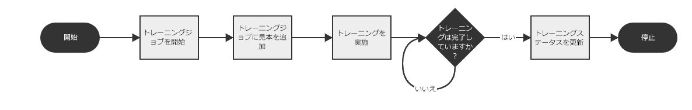
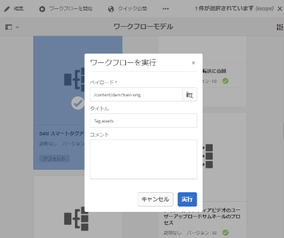
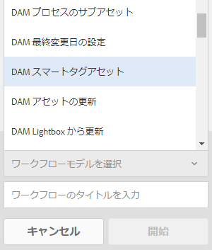

# スマートタグサービスのトレーニングと画像のタグ付け {#train-service-tag-assets}

デジタルアセットを扱う組織では、アセットメタデータで分類に基づく統制語彙を使用することがますます多くなっています。これには、基本的に、従業員、パートナーおよび顧客がデジタルアセットを参照したり、検索したりする場合によく使用するキーワードのリストが含まれます。分類に基づく統制語彙を使用してアセットをタグ付けすると、タグベースの検索でアセットを特定し、取得することが容易になります。

自然言語語彙と比較して、ビジネス上の分類に基づいたタグ付けでは、デジタルアセットを会社のビジネスと容易に連携させることができ、関連性の最も高いアセットが検索で表示されるようになります。例えば、自動車メーカーでは、プロモーションキャンペーンを計画するために様々なモデルの画像を検索する際、関連性の高い画像のみが表示されるように、モデル名を使用して車の画像をタグ付けすることができます。

そのバックグラウンドで、スマートタグは [Adobe Sensei](https://www.adobe.com/jp/sensei/experience-cloud-artificial-intelligence.html) の人工知能フレームワークを使用して、タグ構造とビジネス上の分類に基づいて画像認識アルゴリズムのトレーニングをおこないます。その後、このコンテンツインテリジェンスを使用して、アセットの個々のセットに関連性の高いタグが適用されます。

<!-- TBD: Create a similar flowchart for how training works in CS.
 
-->

スマートタグを使用するには、次のタスクを実行します。

* [Experience Manager と Adobe 開発者コンソールの統合](#integrate-aem-with-aio)。
* [タグモデルとガイドラインの理解](#understand-tag-models-guidelines)。
* [モデルのトレーニング](#train-model)。
* [デジタルアセットのタグ付け](#tag-assets)。
* [タグと検索の管理](#manage-smart-tags-and-searches)。

スマートタグは、[!DNL Adobe Experience Manager Assets] 顧客にのみ適用できます。スマートタグは、[!DNL Experience Manager] のアドオンとして購入できます。

<!-- TBD: Is there a link to buy SCS or initiate a sales call. How are AIO services sold? -->

## [!DNL Experience Manager] と Adobe 開発者コンソールの統合 {#integrate-aem-with-aio}

Adobe 開発者コンソールを使用して、[!DNL Adobe Experience Manager] とスマートタグを統合できます。この設定を使用して、[!DNL Experience Manager] 内からスマートタグサービスにアクセスします。

スマートタグを設定するタスクについては、[アセットのスマートタグのための Experience Manager の設定](smart-tags-configuration.md)を参照してください。バックエンドでは、スマートタグサービスに要求を転送する前に、[!DNL Experience Manager] サーバーが Adobe 開発者コンソールのゲートウェイでサービスの資格情報を認証します。

## タグモデルとガイドラインの理解 {#understand-tag-models-guidelines}

タグモデルは、画像の視覚要素でつながっているタグのグループです。例えば、靴のコレクションは異なるタグを持つことができますが、すべてのタグは靴に関連し、同じタグモデルに属することができます。タグは、画像の明確に異なる視覚要素にのみ関連付けることができます。[!DNL Experience Manager] でトレーニングモデルのコンテンツ表現を理解するには、各タグに対して手動で追加されたタグと例として用いる画像のグループから構成されるトップレベルのエンティティとして、トレーニングモデルを視覚化します。各タグは、画像にのみ適用できます。

現実的に処理できないタグは、以下に関連しています。

* 製品のリリース年や季節、画像のムード、また誘発される感情など、非視覚的で抽象的な要素。
* シャツの襟の有無や、製品に埋め込まれた小さな製品ロゴなど、製品の視覚的な細かい違い。

タグモデルを作成してサービスをトレーニングする前に、自社ビジネスのコンテキストでイメージ内のオブジェクトを最もよく説明する一意のタグのセットを特定します。キュレーション後のセット内のアセットが、[トレーニングガイドライン](#training-guidelines)に従っていることを確認してください。

### トトレーニングガイドライン　{#training-guidelines}

トレーニングセット内の画像は次のガイドラインに従う必要があります。

**数量とサイズ：**&#x200B;タグ 1 つにつき画像は最小 10 個、最大 50 個。

**一貫性**：タグの各画像は、似たような外観にする必要があります。同じ視覚的要素（画像内の同じタイプのオブジェクトなど）に関するタグを 1 つのタグモデルにまとめるのが最適です。例えば、以下の画像は似ていないので、これらの画像すべてを `my-party`（トレーニング用）としてタグ付けするのは適切ではありません。

**対象範囲**：トレーニングの画像には十分な多様性が必要です。AEM が適切に焦点を当てることを学習できるよう、数は少なくても多様性の高い例を提供します。見た目が大きく異なる画像に同じタグを適用する場合は、それぞれの種類に 5 つ以上の例を含めてください。例えば、*model-down-pose* というタグの場合、タグ付け時、類似する画像をより正確に識別できるよう、以下のハイライト表示された画像に似たトレーニング画像を増やします。

**妨害物と障害物**：サービスのトレーニングには、障害物（目立つ背景、メインとなる対象と一緒に含まれる物や人物などの関連性のない付随物）が少ない画像のほうが効果的です。例えば、*casual-shoe* というタグの場合、2 つ目の画像はトレーニングの候補として適切ではありません。

**完全性**：画像が複数のタグの対象となる場合は、適用可能なすべてのタグを追加してから、画像をトレーニングに含めます。例えば、*raincoat* と *model-side-view* などのタグの場合、対象となるアセットに両方のタグを追加してから、そのアセットをトレーニングに含めます。

**タグ数**：各タグに少なくとも 2 つの個別タグと、少なくとも 10 の異なる画像を使用して、モデルのトレーニングをおこなうことをお勧めします。単一のタグモデルでは、50 個を超えるタグを追加しないでください。

**例の数**：各タグに対して、少なくとも 10 個の例を追加します。ただし、アドビでは約 30 をお勧めしています。1 つのタグにつき最大 50 個の例がサポートされます。

**偽陽性や競合を回避**：単一の視覚的要素に対応した単一のタグモデルを作成することをお勧めします。モデル間でタグが重なり合うのを避けるように、タグモデルを構築します。例えば、`shoes` と `footwear` の 2 つの異なるタグモデル名で、`sneakers` のような共通タグは使用しないでください。トレーニングプロセスは、共通のキーワードに関して、トレーニングを受けた 1 つのタグモデルをもう 1 つで上書きします。

**例**：ガイダンスのさらなる例を以下に示します。

* 次のようなタグモデルを作成します。
   * 車種に関連するタグのみ。
   * シャツの色に関連するタグのみ。
   * 女性と男性のジャケットに関するタグのみ。
* 次のようなタグモデルは作成しません。
   * 2019 年と 2020 年にリリースされた車種を含むタグモデル。
   * 同じ車種をいくつか含む複数のタグモデル。

**トレーニングに使用する画像**：同じ画像を使用して、異なるタグモデルをトレーニングできます。ただし、イメージをタグモデル内の複数のタグに関連付けることはできません。したがって、異なるタグモデルに属する異なるタグを、同じ画像にタグ付けすることが可能です。

トレーニングを取り消すことはできません。上記のガイドラインは、トレーニングに適した画像を選択する際に役立ちます。

## カスタムタグに合わせたモデルのトレーニング {#train-model}

ビジネス固有のタグに合わせてモデルを作成してトレーニングするには、次の手順に従います。

1. 必要なタグと適切なタグ構造を作成します。DAM リポジトリに関連する画像をアップロードします。
1. [!DNL Experience Manager] ユーザーインターフェイスで、**[!UICONTROL Assets]**／**[!UICONTROL スマートタグトレーニング]**&#x200B;にアクセスします。
1. 「**[!UICONTROL 作成]**」をクリックします。「**[!UICONTROL タイトル]**」、「**[!UICONTROL 説明]**」を入力します。
1. モデルをトレーニングする既存のタグを `cq:tags` から参照して選択します。「**[!UICONTROL 次へ]**」をクリックします。
1. **[!UICONTROL アセットを選択]**&#x200B;ダイアログで、各タグに対して「**[!UICONTROL アセットを追加]**」をクリックします。DAM リポジトリ内を検索するか、リポジトリを参照して、画像を 10 個以上、最大で 50 個選択します。フォルダーではなくアセットを選択します。画像を選択したら、「**[!UICONTROL 選択]**」をクリックします。
1. 選択した画像のサムネールをプレビューするには、タグの前にあるアコーディオンをクリックします。「**[!UICONTROL アセットを追加]**」をクリックして、選択内容を変更できます。選択が完了したら、「**[!UICONTROL 送信]**」をクリックします。ユーザーインターフェイスに、トレーニングが開始されたことを示す通知がページの下部に表示されます。
1. 各タグモデルの「**[!UICONTROL ステータス]**」列で、トレーニングのステータスを確認します。可能なステータスは、「[!UICONTROL 保留]」、「[!UICONTROL トレーニング済み]」、「[!UICONTROL 失敗]」です。

*図：タグ付けモデルをトレーニングするトレーニングワークフロー手順。*

### トレーニングのステータスとレポートの表示 {#training-status}

アセットのトレーニングセット内のタグに関するスマートタグサービスのトレーニングが実施されたかどうかを確認するには、レポートコンソールでトレーニングワークフローレポートを調べます。

1. [!DNL Experience Manager] インターフェイスで、**[!UICONTROL ツール／Assets／レポートに移動します]**。
1. **[!UICONTROL アセットレポート]**&#x200B;ページで、「**[!UICONTROL 作成]**」をクリックします。
1. 「**[!UICONTROL スマートタグトレーニング]**」レポートを選択し、ツールバーで「**[!UICONTROL 次へ]**」をクリックします。
1. レポートのタイトルと説明を指定します。「**[!UICONTROL レポートをスケジュール]**」で、「**[!UICONTROL 今すぐ]**」オプションを選択したままにします。レポートを後で生成するようにスケジュールするには、「**[!UICONTROL 後で]**」を選択し、日時を指定します。次に、ツールバーの「**[!UICONTROL 作成]**」をクリックします。
1. **[!UICONTROL アセットレポート]**&#x200B;ページで、生成したレポートを選択します。レポートを表示するには、ツールバーの「**[!UICONTROL 表示]**」アイコンをクリックします。
1. レポートの詳細をレビューします。レポートには、トレーニングしたタグのトレーニングステータスが表示されます。「**[!UICONTROL トレーニングステータス]**」列の緑色は、そのタグについてスマートタグサービスのトレーニングが実施されたことを示します。黄色は、特定のタグに関するサービスのトレーニングが完全には実施されていないことを示します。この場合、特定のタグを含む画像をさらに追加し、トレーニングワークフローを実行して、そのタグに関するサービスのトレーニングを完全に実施します。このレポートにタグが表示されない場合は、それらのタグに関するトレーニングワークフローを再度実行してください。
1. レポートをダウンロードするには、リストから対象のレポートを選択し、ツールバーの「**[!UICONTROL ダウンロード]**」をクリックします。レポートが Microsoft Excel スプレッドシートとしてダウンロードされます。

## アセットのタグ付け {#tag-assets}

スマートタグサービスのトレーニングが完了したら、タグ付けワークフローを実行して、類似するアセットの個々のセットに適切なタグを自動的に適用することができます。タグ付けワークフローは、定期的に適用することも、必要に応じて適用することもできます。タグ付けワークフローは、アセットとフォルダーの両方に対して適用されます。

### ワークフローコンソールからのアセットのタグ付け {#tagging-assets-from-the-workflow-console}

1. Experience Manager インターフェイスで、**[!UICONTROL ツール／ワークフロー／モデルに移動します]**。
1. **[!UICONTROL ワークフローモデル]**&#x200B;ページで、「**[!UICONTROL DAM スマートタグアセット]**」ワークフローを選択し、ツールバーの「**[!UICONTROL ワークフローを開始]**」をクリックします。

   

1. **[!UICONTROL ワークフローを実行]**&#x200B;ダイアログで、タグを自動的に適用するアセットが格納されているペイロードフォルダーを参照します。
1. ワークフローのタイトルとオプションのコメントを指定します。「**[!UICONTROL 実行]**」をクリックします。

   

   アセットフォルダーに移動し、タグを確認して、アセットが適切にタグ付けされているかどうかを確認します。詳しくは、[スマートタグの管理](#manage-smart-tags-and-searches)を参照してください。

### タイムラインからのアセットのタグ付け {#tagging-assets-from-the-timeline}

1. Assets のユーザーインターフェイスで、スマートタグを適用するアセットが格納されているフォルダーまたは特定のアセットを選択します。
1. 左上隅から、**[!UICONTROL タイムライン]**&#x200B;を開きます。
1. 左側のサイドバーの下部からアクションを開き、「**[!UICONTROL 開始ワークフロー]**」をクリックします。

   

1. 「**[!UICONTROL DAM スマートタグアセット]**」ワークフローを選択し、ワークフローのタイトルを指定します。
1. 「**[!UICONTROL 開始]**」をクリックします。ワークフローによってアセットにタグが適用されます。アセットフォルダーに移動し、タグを確認して、アセットが適切にタグ付けされているかどうかを確認します。詳しくは、[スマートタグの管理](#manage-smart-tags-and-searches)を参照してください。

>[!NOTE]
>
>後続のタグ付けサイクルでは、新しくトレーニングされたタグを使用して、変更したアセットのみが再度タグ付けされます。ただし、タグ付けワークフローの最後のタグ付けサイクルと現在のタグ付けサイクルの間のギャップが 24 時間を超える場合は、変更されないアセットもタグ付けされます。定期的なタグ付けワークフローについては、時間の間隔が 6 ヶ月を超えると、変更されていないアセットがタグ付けされます。

### アップロードしたアセットのタグ付け {#tag-uploaded-assets}

Experience Manager は、DAM にアップロードするアセットに自動的にタグ付けすることができます。そのためには、管理者は、使用可能な手順をスマートタグアセットに追加するワークフローを設定します。[アップロードしたアセットのスマートタグを有効にする方法](/help/assets/smart-tags-configuration.md#enable-smart-tagging-for-uploaded-assets)を参照してください。

## スマートタグと画像検索の管理 {#manage-smart-tags-and-searches}

関連性の高いタグのみが表示されるようにするために、スマートタグを整理し、ブランド画像に割り当てられた可能性のある不正確なタグを削除することができます。

また、スマートタグをモデレートすると、画像が最も関連性の高いタグの検索結果に表示されるようになるので、画像のタグベース検索の精度が向上します。実質的には、検索結果に関連性のない画像が表示されないようにすることができます。

タグに高いランクを割り当てて、画像に関して関連性を高めることもできます。画像のタグのランクを高くすることで、特定のタグに基づいて検索が実行されたときに、その画像が検索結果に表示される可能性が高くなります。

1. オムニサーチボックスで、タグに基づいてアセットを検索します。
1. 検索結果を調査し、検索に関連性のない画像を特定します。
1. 画像を選択し、ツールバーの「**[!UICONTROL タグを管理]**」アイコンをクリックします。
1. **[!UICONTROL タグを管理]**&#x200B;ページで、タグを調査します。特定のタグに基づいて画像が検索されないようにするには、タグを選択し、ツールバーの削除アイコンをクリックします。または、ラベルの横に表示される `X` 記号をクリックします。
1. タグに高いランクを割り当てるには、タグを選択し、ツールバーの昇格アイコンをクリックします。昇格したタグは、「**[!UICONTROL タグ]**」セクションに移動されます。
1. 「**[!UICONTROL 保存]**」、「**[!UICONTROL OK]**」の順にクリックして、成功ダイアログを閉じます。
1. 画像のプロパティページに移動します。昇格したタグに高い関連性が割り当てられていること、その結果として検索結果の上位に表示されることを確認します。

### スマートタグ付き AEM 検索結果について{#understandsearch}

デフォルトでは、検索用語同士を `AND` 句で組み合わせて AEM 検索がおこなわれます。スマートタグを使用しても、このデフォルトの動作は変わりません。スマートタグを使用すると、適用されたスマートタグ内にある検索用語のいずれかを探すための `OR` 句が追加されます。例えば、「`woman running`」を検索する場合を考えます。デフォルトでは、「`woman`」のみ、または「`running`」のみがメタデータに含まれているアセットは、検索結果に表示されません。しかし、スマートタグを使って「`woman`」または「`running`」のどちらかがタグ付けされているアセットは、そうした検索クエリに表示されます。つまり、検索結果は、以下を組み合わせたものになります。

* 「`woman`」と「`running`」の両方のキーワードがメタデータ内にあるアセット。

* 上記どちらかのキーワードがメタデータ内にあるアセット。

メタデータフィールド内のすべての検索用語に一致する検索結果が最初に表示され、スマートタグ内の検索用語のいずれかに一致する検索結果はその後に表示されます。上記の例の場合、検索結果が表示される順序はおおよそ次のようになります。

1. 各種メタデータフィールド内の「`woman running`」に一致するもの。
1. スマートタグ内の「`woman running`」に一致するもの。
1. スマートタグ内の「`woman`」または「`running`」に一致するもの。

### タグの制限 {#limitations}

拡張スマートタグは、ブランド画像とそのタグの学習モデルに基づいています。これらのモデルは、タグを識別するうえで常に完璧であるわけではありません。スマートタグの現行バージョンには次の制限事項があります。

* 画像内の細かい違いを認識することはできません。例えば、シャツのサイズが細身か標準かなどの違いは認識できません。
* 画像の細かい模様や部分に基づいてタグを識別することはできません。例えば、T シャツのロゴなどです。
* タグ付けは、AEM がサポートされているロケールでサポートされています。言語の一覧については、[スマートタグのリリースノート](https://docs.adobe.com/content/help/ja-JP/experience-manager-64/release-notes/smart-content-service-release-notes.translate.html)を参照してください。

スマートタグ（通常または拡張）付きのアセットを検索するには、アセットのオムニサーチ（全文検索）を使用します。スマートタグには個別の検索用述語はありません。

>[!NOTE]
>
>スマートタグでタグのトレーニングを実施し、それらのタグを他の画像に適用できるかどうかは、トレーニングで使用する画像の質によって決まります。
>最適な結果を得るには、視覚的に似ている画像を使用し、それぞれのタグについてサービスのトレーニングを実施することをお勧めします。

>[!MORELIKETHIS]
>
>* [スマートタグの Experience Manager の設定](smart-tags-configuration.md)
>* [スマートタグによるアセット管理の仕組み](https://medium.com/adobetech/efficient-asset-management-with-enhanced-smart-tags-887bd47dbb3f)

