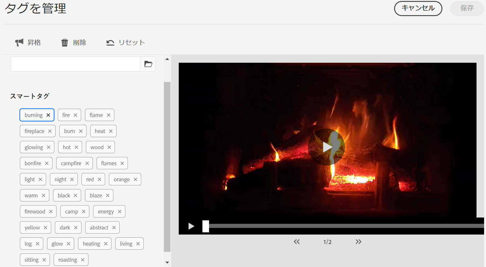

# AEM Assetsのスマートタグ {#using-smart-tags}

組織は数多くのデジタルアセットを保有しており、その数は急速に増加し続けています。 このような大量のデータの中から特定のアセットを検索することは、重大な課題となります。 この問題に対処するために、`metadata` と `tags` を使用して、デジタルアセットの検索性を向上させます。 組織は、アセットメタデータ内で分類に基づく統制語彙を使用します。 通常は、従業員、パートナー、顧客がデジタルアセットを参照して見つけるために一般的に使用するキーワードリストで構成されます。

スマートタグは、テキスト内に表示されるだけでなく、アセットを最も的確に表現するキーワードです。 分類に基づく統制語彙を使用してアセットをタグ付けすると、検索を通じてアセットを特定し、取得することが容易になります。

例えば、辞書の中でアルファベット順に並べられている単語は、ランダムに散らばっている単語よりも見つけやすい。 タグ付けは同様の目的で使用されます。 ビジネス上の分類に従ってアセットが整理され、最も関連性の高いアセットが検索結果に表示されます。 例えば、自動車メーカーでは、プロモーションキャンペーンの設計時に関連する画像のみが表示されるように、モデル名を使用して車の画像にタグを付けることができます。 「ランナー」や「ランニングシューズ」のタグ付けであっても、ユーザーは入力ミス、スペルのバリエーション、代替検索用語について心配する必要はありません。スマートタグはそれらをすべて認識します。

そのバックグラウンドで、[Adobe Sensei](https://business.adobe.com/products/sensei/adobe-sensei.html) の人工知能フレームワークが使用され、ビジネス上の分類に関連付けられたテキストと共に、アップロードされたアセットにスマートタグが自動的に（デフォルトで）適用されます。

## 前提条件と設定 {#smart-tags-prereqs-config}

スマートタグは [!DNL Adobe Experience Manager] as a [!DNL Cloud Service] 用に自動的にプロビジョニングされるので、設定は必要ありません。

## スマートタグのワークフロー {#smart-tags-workflow}

[!DNL Adobe Sensei] を活用したスマートタグ付けでは、人工知能モデルを使用してコンテンツを分析し、アセットにタグを追加します。 これにより、DAM ユーザーが顧客に豊富なエクスペリエンスを提供する時間を短縮できます。 スマートタグは、アセットプロパティで [ 信頼性スコア ](#confidence-score) の降順で表示されます。

* **画像ベースのアセット**
画像の場合、スマートタグは視覚的な観点に基づいて設定されます。 多くの形式の画像は、スマートコンテンツサービスを使用してタグ付けされます。 スマートタグは、JPGと PNG 形式のレンディションを生成する [ サポートされているファイルタイプ ](#supported-file-formats) に適用されます。

  <!-- -->

* **ビデオベースのアセット**
ビデオベースのアセットの場合、[!DNL Adobe Experience Manager] as a [!DNL Cloud Service] では、タグ付けはデフォルトで有効になっています。 同様に、画像およびテキストベースのタグでは、新しいビデオをアップロードする場合や既存のビデオを再処理する場合にも、ビデオは自動タグ付けされます。 ビデオに 2 つのタグのセット [!DNL Adobe Sensei] 生成されます。1 つのセットは、そのビデオのオブジェクト、シーン、アトリビュートに対応し、もう 1 つのセットは、飲酒、ランニング、ジョギングなどのアクションに関連しています。 [ ビデオスマートタグのオプトアウト ](#opt-out-video-smart-tagging) も確認します。

* **テキストベースのアセット**
サポートされているアセットの場合、[!DNL Experience Manager] はすでにテキストを抽出し、その後、インデックスを作成してアセットの検索に使用します。 ただし、テキスト内のキーワードに基づくスマートタグには、構造化された、より優先度の高い専用の検索ファセットが用意されています。後者は、検索インデックスと比較して、アセット検出の向上に役立ちます。
テキストベースのアセットの場合、スマートタグの有効性は、アセット内のテキストの量に依存するのではなく、アセットのテキスト内に存在する関連キーワードまたは関連エンティティに依存します。

  

スマートタグは次のワークフローを使用してAEM Assetsに実装されます。

1. AEMでアセットを作成またはアップロードします。 標準搭載のタグは、画像、ビデオおよびテキストベースのAssetsに対して生成されます。

1. 特定のタグが生成されていない場合は、それに応じて画像タイプのタグのトレーニングを行うことができます。 [ スマートタグのトレーニング ](#smart-tags-training.md) を参照してください。

## スマートタグでサポートされるファイル形式 {#supported-file-formats}

| 画像（MIME タイプ） | テキストベースのアセット（ファイル形式） | ビデオアセット（ファイル形式とコーデック） |
|----|-----|------|
| image/jpeg | CSV | MP4（H264／AVC） |
| image/tiff | DOC | MKV（H264／AVC） |
| image/png | DOCX | MOV（H264／AVC、Motion JPEG） |
| image/bmp | HTML | AVI（indeo 4） |
| image/gif | PDF | FLV（H264／AVC、vp6f） |
| image/pjpeg | PPT | WMV（WMV2） |
| image/x-portable-anymap | PPTX |  |
| image/x-portable-bitmap | RTF |  |
| image/x-portable-graymap | SRT |  |
| image/x-portable-pixmap | TXT |  |
| image/x-rgb | VTT |  |
| image/x-xbitmap | |  |
| image/x-xpixmap | |  |
| image/x-icon |  |  |
| image/photoshop |  |  |
| image/x-photoshop |  |  |
| image/psd |  |  |
| image/vnd.adobe.photoshop |  |  |

## 標準搭載のスマートタグ付け用のアセットの準備

[!DNL Adobe Experience Manager] as a [!DNL Cloud Service] に [ アセットをアップロード ](add-assets.md#upload-assets) すると、アップロードされたアセットが処理されます。 処理が完了したら、アセット[!UICONTROL プロパティ]ページの「[!UICONTROL 基本]」タブを参照してください。スマートタグは、「スマートタグ [!UICONTROL &#x200B; の下のアセットに自動的に追加さ &#x200B;] ます。 アセットマイクロサービスは、[!DNL Adobe Sensei] を使用してこれらのスマートタグを作成します。


<!--
The applied smart tags are sorted in descending order of [confidence score](#confidence-score), combined for object and action tags, within [!UICONTROL Smart Tags].
-->

>[!IMPORTANT]
>
>自動生成されたタグが、ブランドとその内容に適合するかどうか確認してください。

## DAM でタグなしのAssets {#smart-tag-existing-assets}

DAM 内の既存または古いアセットは、自動的にスマートタグが付けられません。 Assetsのスマートタグを生成するには、手動で [ 再処理 ](https://experienceleague.adobe.com/docs/experience-manager-cloud-service/content/assets/admin/about-image-video-profiles.html?lang=en#adjusting-load) する必要があります。 プロセスが完了したら、フォルダー内の任意のアセットの [!UICONTROL &#x200B; プロパティ &#x200B;] ページに移動します。 自動的に追加されたタグは、「[!UICONTROL 基本]」タブの[!UICONTROL スマートタグ]セクションに表示されます。これらの適用されたスマートタグは、[ 信頼性スコア ](#confidence-score) の降順で並べ替えられます。

<!--
To smart tag assets, or folders (including subfolders) of assets that exist in assets repository, follow these steps:

1. Select the [!DNL Adobe Experience Manager] logo and then select assets from the [!UICONTROL Navigation] page.

1. Select [!UICONTROL Files] to display the Assets interface.

1. Navigate to the folder to which you want to apply Smart Tags.

1. Select the assets and click  [!UICONTROL Reprocess Assets] icon and select the [!UICONTROL Full Process] option.

-->

## 信頼スコア {#confidence-score}

アセット検索結果は、信頼性スコアに基づいてランク付けされます。これにより、通常、アセットの割り当て済みタグの検査で示唆される以上の検索結果が得られます。 不正確なタグは信頼スコアが低いことが多いため、アセットのスマートタグリストの最上位に表示されることはめったにありません。
<!--
[!DNL Adobe Experience Manager] as a [!DNL Cloud Service] applies a minimum confidence threshold for object and action-smart tags to avoid having too many tags for each asset, which slows down indexing. 

The default threshold for action and object tags in [!DNL Adobe Experience Manager] for an image is 0.5 and for video it is 0.7 (should be value from 0 through 1). If some assets are not tagged by a specific tag, then it indicates that the algorithm is less than 70% confident in the predicted tags. The default threshold might not always be optimal for all the users. You can, therefore, change the confidence score value in OSGI configuration.

To add the confidence score OSGI configuration to the project deployed to [!DNL Adobe Experience Manager] as a [!DNL Cloud Service] through [!DNL Cloud Manager]:

In the [!DNL Adobe Experience Manager] project (`ui.config` since Archetype 24, or previously `ui.apps`) the `config.author` OSGi configuration, include a config file named `com.adobe.cq.assetcompute.impl.senseisdk.SenseiSdkImpl.cfg.json` with the following contents:

```json
{
  "minVideoActionConfidenceScore":0.5,
  "minVideoObjectConfidenceScore":0.5,
}
```
-->

>[!NOTE]
>
>手動タグには信頼性 100%（最大の信頼性）が割り当てられます。したがって、検索クエリに一致する手動タグを持つアセットがある場合、それらは検索クエリに一致するスマートタグの前に表示されます。

## スマートタグのモデレート {#moderate-smart-tags}

[!DNL Adobe Experience Manager] as a [!DNL Cloud Service] を使用すると、スマートタグをキュレーションして次の操作を行うことができます。

* ブランドアセットに割り当てられている不正確なタグを削除します。

* 最も関連性の高いタグの検索結果にアセットが表示されるように、タグベースのアセット検索を絞り込みます。 そのため、関連のないアセットが検索結果に表示される可能性がなくなります。

* タグに高いランクを割り当てて、アセットに対する関連性を高めます。 アセットのタグのランクを高くすることで、そのタグに基づいて検索が実行されたときに、特定のアセットが検索結果に表示される可能性が高くなります。

アセットのスマートタグをモデレートする方法について詳しくは、[ スマートタグの管理 ](smart-tags.md#manage-smart-tags-and-searches) を参照してください。



>[!NOTE]
>
>[ スマートタグを管理 ](smart-tags.md#manage-smart-tags-and-searches) の手順を使用してモデレートされたタグは、アセットの再処理時に記憶されません。 元のタグセットが再び表示されます。

## スマートタグとアセット検索の管理 {#manage-smart-tags-and-searches}

関連性の高いタグのみが表示されるように、スマートタグを整理し、ブランドアセットに割り当てられている可能性のある不正確なタグを削除することができます。

スマートタグをモデレートすると、最も関連性の高いタグの検索結果にアセットが表示されるため、タグベースのアセット検索を絞り込むこともできます。 実質的には、検索結果に関連性のないアセットが表示されないようにすることができます。

また、タグに上位のランクを割り当てて、タグのアセットに対する関連性を高めることもできます。アセットのタグのランクを高くすることで、特定のタグに基づいて検索が実行されたときに、そのアセットが検索結果に表示される可能性が高くなります。

デジタルアセットのスマートタグをモデレートするには：

1. 検索フィールドで、タグに基づいてデジタルアセットを検索します。

1. 検索に関係のないデジタルアセットを特定するには、検索結果を調べます。

1. アセットを選択し、ツールバーの  をクリックします。

1. **[!UICONTROL タグを管理]**&#x200B;ページで、タグを調査します。特定のタグに基づいてアセットを検索しない場合は、タグを選択し、ツールバーからを選択します。または、ラベルの横にある  を選択します。

1. タグに高いランクを割り当てるには、タグを選択し、ツールバーのをクリックします。昇格したタグは「**[!UICONTROL タグ]**」セクションに移動されます。

1. 「**[!UICONTROL 保存]**」、「**[!UICONTROL OK]**」の順に選択して、[!UICONTROL 成功]ダイアログを閉じます。

1. アセットの[!UICONTROL プロパティ]ページに移動します。昇格したタグに高い関連度が割り当てられているため、検索結果の上位に表示されることを確認します。

### スマートタグ付 [!DNL Experience Manager] 検索結果について {#understand-search}

デフォルトでは、検索用語同士を `AND` 句 [!DNL Experience Manager] たは `OR` 句で組み合わせて、適用されたスマートタグ内の検索用語を検索します。 スマートタグを使用しても、このデフォルトの動作は変更されません。 例えば、「`woman running`」を検索する場合を考えます。デフォルトでは、「`woman`」のみ、または「`running`」のみがメタデータに含まれているアセットは、検索結果に表示されません。ただし、スマートタグを使用して `woman` または `running` のどちらかがタグ付けされているアセットは、このような検索クエリで表示されます。 検索結果は、以下を組み合わせたものになります。

* 「`woman`」と「`running`」の両方のキーワードがメタデータ内にあるアセット

* 上記のどちらかのキーワードがメタデータ内にあるアセット

メタデータフィールド内のすべての検索語句に一致する検索結果がまず表示され、次にスマートタグ内のいずれかの検索語句に一致する検索結果が表示されます。 上記の例では、検索結果の表示順序は次のようになります。

1. 各種メタデータフィールド内の「`woman running`」に一致するもの。
1. スマートタグ内の `woman running` と一致します。
1. スマートタグ内の `woman` または `running` と一致します。

## スマートタグのオプトアウト {#opt-out-smart-tagging}

アセットの自動タグ付けがサムネールの作成やメタデータの抽出などの他のアセット処理タスクと並行して実行されるので、時間がかかる場合があります。 アセットの処理を迅速に行うために、アップロード時にフォルダーレベルでスマートタグのオプトアウトを行うことができます。 特定のフォルダーにアップロードされたアセットの自動スマートタグ生成をオプトアウトするには：

1. フォルダー[!UICONTROL プロパティ]の「[!UICONTROL アセット処理]」タブを開きます。
1. [!UICONTROL &#x200B; ビデオのスマートタグ &#x200B;] メニュー（例：[!UICONTROL &#x200B; 継承 &#x200B;] オプションは、デフォルトで選択されており、ビデオスマートタグが有効になっています。

   「[!UICONTROL 継承]」オプションが選択されている場合、継承されたフォルダーのパスは、「[!UICONTROL 有効化]」と「[!UICONTROL 無効化]」のどちらに設定されているかという情報と共に表示されます。

   

1. フォルダーにアップロードされたスマートタグのオプトアウトを行うには、「[!UICONTROL &#x200B; 無効 &#x200B;]」を選択します。

1. 同様に、[!UICONTROL &#x200B; テキストのスマートタグ &#x200B;]、[!UICONTROL &#x200B; 画像のスマートタグ &#x200B;]、および [!UICONTROL &#x200B; 画像のカラータグ &#x200B;] のスマートタグをオプトアウトできます。

>[!IMPORTANT]
>
>アップロード時にフォルダーのタグ付けをオプトアウトし、アップロード後にスマートタグを使用する場合は、フォルダー **プロパティ  の「[!UICONTROL &#x200B; アセット処理 &#x200B;]」タブで**&#x200B;[!UICONTROL &#x200B; スマートタグを有効にする &#x200B;] と、[[!UICONTROL &#x200B; アセットを再処理 &#x200B;] オプション ](#smart-tag-existing-assets) を使用して、アセットにスマートタグを追加します。

<!--
## Benefits of Smart Tags to your assets {#benefits-of-smart-tags}

Following are the benefits of using Smart Tags in your AEM Assets:
*  Makes an asset searchable.
*  Smart Tags are generated automatically to your assets, thus, it minimizes your effort to perform tagging manually.
*  It allows the usage of the same vocabulary, tag structure, and taxonomy so that you need not to worry about tagging if by chance you miss tagging at first.
*  Whether you are tagging "runners" or "running" shoes, you do not need to worry about typos, wrong spellings, or alternative search terms as Smart Tags know it already!
*  Helps your assets to become organized and categorized.
-->

## AI で生成されたスマートタグによるコンテンツ検出の強化 {#ai-smart-tags}

AI は、手動の入力に依存するのではなく、デジタルアセットに説明的なタグを自動的に割り当てます。 これらの AI で生成されるタグは、メタデータの品質を向上させ、アセットの検索、分類およびレコメンデーションを容易にします。 このアプローチは、手動でのタグ付けを排除することで効率を向上させるだけでなく、大量のデジタルコンテンツ間の一貫性と拡張性も確保します。 例えば、アセットが画像の場合、AI はアセット内のオブジェクト、シーン、感情、さらにはブランドロゴを識別し、「サンセット」、「ビーチ」、「休暇」、「笑顔」など、関連するタグを生成できます。 AI で生成されたコンテンツは、意味論的検索と辞書的検索の両方の手法を活用することで、アセットの検索を強化できます。 詳しくは、[Assetsを検索 ](search-assets.md) を参照してください。<!--If the asset is a document, AI reads and interprets the text to assign meaningful keywords that summarize its content—such as "climate change," "policy," or "renewable energy.-->


### AI が生成したスマートタグの使用 {#using-ai-generated-smart-tags}

<!--[!NOTE]
>
>The enhanced smart tags capability is available only for the newly uploaded assets.
-->

拡張スマートタグ機能を使用するには、次の手順を実行します。

1. [!DNL Experience Manager] インターフェイスで、目的のフォルダーに移動し、「**[!UICONTROL Assetsを追加]**」をクリックします。 <!--Alternatively, to update enhanced smart tags in an existing content, click **[!UICONTROL reprocess]**.--> 互換性のある画像ファイル形式は、`png`、`jpg`、`jpeg`、`psd`、`tiff`、`gif`、`webp`、`crw`、`cr2`、`3fr`、`nef`、`arw` および `bmp` です。

1. 新しくアップロードされたアセットが処理されるまで待ちます。 完了したら、アセットプロパティに移動します。

1. 「**[!UICONTROL AI で生成]**」タブに移動します。 互換性 [!DNL Experience Manager] ないバージョンや更新されていないバージョンの場合、このタブは表示されません。 必要なAEMの最小リリースバージョンは `20626` です。 次のフィールドがあります。

   * **[!UICONTROL 生成されたタイトル &#x200B;]:** このタイトルは、アップロードされたアセットの中心的概念を捕捉する明確で簡潔な見出しを提供し、一目でわかりやすくします。 アセットを追加する際に、（`dc:title` で）タイトルを指定すると、アセットの参照表示に表示されます。 空白の場合、AI で生成されたタイトルが自動的に割り当てられます。
   * **[!UICONTROL 生成された説明 &#x200B;]:** 説明では、アセットの概要を簡潔にしながら情報を提供し、ユーザーや検索モジュールが関連性をすばやく把握できるようにします。
   * **[!UICONTROL 生成されたキーワード &#x200B;]:** キーワードは、アセットの主なテーマを表すターゲット用語で、タグ付けやコンテンツのフィルタリングに役立ちます。

1. [ オプション ] 関連するタグが欠落していると思われる場合は、追加のタグを追加するか、独自のタグを作成できます。 これを行うには、「**[!UICONTROL 生成されたキーワード]**」フィールドにタグを入力し、「**[!UICONTROL 保存]** をクリックします。

## スマートタグに関する制限事項とベストプラクティス {#limitations-best-practices-smart-tags}

これらのモデルは、タグを識別するうえで常に完璧であるわけではありません。スマートタグの現行バージョンには次の制限事項があります。

* 画像内の細かい違いを認識することはできません。例えば、シャツのサイズが細身か標準かなどです。
* 画像の細かい模様や部分に基づいてタグを識別することはできません。例えば、シャツのロゴなどです。
* 処理されないタグは、次のものに関係しています。

   * 視覚的でない、抽象的な側面。製品のリリースの年や季節、画像によって誘発されるムードや感情、ビデオの主観的な意味などがその例です。
   * シャツの襟の有無や、製品に埋め込まれた小さな製品ロゴなど、製品の視覚的な細かい違い。

* ファイルサイズが 300 MB 未満のビデオのみ自動的にタグ付けされます。[!DNL Adobe Sensei] サービスは、サイズが大きいビデオファイルをスキップします。
* スマートタグ（通常または拡張）付きのファイルを検索するには、[!DNL Assets] 検索（全文検索）を使用します。 スマートタグには個別の検索用述語はありません。
* 一般的なタグと比較して、ビジネス分類を使用してタグ付けされたアセットは、タグベースの検索で識別および取得が容易になります。

## よくある質問{#faq-smart-tags}

+++**スマートタグを使用してアセットの検索エクスペリエンスを向上させるにはどうすればよいですか？**

Sensei[!DNL Adobe]、アップロードするとアセットに自動的にタグ付けされます。 自動プロセスはバックエンドで非常に高速に実行されるので、アップロードが完了してから数秒後にアセットにタグが追加されます。

+++

+++**スマートタグリストが不正確な場合や、不要なタグが表示される場合はどうなりますか？**

不正確なタグや不要なタグは、リストから削除できます。 例えば、自動車ディーラーの場合、リストから「破損した」タグを削除するとよいでしょう。

+++

+++**同じタグを含むアセットに優先順位を付けるにはどうすればよいですか？**

はい。同じタグを含むアセットに優先順位を付けることができます。 タグをアセットのスマートタグリストに昇格させて、優先順位付けを実行することができます。 タグのプロモーションを行うと、その特定のタグの検索結果に表示される画像に優先順位を付けることができます。

+++

+++**スマートタグの適用は特定のフォルダーに制限されていますか？**

スマートタグは設定可能で、DAM 内の任意のフォルダーに適用できます。

+++

+++**タグ付けにトレーニングが必要であることがどうすれば分かりますか？**

[ スマートタグトレーニングの要件の決定 ](#smart-tags-training.md#smart-tag-training-requirement) を参照してください。

+++

+++**アセットのタグ付けでサポートされるファイル形式は何ですか？**

[ サポートされるファイル形式 ](#supported-file-formats) を参照してください。

+++

+++**生成される言語スマートタグ**

スマートタグは英語でのみ生成されます。 メタデータを含むアセット全体を翻訳することで、他の言語に翻訳できます。

+++

+++**スマートタグはもう使用しません。**

中断する場合はいつでも [ スマートタグ付けをオプトアウト ](#opt-out-smart-tagging) できます。

+++
