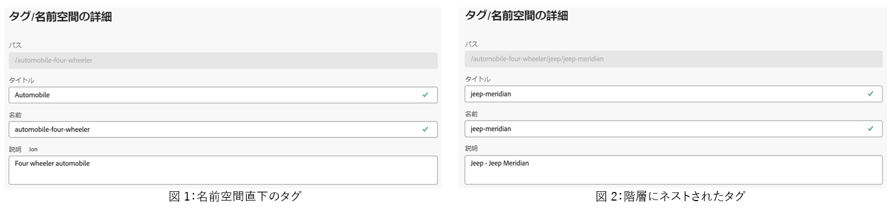

# アセットビューでタグを管理 {#view-assets-and-details}

>[!CONTEXTUALHELP]
>id="assets_taxonomy_management"
>title="タグを管理"
>abstract="タグを使用すると、アセットを分類して参照や検索をより効率的に行えるようになります。管理者は階層タグ構造を使用でき、関連するメタデータの適用、アセットの分類、検索のサポート、タグの再利用、検出性の向上などを簡単に行えます。"

タグを使用すると、アセットを分類して参照や検索をより効率的に行えるようになります。タグ付けは、適切な分類を他のユーザーやワークフローに伝播するうえで役に立ちます。

語彙を制御するフラットなリストは、時間の経過と共に管理できなくなる可能性があります。管理者は階層タグ構造を使用でき、関連するメタデータの適用、アセットの分類、検索のサポート、タグの再利用、検出性の向上などを簡単に行えます。

ルートレベルで名前空間を作成し、名前空間内にサブタグの階層構造を作成できます。例えば、ルートレベルで `Activities` 名前空間を作成し、その名前空間内に `Cycling`、`Hiking` および `Running` タグを含めることができます。`Running` 内にさらにサブタグ `Clothing` および `Shoes` を含めることができます。

タグ付けには、次のような多くの利点があります。

* タグ付けにより、作成者は共通の分類を通じて異なるアセットを簡単に整理できます。作成者は、共通のタグでアセットを素早く検索および整理できます。

* 階層タグは非常に柔軟性があり、用語を論理的に整理するのに優れています。名前空間、タグおよびサブタグを通じて、分類システム全体を表現できます。

* 組織の語彙が変化するにつれて、タグは時間の経過と共に進化する可能性があります。

* 管理ビューで管理するタグは、アセットビューで管理するタグと同期されたままとなるので、メタデータのガバナンスと整合性が確保されます。

アセットにタグを適用できるようにするには、最初に名前空間を作成し、次にタグを作成して追加する必要があります。また、タグを作成してから、既存の名前空間に追加することもできます。ルートレベルで作成したタグはすべて、標準タグ名前空間に自動的に追加されます。次に、「タグ」フィールドをメタデータフォームに追加して、アセットの詳細ページに表示できるようにします。これらの設定を指定した後、アセットへのタグの適用を開始できます。

>[!NOTE]
>
>デフォルトのメタデータフォームを使用していない場合にのみ、「タグ」フィールドをメタデータフォームに追加する必要があります。

管理ビューでは、タグの結合、名前変更、ローカライズ、公開など、この記事で説明している機能以外にも追加機能があります。

## 名前空間の作成 {#create-a-namespace}

名前空間は、ルートレベルにのみ存在できるタグのコンテナです。最初に名前空間の論理名を定義することで、タグの階層構造の設定を開始できます。既存の名前空間のいずれにもタグを追加しない場合、タグは自動的に標準タグに移動します。

名前空間を作成するには、次の手順を実行します。

1. `Settings` の下の `Taxonomy Management` に移動して、既存の名前空間のリストを表示します。また、最終変更日、名前空間またはその下のタグを変更したユーザー、アセット内でタグが使用された回数も表示できます。
1. 「`Create Namespace`」をクリックします。
1. 名前空間に `Title`、`Name` および `Description` を追加します。「`Title`」フィールドで指定した入力は、階層の上位に表示されます。例えば、次の図では、**アクティビティ**&#x200B;は名前空間のタイトルを参照しています。

   

1. 「`Save`」をクリックします。

## 名前空間にタグを追加 {#add-tags-to-namespace}

名前空間にタグを追加するには、次の手順を実行します。

1. に移動します。 **[!UICONTROL 分類管理]**.
1. 名前空間を選択し、「`Create`」をクリックして名前空間の上位レベルにタグを作成します。名前空間に存在するタグの下にサブタグを作成する必要がある場合は、タグを選択し、「`Create`」をクリックします。
   

   この例では、左側の画像は、「`Path`」フィールドに表示されている名前空間 `automobile-four-wheeler` の直下のタグを表しています。右側の画像は、タグ内に追加されたサブタグの例です。名前空間に加えて、「`Path`」フィールドにはさらに多くのタグ名 `jeep` と `jeep-meridian` が表示されます。
1. タグのタイトル、名前、説明を指定し、「`Save`」をクリックします。

   >[!NOTE]
   >
   >* 「`Title`」フィールドと「`Name`」フィールドは必須ですが、「`Description`」フィールドはオプションです。
   >* デフォルトでは、ツールは「タイトル」フィールドに入力したテキストをコピーし、空白または特殊文字（.&amp; / \ : * ? [ ] | &quot; %）を削除して、それを名前として保存します。
   >* 「`Title`」フィールドは後で更新できますが、「`Name`」フィールドは読み取り専用です。

## 標準タグにタグを追加 {#add-tags-to-standard-tags}

非構造化タグや階層を持たないタグは、`Standard Tags` 名前空間に保存されます。さらに、管理される分類に影響を与えずに説明的な用語を追加する場合は、その値を `Standard Tags` に保存できます。これらの値は、時間の経過と共に構造化された名前空間に移動できます。さらに、`Standard Tags` 名前空間をキーワードの自由形式エントリとして使用できます。

標準タグを作成するには、ルートレベルで「`Create Tag`」をクリックします。タイトル、名前および説明を指定し、「`Save`」をクリックします。

>[!NOTE]
>
>Assets as a Cloud Service を使用して `Standard Tags` 名前空間を削除する場合、ルートレベルで作成されたタグは、使用可能なタグのリストに表示されません。

## タグを移動 {#move-tags}

タグを誤った階層に格納したり、時間の経過と共に分類が変更された場合は、選択したタグを移動してデータの整合性を維持できます。タグの移動時には、次の条件を考慮する必要があります。

* タグは、既存の名前空間の下または既存のタグ階層内にのみ移動できます。
* タグを名前空間にするために、ルートに移動できません。
* 親タグを移動すると、階層に保存されているすべての子タグも移動されます。

タグを別の場所に移動するには、次の手順を実行します。

1. 適切な名前空間の下でタグまたはタグの階層全体を選択し、「`Move`」をクリックします。
1. 移動ダイアログで、「`Select Tag`」セクションを使用して、新しい宛先タグまたは名前空間を選択します。
1. 「`Save`」をクリックします。タグが新しい場所に表示されます。

## タグを編集 {#edit-tags}

タグのタイトルを編集するには、タグを選択し、「`Edit`」をクリックします。新しいタイトルを指定し、「`Save`」クリックします。

>[!NOTE]
>
>* タグの `Name` は更新できません。タグのルートパスも、タグの名前に基づきます。「`Title`」フィールドを更新しても、パスは同じままです。
>* Assets as a Cloud Service では、結合、ローカライズ、公開などの追加の操作を使用できます。

## タグを削除 {#delete-tags}

複数の名前空間またはタグを同時に削除できます。削除操作を元に戻すことはできません。

タグを削除するには、次の手順を実行します。

1. 名前空間またはタグを選択し、「`Delete`」をクリックします。
1. 「`Confirm`」をクリックします。

>[!NOTE]
>
>* 親タグまたは名前空間を削除すると、階層に保存されているサブタグも削除されます。親の名前空間を削除または更新する必要がある場合は、新しい宛先に[タグを移動](#moving-tags)してから、親階層を削除することをお勧めします。
>* タグを削除すると、そのタグの参照もすべてアセットから削除されます。
>* ルートレベルに存在する標準タグは削除できません。

## メタデータフォームへのタグコンポーネントの追加 {#add-tags-to-metadata-form}

タグコンポーネントが `default` メタデータフォームに自動的に追加されます。[メタデータフォーム](https://experienceleague.adobe.com/docs/experience-manager-assets-essentials/help/metadata.html?lang=ja#metadata-forms)は、テンプレートを使用するまたは最初からデザインできます。既存のメタデータフォームテンプレートを使用しない場合は、メタデータフォームを変更し、タグコンポーネントを追加できます。メタデータプロパティのマッピングは自動的に入力され、この時点では変更できません。[!DNL Assets as a Cloud Service] ユーザーは、カスタム名前空間を使用してタグ値を格納するようにマッピングを更新し、ルートパスを使用して階層のサブセットのみを公開できます。

メタデータフォームにタグコンポーネントを追加する方法について詳しくは、このクイックビデオをご覧ください。

>[!VIDEO](https://video.tv.adobe.com/v/3420452)

### アセットにタグを追加 {#add-tags-to-assets}

1. アセットの詳細ページに移動し、メタデータフォームの「`Tags`」セクションに移動します。
1. 「タグ」フィールドの横にあるタグピッカーアイコンを選択するか、タグ名を入力して、推奨される結果を確認します。

   

1. 1 つ以上のタグを選択します。サブタグは、親タグまたは名前空間と共に自動的に選択されます。
Assets Essentials で変更したタグは、Assets as a Cloud Service にも適用されます。

## タグを追加してブロックリストに加える {#blocklist-essentials}

[!DNL Assets view] では、アセットがリポジトブロックリストに加えるリーにアップロードされる際に、スマートタグとしてアセットに追加しない単語を含むを設定できます。 この機能は、ブランドのコンプライアンスを保持し、スマートタグのモデレートにかかる作業を軽減するのに役立ちます。
<!--
### Block smart tags for single asset {#block-smart-tags-for-single-asset}

-->

### すべてのアセットのスマートタグをブロックする {#block-smart-tags-for-all-assets}

[!DNL Assets view] 管理者が既存のアセットおよび新しく追加されたアセットのスマートタグをブロックできるようにします。 タグをブロックするには、次の手順を実行します。

1. に移動します。 **[!UICONTROL ブロックされたタグ]** under **[!UICONTROL 設定]**.
1. クリック **[!UICONTROL ブロックしたタグを追加]**.
1. ブロックする必要があるテキストボックスにタグを入力し、 **[!UICONTROL 入力]**.
1. タグの追加が完了したら、「 **[!UICONTROL 追加]**. 入力したタグがブロックタグリストに表示されます。

   >[!NOTE]
   >
   >一度に最大 25 個のタグをリストに追加できます。 手順を繰り返して、タグにタグを追加しブロックリストに加えるます。

また、単一のアセットに対してスマートタグをブロックすることもできます。 アセットの詳細に移動します。 の下 **[!UICONTROL タグ]** 」タブで、不要なスマートタグを削除し、 **[!UICONTROL 保存]**. 選択したアセットのタグがブロックリストに加えるに表示されます。

### 実行時に実行されるアクシブロックリストに加えるョン {#blocklist-actions}

* **タグを削除：** タグをタグから削除することもでブロックリストに加えるきます。 これをおこなうには、削除するタグを 1 つ以上選択します。 クリック **[!UICONTROL 削除]**. 一度に最大 25 個のタグをリストから削除できます。
* **すべてを選択：** の横にあるチェックボックスをオンにします。 **タグ名** をクリックして、「 」タグのすべてのタグを選択しブロックリストに加えるます。
* **ソート：** 昇順または降ブロックリストに加える順でを並べ替えることができます。 それには、 **タグ名**.

  

  >[!NOTE]
  >
  >タグにタグを追加する際には、特殊文字を使用しないでくブロックリストに加えるださい。 a ～ z、A ～ Z、0 ～ 9、 — などの文字を使用できます。

### 書き出しブロックリストに加える{#export-blocklist}

Assets ビューでは、リストに表示されたブロック済みタグを CSV 形式で書き出すことができます。 書き出しブロックリストに加えるを行うには、次の手順を実行します。

1. クリック **[!UICONTROL CSV として書き出し]**.
1. 適切な場所を選択して CSV ファイルを保存します。 また、必要に応じてファイル名を変更できます。
1. 「**[!UICONTROL 保存]**」をクリックします。CSV 形式で書き出されたリストは、選択した場所にダウンロードされます。

### インポートブロックリストに加える{#import-blocklist}

Assets ビューでは、ブロックされたタグをデータソース (CSV) から読み込むことができます。 インポートブロックリストに加えるを実行するには、次の手順を実行します。

1. クリック **[!UICONTROL CSV として読み込み]**.
1. デバイスから CSV ファイルを選択します。 クリック **[!UICONTROL ファイルを選択]** をクリックして、デバイスからファイルに移動します。 または、デバイスから CSV ファイルをドラッグ&amp;ドロップすることもできます。
1. 「**[!UICONTROL アップロード]**」をクリックします。CSV ファイルから取得したタグは、ブロック済みタグリストに表示されます。

   

ブロックされたタグテンプレートをダウンロードする場合は、次の手順に従います。

1. クリック **[!UICONTROL テンプレートをダウンロード]**.
1. 適切な場所を選択して CSV ファイルを保存します。 また、必要に応じてファイル名を変更できます。
1. 「**[!UICONTROL 保存]**」をクリックします。CSV 形式のブロックタグテンプレートが、選択した場所にダウンロードされます。
