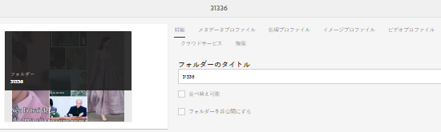
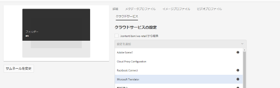

# 多言語のアセット {#multilingual-assets}

多言語アセットとは、複数の言語のバイナリ、メタデータ、タグを含むアセットです。通常、アセットのバイナリ、メタデータ、タグに使用される言語は 1 つですが、多言語プロジェクト用に他の言語へと翻訳されます。Adobe Experience Manager (AEM) Assets を使用して、アセット（バイナリ、メタデータ、タグを含む）に対する翻訳ワークフローを自動化し、多言語プロジェクトで使用するために他の言語のアセットを生成できます。

翻訳ワークフローを自動化するには、翻訳サービスプロバイダーと AEM とを統合して、アセットを複数の言語に翻訳するためのプロジェクトを作成します。AEM では人間による翻訳と機械翻訳のワークフローがサポートされます。

人間による翻訳：翻訳済みアセットが返され、AEM に読み込まれます。翻訳プロバイダーと AEM を連携すると、AEM と翻訳プロバイダーとの間でアセットが自動的に送信されます。

機械翻訳：機械翻訳サービスでは、アセットのメタデータとタグがすぐに翻訳されます。

<!--
We have multiple articles around translation of assets. For now, dumping all content in this article to remove others and create only ONE UBER article.

https://docs.adobe.com/content/help/en/experience-manager-65/assets/managing/translation-projects.html
https://docs.adobe.com/content/help/en/experience-manager-65/assets/managing/preparing-assets-for-translation.html
[Apply translation cloud services to folders](https://docs.adobe.com/content/help/en/experience-manager-65/assets/managing/transition-cloud-services.html)

One of these articles is a copy of [Preparing Content for Translation](https://docs.adobe.com/content/help/en/experience-manager-65/administering/introduction/tc-prep.html

-->

<!-- 
Translating assets includes the following:

1. [Connecting AEM with the translation service provider](/help/sites-administering/tc-tic.md#connecting-to-a-translation-service-provider)
1. [Creating translation integration framework configurations](/help/sites-administering/tc-tic.md)
1. [Preparing assets for translation](prepare-assets-for-translation.md)
1. [Applying translation cloud services to folders](transition-cloud-services.md)
1. [Create translation projects](translation-projects.md)

If your translation service provider does not provide a connector to integrate with AEM, use an [alternative process](/help/sites-administering/tc-manage.md#exporting-a-translation-job).

Also see, [Creating translation projects for content fragments](creating-translation-projects-for-content-fragments.md).

-->

## 翻訳するアセットの準備 {#prepare-assets-for-translation}

多言語アセットとは、複数の言語のバイナリ、メタデータ、タグを含むアセットです。通常、アセットのバイナリ、メタデータ、タグに使用される言語は 1 つですが、多言語プロジェクト用に他の言語へと翻訳されます。

Adobe Experience Manager (AEM) Assets では、多言語アセットはフォルダーに含まれ、各フォルダーに異なる言語のアセットが格納されます。

各言語のフォルダーは言語コピーと呼ばれます。言語コピーのルートフォルダー（言語ルート）が、言語コピー内のコンテンツの言語を識別します。例えば、`/content/dam/it` はイタリア語の言語コピー用のイタリア語言語ルートです。ソースアセットの翻訳の実行時に適切な言語がターゲットになるように、言語コピーは、[正しく設定された言語ルート](#create-a-language-root)を使用する必要があります。

最初にアセットを追加した言語コピーが言語プライマリです。言語プライマリは、他の言語に翻訳されるソースです。サンプルフォルダー階層にはいくつかの言語ルートが含まれています。

```shell
/content
    /- dam
        |- en
        |- fr
        |- de
        |- es
        |- it
        |- ja
        |- zh
```

翻訳するアセットを準備するには、次の手順を実行します。

1. 言語プライマリの言語ルートを作成します。例えば、サンプルフォルダー階層の英語言語コピーの言語ルートは `/content/dam/en` です。[言語ルートの作成](#create-a-language-root)に記載の情報に従って言語ルートが正しく設定されていることを確認してください。

1. 言語プライマリにアセットを追加します。
1. 言語コピーが必要な各ターゲット言語の言語ルートを作成します。

### 言語ルートの作成 {#create-a-language-root}

言語ルートを作成するには、フォルダーを作成し、「名前」プロパティの値として ISO 言語コードを使用します。言語ルートを作成したら、言語ルート内の任意のレベルに言語コピーを作成できます。

例えば、サンプル階層のイタリア語言語コピーのルートページの「名前」プロパティは `it` になります。「名前」プロパティは、リポジトリ内の asset ノードの名前として使用されます。そのため、このプロパティによってアセットのパスが指定されます（*&lt;server>:&lt;port>/assets.html/content/dam/it/*）

1. アセットコンソールで「**[!UICONTROL 作成]**」をクリックまたはタップし、メニューから「**[!UICONTROL フォルダー]**」を選択します。
1. 「名前」フィールドに、`<language-code>` の形式で国コードを入力します。
1. 「**[!UICONTROL 作成]**」をクリックまたはタップします。アセットコンソール内に言語ルートが作成されます。

### 言語ルートの表示 {#view-language-roots}

タッチ対応 UI には参照パネルがあります。このパネルには、AEM Assets 内で作成された言語ルートのリストが表示されます。

1. アセットコンソールで、言語コピーを作成する言語プライマリを選択します。
1. グローバルナビゲーションアイコンをクリックまたはタップして、「**[!UICONTROL 参照]**」を選択して参照パネルを開きます。
1. 参照パネルで、「**[!UICONTROL 言語コピー]**」をクリックまたはタップします。アセットの言語コピーが言語コピーパネルに表示されます。

### 新しい翻訳プロジェクトを作成 {#create-a-new-translation-project}

このオプションを使用すると、翻訳されるアセットは、翻訳先言語の言語ルートにコピーされます。選択するオプションによって異なりますが、アセットに対応する翻訳プロジェクトがプロジェクトコンソールで作成されます。設定によっては、翻訳プロジェクトを手動で開始することも、翻訳プロジェクトの作成後すぐに自動的に実行することもできます。

1. Assets UI で、言語コピーを作成しようとするソースフォルダーを選択します。
1. **[!UICONTROL 参照]**&#x200B;パネルを開き、「**[!UICONTROL コピー]**」の下の「**[!UICONTROL 言語コピー]**」をクリックまたはタップします。
1. 一番下の「**[!UICONTROL 作成と翻訳]**」をクリックまたはタップします。
1. 「**[!UICONTROL ターゲット言語]**」リストで、フォルダー構造を作成しようとしている言語を選択します。
1. 「**[!UICONTROL プロジェクト]**」リストで「**[!UICONTROL 新しい翻訳プロジェクトを作成]**」を選択します。
1. 「**[!UICONTROL プロジェクトタイトル]**」フィールドに、プロジェクトのタイトルを入力します。
1. 「**[!UICONTROL 作成]**」をクリックまたはタップします。ソースフォルダーのアセットが、手順 4 で選択したロケールのターゲットフォルダーにコピーされます。
1. そのフォルダーに移動するには、言語コピーを選択してから「**[!UICONTROL アセットで表示]**」をクリックします。
1. プロジェクトコンソールに移動します。翻訳フォルダーはプロジェクトコンソールにコピーされます。
1. フォルダーを開くと翻訳プロジェクトが表示されます。
1. プロジェクトをクリックまたはタップして詳細ページを開きます。
1. 翻訳ジョブのステータスを表示するには、「**[!UICONTROL 翻訳ジョブ]**」タイルの一番下にある省略記号をクリックします。<!-- For more details around job statuses, see [Monitoring the Status of a Translation Job](/help/sites-administering/tc-manage.md#monitoring-the-status-of-a-translation-job). -->
1. Assets ユーザーインターフェイスで、翻訳されたアセットごとにプロパティページを開いて、翻訳されたメタデータを表示します。

>[!NOTE]
>
>この機能は、アセットに対してもフォルダーに対しても使用できます。フォルダーではなくアセットを選択すると、そのアセットの言語コピーを作成するために、言語ルートまでのフォルダーの階層全体がコピーされます。

### 既存の翻訳プロジェクトへの追加 {#add-to-existing-translation-project}

このオプションを使用すると、前の翻訳ワークフローの実行後にユーザーがソースフォルダーに追加したアセットに対して、翻訳ワークフローが実行されます。新しく追加されたアセットのみが、既に翻訳済みのアセットを含むターゲットフォルダーにコピーされます。この場合、新しい翻訳プロジェクトは作成されません。

1. Assets UI で、翻訳されていないアセットを含むソースフォルダーに移動します。
1. 翻訳するアセットを選択して、**[!UICONTROL 参照パネル]**&#x200B;を開きます。「**[!UICONTROL 言語コピー]**」セクションに、現在使用可能な翻訳コピーの数が表示されます。
1. 「**[!UICONTROL コピー]**」の下の「**[!UICONTROL 言語コピー]**」をクリックまたはタップします。使用可能な翻訳コピーのリストが表示されます。
1. 一番下の「**[!UICONTROL 作成と翻訳]**」をクリックまたはタップします。
1. 「**[!UICONTROL ターゲット言語]**」リストで、フォルダー構造を作成しようとしている言語を選択します。
1. 「**[!UICONTROL プロジェクト]**」リストで「**[!UICONTROL 既存の翻訳プロジェクトに追加]**」を選択して、翻訳ワークフローをフォルダーに対して実行します。
   >[!NOTE]
   >
   >「**[!UICONTROL 既存の翻訳プロジェクトに追加]**」オプションを選択すると、プロジェクトの設定が既存のプロジェクトの設定と完全に一致する場合にのみ、翻訳プロジェクトが既存のプロジェクトに追加されます。それ以外の場合は、新しいプロジェクトが作成されます。
1. 「**[!UICONTROL 既存の翻訳プロジェクト]**」リストで、翻訳のためのアセットを追加するプロジェクトを選択します。
1. 「**[!UICONTROL 作成]**」をクリックまたはタップします。翻訳されるアセットがターゲットフォルダーに追加されます。更新されたフォルダーが、「**[!UICONTROL 言語コピー]**」セクションに表示されます。
1. プロジェクトコンソールに移動し、追加先の既存の翻訳プロジェクトを開きます。
1. 翻訳プロジェクトをクリックまたはタップして、プロジェクトの詳細ページを表示します。
1. 「**翻訳ジョブ**」タイルの一番下にある省略記号をクリックまたはタップして、翻訳ワークフローのアセットを表示します。翻訳ジョブリストには、アセットのメタデータとタグのエントリも表示されます。これらのエントリは、アセットのメタデータとタグも翻訳されることを意味します。

   >[!NOTE]
   >
   >* タグまたはメタデータのエントリを削除した場合は、どのアセットのタグまたはメタデータも翻訳されません。
   >* 機械翻訳を使用する場合は、アセットのバイナリは翻訳されません。
   >* 翻訳ジョブに追加したアセットがサブアセットを含んでいる場合は、問題を避けるために、サブアセットを選択して翻訳から除外してください。


1. アセットの翻訳を開始するには、「**[!UICONTROL 翻訳ジョブ]**」タイルの矢印をクリックまたはタップし、リストから「**[!UICONTROL 開始]**」を選択します。翻訳ジョブの開始を通知するメッセージが表示されます。
1. 翻訳ジョブのステータスを表示するには、「**[!UICONTROL 翻訳ジョブ]**」タイルの一番下の省略記号をクリックまたはタップします。<!-- For more details, see [Monitoring the Status of a Translation Job](/help/sites-administering/tc-manage.md#monitoring-the-status-of-a-translation-job). -->
1. 翻訳が完了すると、ステータスが「レビューへの準備完了」に変更されます。Assets UI に移動し、翻訳済みアセットそれぞれのプロパティページを開き、翻訳されたメタデータを表示します。

### 言語コピーを更新 {#update-language-copies}

このワークフローを実行すると、追加のアセットのセットが翻訳され、特定のロケールの言語コピーに含められます。この場合、翻訳されたアセットが追加されるターゲットフォルダーには翻訳済みのアセットが既に含まれています。オプションの選択に応じて、翻訳プロジェクトが作成されるか、既存の翻訳プロジェクトが新しいアセットを含むように更新されます。「言語コピーを更新」ワークフローには次のオプションがあります。

* 新しい翻訳プロジェクトを作成
* 既存の翻訳プロジェクトに追加

### 既存の翻訳プロジェクトに追加 {#add-to-existing-translation-project-1}

このオプションを使用すると、アセットのセットが既存の翻訳プロジェクトに追加され、選択したロケールの言語コピーが更新されます。

1. Assets UI で、アセットフォルダーを追加したソースフォルダーを選択します。
1. **[!UICONTROL 参照]**&#x200B;パネルを開き、「**[!UICONTROL コピー]**」の下の「**[!UICONTROL 言語コピー]**」をクリックまたはタップして、言語コピーのリストを表示します。
1. 「**[!UICONTROL 言語コピー]**」の前のチェックボックスをオンにします。これによりすべての言語コピーが選択されます。翻訳先のロケールに対応する言語コピーを除き、他のコピーの選択を解除します。
1. 下部の「**[!UICONTROL 言語コピーを更新]**」をクリックまたはタップします。
1. 「**[!UICONTROL プロジェクト]**」リストで「**[!UICONTROL 既存の翻訳プロジェクトに追加]**」を選択します。
1. 「**[!UICONTROL 既存の翻訳プロジェクト]**」リストで、翻訳のためのアセットを追加するプロジェクトを選択します。
1. 「**[!UICONTROL 開始]**」をクリックまたはタップします。
1. [既存の翻訳プロジェクトに追加](#add-to-existing-translation-project)の手順 9～14 を参照して、この手順の続きを完了させます。

### 一時的な言語コピーの作成 {#creating-temporary-language-copies}

翻訳ワークフローを実行して、元のアセットを編集したバージョンで言語コピーを更新するとき、翻訳済みアセットをユーザーが承認するまで、既存の言語コピーが維持されます。AEM Assets は、新たに翻訳されたアセットを一時的な場所に格納しておき、ユーザーがアセットを明示的に承認した後で既存の言語コピーを更新します。ユーザーがアセットを承認しないと、言語コピーは変更されません。

1. 言語コピーを既に作成した「**[!UICONTROL 言語コピー]**」の下のソースルートフォルダーをクリックまたはタップしてから、「**[!UICONTROL アセットで表示]**」をクリックまたはタップしてフォルダーを AEM Assets で開きます。
1. Assets UI で、既に翻訳したアセットを選択し、ツールバーの「**[!UICONTROL 編集]**」アイコンをクリックまたはタップしてアセットを編集モードで開きます。
1. アセットを編集して、変更内容を保存します。
1. [既存の翻訳プロジェクトに追加](#add-to-existing-translation-project)の手順 2～14 を実行して、言語コピーを更新します。
1. 「**[!UICONTROL 翻訳ジョブ]**」タイルの一番下にある省略記号をクリックまたはタップします。**[!UICONTROL 翻訳ジョブ]**&#x200B;ページのアセットのリストで、翻訳済みバージョンのアセットが格納されている一時的な場所を確認できます。
1. 「**[!UICONTROL タイトル]**」の横にあるチェックボックスをオンにします。
1. ツールバーの「**[!UICONTROL 翻訳を承認]**」をクリックまたはタップし、ダイアログの「**[!UICONTROL 確定]**」をクリックまたはタップすると、ターゲットフォルダー内の翻訳済みアセットが、編集されたアセットの翻訳済みバージョンで上書きされます。

   >[!NOTE]
   >
   >翻訳ワークフローが対象のアセットを更新できるようにするには、アセットとメタデータの両方を承認します。

   「**[!UICONTROL 翻訳を拒否]**」をクリックまたはタップすると、ターゲットロケールルートにあるアセットの最初の翻訳バージョンが保持され、編集されたバージョンは拒否されます。

1. アセットコンソールに移動し、翻訳済みアセットそれぞれのプロパティページを開き、翻訳されたメタデータを表示します。

アセットのメタデータを効率よく翻訳するためのヒントは、[メタデータを効率よく翻訳するための 5 つの手順（英語）](https://blogs.adobe.com/experiencedelivers/experience-management/translate_aemassets_metadata/)を参照してください。

## 翻訳プロジェクトの作成 {#creating-translation-projects}

言語コピーを作成するには、Assets UI の参照パネルに表示される以下の言語コピーワークフローのいずれかを実行します。

**作成と翻訳**

このワークフローでは、翻訳されるアセットは、翻訳先言語の言語ルートにコピーされます。また、選択するオプションによって異なりますが、アセットに対応する翻訳プロジェクトがプロジェクトコンソールで作成されます。設定によっては、翻訳プロジェクトを手動で開始することも、翻訳プロジェクトの作成後すぐに自動的に実行することもできます。

**言語コピーを更新**

このワークフローを実行すると、追加のアセットグループが翻訳され、特定のロケールの言語コピーに含められます。この場合、翻訳されたアセットが追加されるターゲットフォルダーには翻訳済みのアセットが既に含まれています。

>[!NOTE]
>
>アセットバイナリは、翻訳サービスプロバイダーがバイナリの翻訳をサポートしている場合にのみ翻訳されます。

>[!NOTE]
>
>PDF ファイルや Adobe InDesign ファイルなど複雑なアセットの翻訳ワークフローを起動しても、サブアセットまたはレンディション（ある場合）は翻訳のために送信されません。

### 作成と翻訳ワークフロー {#create-and-translate-workflow}

最初は、作成と翻訳ワークフローを使用して、特定の言語の言語コピーを生成します。ワークフローには次のオプションがあります。

* 構造のみを作成
* 新しい翻訳プロジェクトを作成
* 既存の翻訳プロジェクトに追加

### 構造のみを作成 {#create-structure-only}

「**構造のみを作成**」オプションを使用して、ソース言語ルート内のソースフォルダーの階層と一致するように、ターゲット言語ルート内にターゲットフォルダー階層を作成します。この場合、ソースアセットが宛先フォルダーにコピーされます。ただし、翻訳プロジェクトは生成されません。

1. Assets UI で、ターゲット言語ルート内に構造を作成するソースフォルダーを選択します。
1. **[!UICONTROL 参照]**&#x200B;パネルを開き、「**[!UICONTROL コピー]**」の下の「**[!UICONTROL 言語コピー]**」をクリックまたはタップします。
1. 一番下の「**[!UICONTROL 作成と翻訳]**」をクリックまたはタップします。
1. 「**[!UICONTROL ターゲット言語]**」リストで、フォルダー構造を作成しようとしている言語を選択します。
1. 「**[!UICONTROL プロジェクト]**」リストで「**[!UICONTROL 構造のみを作成]**」を選択します。
1. 「**[!UICONTROL 作成]**」をクリックまたはタップします。ターゲット言語の新しい構造が、「**[!UICONTROL 言語コピー]**」の下に表示されます。
1. このリストで構造をクリックまたはタップしてから、「**[!UICONTROL アセットで表示]**」をクリックまたはタップしてターゲット言語内のフォルダー構造に移動します。

## フォルダーへの翻訳クラウドサービスの適用 {#applying-translation-cloud-services-to-folders}

Adobe Experience Manager（AEM）では、選択した翻訳プロバイダーのクラウドベースの翻訳サービスを利用して、確実に要件に基づいてアセットを翻訳できます。

翻訳クラウドサービスをアセットフォルダーに直接適用できるので、翻訳ワークフローの間もずっとアセットを利用できます。

### 翻訳サービスの適用 {#applying-the-translation-services}

翻訳クラウドサービスをアセットフォルダーに直接適用すると、翻訳ワークフローの作成または変更時に翻訳サービスを設定する必要がなくなります。

1. Assets ユーザーインターフェイスから翻訳サービスを適用するフォルダーを選択します。
1. ツールバーの「**[!UICONTROL プロパティ]**」アイコンをクリックまたはタップして、**[!UICONTROL フォルダーのプロパティ]**&#x200B;ページを表示します。

   

1. 「**[!UICONTROL クラウドサービス]**」タブに移動します。
1. 「クラウドサービスの設定」リストから目的の翻訳プロバイダーを選択します。例えば、Microsoft の翻訳サービスを利用する場合は、「**[!UICONTROL Microsoft Translator]**」を選択します。

   

1. 翻訳プロバイダーのコネクタを選択します。

   

1. ツールバーの「**[!UICONTROL 保存]**」をクリックまたはタップし、「**[!UICONTROL OK]**」をクリックしてダイアログを閉じます。翻訳サービスがフォルダーに適用されます。

### カスタム翻訳コネクタの適用 {#applying-custom-translation-connector}

翻訳ワークフローで使用する翻訳サービスにカスタムコネクタを適用する場合、カスタムコネクタを適用するには、まずパッケージマネージャーからコネクタをインストールします。次に、クラウドサービスコンソールからコネクタを設定します。コネクタを設定すると、[翻訳サービスの適用](#applying-the-translation-services)で説明されている「クラウドサービス」タブのコネクタのリストに表示されるようになります。カスタムコネクタを適用し、翻訳ワークフローを実行すると、翻訳プロジェクトの「**[!UICONTROL 翻訳の概要]**」タイルの「**[!UICONTROL プロバイダー]**」と「**[!UICONTROL メソッド]**」という見出しの下にコネクタの詳細が表示されます。

1. パッケージマネージャーからコネクタをインストールします。
1. AEM のロゴをクリックまたはタップし、**[!UICONTROL ツール／デプロイメント／クラウドサービス]**&#x200B;に移動します。
1. インストールしたコネクタを&#x200B;**[!UICONTROL クラウドサービス]**&#x200B;ページの「**[!UICONTROL サードパーティのサービス]**」の下で探します。

   

1. 「**[!UICONTROL 今すぐ設定]**」リンクをクリックまたはタップして、**[!UICONTROL 設定を作成]**&#x200B;ダイアログを開きます。

   

1. コネクタのタイトルと名前を指定して、「**[!UICONTROL 作成]**」をクリックまたはタップします。[翻訳サービスの適用](#applying-the-translation-services)のステップ 5 で説明されている「**[!UICONTROL クラウドサービス]**」タブのコネクタリストにカスタムコネクタが表示されます。
1. カスタムコネクタを適用したら、翻訳プロジェクトの作成で説明されている翻訳ワークフローを実行します。**[!UICONTROL プロジェクト]**&#x200B;コンソールで、翻訳プロジェクトの「**[!UICONTROL 翻訳の概要]**」タイルに表示されているコネクタの詳細を確認します。

   
