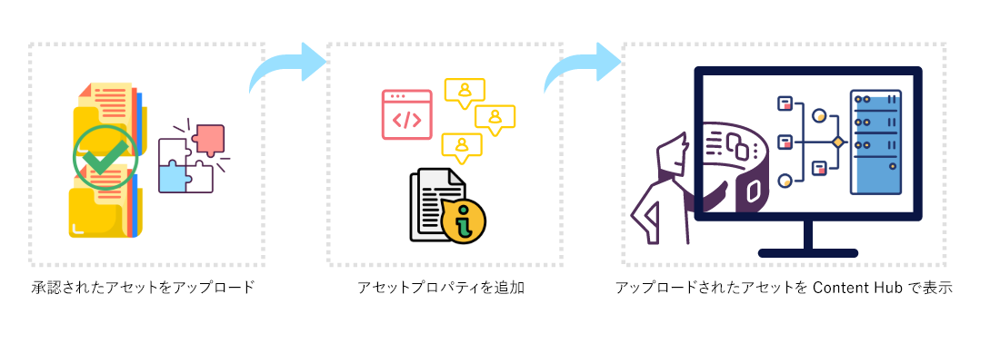
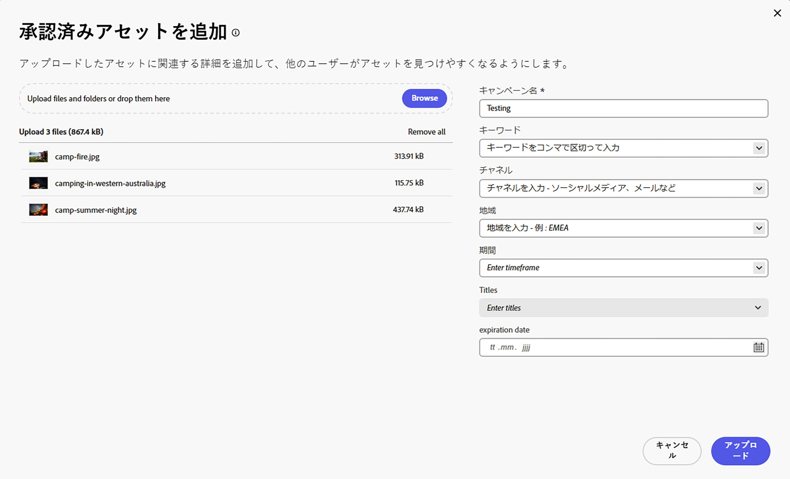

# コンテンツハブへのブランド承認済みアセットのアップロード {#upload-brand-approved-assets-content-hub}

>[!CONTEXTUALHELP]
>id="upload_assets_content_hub"
>title="コンテンツハブへのブランド承認済みアセットのアップロード"
>abstract="ローカルファイルシステムからコンテンツハブに承認済みアセットを追加するか、OneDrive データソースまたは Dropbox データソースからアセットを読み込みます。検索機能を強化するために、フォルダー構造に関係なく、すべてのアセットがコンテンツハブの最上位に表示されます。"

[アセットを追加する権限を持つコンテンツハブユーザー](/help/assets/deploy-content-hub.md#onboard-content-hub-users-add-assets)は、ローカルファイルシステムからコンテンツハブにアセットを追加することや、OneDrive または Dropbox データソースからアセットを読み込むことができます。検索機能を強化するのに、ローカルファイルシステムまたは OneDrive および Dropbox データソースで使用可能なフォルダー構造に関係なく、すべてのアセットがコンテンツハブの上位レベルに表示されます。

>[!VIDEO](https://video.tv.adobe.com/v/3445376/?captions=jpn&learn=on){transcript=true}

Assets as a Cloud Service で `Approved` としてマークされたアセットは、コンテンツハブで自動的に使用できます。詳しくは、[コンテンツハブ向けアセットの承認](/help/assets/approve-assets-content-hub.md)を参照してください。

アセット検索をさらに強化するには、コンテンツハブでは次の操作を実行できます。

* キャンペーン名、キーワード、チャネルなど、アセットのアップロードに関連する重要な詳細を定義します。

* アップロードが成功すると、ファイルサイズ、形式、解像度、その他のプロパティなど、各アセットのその他のプロパティが自動的に生成されます。

* [Adobe AI](https://business.adobe.com/ai/adobe-genai.html) が提供する人工知能を使用して、アップロードされたすべてのアセットに適切なタグを自動的に適用します。 スマートタグという適切な名前が付けられたこれらのタグを使用すると、関連性の高いアセットをすばやく見つけるうえで役に立つので、プロジェクトのコンテンツベロシティ（コンテンツ創出の速度）が向上します。

[コンテンツハブにブランド承認済みアセット](/help/assets/approve-assets.md)のみをアップロードすることを確認します。

## 前提条件 {#prerequisites-add-assets}

[アセットを追加する権限を持つコンテンツハブユーザー](/help/assets/deploy-content-hub.md#onboard-content-hub-users-add-assets)は、コンテンツハブにアセットをアップロードできます。

## ローカルファイルシステムからコンテンツハブへのアセットの追加 {#add-assets-local-file-system}

コンテンツハブにアセットを追加するには、次の手順を実行します。

1. 「**[!UICONTROL アセットを追加]**」をクリックし、アップロードを作成できる&#x200B;**[!UICONTROL 承認済みアセットを追加]**&#x200B;ダイアログボックスを表示します。

1. 右側のパネルにある「**[!UICONTROL ここにファイルまたはフォルダーをドラッグ]**」セクションでは、ローカルファイルシステムからアセットをドラッグするか、「**[!UICONTROL 参照]**」をクリックしてローカルファイルシステムで使用可能なファイルまたはフォルダーを手動で選択できます。アップロードに含まれるファイルのリストは、リストとして使用できます。

   また、サムネールを使用して選択した画像をプレビューし、X アイコンをクリックして、リストから特定の画像を削除することもできます。X アイコンは、画像名またはサイズの上にマウスポインタを合わせた際にのみ表示されます。また、「**[!UICONTROL すべてを削除]**」をクリックして、アップロードリストからすべての項目を削除することもできます。

   アップロードプロセスを完了し、「**[!UICONTROL アップロード]**」ボタンを有効にするには、アセットをキャンペーン名でグループ化する必要があります。

   

1. 「**[!UICONTROL キャンペーン名]**」フィールドを使用して、アップロードの名前を定義します。既存の名前を使用するか、新しい名前を作成できます。コンテンツハブでは、名前を入力する際にさらに多くのオプションが提供されます。<!--You can define multiple Campaign names for your upload. While you are typing a name, either click anywhere else within the dialog box or press the `,` (Comma) key to register the name.-->

   ベストプラクティスとして、アドビでは、アップロードしたアセットの検索エクスペリエンスを強化すると共に、残りのフィールドに値を指定することをお勧めします。

1. 同様に、「**[!UICONTROL キーワード]**」、「**[!UICONTROL チャネル]**」、「**[!UICONTROL 期間]**」、「**[!UICONTROL 地域]**」の各フィールドの値を定義します。キーワード、チャネル、場所でアセットのタグ付けとグループ化を行うと、承認済みの会社のコンテンツを使用するすべてのユーザーがこれらのアセットを見つけて整理できるようになります。

1. 「**[!UICONTROL アップロード]**」をクリックして、コンテンツハブにアセットをアップロードします。[!UICONTROL レビューの詳細]確認ボックスが表示されます。「[!UICONTROL 続行]」をクリックします。

1. アセットのアップロードが開始されます。「[!UICONTROL 新規アップロード]」をクリックして、アップロード手順を再開します。「[!UICONTROL 完了]」をクリックして、アップロードを完了します。

また、管理者は、キャンペーン名、キーワード、チャネルなど、アセットのアップロード中に表示される必須フィールドとオプションフィールドを設定することもできます。詳しくは、[コンテンツハブユーザーインターフェイスの設定](configure-content-hub-ui-options.md#configure-upload-options-content-hub)を参照してください。

## コンテンツハブを使用してアップロードしたアセットの管理 {#manage-assets-uploaded-using-content-hub}

[アセットを追加する権限を持つコンテンツハブユーザー](/help/assets/deploy-content-hub.md#onboard-content-hub-users-add-assets)は、ローカルファイルシステムから[コンテンツハブにアセットを追加](/help/assets/upload-brand-approved-assets.md)することや、OneDrive または Dropbox データソースからアセットを読み込むことができます。検索機能を強化するのに、ローカルファイルシステムまたは OneDrive および Dropbox データソースで使用可能なフォルダー構造に関係なく、すべてのアセットがコンテンツハブの上位レベルに表示されます。

コンテンツハブを使用してアップロードしたアセットの表示は、[自動承認切替スイッチを有効](/help/assets/configure-content-hub-ui-options.md#configure-import-options-content-hub)にしているかどうかによって異なります。

* **[!UICONTROL 自動承認]**&#x200B;切替スイッチが有効になっている場合、コンテンツハブを使用してアップロードしたアセットは自動的に使用できます。

* **[!UICONTROL 自動承認]**&#x200B;切替スイッチが無効になっている場合、コンテンツハブを使用してアップロードしたアセットは自動的に表示されません。アセットは、Assets as a Cloud Service 環境の `hydrated-assets` フォルダーで使用できます。フォルダーに移動し、これらのアセットのステータスを[一括編集](#bulk-approve-assets-content-hub)して `Approved` にすると、これらのアセットがコンテンツハブに表示されます。

## よくある質問 {#faqs-content-hub-upload-assets}

### Content Hubには、どのような種類のアセットをどこからアップロードできますか？ {#asset-types-upload-to-content-hub}

アセットを追加する権限を持つContent Hub ユーザーは、ブランド承認済みアセットをローカルファイルシステムからアップロードできます。 アップロードされたすべてのアセットは、元のフォルダー構造に関係なく、Content Hubの最上位に表示され、検索機能が強化されます。

### Content Hubはアセットの検索と整理をどのように強化しますか？ {#search-content-hub}

Content Hubでは、キャンペーン名、キーワード、チャネル、期間、地域など、アップロードごとに主要な詳細を定義できるので、アセットの検索と整理が強化されます。 また、各アセットの追加のプロパティ（ファイルサイズ、形式、解像度など）が自動的に生成され、Adobe AIを使用してスマートタグが適用されるので、関連するアセットをより簡単かつ迅速に見つけることができます。

### ローカルファイルシステムからContent Hubにアセットをアップロードする方法 {#upload-assets-content-hub}

ローカルファイルシステムからアセットをアップロードするには、「**Assetsを追加**」をクリックしてアップロードダイアログを開きます。 ファイルまたはフォルダーをドラッグ&amp;ドロップするか、手動で参照して選択できます。 アセットはキャンペーン名の下にグループ化する必要があります。整理を改善するには、キーワード、チャネル、期間、地域など、他のフィールドに入力することをお勧めします。 準備が整ったら、「**アップロード** をクリックし、詳細を確認してアップロードを開始します。

### Content Hubでのアセット承認プロセスの仕組み {#asset-approval-content-hub}

自動承認の切り替えが有効になっている場合、Content Hubを使用してアップロードされたアセットは自動的に使用可能になります。 無効にした場合、アップロードされたアセットはAssets as a Cloud Serviceの **hydrated-assets** フォルダーに配置されるので、Content Hubに表示するには、そのステータスを手動で **承認済み** に一括編集する必要があります。

### アセットをContent Hubにアップロードする際に、必須フィールドまたはオプションフィールドを設定できますか？ {#available-fields-while-uploading-assets-to-content-hub}

管理者は、設定ユーザーインターフェイスを使用して、アセットをContent Hubにアップロードする際に必須またはオプションとなるフィールドを定義できます。

### アップロードしたアセットがContent Hubに自動的に表示されない場合は、どうすればよいですか？ {#assets-do-not-display-in-content-hub}

アセットが自動的に表示されない場合は、自動承認の切り替えが無効になっていることを意味します。 アセットは、Assets as a Cloud Service環境の **hydrated-assets** フォルダーに配置されます。 ユーザーのステータスを **承認済み** に一括編集して、Content Hubに表示できるようにする必要があります。

