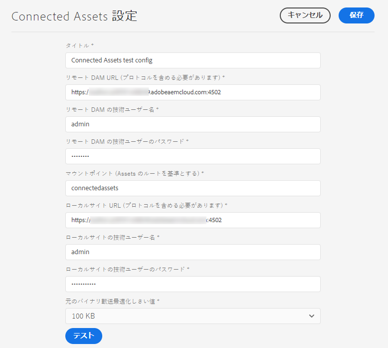
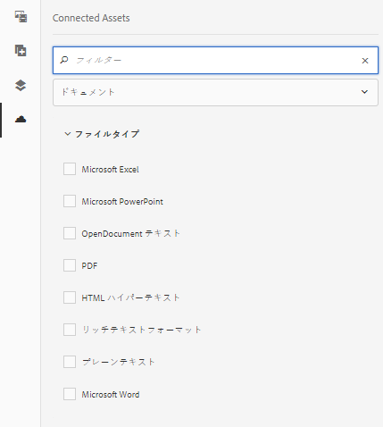
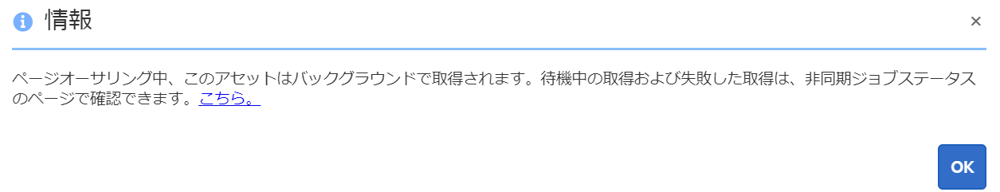

# Connected Assets を使用した [!DNL Experience Manager Sites] での DAM アセットの共有{#use-connected-assets-to-share-dam-assets-in-aem-sites}

大規模企業では、Web サイトの作成に必要なインフラストラクチャが分散していることがあります。Web サイト作成機能と、それらの Web サイトの作成に使用されたデジタルアセットが、別のデプロイメントに格納されている場合もあります。1 つの理由は、連携して動作する必要がある既存のデプロイメントを地理的に分散させることができます。もう 1 つの理由は、親会社が一緒に使用したい異種インフラストラクチャをもたらす買収です。

ユーザーは、[!DNL Experience Manager Sites] で Web ページを作成できます。[!DNL Experience Manager Assets] は、Web サイトに必要なアセットを提供するデジタルアセット管理（DAM）システムです。[!DNL Experience Manager] では、[!DNL Sites] と [!DNL Assets] の統合により、上記の使用事例をサポートできるようになりました。

## Connected Assets の概要 {#overview-of-connected-assets}

作成者は、[!UICONTROL ページエディター]でページを編集しながら、別の [!DNL Assets] デプロイメント上のアセットをシームレスに検索、参照および埋め込むことができます。管理者は、[!DNL Assets] の別の（リモートの）デプロイメントと、[!DNL Sites] のデプロイメントとの 1 回限りの統合を作成します。

[!DNL Sites] 作成者の場合、リモートアセットは読み取り専用のローカルアセットとして利用できます。この機能は、一度に少数のリモートアセットをシームレスに検索および使用できるようサポートします。多くのリモートアセットを [!DNL Sites] ローカルデプロイメントで一度に利用できるようにするには、リモートアセットを一括で移行することを検討します。

### 前提条件とサポートされているデプロイメント {#prerequisites}

この機能を使用または設定する前に、以下を確認してください。

* ユーザーは、各デプロイメントで適切なユーザーグループに属します。
* [!DNL Adobe Experience Manager] のデプロイメントタイプでは、サポートされている条件の 1 つが満たされます。[!DNL Experience Manager] 6.5 について詳しくは、[Experience Manager 6.5 Assets の Connected Assets 機能](https://docs.adobe.com/content/help/ja-JP/experience-manager-65/assets/using/use-assets-across-connected-assets-instances.translate.html)を参照してください。

   |  | [!DNL Sites] as a Cloud Service | AMS 上の [!DNL Experience Manager] 6.5 [!DNL Sites] | [!DNL Experience Manager] 6.5 [!DNL Sites] On-Premise |
   |---|---|---|---|
   | **[!DNL Experience Manager Assets]as a Cloud Service ** | サポート対象 | サポート対象 | サポート対象 |
   | AMS 上の **[!DNL Experience Manager]6.5[!DNL Assets]** | サポート対象 | サポート対象 | サポート対象 |
   | **[!DNL Experience Manager]6.5[!DNL Assets]On-Premise ** | サポートなし | サポートなし | サポートなし |

### サポートされているファイル形式 {#mimetypes}

作成者は、コンテンツファインダーで画像と次の種類のドキュメントを検索し、ページエディターで検索されたアセットを使用します。 ドキュメントがコンポーネントに追加され `Download` 、画像がコンポー `Image` ネントに追加されます。 Authors also add the remote assets in any custom [!DNL Experience Manager] component that extends the default `Download` or `Image` components. サポートされる形式は以下の通りです。

* **画像形式**：[画像コンポーネント](https://docs.adobe.com/content/help/ja-JP/experience-manager-core-components/using/components/image.html)がサポートする形式。[!DNL Dynamic Media] 画像はサポートされていません。
* **ドキュメント形式**: サ [ポートされるドキュメント形式を参照してください](file-format-support.md#document-formats)。

### 関連するユーザーとグループ {#users-and-groups-involved}

この機能の設定や使用に関係する様々な役割と対応するユーザーグループについて、以下で説明します。ローカルスコープは、作成者が Web ページを作成する場合に使用します。リモートスコープは、必要なアセットをホストしている DAM デプロイメントで使用されます。[!DNL Sites] 作成者は、これらのリモートアセットを取得します。

| 役割 | 対象範囲 | ユーザーグループ | 手順のユーザーネーム | 要件 |
|----------------------------------|--------|------------------------------------------------------------------------------|--------------------------|--------------------------------------------------------------------------------------------------------------------------------------------------------------------------------------------------------------------------------------------------------------|
| [!DNL Sites] administrator | ローカル | [!DNL Experience Manager] `administrators` | `admin` | [!DNL Experience Manager]を設定し、リモート [!DNL Assets] デプロイメントとの統合を設定します。 |
| DAM ユーザー | ローカル | `Authors` | `ksaner` | `/content/DAM/connectedassets/` の取得済みアセットを表示／複製するために使用されます。 |
| [!DNL Sites] 作成者 | ローカル | `Authors`（リモート DAM での読み取りアクセス権とローカル [!DNL Sites] での作成者アクセス権を持つ） | `ksaner` | エンドユーザーは、この統合を使用してコンテンツの速度を向上させる [!DNL Sites] 作成者です。作成者は、[!UICONTROL コンテンツファインダー]や、ローカル Web ページ内の必要な画像を使用して、リモート DAM 内のアセットを検索および閲覧します。`ksaner` DAM ユーザーの資格情報が使用されます。 |
| [!DNL Assets] administrator | リモート | [!DNL Experience Manager] `administrators` | リモート [!DNL Experience Manager] の `admin` | クロスオリジンリソース共有（CORS）を設定します。 |
| DAM ユーザー | リモート | `Authors` | リモート [!DNL Experience Manager] の `ksaner` | リモート [!DNL Experience Manager] デプロイメントでの作成者の役割。[!UICONTROL コンテンツファインダー]を使用して Connected Assets 内のアセットを検索／参照します。 |
| DAM ディストリビューター（テクニカルユーザー） | リモート | [!DNL Sites] `Authors` | リモート [!DNL Experience Manager] の `ksaner` | リモートデプロイメント上に存在するこのユーザーは、（[!DNL Sites] 作成者の役割ではなく）[!DNL Experience Manager] ローカルサーバーによって、[!DNL Sites] 作成者の代わりにリモートアセットを取得するために使用されます。この役割は、上の 2 つの `ksaner` の役割とは異なり、別のユーザーグループに属しています。 |

## [!DNL Sites] デプロイメントと [!DNL Assets] デプロイメント間の接続の設定 {#configure-a-connection-between-sites-and-assets-deployments}

[!DNL Experience Manager] 管理者はこの統合を作成できます。作成したIDを使用するために必要な権限は、ユーザーグループを介して確立されます。 ユーザーグループは、 [!DNL Sites] 配置およびDAM配置で定義されます。

To configure Connected Assets and local [!DNL Sites] connectivity, follow these steps:

1. 既存の [!DNL Sites] デプロイメントにアクセスするか、以下のコマンドを使用してデプロイメントを作成します。

   1. JAR ファイルのフォルダーで、ターミナルから次のコマンドを実行して各 [!DNL Experience Manager] サーバーを作成します。
      `java -XX:MaxPermSize=768m -Xmx4096m -jar <quickstart jar filepath> -r samplecontent -p 4502 -nofork -gui -nointeractive &`

   1. 数分後に [!DNL Experience Manager] サーバーが正常に起動します。この [!DNL Sites] デプロイメントを、Web ページオーサリング用のローカルマシン（`https://[local_sites]:4502`）と見なします。

1. ローカルスコープのユーザーと役割が、[!DNL Sites] デプロイメント上と AMS の [!DNL Assets] デプロイメント上に存在していることを確認します。[!DNL Assets] デプロイメント上でテクニカルユーザーを作成し、[関連するユーザーとグループ](/help/assets/use-assets-across-connected-assets-instances.md#users-and-groups-involved)で説明したユーザーグループに追加します。

1. `https://[local_sites]:4502` にあるローカルの [!DNL Sites] デプロイメントにアクセスします。**[!UICONTROL ツール]**／**[!UICONTROL Assets]**／**[!UICONTROL Connected Assets 設定]**&#x200B;をクリックし、次の値を入力します。

   1. [!DNL Assets] の場所は `https://[assets_servername_ams]:[port]` です。
   1. DAM ディストリビューター（テクニカルユーザー）の資格情報。
   1. In the **[!UICONTROL Mount Point]** field, enter the local [!DNL Experience Manager] path where [!DNL Experience Manager] fetches the assets. 例：`remoteassets` フォルダー。

   1. 「**[!UICONTROL オリジナルバイナリ転送の最適化しきい値]**」の値をネットワークに応じて調整します。このしきい値より大きいサイズのアセットレンディションは、非同期で転送されます。
   1. データストアを使用してアセットを保存し、データストアが両方の デプロイメント間に共通のストレージである場合は、「**[!UICONTROL Connected Assets と共有されるデータストア]**」を選択します。この場合、実際のアセットバイナリはデータストアに存在し、転送されないため、しきい値の制限は重要ではありません。

   

   *図：Connected Assets の典型的な設定.*

1. アセットは既に処理され、レンディションが取得されたので、ワークフローランチャーを無効にします。ローカル（[!DNL Sites]）デプロイメントのランチャー設定を調整し、リモートアセットが取得される `connectedassets` フォルダーを除外するようにします。

   1. [!DNL Sites] デプロイメントで、**[!UICONTROL ツール]**／**[!UICONTROL ワークフロー]**／**[!UICONTROL ランチャー]**&#x200B;をクリックします。

   1. **[!UICONTROL DAM アセットの更新]**&#x200B;および **[!UICONTROL DAM メタデータの書き戻し]**&#x200B;ワークフローを含むランチャーを検索します。

   1. ワークフローランチャーを選択し、アクションバーの「**[!UICONTROL プロパティ]**」をクリックします。

   1. [!UICONTROL プロパティ]ウィザードで、「**[!UICONTROL パス]**」フィールドを次のマッピングに従って変更し、マウントポイント **[!UICONTROL connectedassets]** が除外されるように正規表現を更新します。

   | 前 | 後 |
   | ------------------------------------------------------- | -------------------------------------------------------------------------- |
   | `/content/dam(/((?!/subassets).)*/)renditions/original` | `/content/dam(/((?!/subassets)(?!connectedassets).)*/)renditions/original` |
   | `/content/dam(/.*/)renditions/original` | `/content/dam(/((?!connectedassets).)*/)renditions/original` |
   | `/content/dam(/.*)/jcr:content/metadata` | `/content/dam(/((?!connectedassets).)*/)jcr:content/metadata` |

   >[!NOTE]
   >
   >作成者がアセットを取得する際、リモート デプロイメントで使用可能なすべてのレンディションが取得されます。取得したアセットのレンディションをさらに作成したい場合は、この設定手順をスキップしてください。[!UICONTROL DAM アセットの更新]ワークフローが開始され、追加のレンディションが作成されます。これらのレンディションは、ローカルの [!DNL Sites] デプロイメントでのみ使用でき、リモート DAM デプロイメントでは使用できません。

1. Add the [!DNL Sites] deployment as one of the **[!UICONTROL Allowed Origins]** on the remote [!DNL Assets'] CORS configuration.

   1. 管理者の資格情報を使用してログインします。`Cross-Origin` を検索。**[!UICONTROL ツール]**／**[!UICONTROL 操作]**／**[!UICONTROL Web コンソール]**&#x200B;にアクセスします。

   1. To create a CORS configuration for [!DNL Sites] deployment, click add option  next to **[!UICONTROL Adobe Granite Cross-Origin Resource Sharing Policy]**.

   1. フィールド「**[!UICONTROL 許可されたオリジン]**」にローカル [!DNL Sites] の URL、つまり `https://[local_sites]:[port]` を入力します。設定を保存します。

## リモートアセットの使用 {#use-remote-assets}

Webサイト作成者は、コンテンツファインダーを使用してDAM展開に接続します。 Web サイト作成者は、コンポーネント内のリモートアセットを参照、検索、ドラッグできます。リモート DAM への認証をおこなえるよう、管理者から提供された DAM ユーザーの資格情報を手元に用意してください。

作成者は、ローカルDAMおよびリモートDAM展開で使用可能なアセットを、単一のWebページで使用できます。 コンテンツファインダーを使用すれば、ローカル DAM の検索とリモート DAM の検索を切り替えることができます。

Only those tags of remote assets are fetched that have an exact corresponding tag along with the same taxonomy hierarchy, available on the local [!DNL Sites] deployment. その他のタグは破棄されます。作成者は、全文検索が提供されるので、リモート [!DNL Experience Manager] デプロイメントに存在するすべてのタグを使用して、リモートアセットを検索できます。

### 使用手順 {#walk-through-of-usage}

上記のセットアップを使用してオーサリングエクスペリエンスを試し、機能を理解してください。リモート DAM デプロイメントで、選択したドキュメントまたは画像を使用します。

1. リモートデプロイメントの [!DNL Assets] インターフェイスに移動するには、[!DNL Experience Manager] Workspace から **[!UICONTROL Assets]**／**[!UICONTROL ファイル]**&#x200B;にアクセスします。または、ブラウザーで `https://[assets_servername_ams]:[port]/assets.html/content/dam` にアクセスします。選択したアセットをアップロードします。
1. On the [!DNL Sites] deployment, in the profile activator in the upper-right corner, click **[!UICONTROL Impersonate as]**. ユーザー名として `ksaner` を入力し、提供されたオプションを選択し、「**[!UICONTROL OK]**」をクリックします。
1. **[!UICONTROL Sites]**／**[!UICONTROL We.Retail]**／**[!UICONTROL us]**／**[!UICONTROL en]** で、We.Retail Web サイトページを開きます。ページを編集します。または、ブラウザーで `https://[aem_server]:[port]/editor.html/content/we-retail/us/en/men.html` にアクセスしてページを編集します。

   ページの左上隅にある「**[!UICONTROL サイドパネルを切り替え]**」をクリックします。

1. 「[!UICONTROL Assets]」タブを開き、「**[!UICONTROL Connected Assets へのログイン]**」をクリックします。
1. 資格情報（ユーザー名：`ksaner`、パスワード：`password`）を入力します。このユーザーには、両方の [!DNL Experience Manager] デプロイメントのオーサリング権限があります。
1. DAM に追加したアセットを検索します。リモートアセットは左側のパネルに表示されます。画像またはドキュメントでフィルタリングしてから、サポートされているドキュメントのタイプでさらにフィルタリングします。`Image` コンポーネント上の画像と `Download` コンポーネント上のドキュメントをドラッグします。

   ローカル [!DNL Sites] デプロイメントでは、取得されたアセットは読み取り専用です。[!DNL Sites] コンポーネントが提供するオプションを使用して、取得したアセットを編集できます。コンポーネントによる編集は非破壊的です。

   

   *図：リモート DAM でアセットを検索するときにドキュメントタイプと画像をフィルタリングするオプション.*

1. アセットが非同期で取得され、取得タスクが失敗した場合、サイト作成者に通知されます。オーサリング中またはオーサリング後でも、作成者は[非同期ジョブ](/help/operations/asynchronous-jobs.md)ユーザーインターフェースで取得タスクやエラーについての詳細情報を確認できます。

   

   *図：バックグラウンドで発生するアセットの非同期取得に関する通知。*

1. When publishing a page, [!DNL Experience Manager] displays a complete list of assets that are used on the page. 公開時にリモートアセットが正常に取得されることを確認します。取得した各アセットのステータスを確認するには、[非同期ジョブ](/help/operations/asynchronous-jobs.md)ユーザーインターフェースをご覧ください。

   >[!NOTE]
   >
   >1 つ以上のリモートアセットが取得されない場合でも、ページは公開されます。リモートアセットを使用するコンポーネントは空で公開されます。[!DNL Experience Manager] 通知領域では、非同期ジョブページに表示されるエラーの通知を確認できます。

>[!CAUTION]
>
>Once used in a web page, the fetched remote assets are searchable and usable by anyone who has permissions to access the local folder. The fetched assets are stored (`connectedassets` in the above walk-through). これらのアセットは、ローカルリポジトリでも[!UICONTROL コンテンツファインダー]経由で検索および表示できます。

取得されたアセットは他のローカルアセットと同じように使用できます。ただし、関連するメタデータは編集できません。

## 制限事項 {#limitations}

### 権限とアセット管理 {#permissions-and-managing-assets}

* ローカルアセットは、リモートデプロイメントの元のアセットと同期されません。DAM デプロイメント上での編集、削除または権限の失効は、ローカル側には一切伝播されません。
* ローカルアセットは読み取り専用のコピーです。[!DNL Experience Manager] コンポーネントは、アセットに対して非破壊編集をおこないます。その他のいかなる編集もできません。
* ローカルで取得されたアセットは、オーサリング用途でのみ使用できます。アセット更新ワークフローの適用やメタデータの編集はおこなえません。
* 画像とリストに表示されるドキュメント形式のみがサポートされます。[!DNL Dynamic Media]、アセット、コンテンツフラグメントおよびエクスペリエンスフラグメントはサポートされません。
* メタデータスキーマは取得されません。
* All [!DNL Sites] authors have read permissions on the fetched copies, even if authors cannot access the remote DAM deployment.
* 統合をカスタマイズするための API サポートはありません。
* この機能は、リモートアセットのシームレスな検索および使用をサポートします。多くのリモートアセットをローカルデプロイメントで一度に利用できるようにするには、リモートアセットの移行を検討します。
* リモートアセットを[!UICONTROL ページプロパティ]ユーザーインターフェイスのページサムネールとして使用することはできません。Web ページのサムネールは、[!UICONTROL ページプロパティ]ユーザインターフェイスの[!UICONTROL サムネール]から、「[!UICONTROL 画像を選択]」をクリックして設定できます。

### セットアップとライセンス {#setup-licensing}

* [!DNL Adobe Managed Services] での [!DNL Assets] のデプロイメントはサポートされています。
* [!DNL Sites] は一度に 1 つのリポジトリに接続できます。[!DNL Assets]
* リモートリポジトリとして動作する [!DNL Assets] の 1 つのライセンス。
* ローカルオーサリングデプロイメントとして動作する [!DNL Sites] の 1 つ以上のライセンス。

### 使用方法 {#usage}

* ユーザーは、オーサリング時にリモートアセットを検索し、ローカルページにドラッグできます。 その他の機能はサポートされていません。
* 取得操作は 5 秒でタイムアウトします。アセット取得時、問題が発生する場合があります（ネットワークに問題がある場合など）。作成者は、再試行をおこない、リモートアセットを[!UICONTROL コンテンツファインダー]から[!UICONTROL ページエディター]にドラッグ＆ドロップできます。
* 取得されたアセットに対しては、単純な非破壊編集と、 `Image` コンポーネント経由でサポートされている編集をおこなえます。アセットは読み取り専用です。
* アセットを再取得する唯一の方法は、アセットをページにドラッグすることです。 アセットを更新するために再取得するAPIのサポートやその他のメソッドはありません。

## 問題のトラブルシューティング {#troubleshoot}

一般的なエラーシナリオのトラブルシューティングを行うには、次の手順に従います。

* If you cannot search for remote assets from the [!UICONTROL Content Finder], then ensure that the required roles and permissions are in place.
* リモートダムから取得したアセットは、1つ以上の理由でWebページに発行できない場合があります。 リモートサーバーに存在しない、取得する適切なアクセス許可がない、ネットワーク障害が原因の可能性があります。 アセットがリモートDAMから削除されていないことを確認してください。 適切な権限が設定され、前提条件が満たされていることを確認します。 アセットをページに追加し直して、再公開してください。 アセット取得時のエラーについては、[非同期ジョブのリスト](/help/operations/asynchronous-jobs.md)を確認してください。
