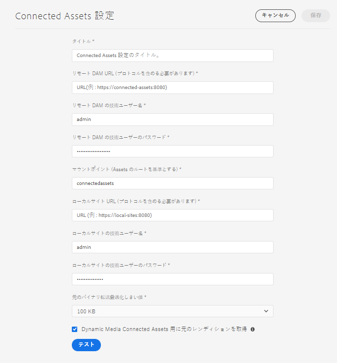

# Connected Assets を使用した AEM Sites での DAM アセットの共有 {#use-connected-assets-to-share-dam-assets-in-aem-sites}

大規模企業では、Web サイトの作成に必要なインフラストラクチャが分散していることがあります。Web サイト作成機能と、それらの Web サイトの作成に使用されたデジタルアセットが、別のデプロイメントに格納されている場合もあります。理由として、連携する必要のあるデプロイメントが地理的に分散している、企業買収によって異種混合インフラストラクチャとなった（親企業は統合を望んでいる）、成長によりアセット管理専用のインスタンスが必要な規模になった、などが挙げられます。

AEM Sites は Web ページの作成機能を備え、AEM Assets は Web サイトに必要なアセットを提供するデジタルアセット管理（DAM）システムです。AEM では、AEM Sites と AEM Assets の統合により、上記の使用事例をサポートできるようになりました。

## Connected Assets の概要 {#overview-of-connected-assets}

作成者は、ページエディターでページを編集しながら、別の AEM Assets デプロイメント上のアセットをシームレスに検索、参照および埋め込むことができます。AEM 管理者が実行する場合は、AEM Sites の様々なローカルデプロイメントと AEM Assets の別の（リモート）デプロイメントを一度だけ統合します。

サイト作成者の場合、リモートアセットは読み取り専用のローカルアセットとして利用できます。この機能は、一度に少数のリモートアセットをシームレスに検索および使用できるようサポートします。多くのリモートアセットをローカルデプロイメントで一度に利用できるようにするには、一括でのリモートアセットの移行を検討します。[Assets 移行ガイド](/help/assets/assets-migration-guide.md)を参照してください。

### 前提条件とサポートされている導入 {#prerequisites}

この機能を使用または設定する前に、以下を確認してください。

* ユーザーがそれぞれのデプロイメント上で適切なユーザーグループに属している。
* Adobe Experience Managerのデプロイメントタイプでは、サポートされている条件の1つが満たされます。

   |  | AEM Sites as a Cloud Service | AMS上のAEM 6.5サイト | AEM 6.5オンプレミスサイト |
   |---|---|---|---|
   | **AEM Assets as a Cloud Service** | サポート対象 | サポート対象 | サポート対象 |
   | **AMS上のAEM 6.5アセット** | サポート対象 | サポート対象 | サポート対象 |
   | **AEM 6.5アセットオンプレミス** | サポートなし | サポートなし | サポートなし |

### サポートされているファイル形式 {#mimetypes}

作成者は、コンテンツファインダーで画像や次のタイプのドキュメントを検索し、検索したアセットをページエディターで使用できます。 Documents can be added to the `Download` component and images can be added to the `Image` component. Authors can also add the remote assets in any custom AEM component that extends the default `Download` or `Image` components. サポートされるリストは次のとおりです。

* **画像形式**:画像コンポーネントでサポートされてい [る画像形式](https://docs.adobe.com/content/help/ja-JP/experience-manager-core-components/using/components/image.html) がサポートされます。 ダイナミックメディア画像はサポートされていません。
* **ドキュメント形式**:詳しくは、接続さ [れたアセットでサポートされるドキュメント形式を参照してくださ](file-format-support.md#doc-formats)い。

### 関連するユーザーとグループ {#users-and-groups-involved}

この機能の設定や使用に関係する様々な役割と対応するユーザーグループについて、以下で説明します。ローカルスコープは、作成者によって Web ページが作成される使用例のために使用されます。リモートスコープは、必要なアセットをホストするDAMデプロイメントに使用されます。 Sites 作成者は、これらのリモートアセットを取得します。

| 役割 | 対象範囲 | ユーザーグループ | ウォークスルーでのユーザ名 | 要件 |
|----------------------------------|--------|------------------------------------------------------------------------------|--------------------------|--------------------------------------------------------------------------------------------------------------------------------------------------------------------------------------------------------------------------------------------------------------|
| AEMサイト管理者 | ローカル | AEM管理者 | `admin` | AEM を設定し、リモート Assets デプロイメントとの統合を設定します。 |
| DAM ユーザー | ローカル | 作成者 | `ksaner` | Used to view and duplicate the fetched assets at `/content/DAM/connectedassets/`. |
| AEM Sites 作成者 | ローカル | 作成者（リモート DAM での読み取りアクセス権とローカル Sites での作成者アクセス権を持つ） | `ksaner` | エンドユーザーは、この統合を使用してコンテンツの速度を向上させる Sites 作成者です。作成者は、コンテンツファインダーを使用し、ローカルWebページで必要な画像を使用して、リモートDAM内のアセットを検索および参照します。 The credentials of `ksaner` DAM user are used. |
| AEM Assets 管理者 | リモート | AEM 管理者 | `admin` リモートAEMで | クロスオリジンリソース共有（CORS）を設定します。 |
| DAM ユーザー | リモート | 作成者 | `ksaner` リモートAEMで | リモート AEM デプロイメントでの作成者の役割。コンテンツファインダーを使用して Connected Assets 内のアセットを検索／参照します。 |
| DAM ディストリビューター（テクニカルユーザー） | リモート | パッケージビルダーおよびサイト作成者 | `ksaner` リモートAEMで | リモートデプロイメント上に存在するこのユーザーは、（Site 作成者役割ではなく）AEM ローカルサーバーによって、Sites 作成者.の代わりにリモートアセットを取得するために使用されます。この役割は、上の 2 つの `ksaner` の役割とは異なり、別のユーザーグループに属しています。 |

## Sites デプロイメントと Assets デプロイメント間の接続の設定 {#configure-a-connection-between-sites-and-assets-deployments}

AEM 管理者はこの統合を作成できます。作成すると、統合を使用するために必要な権限が、Sites デプロイメント上と DAM デプロイメント上で定義されたユーザーグループによって確立されます。

Connected Assets とローカル Sites の接続を構成するには、次の手順を実行します。

1. 既存の AEM Sites デプロイメントにアクセスするか、以下のコマンドを使用してデプロイメントを作成します。

   1. JAR ファイルのフォルダーで、ターミナルから次のコマンドを実行して各 AEM サーバーを作成します。
      `java -XX:MaxPermSize=768m -Xmx4096m -jar <quickstart jar filepath> -r samplecontent -p 4502 -nofork -gui -nointeractive &`

   1. 数分後に AEM サーバーが正常に起動します。この AEM Sites デプロイメントを、Web ページオーサリング用のローカルマシン（`https://[local_sites]:4502`）と見なします。

1. ローカルスコープのユーザーと役割が、AEM Sites デプロイメント上と AMS の AEM Assets デプロイメント上に存在していることを確認します。Create a technical user on Assets deployment and add to the user group mentioned in [users and groups involved](/help/assets/use-assets-across-connected-assets-instances.md#users-and-groups-involved).

1. Access the local AEM Sites deployment at `https://[local_sites]:4502`. **[!UICONTROL ツール]**／**[!UICONTROL アセット]**／**[!UICONTROL Connected Assets 設定]**&#x200B;をクリックし、次の値を入力します。

   1. AEM Assetsの場所はです `https://[assets_servername_ams]:[port]`。
   1. DAM ディストリビューターの資格情報（テクニカルユーザー）。
   1. 「**[!UICONTROL マウントポイント]**」フィールドに、AEM が取得したアセットの格納先となるローカル AEM パスを入力します。For example, `remoteassets` folder.

   1. Adjust the values of **[!UICONTROL Original Binary transfer optimization Threshold]** depending on your network. このしきい値より大きいサイズのアセットレンディションは、非同期で転送されます。
   1. データストアを使用してアセットを保存し、データストアが両方の AEM デプロイメント間に共通のストレージである場合は、「**[!UICONTROL Connected Assets と共有されるデータストア]**」を選択します。この場合、実際のアセットバイナリはデータストアに存在し、転送されないので、しきい値の制限は関係ありません。
   

   *図：接続されたアセットの一般的な設定*

1. アセットは既に処理され、レンディションが取得されたので、ワークフローランチャーを無効にします。ローカル（AEM Sites）デプロイメントのランチャー設定を調整し、リモートアセットが取得される `connectedassets` フォルダーを除外するようにします。

   1. AEM Sites デプロイメントで、**[!UICONTROL ツール]**／**[!UICONTROL ワークフロー]**／**[!UICONTROL ランチャー]**&#x200B;をクリックします。

   1. **[!UICONTROL DAM アセットの更新]**&#x200B;および&#x200B;**[!UICONTROL DAM メタデータの書き戻し]**&#x200B;ワークフローを含むランチャーを検索します。

   1. ワークフローランチャーを選択し、アクションバーの「**[!UICONTROL プロパティ]**」をクリックします。

   1. プロパティウィザードで、「**[!UICONTROL パス]**」フィールドを次のマッピングに従って変更し、マウントポイント **[!UICONTROL connectedassets]** が除外されるように正規表現を更新します。
   | 前 | 後 |
   |---|---|
   | /content/dam(/((?!/subassets).)*/)renditions/original | /content/dam(/((?!/subassets)(?!connectedassets).)*/)renditions/original |
   | /content/dam(/.*/)renditions/original | /content/dam(/((?!connectedassets).)*/)renditions/original |
   | /content/dam(/.*)/jcr:content/metadata | /content/dam(/((?!connectedassets).)*/)jcr:content/metadata |

   >[!NOTE]
   >
   >作成者がアセットを取得する際に、リモートAEMデプロイメントで使用可能なすべてのレンディションが取得されます。 取得したアセットのレンディションをさらに作成したい場合は、この設定手順をスキップしてください。DAM アセットの更新ワークフローが開始され、追加のレンディションが作成されます。これらのレンディションは、ローカルの Sites デプロイメントでのみ使用でき、リモート DAM デプロイメントでは使用できません。

1. AEM Sites インスタンスを、リモート AEM Assets の CORS 設定の「**[!UICONTROL 許可されたオリジン]**」の 1 つとして追加します。

   1. 管理者の資格情報を使用してログインします。「Cross-Origin」を検索します。**[!UICONTROL ツール]**／**[!UICONTROL 操作]**／**[!UICONTROL Web コンソール]**&#x200B;にアクセスします。

   1. To create a CORS configuration for AEM Sites instance, click  icon next to **[!UICONTROL Adobe Granite Cross-Origin Resource Sharing Policy]**.

   1. フィールド「**[!UICONTROL 許可されたオリジン]**」にローカル Sites の URL、つまり `https://[local_sites]:[port]` を入力します。設定を保存します。

## リモートアセットの使用 {#use-remote-assets}

Web サイト作成者は、コンテンツファインダーを使用して DAM インスタンスに接続します。作成者は、コンポーネント内のリモートアセットを参照、検索およびドラッグできます。 リモート DAM への認証をおこなえるよう、管理者から提供された DAM ユーザーの資格情報を手元に用意してください。

作成者は、ローカル DAM インスタンスで利用可能なアセットとリモート DAM インスタンスで利用可能なアセットの両方を、単一の Web ページ内で使用できます。コンテンツファインダーを使用すれば、ローカル DAM の検索とリモート DAM の検索を切り替えることができます。

ローカルのSitesインスタンスで使用できる、完全に対応するタグ（同じ分類階層を持つ）を持つリモートアセットのタグのみが取得されます。 その他のタグは破棄されます。 作成者は、AEMオファーが全文検索を行うので、リモートAEMデプロイメントに存在するすべてのタグを使用して、リモートアセットを検索できます。

### 使用手順 {#walk-through-of-usage}

上記のセットアップを使用してオーサリングエクスペリエンスを試し、機能を理解してください。リモート DAM デプロイメントで、選択したドキュメントまたは画像を使用します。

1. リモートデプロイメントの Assets UI に移動するため、AEM Workspace から&#x200B;**[!UICONTROL アセット]**／**[!UICONTROL ファイル]**&#x200B;にアクセスします。または、ブラウザーで `https://[assets_servername_ams]:[port]/assets.html/content/dam` アクセスします。 選択したアセットをアップロードします。
1. Sites インスタンスの右上隅にあるプロファイルアクティベーターで、「**[!UICONTROL 次のユーザーとして操作]**」をクリックします。ユーザー名として `ksaner` を入力し、提供されたオプションを選択し、「**[!UICONTROL OK]**」をクリックします。
1. **[!UICONTROL サイト]**／**[!UICONTROL We.Retail]**／**[!UICONTROL us]**／**[!UICONTROL en]** で、We.Retail Web サイトページを開きます。ページを編集します。または、ブラウザー `https://[aem_server]:[port]/editor.html/content/we-retail/us/en/men.html` でアクセスしてページを編集します。

   ページ **[!UICONTROL の左上隅にある]** 「サイドパネルを切り替え」をクリックします。

1. Open the Assets tab and click **[!UICONTROL Log in to Connected Assets]**.
1. Provide the credentials -- `ksaner` as user name and `password` as password. このユーザーには、両方の AEM デプロイメントのオーサリング権限があります。
1. DAM に追加したアセットを検索します。リモートアセットは左側のパネルに表示されます。画像またはドキュメントでフィルタリングしてから、サポートされているドキュメントのタイプでさらにフィルタリングします。コンポーネント上の画像とコ `Image` ンポーネント上のドキュメントをドラ `Download` ッグします。

   ローカル AEM Sites デプロイメントでは、取得されたアセットは読み取り専用です。AEM Sites コンポーネントが提供するオプションを使用して、取得したアセットを編集できます。コンポーネントによる編集は非破壊的です。

   

   *図：リモートDAMでドキュメントを検索する際に、アセットの種類と画像をフィルターするオプション*

1. アセットが非同期で取得され、取得タスクが失敗した場合、サイト作成者に通知されます。オーサリング中またはオーサリング後でも、作成者は[非同期ジョブ](/help/assets/asynchronous-jobs.md)ユーザーインターフェースで取得タスクやエラーについての詳細情報を確認できます。

   

   *図：バックグラウンドで発生するアセットの非同期フェッチに関する通知。*

1. ページを公開すると、ページで使用されているアセットの完全なリストが AEM に表示されます。公開時にリモートアセットが正常に取得されることを確認します。取得した各アセットのステータスを確認するには、[非同期ジョブ](/help/assets/asynchronous-jobs.md)ユーザーインターフェースをご覧ください。

   >[!NOTE]
   >
   >1 つ以上のリモートアセットが取得されない場合でも、ページは公開されます。リモートアセットを使用するコンポーネントは空で公開されます。AEM 通知領域では、非同期ジョブページに表示されるエラーの通知を確認できます。

>[!CAUTION]
>
>Web ページで使用された、取得済みのリモートアセットは、その格納先となるローカルフォルダー（上の手順の場合は `connectedassets`）へのアクセス権限を持つすべてのユーザーから検索や使用が可能となります。The assets are also searchable and visible in the local repository via [!UICONTROL Content Finder].

取得されたアセットは他のローカルアセットと同じように使用できます。ただし、関連するメタデータは編集できません。

## 制限事項 {#limitations}

**権限とアセット管理**

* ローカルアセットは、リモートデプロイメントの元のアセットと同期されません。DAM デプロイメント上での編集、削除または権限の失効は、ローカル側には一切伝播されません。
* ローカルアセットは読み取り専用のコピーです。AEM コンポーネントは、アセットに対して非破壊編集をおこないます。その他のいかなる編集もできません。
* ローカルで取得されたアセットは、オーサリング用途でのみ使用できます。アセット更新ワークフローの適用やメタデータの編集はおこなえません。
* 画像とリストに表示されるドキュメント形式のみがサポートされます。 ダイナミックメディアアセット、コンテンツフラグメント、エクスペリエンスフラグメントはサポートされていません。
* メタデータスキーマは取得されません。
* Sites 作成者は全員、リモート DAM デプロイメントへのアクセス権限を持っていなくても、取得されたコピーに対する読み取り権限を持ちます。
* 統合をカスタマイズするための API サポートはありません。
* この機能は、リモートアセットのシームレスな検索および使用をサポートします。多くのリモートアセットをローカルデプロイメントで一度に利用できるようにするには、リモートアセットの移行を検討します。[Assets 移行ガイド](assets-migration-guide.md)を参照してください。
* 「画像を選択」をクリックして、ページのプロパティの「サムネール」タブでWebページのサムネ [!UICONTROL ールと] してリモ [!UICONTROL ートアセットを使用] できません 。

**セットアップとライセンス**

* AMSでのAEM Assetsのデプロイメントがサポートされます。
* AEM Sites は一度に 1 つの AEM Assets リポジトリに接続できます。
* リモートリポジトリとして動作する AEM Assets の 1 つのライセンス。
* ローカルオーサリングデプロイメントとして動作する AEM Sites の 1 つ以上のライセンス。

**使用方法**

* リモートアセットを検索し、ローカルページ上のリモートアセットをコンテンツを作成するためにドラッグする機能のみがサポートされています。
* 取得操作は 5 秒でタイムアウトします。アセット取得時、問題が発生する場合があります（ネットワークに問題がある場合など）。Authors can re-attempt by dragging the remote asset from [!UICONTROL Content Finder] to [!UICONTROL Page Editor].
* Simple edits that are non-destructive and the edit supported via the AEM `Image` component, can be done on fetched assets. アセットは読み取り専用です。

## 問題のトラブルシューティング {#troubleshoot}

一般的なエラーシナリオのトラブルシューティングをおこなうには、次の手順に従います。

* コンテンツファインダーからリモートアセットを検索できない場合は、必要な役割と権限が設定されていることを再度確認してください。
* リモート DAM から取得したアセットは、リモートに存在しない、それを取得するための適切な権限が不足している、ネットワーク障害などの理由で Web ページに公開されない場合があります。アセットがリモートDAMから削除されないか、権限が変更されていないことを確認します。適切な前提条件が満たされていることを確認します。ページへのアセットの追加を再試行し、再公開します。 アセット取得時のエラーについては、[非同期ジョブのリスト](/help/assets/asynchronous-jobs.md) を確認してください。
