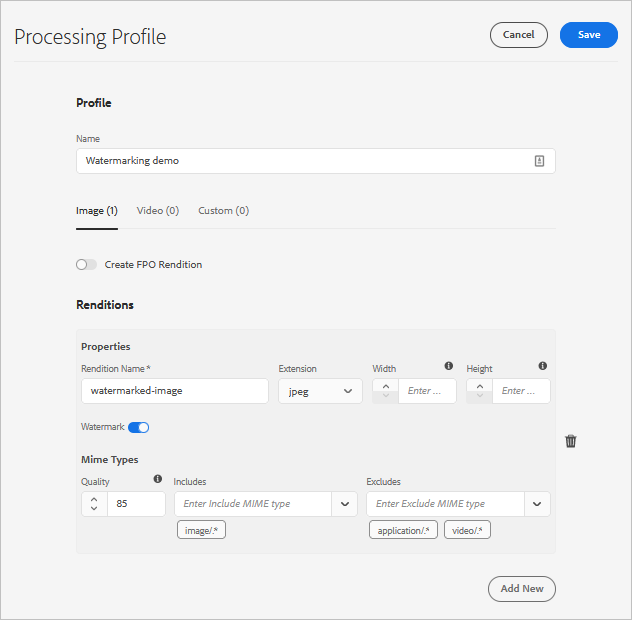

# アセットの透かしの設定 {#watermark-assets}

[!DNL Adobe Experience Manager Assets] では、画像に電子透かしを追加できます。[!DNL Assets] は、他の画像ファイルへの透かしとしての画像の適用をサポートしています。透かしは、アセットの信頼性と著作権の所有権を確認するのに役立ちます。また、透かしを使用して、機密、ドラフト、有効性などのドキュメントの状態も示せます。

アセットの透かしを [!DNL Experience Manager] で設定するには、次の手順に従います。

1. 透かしとして PNG ファイルが適用されます。このファイルを DAM リポジトリにアップロードします。

1. 環境に関連付けられた [!DNL Cloud Manager] Git リポジトリにアクセスします。リポジトリ内の`com.adobe.cq.assetcompute.impl.profile.WatermarkingProfileServiceImpl.cfg.json`という名前のファイルを次の内容でコミットします。 手順については、[Cloud Service](/help/implementing/deploying/configuring-osgi.md)として [!DNL Experience Manager] OSGi設定を行う方法を参照してください。

   ```json
   {
   "watermark": "/content/dam/<path-to-watermark-image.png>",
    "width": 100
   }
   ```

1. 透かしを適用する際にアセットマイクロサービスを利用する[処理プロファイルを作成します](/help/assets/asset-microservices-configure-and-use.md#create-custom-profile)。

   

1. [フォルダーに処理プロファイルを適用して](/help/assets/asset-microservices-configure-and-use.md#use-profiles)、透かし付きのアセットを作成します。

## ヒントと制限事項 {#tips-limitations-bestpractices}

* 単一の設定を使用して、すべてのアセットに透かしを付けることができます。透かしに使用される画像は 1 つだけで、幅は固定されます。
* 透かしはタイルを適用せずに中央に配置できます。
* テキストベースの透かしはサポートされていません。

>[!MORELIKETHIS]
>
>* [アセットマイクロサービスの概要](/help/assets/asset-microservices-overview.md)。
>* [処理プロファイルでアセットマイクロサービスを使用します](/help/assets/asset-microservices-configure-and-use.md)。

