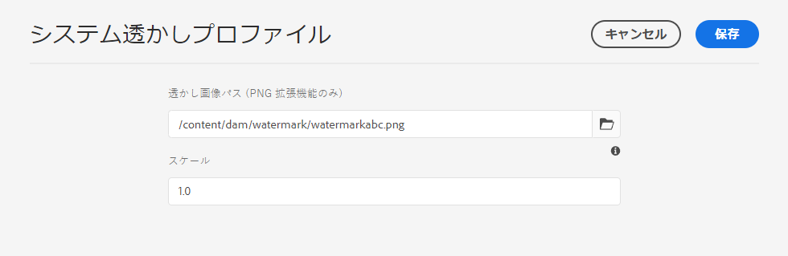

# アセットの透かしの設定 {#watermark-assets}

| バージョン | 記事リンク |
| -------- | ---------------------------- |
| AEM 6.5 | [ここをクリックしてください](https://experienceleague.adobe.com/docs/experience-manager-65/assets/administer/watermarking.html?lang=ja) |
| AEM as a Cloud Service | この記事 |

[!DNL Adobe Experience Manager Assets] では、画像とビデオにデジタル透かしを追加できます。[!DNL Assets] は、他の画像ファイルへの透かしとしての画像の適用をサポートしています。透かしは、アセットの信頼性と著作権の所有権を確認するのに役立ちます。また、透かしを使用して、機密、ドラフト、有効性などのドキュメントの状態も示せます。

アセットに透かしを適用するように [!DNL Experience Manager] を設定するには：

1. 透かしとして PNG ファイルが適用されます。このファイルを DAM リポジトリにアップロードします。

1. **[!UICONTROL ツール／アセット／アセット設定]**&#x200B;に移動します。

1. 「**[!UICONTROL システム透かしプロファイル]**」をクリックします。

1. [!UICONTROL システム透かしプロファイル]ページで、手順 1 で DAM リポジトリにアップロードした画像のパスを指定します。

1. 「**[!UICONTROL スケール]**」フィールドで、レンディションの幅を基準に 0.0～1.0 の範囲で透かしの倍率を指定します。

1. 「**[!UICONTROL 保存]**」をクリックします。

   

   >[!NOTE]
   >
   >`com.adobe.cq.assetcompute.impl.profile.WatermarkingProfileServiceImpl.cfg.json`設定ファイル（OSGi 設定）を使用してシステム透かしプロファイルを設定した場合は、それを引き続き使用できますが、アドビでは新しいメソッドを使用することをお勧めします。

1. 透かしを適用する際にアセットマイクロサービスを利用する[処理プロファイルを作成します](/help/assets/asset-microservices-configure-and-use.md#create-custom-profile)。

   

   処理プロファイルの作成時には、「**[!UICONTROL 透かし]**」トグルを必ずオンに切り替えます。

1. [フォルダーに処理プロファイルを適用して](/help/assets/asset-microservices-configure-and-use.md#use-profiles)、透かし付きのアセットを作成します。

## ヒントと制限事項 {#tips-limitations-bestpractices}

* 単一の設定を使用して、すべてのアセットに透かしを付けることができます。透かしに使用される画像は 1 つだけで、幅は固定されます。
* 透かしはタイルを適用せずに中央に配置できます。
* テキストベースの透かしはサポートされていません。

**関連情報**

* [アセットを翻訳](translate-assets.md)
* [Assets HTTP API](mac-api-assets.md)
* [AEM Assets as a Cloud Service でサポートされているファイル形式](file-format-support.md)
* [アセットを検索](search-assets.md)
* [接続されたアセット](use-assets-across-connected-assets-instances.md)
* [アセットレポート](asset-reports.md)
* [メタデータスキーマ](metadata-schemas.md)
* [アセットをダウンロード](download-assets-from-aem.md)
* [メタデータを管理](manage-metadata.md)
* [検索ファセット](search-facets.md)
* [コレクションを管理](manage-collections.md)
* [メタデータの一括読み込み](metadata-import-export.md)
* [AEM および Dynamic Media へのアセットの公開](/help/assets/publish-assets-to-aem-and-dm.md)

>[!MORELIKETHIS]
>
>* [アセットマイクロサービスの概要](/help/assets/asset-microservices-overview.md)。
>* [処理プロファイルでアセットマイクロサービスを使用します](/help/assets/asset-microservices-configure-and-use.md)。
