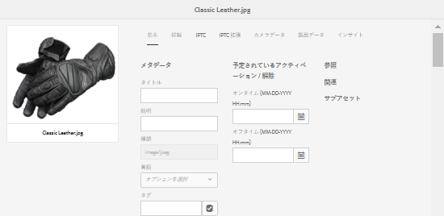
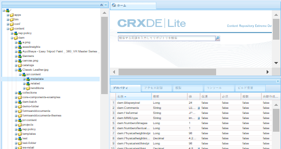
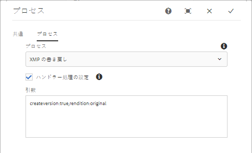

# XMP メタデータ {#xmp-metadata}

XMP（Extensible Metadata Platform）は、AEM Assets であらゆるメタデータ管理に使用されるメタデータ規格です。XMP で提供される標準形式によって、多様なアプリケーションに対応したメタデータの作成、処理およびやり取りができます。

XMP では、すべてのファイル形式に埋め込むことができる共通のメタデータエンコーディングのほか、リッチ[コンテンツモデル](#xmp-core-concepts)も提供され、[アドビによるサポート](#advantages-of-xmp)やその他各社のサポートがあるので、XMP を AEM Assets と組み合わせて使用すると強力なプラットフォームを構築できます。

## XMP の概要とエコシステム {#xmp-ecosystem}

AEM Assets は、XMP メタデータ標準をネイティブにサポートしています。XMP は、デジタルアセット内の標準化されたメタデータと独自メタデータを処理および格納するための規格です。XMP は、複数のアプリケーションでメタデータを効率的に使用するための共通規格となるよう設計されています。

例えば制作のプロフェッショナルは、アドビのアプリケーションに組み込まれた XMP サポートを使用して、複数のファイル形式に情報を渡します。AEM Assets リポジトリでは、XMP メタデータを抽出し、そのデータをコンテンツのライフサイクルの管理に使用します。自動化ワークフローを作成することもできます。

XMP が提供するデータモデル、ストレージモデルおよびスキーマを使用して、メタデータの定義、作成および処理方法を規格化できます。これらの概念は、すべてこの節で説明します。

EXIF、ID3、Microsoft Office などの従来のメタデータは、すべて自動的に XMP に解釈され、製品カタログなどの顧客固有のメタデータスキーマをサポートするよう拡張することができます。

XMP のメタデータは、一連のプロパティで構成されます。これらのプロパティは、常にリソースと呼ばれる特定のエンティティに関連付けられます。つまり、プロパティはリソースの「説明」です。XMP の場合、リソースとなるのは常にアセットです。

XMP によって定義される[メタデータ](https://en.wikipedia.org/wiki/Metadata)モデルは、任意の定義済みメタデータ項目のセットと併用できます。また、XMP によって、リソースで複数の処理手順がおこなわれる際にその履歴を記録するうえで便利な基本的なプロパティに対して、特定の[スキーマ](https://en.wikipedia.org/wiki/XML_schema)も定義されます。処理手順は、撮影、[スキャン](https://en.wikipedia.org/wiki/Image_scanner)またはテキスト作成から、画像編集手順（[切り抜き](https://en.wikipedia.org/wiki/Cropping_%28image%29)やカラー調整など）を経て、最終的な画像へのアセンブリまでです。XMP の処理中に、各ソフトウェアプログラムまたはデバイスでデジタルリソースに独自の情報を付加できます。この情報は、最終的なデジタルファイルで保持されます。

XMP のシリアライズおよび格納は、通常 [W3C](https://ja.wikipedia.org/wiki/World_Wide_Web_Consortium) [Resource Description Framework](https://en.wikipedia.org/wiki/Resource_Description_Framework)（RDF）のサブセットを使用して実行され、[XML](https://ja.wikipedia.org/wiki/XML) で表記されます。

### XMP の利点 {#advantages-of-xmp}

XMP には、他のエンコーディング規格およびエンコーディングスキーマに比べて次の利点があります。

* XMP ベースのメタデータは利便性が高く、細かく分類されています。  
* XMP では 1 つのプロパティに複数の値を指定できます。
* XMP の規格化されたエンコーディングによって、メタデータを簡単にやり取りできます。
* XMP は拡張可能です。アセットに詳細情報を追加できます。

XMP 規格は拡張できるように設計されていて、カスタムタイプのメタデータを XMP データに追加できます。一方、EXIF は拡張できません。EXIF のプロパティのリストは固定されていて、拡張することはできません。

>[!NOTE]
>
>XMP では通常、バイナリデータタイプを埋め込むことはできません。XMP でバイナリデータ（サムネール画像など）を扱う場合、XML に対応するフォーマット（`Base64` など）でエンコーディングする必要があります。

### XMP の中心概念 {#xmp-core-concepts}

**名前空間とスキーマ**

XMP スキーマは、一連のプロパティ名を共通の XML 名前空間で定義したものです。
名前空間には、データタイプや識別情報が含まれます。XMP スキーマは、そのスキーマの XML 名前空間 URI によって識別されます。名前空間を使用すると、異なるスキーマに存在する、名前が同じで意味が異なるプロパティとの競合を防ぐことができます。

例えば、別個に設計された 2 つのスキーマにある **Creator** プロパティは、アセットを作成した個人を意味する場合と、アセットの作成元アプリケーション（Adobe Photoshop など）を意味する場合があります。

**XMP のプロパティと値**

XMP には、1 つ以上のスキーマからプロパティを選択し含めることができます。多くのアドビアプリケーションで使用される一般的なサブセットに含まれるプロパティの例を示します。

* Dublin Core スキーマ：`dc:title`、`dc:creator`、`dc:subject`、`dc:format`、`dc:rights`
* XMP 基本スキーマ：`xmp:CreateDate`、`xmp:CreatorTool`、`xmp:ModifyDate`、`xmp:metadataDate`
* XMP Rights Management スキーマ：`xmpRights:WebStatement`、`xmpRights:Marked`
* XMP Media Management スキーマ：`xmpMM:DocumentID`

**代替言語**

XMP には、`xml:lang` プロパティをテキストプロパティに追加して、テキストの言語を指定する機能があります。

## レンディションへの XMP の書き戻し {#xmp-writeback-to-renditions}

Adobe Experience Manager (AEM) Assets のこの XMP の書き戻し機能は、アセットメタデータの変更をアセットのレンディションにレプリケートします。

AEM Assets 内からアセットのメタデータを変更した場合、またはアセットをアップロードした場合、変更は最初に CRXDE のアセットノードに保存されます。

XMP の書き戻し機能によって、メタデータの変更が、アセットのすべてのレンディションまたは特定のレンディションに反映されます。

「`Classic Leather`」というタイトルのアセットの「[!UICONTROL タイトル]」プロパティを「`Nylon`」に変更するシナリオについて考えます。

この場合、AEM Assets ではこの「**[!UICONTROL タイトル]**」プロパティへの変更が、アセット階層に格納されたアセットメタデータ用の `dc:title` パラメーターに保存されます。

ただし、AEM Assets では、メタデータの変更はアセットのレンディションに自動的に反映されません。

XMP の書き戻し機能によって、メタデータの変更が、アセットのすべてのレンディションまたは特定のレンディションに反映されます。ただし、変更はアセット階層の metadata ノード以下には保存されません。代わりに、この機能によって、レンディションのバイナリファイル内に変更内容が埋め込まれます。

### XMP 書き戻しの有効化 {#enable-xmp-writeback}

<!-- asgupta, Engg: Need attention here to update the configuration manager changes.
-->

アセットのアップロード時にメタデータの変更をアセットのレンディションに反映させるには、設定マネージャーで「**[!UICONTROL Adobe CQ DAM Rendition Maker]**」の設定を変更します。

1. Configuration Manager を開くには、`https://[aem_server]:[port]/system/console/configMgr` にアクセスします。
1. 「**[!UICONTROL Adobe CQ DAM Rendition Maker]**」設定を開きます。
1. 「**[!UICONTROL Propagate XMP]**」オプションを選択し、変更を保存します。

### 特定のレンディションに対する XMP 書き戻しの有効化 {#enable-xmp-writeback-for-specific-renditions}

XMP の書き戻し機能によって、選択されたレンディションにメタデータの変更が反映されるようにするには、これらのレンディションを DAM メタデータ書き戻しワークフローの「[!UICONTROL XMP の書き戻しプロセス]」ワークフローステップに指定します。デフォルトでは、このステップには元のレンディションが設定されています。

XMP の書き戻し機能でメタデータを thumbnail.140.100.png および thumbnail.319.319.png のレンディションに反映するには、次の手順を実行します。

1. AEM のロゴをタップまたはクリックし、**[!UICONTROL ツール]**／**[!UICONTROL ワークフロー]**／**[!UICONTROL モデル]**&#x200B;に移動します。
1. モデルページで、「**[!UICONTROL DAM メタデータの書き戻し]**」ワークフローモデルを開きます。
1. **[!UICONTROL DAM メタデータの書き戻し]**&#x200B;ページで、「**[!UICONTROL XMP の書き戻しプロセス]**」ステップを開きます。
1. **[!UICONTROL ステップのプロパティ]**&#x200B;ダイアログボックスで、「**[!UICONTROL プロセス]**」タブをタップまたはクリックします。
1. 「**[!UICONTROL 引数]**」ボックスに「`rendition:cq5dam.thumbnail.140.100.png,rendition:cq5dam.thumbnail.319.319.png`」を追加し、「**[!UICONTROL OK]**」をタップまたはクリックします。

   

1. 変更内容を保存します。
1. 新しい属性で Dynamic Media 画像の PTIFF（Pyramid TIFF）レンディションを再生成するには、「**[!UICONTROL Dynamic Media プロセスの画像アセット]**」ステップを DAM メタデータ書き戻しワークフローに追加します。PTIFF レンディションは、Dynamic Media Hybrid 実装でのみ、ローカルで作成および格納されます。

1. ワークフローを保存します。

メタデータの変更がアセットのレンディション thumbnail.140.100.png と thumbnail.319.319.png のみに反映され、他のレンディションには反映されなくなります。

<!--
>[!NOTE]
>
>For XMP writeback issues in 64 bit Linux, see [How to enable XMP write-back on 64-bit RedHat Linux](https://helpx.adobe.com/experience-manager/kb/enable-xmp-write-back-64-bit-redhat.html).
>
>For more information about supported platforms, see [XMP metadata write-back prerequisites](/help/sites-deploying/technical-requirements.md#requirements-for-aem-assets-xmp-metadata-write-back).
-->

### XMP メタデータのフィルタリング {#filtering-xmp-metadata}

AEM Assetsは、アセットバイナリから読み取られ、アセットが取り込まれる際にJCRに保存されるXMPメタデータのプロパティ/ノードのフィルタリングをサポートします。 フィルタリングは、ブロックされたリストと許可されたリストを介して可能です。

ブロックされたリストを使用してフィルタリングすると、除外用に指定されたプロパティを除く、すべてのXMPメタデータプロパティを読み込むことができます。 ただし、膨大な量の XMP メタデータ（例えば、10,000 個のプロパティを持つ 1,000 個のノード）を含む INDD ファイルなどのアセットタイプの場合、フィルタリングするノードの名前が必ずしも事前にわかるわけではありません。ブロックされたリストを使用してフィルタリングすると、多数のXMPメタデータを持つ大量のアセットを読み込める場合、AEMインスタンス/クラスターでは、ログに記録された監視キューなど、安定性の問題が発生する可能性があります。

許可されているリストを使用したXMPメタデータのフィルタリングにより、読み込むXMPプロパティを定義できるので、この問題は解決されます。 そこに定義されていない XMP プロパティや不明な XMP プロパティは無視されます。下位互換性を確保するために、これらのプロパティの一部を、ブロックされたリストを使用するフィルターに追加できます。

>[!NOTE]
>
>フィルタリングは、アセットバイナリの XMP ソースから派生したプロパティに対してのみ機能します。EXIF 形式や IPTC 形式などの XMP 以外のソースから派生したプロパティについては、フィルタリングは機能しません。例えば、アセットの作成日は、`CreateDate` という名前のプロパティに EXIF TIFF 形式で格納されています。AEM では、この値を `exif:DateTimeOriginal` という名前のメタデータフィールドに格納します。この場合は XMP 以外のソースなので、このプロパティにはフィルタリングは機能しません。

1. Configuration Manager を開くには、`https://[aem_server]:[port]/system/console/configMgr` にアクセスします。
1. 「**[!UICONTROL Adobe CQ DAM XmpFilter]**」設定を開きます。
1. To apply filtering via an allowed list, select **[!UICONTROL Apply Whitelist to XMP Properties]**, and specify the properties to be imported in the **[!UICONTROL Whitelisted XML Names for XMP filtering]** box.

1. To filter out blocked XMP properties after applying filtering via allowed list, specify them in the **[!UICONTROL Blacklisted XML Names for XMP filtering]** box.

   >[!NOTE]
   >
   >「**[!UICONTROL Apply Blacklist to XMP Properties]**」チェックボックスは、デフォルトでオンになっています。つまり、ブロックされたリストを使用したフィルタリングは、デフォルトで有効になっています。 To disable such filtering, deselect the **[!UICONTROL Apply Blacklist to XMP Properties]** option.

1. 変更内容を保存します。

>[!MORELIKETHIS]
>
>* [アドビの XMP 仕様](https://www.adobe.com/devnet/xmp.html)

