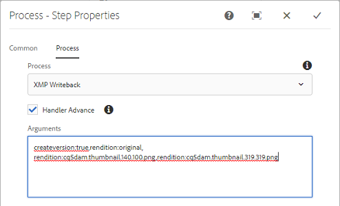

# XMP メタデータ {#xmp-metadata}

<table>
    <tr>
        <td>
            <i> 新規 </i>Dynamic Media Prime<a href="/help/assets/dynamic-media/dm-prime-ultimate.md"><b>Ultimate</b></a>
        </td>
        <td>
            <i> 新規 </i> <a href="/help/assets/assets-ultimate-overview.md"><b>AEM AssetsUltimate</b></a>
        </td>
        <td>
            <i> 新規 </i> <a href="/help/assets/integrate-aem-assets-edge-delivery-services.md"><b>AEM AssetsとEdge Delivery Servicesの統合 </b></a>
        </td>
        <td>
            <i> 新規 </i><a href="/help/assets/aem-assets-view-ui-extensibility.md"><b>UI 拡張機能 </b></a>
        </td>
          <td>
            <i>Dynamic Media Prime</i>Ultimateの新 <a href="/help/assets/dynamic-media/enable-dynamic-media-prime-and-ultimate.md"><b> 能 </b></a>
        </td>
    </tr>
    <tr>
        <td>
            <a href="/help/assets/search-best-practices.md"><b>検索のベストプラクティス</b></a>
        </td>
        <td>
            <a href="/help/assets/metadata-best-practices.md"><b>メタデータのベストプラクティス</b></a>
        </td>
        <td>
            <a href="/help/assets/product-overview.md"><b>コンテンツハブ</b></a>
        </td>
        <td>
            <a href="/help/assets/dynamic-media-open-apis-overview.md"><b>OpenAPI 機能を備えた Dynamic Media</b></a>
        </td>
        <td>
            <a href="https://developer.adobe.com/experience-cloud/experience-manager-apis/"><b>AEM Assets 開発者向けドキュメント</b></a>
        </td>
    </tr>
</table>

| バージョン | 記事リンク |
| -------- | ---------------------------- |
| AEM 6.5 | [ここをクリックしてください](https://experienceleague.adobe.com/docs/experience-manager-65/assets/administer/xmp-writeback.html?lang=ja) |
| AEM as a Cloud Service | この記事 |

XMP（Extensible Metadata Platform）は、Experience Manager Assets であらゆるメタデータ管理に使用されるメタデータ規格です。XMP で提供される標準形式によって、多様なアプリケーションに対応したメタデータの作成、処理およびやり取りができます。

XMP では、すべてのファイル形式に埋め込むことができる共通のメタデータエンコーディングのほか、リッチ[コンテンツモデル](#xmp-core-concepts)も提供され、[アドビによるサポート](#advantages-of-xmp)やその他各社のサポートがあるので、XMP を と組み合わせて使用すると強力なプラットフォームを構築できます。[!DNL Assets]

## XMP の概要とエコシステム {#xmp-ecosystem}

[!DNL Assets] は、XMP メタデータ標準をネイティブにサポートしています。XMP は、デジタルアセット内の標準化されたメタデータと独自メタデータを処理および格納するための規格です。XMP は、複数のアプリケーションでメタデータを効率的に使用するための共通規格となるよう設計されています。

例えば制作のプロフェッショナルは、アドビのアプリケーションに組み込まれた XMP サポートを使用して、複数のファイル形式に情報を渡します。[!DNL Assets] リポジトリーでは、XMP メタデータを抽出し、そのデータをコンテンツのライフサイクルの管理に使用します。自動化ワークフローを作成することもできます。

XMP は、データモデル、ストレージモデル、スキーマを提供することで、メタデータの定義、作成および処理方法を標準化します。これらの概念はすべて、この節で説明します。

従来のメタデータ（EXIF、ID3、Microsoft Office など）はすべて XMP に自動変換され、製品カタログなどの顧客固有のメタデータスキーマをサポートするよう拡張できます。

XMP のメタデータは、一連のプロパティで構成されます。これらのプロパティは常に、リソースとして参照される特定のエンティティに関連付けられます。つまり、プロパティはリソースの「説明」です。XMP の場合、リソースとなるのは常にアセットです。

XMP によって定義される[メタデータ](https://en.wikipedia.org/wiki/Metadata)モデルは、任意の定義済みメタデータ項目のセットと併用できます。また、XMP によって、リソースで複数の処理手順が行われる際にその履歴を記録するうえで便利な基本的なプロパティに対して、特定の[スキーマ](https://en.wikipedia.org/wiki/XML_schema)も定義されます。処理手順は、撮影、[スキャン](https://en.wikipedia.org/wiki/Image_scanner)またはテキスト作成から、画像編集手順（[切り抜き](https://en.wikipedia.org/wiki/Cropping_%28image%29)やカラー調整など）を経て、最終的な画像へのアセンブリまでです。XMP の処理中に、各ソフトウェアプログラムまたはデバイスでデジタルリソースに独自の情報を付加できます。この情報は、最終的なデジタルファイルで保持されます。

XMP のシリアライズおよび格納は、通常 [W3C](https://ja.wikipedia.org/wiki/World_Wide_Web_Consortium) [Resource Description Framework](https://ja.wikipedia.org/wiki/Resource_Description_Framework)（RDF）のサブセットを使用して実行され、[XML](https://ja.wikipedia.org/wiki/XML) で表記されます。

### XMP の利点 {#advantages-of-xmp}

XMP には、他のエンコーディング規格やスキーマと比較して次の利点があります。

* XMP ベースのメタデータは利便性が高く、細かく分類されています。
* XMP では 1 つのプロパティに複数の値を指定できます。
* XMP には標準化されたエンコーディングがあるので、メタデータを簡単に交換できます。
* XMP は拡張可能です。 アセットに詳細情報を追加できます。

XMP 標準は拡張可能に設計されており、カスタムタイプのメタデータを XMP データに追加できます。一方、EXIF のプロパティのリストは固定されていて、拡張することはできません。

>[!NOTE]
>
>XMP では通常、バイナリデータ型を埋め込むことはできません。XMP でバイナリデータ（サムネール画像など）を扱う場合、XML に対応するフォーマット（`Base64` など）でエンコーディングする必要があります。

### XMP の中心概念 {#xmp-core-concepts}

**名前空間とスキーマ**

XMP スキーマは、一連のプロパティ名を共通の XML 名前空間で定義したものです。
名前空間には、データタイプや識別情報が含まれます。XMP スキーマは、そのスキーマの XML 名前空間 URI によって識別されます。名前空間を使用すると、異なるスキーマに存在する、名前が同じで意味が異なるプロパティとの競合を防ぐことができます。

例えば、別個に設計された 2 つのスキーマにある **Creator** プロパティは、アセットを作成した個人を意味する場合と、アセットの作成元アプリケーション（Adobe Photoshop など）を意味する場合があります。

**XMP のプロパティと値**

XMP には、1 つ以上のスキーマからプロパティを選択し含めることができます。多くのアドビアプリケーションで使用される一般的なサブセットに含まれるプロパティの例を示します。

* Dublin Core スキーマ：`dc:title`、`dc:creator`、`dc:subject`、`dc:format`、`dc:rights`
* XMP 基本スキーマ：`xmp:CreateDate`、`xmp:CreatorTool`、`xmp:ModifyDate`、`xmp:metadataDate`
* XMP Rights Management スキーマ：`xmpRights:WebStatement`、`xmpRights:Marked`
* XMP Media Management スキーマ：`xmpMM:DocumentID`

**代替言語**

XMP には、`xml:lang` プロパティをテキストプロパティに追加して、テキストの言語を指定する機能があります。

## レンディションへの XMP の書き戻し {#xmp-writeback-to-renditions}

[!DNL Adobe Experience Manager Assets] の XMP 書き戻し機能では、メタデータの変更内容を元のアセットのレンディションに複製します。[!DNL Assets] 内からアセットのメタデータを変更した場合、またはアセットをアップロードした場合、変更内容は最初アセット階層のメタデータノードに保存されます。の書き戻し機能によって、メタデータの変更が、アセットのすべてのレンディションまたは特定のレンディションに反映されます。この機能は、`jcr` 名前空間を使用するメタデータプロパティのみを書き戻します。つまり、`dc:title` という名前のプロパティは書き戻されますが、`mytitle` という名前のプロパティは書き戻されません。

例えば、「[!UICONTROL 」というタイトルのアセットの「]タイトル`Classic Leather`」プロパティを「`Nylon`」に変更するシナリオについて考えます。

この場合、[!DNL Assets] ではこの「**[!UICONTROL タイトル]**」プロパティへの変更が、アセット階層に格納されているアセットメタデータの `dc:title` パラメーターに保存されます。

>[!IMPORTANT]
>
>[!DNL Assets] では、書き戻し機能はデフォルトでは有効になっていません。[メタデータの書き戻しを有効にする方法](#enable-xmp-writeback)を参照してください。デジタルアセット用の MSM は、メタデータの書き戻しが有効になっている場合は機能しません。書き戻し時に、継承が中断されます。

### XMP の書き戻しの有効化 {#enable-xmp-writeback}

アセットのメタデータの書き戻しには、[!UICONTROL DAM メタデータの書き戻し]ワークフローが使用されます。書き戻しを有効にするには、次の 3 つの方法のいずれかを実行します。

* ランチャーを使用する
* `DAM MetaData Writeback` ワークフローを手動で開始する
* 後処理の一部としてワークフローを設定する

ランチャーを使用するには、次の手順に従います。

1. 管理者として、**[!UICONTROL ツール]**／**[!UICONTROL ワークフロー]**／**[!UICONTROL ランチャー]**&#x200B;にアクセスします。
1. 「**[!UICONTROL ワークフロー]**」列に **[!UICONTROL DAM メタデータの書き戻し]**&#x200B;が表示されている[!UICONTROL ランチャー]を選択します。ツールバーの「**[!UICONTROL プロパティ]**」をクリックします。

   

1. **[!UICONTROL ランチャーのプロパティ]**&#x200B;ページで「**[!UICONTROL アクティベート]**」を選択します。「**[!UICONTROL 保存して閉じる]**」をクリックします。

このワークフローをアセットに 1 回だけ適用するには、左側のパネルから [!UICONTROL DAM メタデータの書き戻し]ワークフローを適用します。

すべてのアップロードしたアセットにワークフローを適用するには、ワークフローを後処理プロファイルに追加します。

<!-- Commenting for now. Need to document how to enable metadata writeback. See CQDOC-17254.

### Enable XMP writeback {#enable-xmp-writeback}

To enable the metadata changes to be propagated to the renditions of the asset when uploading it, modify the **[!UICONTROL Adobe CQ DAM Rendition Maker]** configuration in Configuration Manager.

1. To open Configuration Manager, access `https://[aem_server]:[port]/system/console/configMgr`.
1. Open the **[!UICONTROL Adobe CQ DAM Rendition Maker]** configuration.
1. Select the **[!UICONTROL Propagate XMP]** option, and then save the changes.

### Enable XMP write-back for specific renditions {#enable-xmp-writeback-for-specific-renditions}

To let the XMP write-back feature propagate metadata changes to select renditions, specify these renditions to the [!UICONTROL XMP Writeback Process] workflow step of DAM Metadata WriteBack workflow. By default, this step is configured with the original rendition.

For the XMP write-back feature to propagate metadata to the rendition thumbnails 140.100.png and 319.319.png, perform these steps.

1. Select the Experience Manager logo, and then navigate to **[!UICONTROL Tools]** &gt; **[!UICONTROL Workflow]** &gt; **[!UICONTROL Models]**.
1. From the Models page, open the **[!UICONTROL DAM Metadata Writeback]** workflow model.
1. In the **[!UICONTROL DAM Metadata Writeback]** properties page, open the **[!UICONTROL XMP Writeback Process]** step.
1. In the **[!UICONTROL Step Properties]** dialog box, select the **[!UICONTROL Process]** tab.
1. In the **[!UICONTROL Arguments]** box, add `rendition:cq5dam.thumbnail.140.100.png,rendition:cq5dam.thumbnail.319.319.png`, and then select **[!UICONTROL OK]**.

   

1. Save the changes.
1. To regenerate the Pyramid TIFF (PTIFF) renditions for Dynamic Media images with the new attributes, add the **[!UICONTROL Dynamic Media Process Image Assets]** step to the DAM Metadata write-back workflow. PTIFF renditions are only created and stored locally in a Dynamic Media Hybrid implementation.

1. Save the workflow.

The metadata changes are propagated to the renditions renditions thumbnail.140.100.png and thumbnail.319.319.png of the asset, and not the others.
-->

**関連情報**

* [アセットを翻訳](translate-assets.md)
* [Assets HTTP API](mac-api-assets.md)
* [AEM Assets as a Cloud Service でサポートされているファイル形式](file-format-support.md)
* [アセットを検索](search-assets.md)
* [接続されたアセット](use-assets-across-connected-assets-instances.md)
* [アセットレポート](asset-reports.md)
* [メタデータスキーマ](metadata-schemas.md)
* [アセットをダウンロード](download-assets-from-aem.md)
* [メタデータを管理](manage-metadata.md)
* [検索ファセット](search-facets.md)
* [コレクションを管理](manage-collections.md)
* [メタデータの一括読み込み](metadata-import-export.md)
* [AEM および Dynamic Media へのアセットの公開](/help/assets/publish-assets-to-aem-and-dm.md)
