# コマースエクスペリエンスのオーサリング {#authoring-commerce-experiences}

## 概要 {#overview}

CIF アドオンは、コマース固有の機能を使用してAEMオーサリングを拡張します。 これにより、作成者は、コンテキストを離れることなく製品データやコンテンツにアクセスして、コマース関連のエクスペリエンスを効率的に作成および管理できます。

## ピッカーズ {#pickers}

製品およびカテゴリの選択者は、AEM作成者が必要に応じて製品やカテゴリを見つけて選択できる快適な方法を提供するモーダル UI ダイアログです。 コアコンポーネント、コンテンツの関連付け、製品テンプレートは、製品カタログデータが必要な設定を備えた一般的な領域です。 ピッカーは、複数選択、バリエーション選択、値の事前選択など、様々な設定オプションをサポートしています。

### 製品ピッカー {#product-picker}

このピッカーは、カタログ構造または全文検索を参照して商品を検索する機能を提供します。 バリエーションを持つ製品には、「タイプ」列にフォルダーアイコンが表示されます。 フォルダーアイコンをクリックすると、選択した製品のバリエーションが開きます。

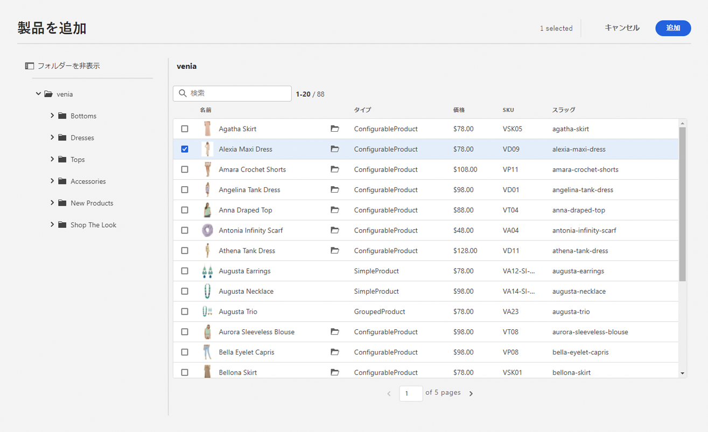

親カテゴリをクリックすると、作成者は製品レベルに戻ります。

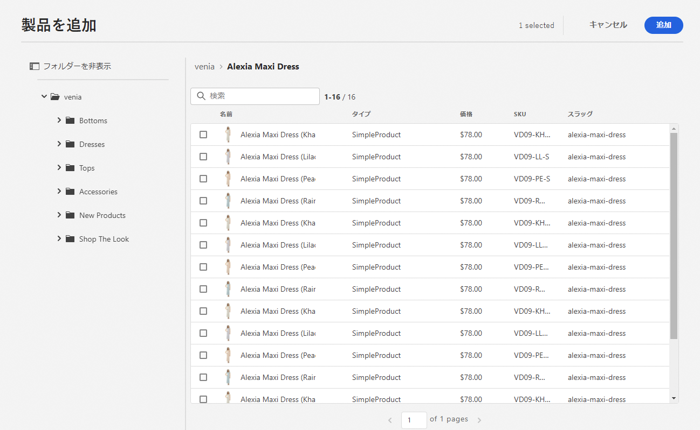

**製品ティーザーの例**

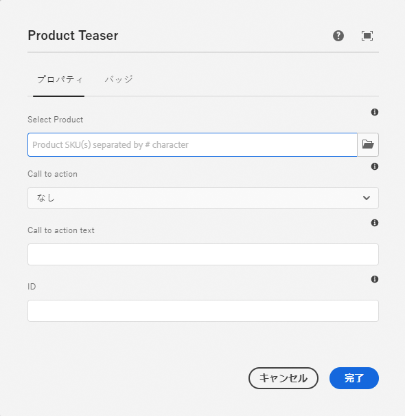

このコンポーネントの設定ダイアログには製品が必要です。 CIF では SKU を製品識別子として使用します。 作成者は、sku を手動で入力するか、フォルダーアイコンをクリックして製品ピッカーを開くことができます。 ピッカーを選択して閉じると、コンポーネントダイアログに選択した製品の名前が表示されます

### カテゴリピッカー {#category-picker}

このピッカーは、カタログ構造を参照してカテゴリを検索する機能を提供します。

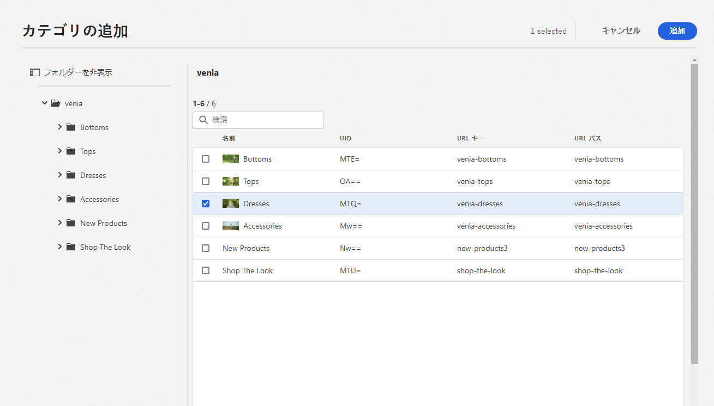

**カルーセルの例**

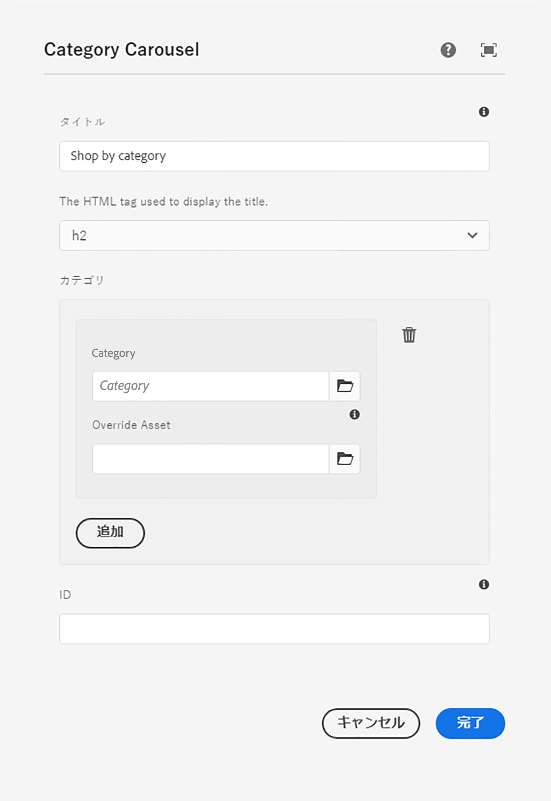

このコンポーネントの設定ダイアログには、1 つが必要です。n 個のカテゴリ。 CIF では、カテゴリ識別子として UID / ID を使用します。 作成者は、手動で UID を入力するか、フォルダーアイコンをクリックしてカテゴリピッカーを開くことができます。 ピッカーを選択して閉じると、コンポーネントダイアログに選択したカテゴリの名前が表示されます。

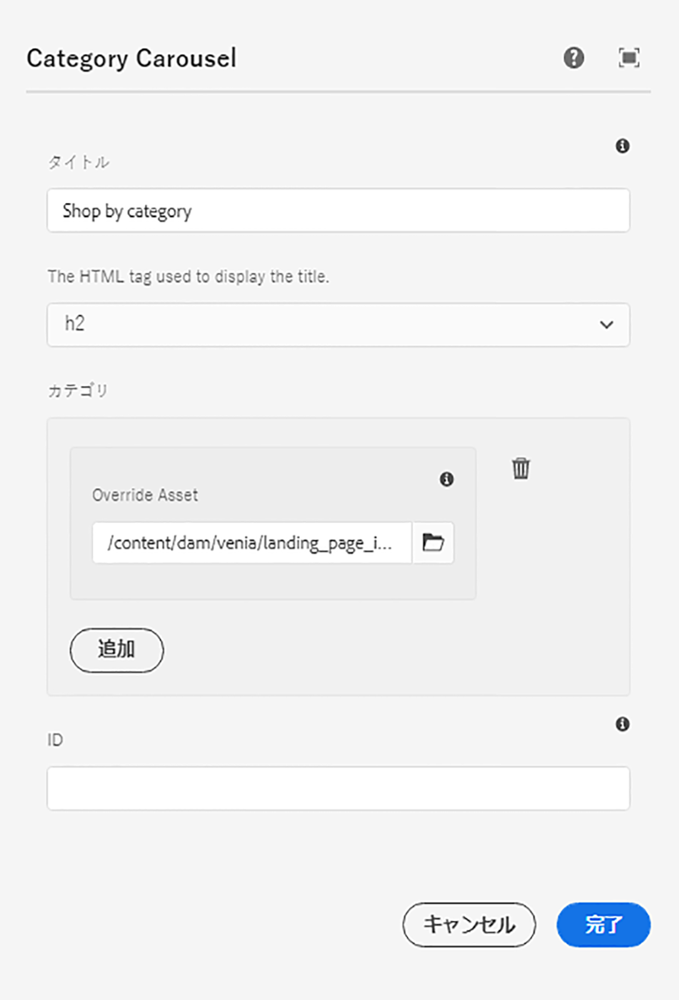

## ユニバーサルエディタ {#universal-editor}

ユニバーサルエディターは、リアルタイムの製品データと関連する製品コンテンツにアクセスする機能で拡張されます。

### 製品データへのアクセス {#access-product-data}

エディターのサイドパネルの「アセット」タブでは、「製品」タイプを選択して、製品データにアクセスできます。 データは、設定されたコマースエンドポイントからライブで取得されます。 このフィルターは、特定の製品を見つけるための、コマースエンドポイントの全文検索です。

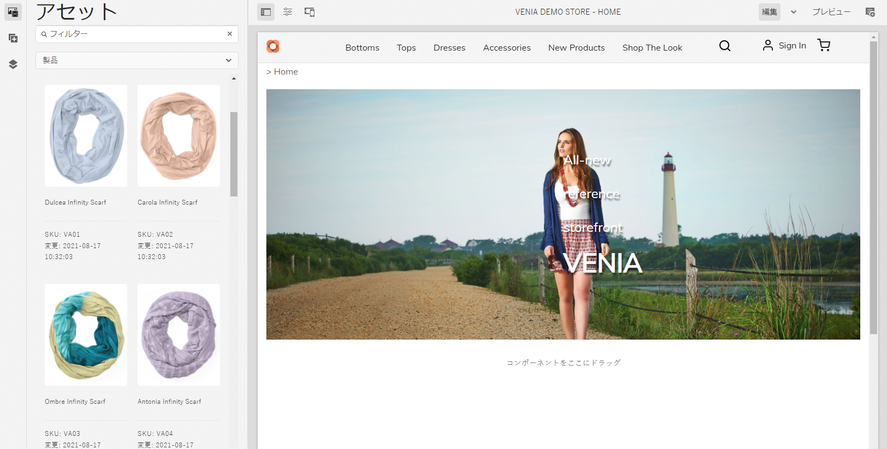

アセットに対するアナログ、製品は、ページ（デフォルトで製品ティーザーコンポーネントを作成）またはコンポーネント（現在サポートされているのは、製品ティーザーと製品カルーセル）で検索できます。

### RTE（リッチテキストエディター）を使用したテキストフィールドでの製品ページまたはカテゴリページへのリンクの追加  {#rte}

CIF 製品カタログページは、その場でレンダリングされる仮想ページです。 したがって、通常のAEMページに対してのようなハイパーリンクを埋め込むことはできません。 CIF が RTE に新しいアクション「コマースリンク」を追加します。 このアクションは、通常の「ハイパーリンク」アクションと同じように機能しますが、作成者はピッカーを使用して製品またはカテゴリを選択できます。

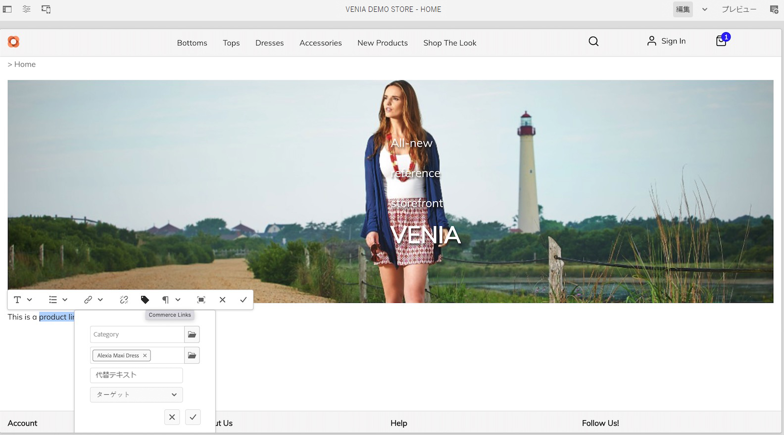

    >[！注意 ]
    >
    > カテゴリと製品の両方が選択された場合、製品が選択されます。

これにより、ページのレンダリング時に実際のリンクに置き換えられるプレースホルダーリンクが作成されます。

### 関連する製品コンテンツへのアクセス {#associated-content}

ユニバーサルエディターがページ上で 1:n 個の製品を認識した場合、サイドパネルに「関連コマースコンテンツ」タブが自動的に表示されます。 このタブを使用すると、作成者は、製品でタグ付けされたAEMコンテンツにすばやくアクセスできます ( [関連するAEMコンテンツを使用した製品データのエンリッチメント](./enrich-product-associated-content.md) を参照 )。 このタブには、ページ上に複数の製品が存在する場合に、コンテンツタイプや特定の製品をフィルタリングするためのドロップダウンが表示されます。 コンテンツの使用は、「アセット」タブのコンテンツの使用とまったく同じように機能します。

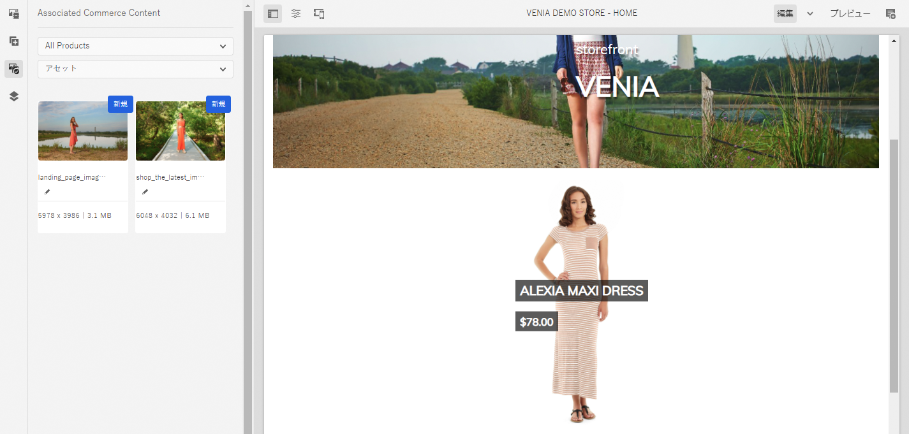

### ステージングされた製品データのプレビュー {#staged-data}

エディターのタイムワープモードを使用すると、作成者は、タイムワープの日付に基づいて、ステージングされた製品カタログデータを使用してAEMエクスペリエンスをプレビューおよび参照できます。

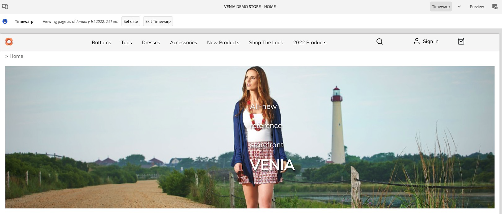

使用された日付がステージング済みの場合、コンポーネントには視覚的なインジケーターが表示されます。

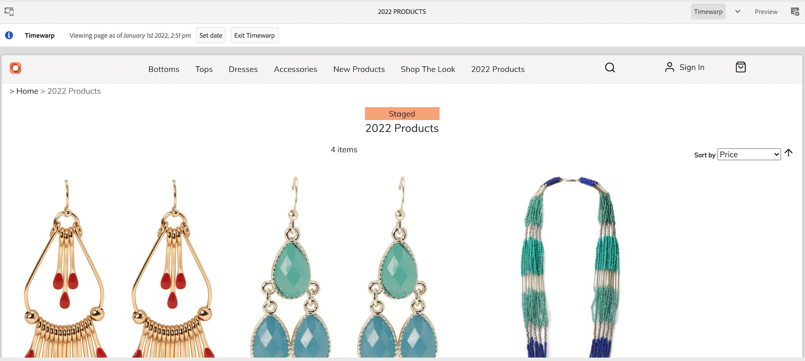

## オムニサーチ {#omnisearch}

オムニサーチを使用すると、実務担当者は全文検索を使用してAEMコンテンツおよび製品カタログデータを簡単に見つけることができます。 オムニサーチは、AEMおよびコマースバックエンドで全文検索を実行し、コマースバックエンドとAEMコンテンツで製品カタログオブジェクトを検索します。 AEMの結果には、製品/カテゴリデータでタグ付けされたコンテンツも含まれます。

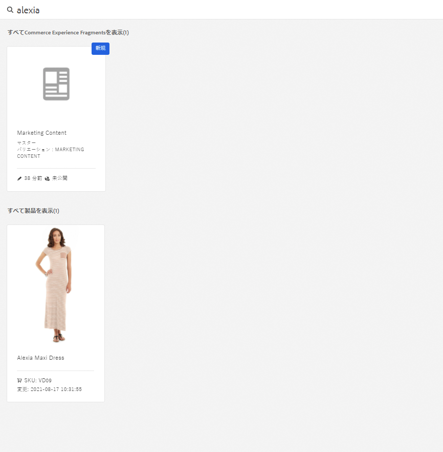

結果はタイプ別にグループ化されます。

    >[！注意 ]
    >
    オムニサーチの > 全文検索では、関連するコンテンツフラグメントはサポートされません。 SKU または UID を使用して、関連するコンテンツフラグメントを検索します。
