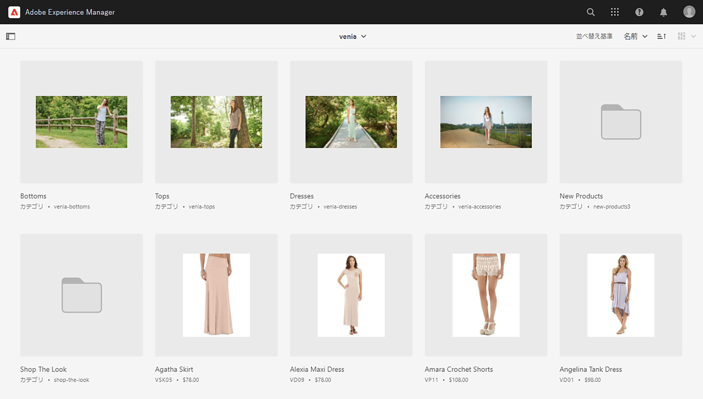
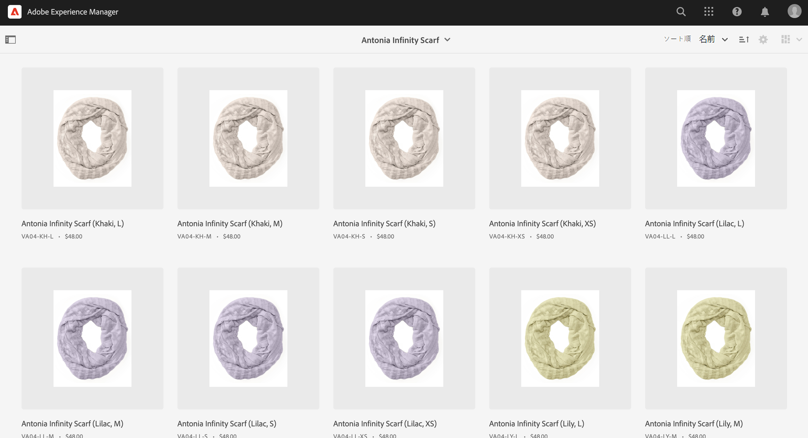
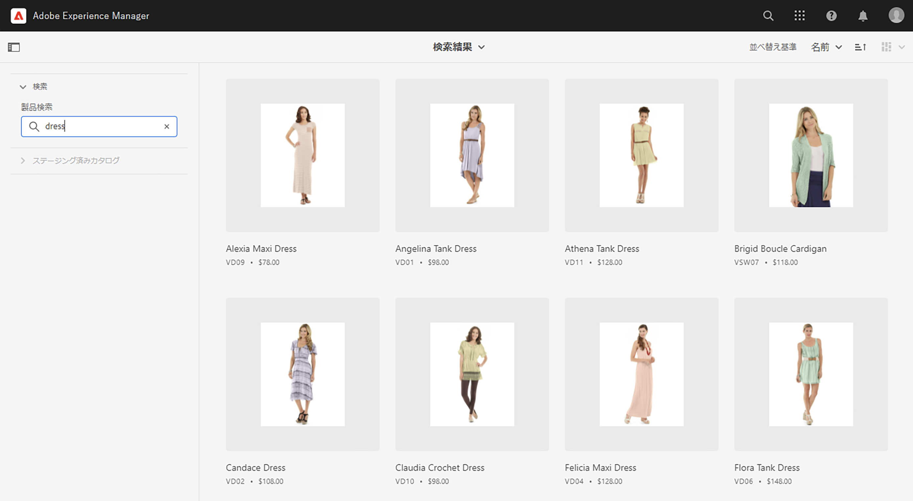
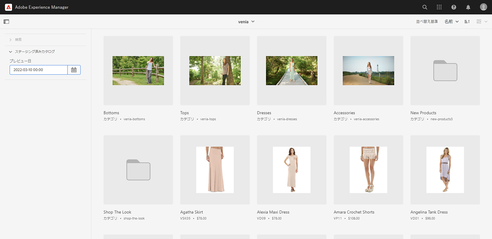
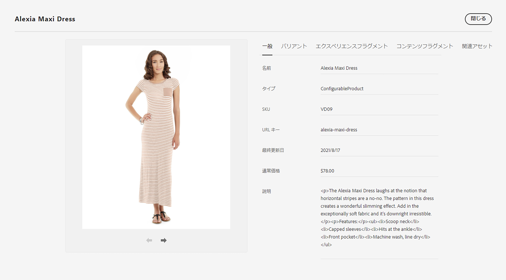
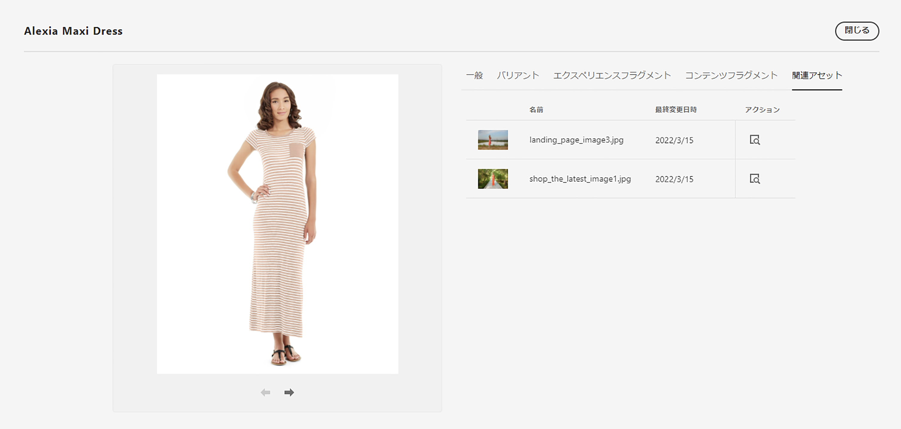

# 製品コックピット {#product-cockpit}

## 概要 {#overview}

製品コックピットでは、リンクされた製品カタログと関連コンテンツの概要を統一して提供します。 関連するすべてのコンテンツには、コックピットからすばやくアクセスできるリンクがあります。

ステージングされた製品データには、新しいカテゴリ、製品、更新されたプロパティなど、将来的に変異が含まれます。

>[!NOTE]
>
>商品カタログという用語は、コマースストア、ストア表示、類似した式と交換できます。

## 設定 {#configuration}

商品カタログは、AEMで設定する必要があります。 詳しくは、 [ストアとカタログの設定](https://experienceleague.adobe.com/docs/experience-manager-cloud-service/content-and-commerce/storefront/getting-started.html?#catalog) を参照してください。

ステージング済みカタログ機能を有効にするには、認証が必要です。 詳しくは、 [はじめに](https://experienceleague.adobe.com/docs/experience-manager-cloud-service/content-and-commerce/storefront/getting-started.html) を参照してください。

>[!NOTE]
>
>ステージング済みカタログ機能は、トークンベースの認証をサポートするAdobe Commerceおよびサードパーティコネクタでのみ使用できます。

## 製品コックピットを開く {#opening-product-cockpit}

製品コックピットにアクセスする最も簡単な方法は、AEMのメインメニューの「コマース」メニューを使用することです。 オムニサーチ（コマースを検索）を使用するか、 `https://<yourAEMInstance>/commerce.html`.

## 商品カタログの参照 {#browsing-product-catalogs}

プロダクトコックピットは、プロダクトカタログ構造に従って階層的に編成されます。 第 1 レベルは、コマースバックエンドのメタ情報を含む、設定済みのすべての製品カタログのカタログルートレベルを示します。

カテゴリをクリックすると、クリックされたカテゴリの子が読み込まれます。

製品をクリックすると、製品のバリエーションが読み込まれます（可能な場合）。

>[!NOTE]
>
>AEMの製品カタログデータは、設定されたコマースエンドポイントを介してリアルタイムに取得されるデータです。 製品カタログデータがAEMに保存されていません。

## 商品カタログの検索 {#searching-product-catalog}

製品カタログ全体に対する全文検索が左側のフィルタータブに表示され、製品をすばやく検索できます。

## ステージング済み製品カタログの参照 {#staged-product-catalogs}

デフォルトでは、製品コックピットには、ライブ製品カタログデータが表示されます。 左のフィルタータブの「STAGED CATALOG」を使用すると、選択した日付の商品カタログが読み込まれます。

## 商品カタログのプロパティ {#catalog-properties}

製品またはカテゴリのプロパティアイコンをクリックすると、選択したオブジェクトのプロパティビューが開きます。 製品バリアントの「プロパティを開く」は、メインの製品プロパティを開く場合と同じです。

### コマースタブ {#tabs}

「一般」タブと「バリアント」タブには、コマースバックエンドから取得された事前定義済みのコマースプロパティが表示されます。 このデータ ( バリアント型 ) はAEMの読み取り専用データです。レコードのシステムがコマースバックエンドなのでです。 バリアントを含む製品の場合にのみ「バリアント」タブが表示され、すべてのバリアントのリストが表示されます。

### AEM Content タブ {#content-tabs}

これらのタブはAEMコンテンツタイプ（エクスペリエンスフラグメント、コンテンツフラグメント、関連アセット）別にグループ化され、コマースオブジェクトに関連付けられたAEMコンテンツを表示します。 「詳細を表示」アクションを実行すると、選択したコンテンツを含む新しいブラウザータブが開きます。

