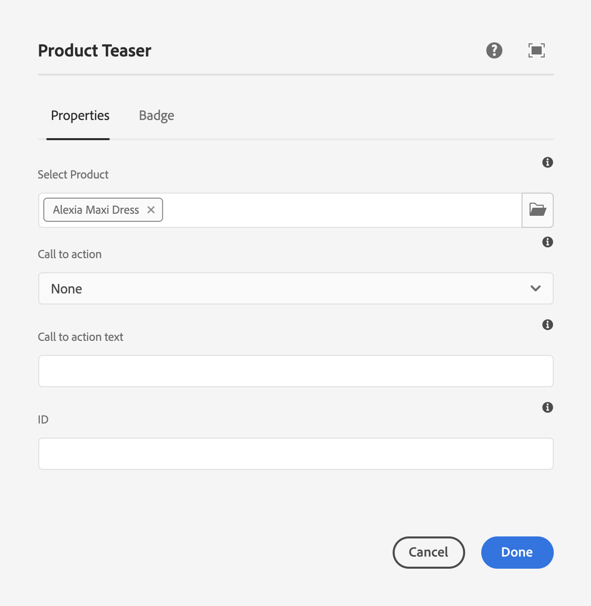

# コマースエクスペリエンスのオーサリング {#authoring-commerce-experiences}

## 概要 {#overview}

CIF アドオンは、コマース固有の機能を使用して AEM オーサリングを拡張します。これにより、作成者は、コンテキストを離れることなく製品データやコンテンツにアクセスして、コマース関連のエクスペリエンスを効率的に作成および管理できます。

## ピッカー {#pickers}

製品ピッカーとカテゴリピッカーは、AEM 作成者が必要に応じて製品やカテゴリを見つけ、選択するための快適な方法を提供するモーダル UI ダイアログです。コアコンポーネント、コンテンツの関連付け、製品テンプレートは、製品カタログデータを必要とする構成の典型的なものです。ピッカーは、複数選択、バリエーション選択、値の事前選択など、様々な設定オプションをサポートしています。

### 製品ピッカー {#product-picker}

このピッカーは、製品を見つけるためにカタログ構造によるブラウジングや全文検索を提供します。バリエーションを持つ製品には、「タイプ」列にフォルダーアイコンが表示されます。フォルダーアイコンをクリックすると、選択した製品のバリエーションが開きます。

親カテゴリをクリックすると、作成者は製品レベルに戻ります。

#### 製品ティーザーの例 {#example-product-teaser}

このコンポーネントの設定ダイアログには製品が必要です。CIF では SKU を製品識別子として使用します。作成者は、SKU を手動で入力するか、フォルダーアイコンをクリックして製品ピッカーを開くことができます。ピッカーを選択して閉じると、コンポーネントダイアログに選択した製品の名前が表示されます

### カテゴリピッカー {#category-picker}

このピッカーは、カテゴリを見つけるためにカタログ構造によるブラウジングを提供します。

#### カテゴリカルーセルの例 {#example-carousel}

このコンポーネントの設定ダイアログには、1 : n のカテゴリが必要です。CIF では、カテゴリ識別子として UID / ID を使用します。作成者は、手動で UID を入力するか、フォルダーアイコンをクリックしてカテゴリピッカーを開くことができます。ピッカーを選択して閉じると、選択したカテゴリの名前がコンポーネントダイアログに表示されます。

## ページエディター {#page-editor}

AEM のページエディターは、リアルタイムの製品データと関連する製品コンテンツにアクセスする機能で拡張されています。

### 製品データへのアクセス {#access-product-data}

エディターのサイドパネルの「アセット」タブでは、「製品」タイプを選択すると製品データにアクセスできます。データは、設定されたコマースエンドポイントからライブで取得されます。このフィルターは、コマースエンドポイントで全文検索を行い、特定の製品を探し出します。

アセットと同様に、製品はページ（デフォルトで製品ティーザーコンポーネントを作成）またはコンポーネント（現在サポートされているのは商品ティーザーと商品カルーセル）に DND できます。

### RTE を使用したテキストフィールドへのリンクの追加 {#rte}

CIF 製品カタログページは、その場でレンダリングされる仮想ページです。そのため、通常の AEM ページのようにハイパーリンクを埋め込むことはできません。CIF によって、RTE（リッチテキストエディター）に新しいアクション「コマースリンク」が追加されます。このアクションは、通常の「ハイパーリンク」アクションとまったく同じように機能しますが、作成者はピッカーを使用して製品またはカテゴリを選択できるようになります。

>[!NOTE]
>
> カテゴリと製品の両方を選択した場合は、製品が使用されます。

これにより、ページのレンダリング時に実際のリンクに置き換えられるプレースホルダーリンクが作成されます。

### 関連する製品コンテンツへのアクセス {#associated-content}

エディターがページ上で 1:n の商品を認識すると、サイドパネルに「関連するCommerceコンテンツ」タブが自動的に表示されます。 このタブを使用すると、作成者は、その製品がタグ付けされた AEM コンテンツにすばやくアクセスできます（詳しくは、 [関連する AEM コンテンツを使用した製品データのエンリッチメント](/help/commerce-cloud/cif-storefront/authoring/enrich-product-associated-content.md) を参照してください）。このタブには、ページ上に複数の製品が存在する場合に、コンテンツタイプや特定の製品をフィルタリングするためのドロップダウンが表示されます。コンテンツの使用は、「アセット」タブのコンテンツの使用とまったく同じように機能します。

### ステージングされた製品データのプレビュー {#staged-data}

エディターのタイムワープモードを使用すると、作成者は、タイムワープの日付に基づいて、ステージングされた製品カタログデータを使用して AEM エクスペリエンスをプレビューおよび参照できます。

使用された日付がステージング済みの場合、コンポーネントには視覚的なインジケーターが表示されます。

## オムニサーチ {#omnisearch}

オムニサーチを使用すると、実務担当者は全文検索を使用して AEM コンテンツおよび製品カタログデータを簡単に見つけることができます。オムニサーチは、AEM およびコマースバックエンドで全文検索を実行し、コマースバックエンドと AEM コンテンツで製品カタログオブジェクトを検索します。AEM の結果には、製品／カテゴリデータでタグ付けされたコンテンツも含まれます。

結果はタイプ別にグループ化されます。

>[!NOTE]
>
> オムニサーチの全文検索では、関連するコンテンツフラグメントはサポートされていません。SKU または UID を使用して、関連するコンテンツフラグメントを検索します。
