# 製品カタログのページとテンプレートを管理 {#product-catalog}

製品カタログのページとテンプレートの管理方法を説明します。

## これまでの説明内容 {#story-so-far}

AEM コンテンツとCommerce オーサリングジャーニーの前のドキュメント「[AEM CIF オーサリングの基本を学ぶ」では、CIF オーサリングの基本について説明しました。](/help/commerce-cloud/cif-storefront/commerce-journeys/aem-commerce-content-author/getting-started.md)

この記事は、これらの基本事項に基づいて作成されています。

## 目的 {#objective}

このドキュメントでは、製品カタログのページとテンプレートの管理方法を確認します。読み終えると、次のことができるようになります。

* カタログテンプレートの概念を理解する
* 汎用テンプレートの仕組み
* 個々のテンプレートを作成している

## 基本概念 {#basic-concept}

Venia ストアフロントには、ナビゲーション、ランディング、カテゴリ（PLP）、製品詳細ページ（PDP）などの一般的な製品カタログのエクスペリエンスが付属しています。

カタログページは、AEM CIF カタログテンプレートと製品データを使用して動的に作成されます。製品データは、必要時にコマースエンドポイントからリアルタイムに取得されます。あらゆるカタログには、商品ページとカテゴリーページ用の汎用テンプレートが用意されています。

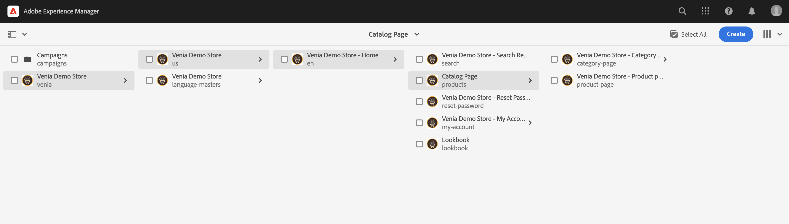

ナビゲーションコンポーネントは、コンテンツページとカタログページを表示します。ナビゲーションには、カタログのランディングページまたは第 1 レベルのカテゴリを表示できます。カテゴリの上にマウスポインターを置くと、2行目に2番目のレベルのカテゴリが表示されます。

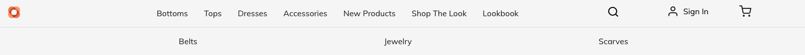

カテゴリをクリックすると、カテゴリページ（または製品の一覧ページ）が開きます。

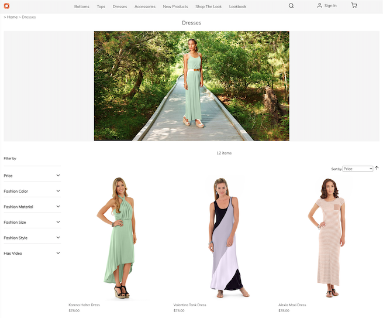

製品をクリックすると、製品の詳細ページが開きます。

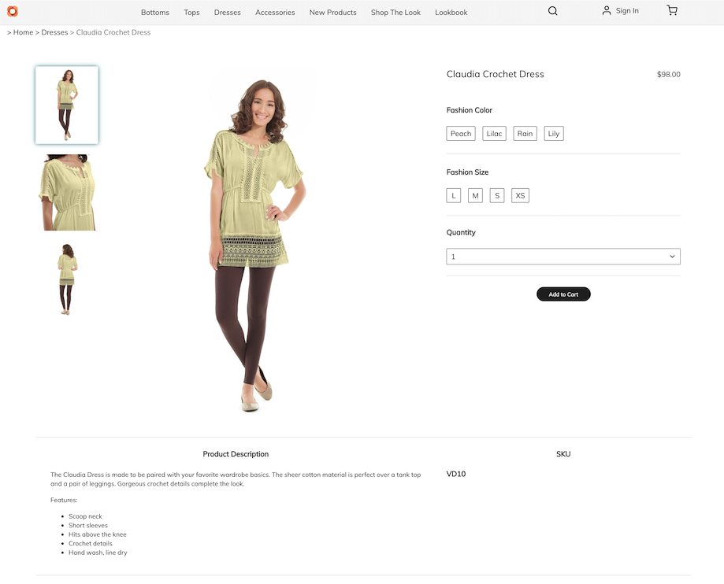

## テンプレート {#templates}

### 汎用テンプレート {#generic}

汎用の Venia カタログテンプレートは、製品リストコアコンポーネントを使用します。 このコンポーネントは、カテゴリ画像が使用可能な場合はカテゴリ画像を表示し、カテゴリの製品を表示します。

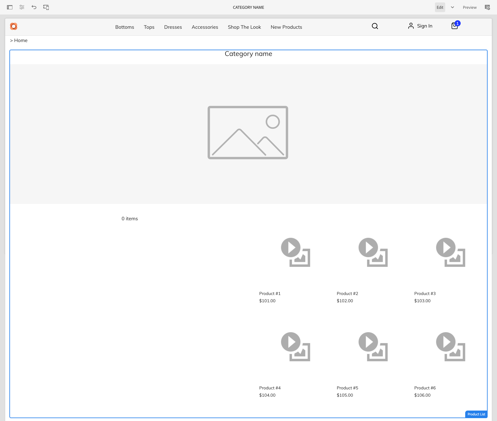

汎用の Venia 製品テンプレートでは、製品詳細コアコンポーネントを使用します。 このコンポーネントには、様々な製品タイプとカートへの追加操作に関する製品情報が表示されます。

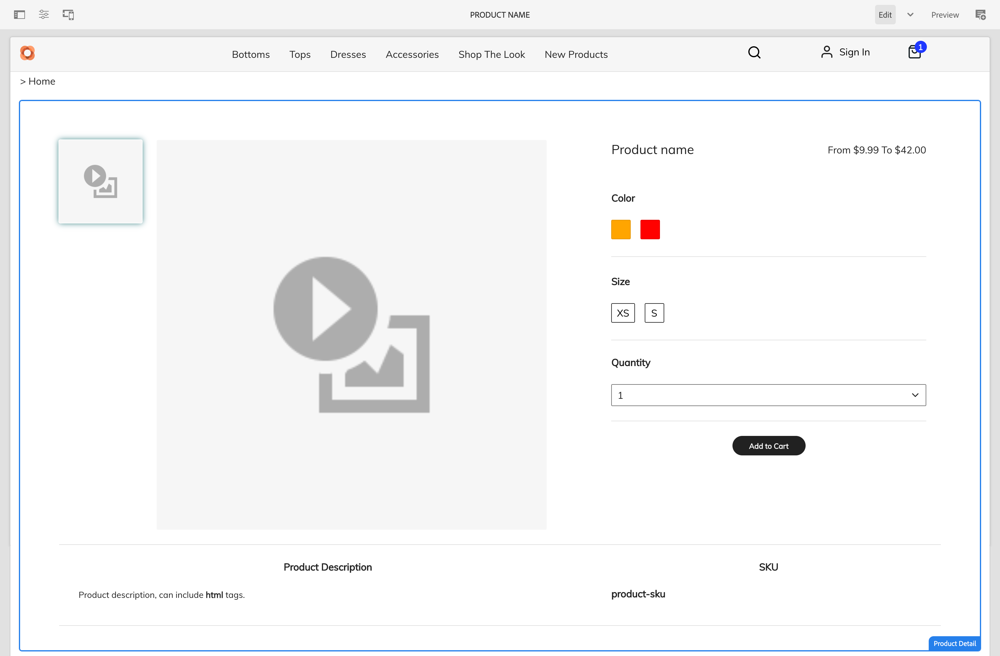

### テンプレートを編集 {#edit-templates}

テンプレートを編集するには、テンプレートページを直接開くか、製品カタログページを参照しながら編集モードに切り替えます。ページを変更すると、製品やカテゴリの特定のページだけでなく、テンプレートが変更されることに注意してください。

### カテゴリまたは製品に固有のテンプレート {#specific}

CIF は、数回のクリックで複数のテンプレートをサポートします。 別のテンプレートを作成するには、それぞれのカテゴリから汎用テンプレートを選択し、「**作成**」アクションを使用してページを作成します。

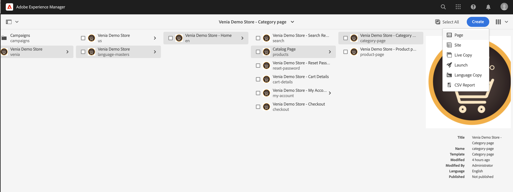

各製品またはカテゴリのテンプレートを選択します。

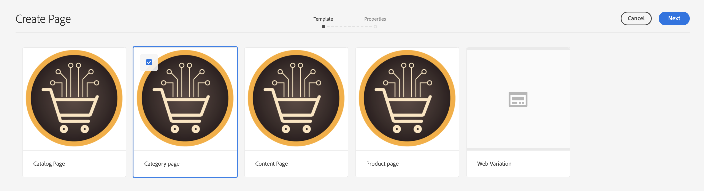

タイトルを入力し、ページを作成します。

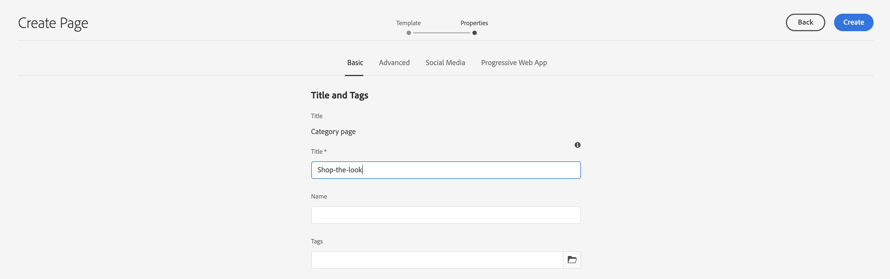

汎用テンプレートの下に特定のテンプレートが作成されました。

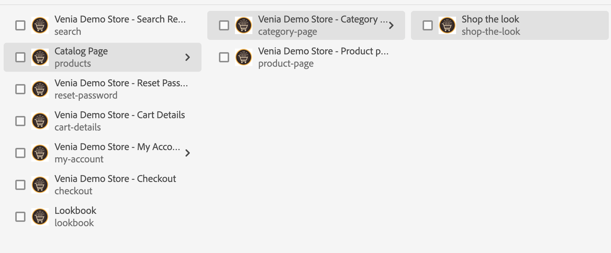

テンプレートを開きます。汎用カテゴリテンプレートとまったく同じ外観です。

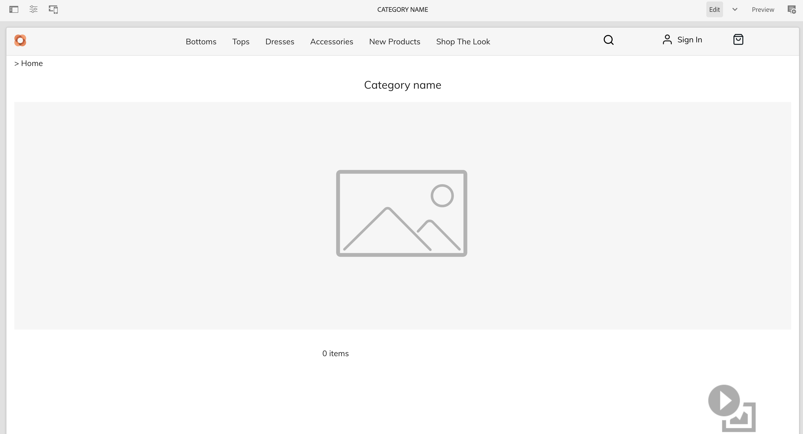

画像をページの上に追加します。

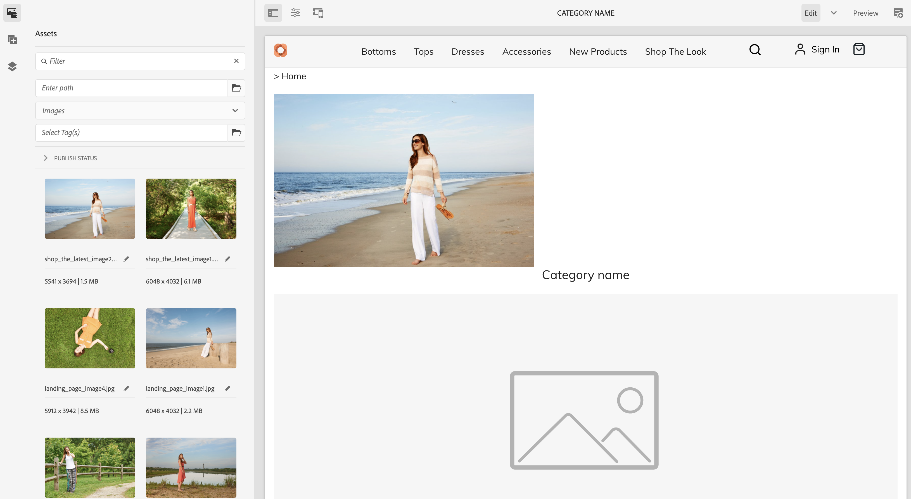

テンプレートは、任意のカテゴリ/製品でプレビューできます。 **ページ情報**&#x200B;を開き、「**カテゴリ/製品で表示**」を選択します。 ピッカーから製品/カテゴリを選択して、この製品/カテゴリのプレビューを表示します。 更新されたテンプレートのプレビューを取得するには、 **商品の陳列** カテゴリを選択します。

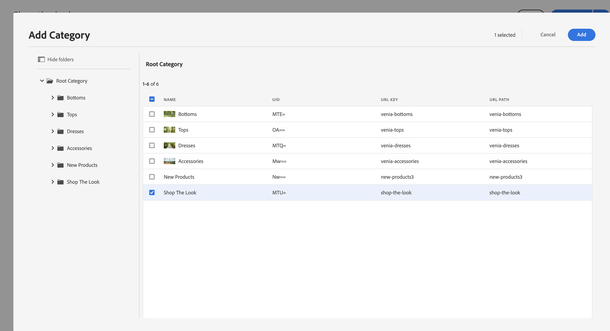

次に、このテンプレートを具体的なカテゴリに割り当てる必要があります。**ページ情報** メニューでプロパティを開き、「コマース」タブに切り替えます。フォルダーアイコンをクリックして、カテゴリピッカーから&#x200B;**商品の陳列**&#x200B;カテゴリを選択します。チェックボックスをオンにすると、1 つのテンプレートに複数のカテゴリを割り当てたり、サブカテゴリも含めたりできます。

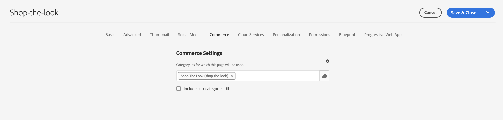

メインのホームページに戻り、 **商品の陳列**&#x200B;カテゴリをクリックして、特定のテンプレートを表示します。その他のカテゴリでは、すべて汎用テンプレートが使用されます。

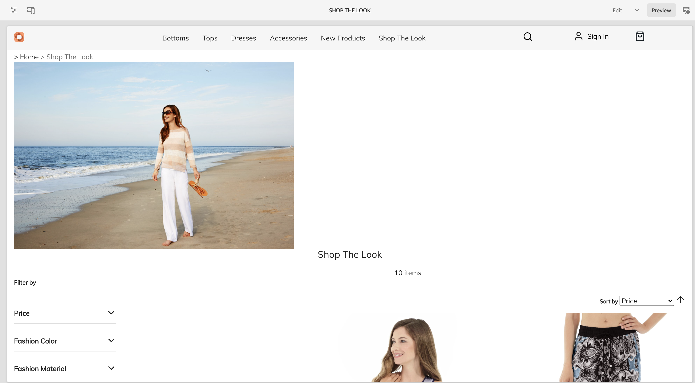

同じワークフローを適用して、個々の製品テンプレートを作成できます。

## 次の手順 {#what-is-next}

これで、ジャーニーのこのステップが完了しました。次のことを行う必要があります。

* カタログテンプレートの概念を理解する
* 汎用テンプレートの仕組み
* 個々のテンプレートを作成している

この知識を基に、次にステージング済み製品カタログエクスペリエンスを管理する[&#x200B; ドキュメントを確認して、ジャーニーを続けてください。このドキュメントでは、ステージング済み製品データとAEM Launchの操作方法について説明します。](/help/commerce-cloud/cif-storefront/commerce-journeys/aem-commerce-content-author/staged-catalog.md)

## その他のリソース {#additional-resources}

ドキュメント [&#x200B; ステージング済み製品カタログエクスペリエンスの管理](/help/commerce-cloud/cif-storefront/commerce-journeys/aem-commerce-content-author/staged-catalog.md)を確認して、ジャーニーの次のパートに進むことをお勧めします。次に示すのは、このドキュメントで取り上げたいくつかの概念について詳しく説明する追加のオプションのリソースですが、ヘッドレスジャーニーを続ける必要はありません。

* [複数のカテゴリページと製品ページの作成](/help/commerce-cloud/cif-storefront/authoring/multi-template-usage.md)
* [Experience Manager Cloud Service への移行ガイド](/help/commerce-cloud/cif-storefront/migration.md) - 古いバージョンから AEM Commerce 統合フレームワーク（CIF）アドオンに移行する方法
