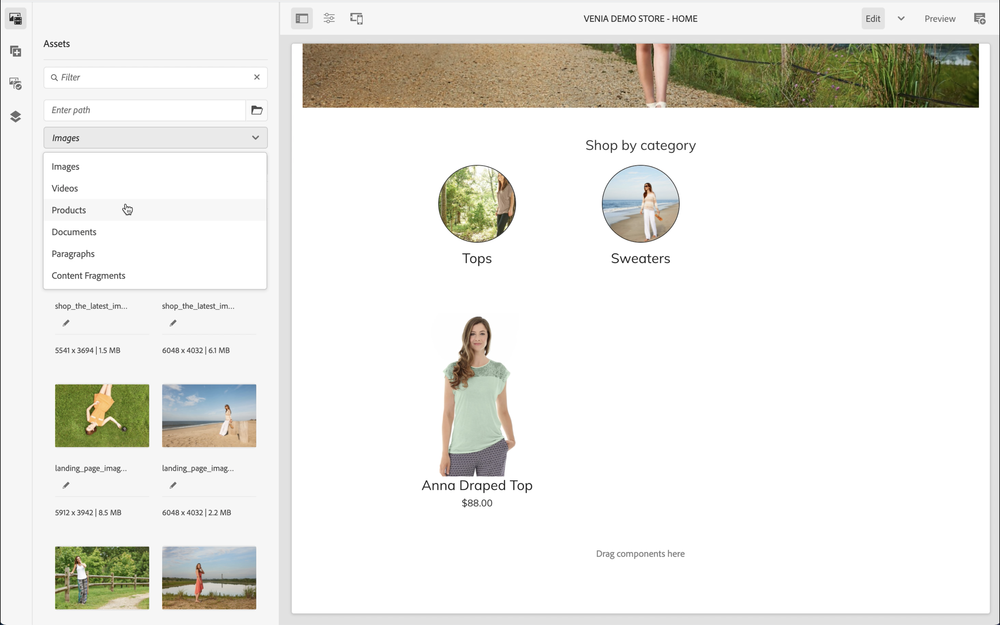
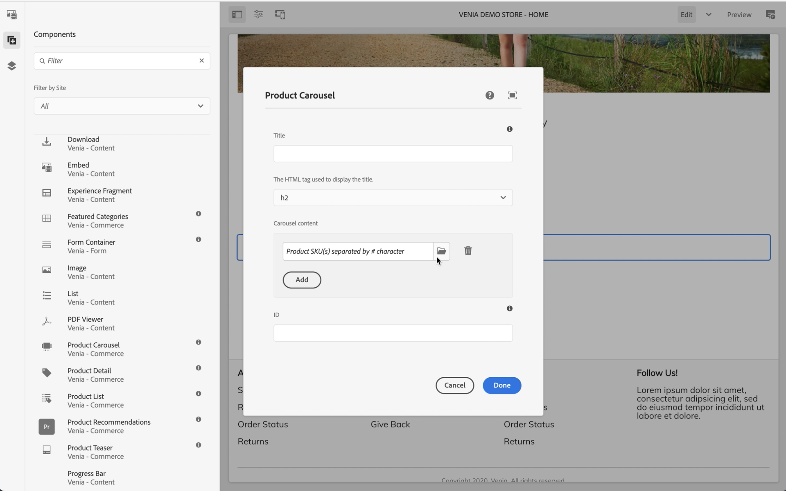
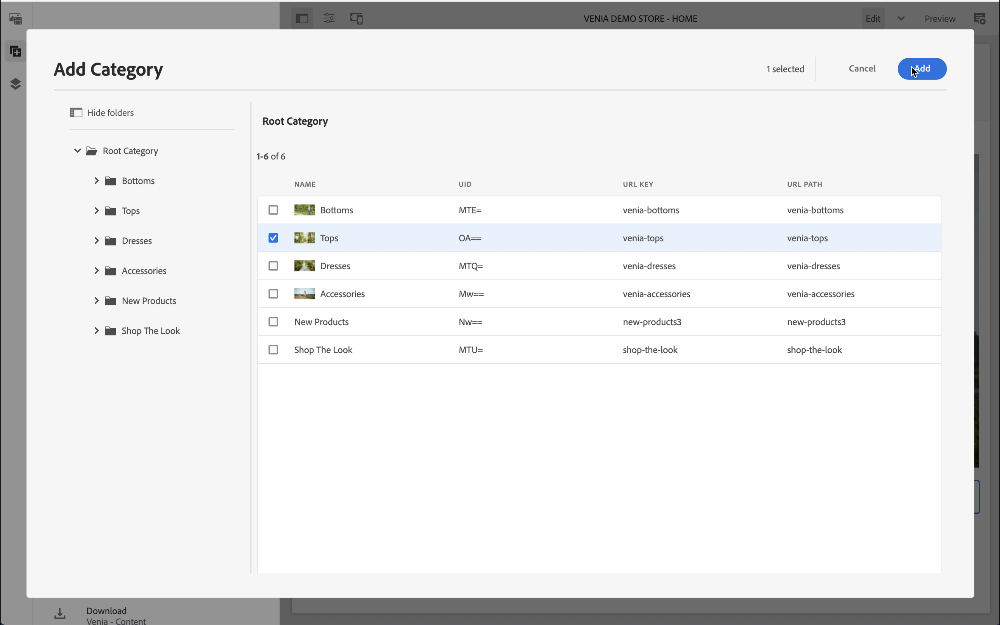
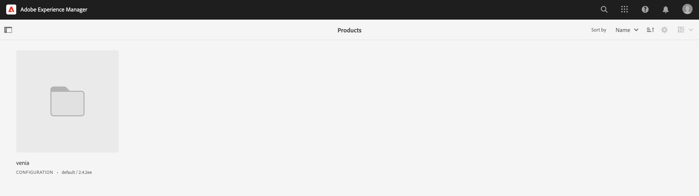
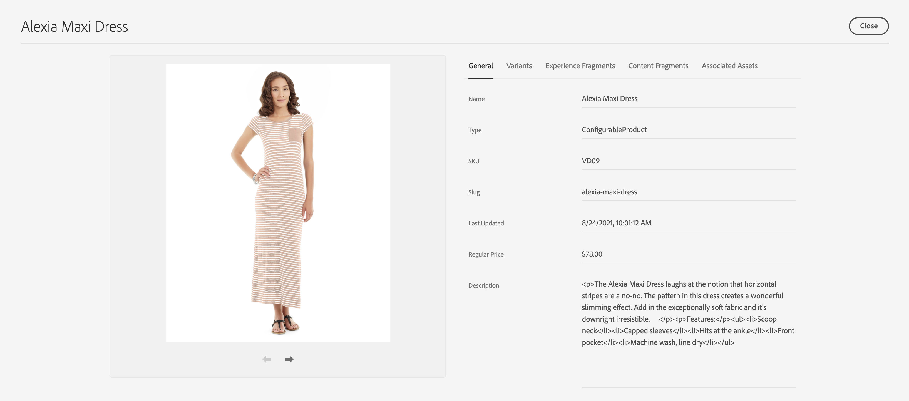
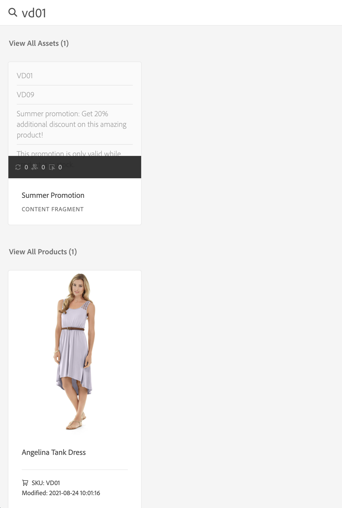

# AEM CIF オーサリングの概要 {#getting-started}

Adobe Experience Manager（AEM）CIF オーサリングについて説明します。

## これまでの説明内容 {#story-so-far}

AEM コンテンツとCommerce ジャーニーの前のドキュメント [AEM コンテンツとCommerceについて &#x200B;](/help/commerce-cloud/cif-storefront/introduction.md) では、ヘッドレス CMSとAEM コンテンツおよびCommerceの基本概念を説明しました。

この記事は、これらの基本事項に基づいて作成されています。

## 目的 {#objective}

このドキュメントでは、Content and Commerce 特有のオーサリングに CIF を使用する方法を確認します。読み終えると、次のことができるようになります。

* AEM のページエディターを使用した CIF オーサリングの概念を理解する
* 製品およびカテゴリの選択機能を使用して AEM の製品カタログデータにアクセスする方法
* 製品コックピットおよび AEM オムニサーチを使用して Content and Commerce のデータにアクセスする方法

## AEM ページエディターでの CIF オーサリング {#cif-authoring}

CIF は、コンテキストを離れずにリアルタイムの製品データにアクセスできる機能を備えた AEM のページエディターを拡張します。

サイドパネルを開き、ドロップダウンリストから「製品」を選択します。

製品カタログを参照するか、全文検索フィールドを使用して製品を検索できます。

製品は、製品ティーザーコンポーネントを自動的に作成するページ上に、製品ドロップをサポートするコンポーネント（製品ティーザー、製品カルーセルなど）に直接ドロップできます。

## 製品およびカテゴリの選択 {#pickers}

AEM 作成者は、コマースコンポーネントや AEM のバックオフィスダイアログで製品およびカテゴリデータが必要な場合、UI 要素であるピッカーを使用して、製品カタログデータを快適に検索して選択できます。

### 製品ピッカー {#product-picker}

フォルダーアイコンをクリックすると、ピッカーモーダル UI （製品ティーザーなど）が開きます。

製品は、左側のカタログ構造を参照するか、検索して見つけることができます。フルテキスト検索では、選択したカテゴリが適用され、検索結果がこのカテゴリに限定されます。

バリエーションを持つ製品には、すべてのバリエーションを表示するためにクリックできるフォルダーアイコンが付きます。

### カテゴリピッカー {#category-picker}

製品ピッカーのように機能します。 フォルダーアイコンをクリックすると、ピッカーモーダル UI （カテゴリカルーセルなど）が開きます。

左側のカタログ構造を参照し、カテゴリを選択します。

## 製品コックピット {#cockpit}

製品コックピットは、エンリッチメントされたコンテンツを含む製品カタログにすばやくアクセスするための中心的な場所です。次のモジュールの 1 つで、製品データをコンテンツでエンリッチメントする方法を学習します。ここでは、製品データへのアクセスに焦点を当てます。

メインメニューで「コマース」をクリックし、添付されているすべての製品カタログのリストを表示します。

これは、接続されているすべての製品カタログのリストを表示します。

製品カタログでは、すべての第 1 レベルのカテゴリを、すべての製品とともにデフォルトで表示します。カテゴリをクリックすると、そのカテゴリが開き、関連するすべての製品とサブカテゴリ（製品を含む）が表示されます。

プロパティアイコンをクリックして、製品プロパティを開くことができます。アイコンは、製品タイルにカーソルを合わせると表示されます。

接続されたバックエンドからデータがリアルタイムで読み込まれるので、すべての製品プロパティは読み取り専用です。製品プロパティの変更は、レコードがあるシステムであるバックエンドシステムで行う必要があります。「**バリアント**」タブは、製品にバリエーションがある場合にのみ表示されます。タブをクリックすると、すべてのバリエーションとその属性が表示されます。

残りのタブには、製品に関連付けられているすべての AEM コンテンツが表示されます。これらのタブについて詳しくは、次のモジュールの 1 つで説明します。

## AEM オムニサーチ {#omnisearch}

オムニサーチを使用すると、全文検索を使用して AEM コンテンツを簡単に見つけることができます。CIFは、商品カタログとその関連するAEM コンテンツの全文検索で、オムニサーチを拡張します。

オムニサーチは、コマースバックエンドで全文検索を実行し、関連するすべての製品を検索します。結果は、**すべての製品を表示**&#x200B;に一覧表示されます。オムニサーチでは、検索した製品に関連付けられたコンテンツを AEM で検索します。結果は、それぞれの AEM カテゴリに表示されます。この例では、1 つのコンテンツフラグメントが製品に関連付けられています。

## 次の手順 {#what-is-next}

これで、ジャーニーのこのステップが完了しました。次のことを行う必要があります。

* ページエディターを使用した CIF オーサリングの概念を理解する
* 製品およびカテゴリの選択機能を使用して AEM の製品カタログにアクセスする方法
* 製品コックピットおよび AEM オムニサーチを使用して Content and Commerce のデータにアクセスする方法

この知識に基づいて、次は [&#x200B; 製品カタログのページとテンプレートを管理 &#x200B;](/help/commerce-cloud/cif-storefront/commerce-journeys/aem-commerce-content-author/catalog-templates.md) のドキュメントを確認して、ジャーニーを続行してください。そこでは、製品カタログのエクスペリエンスを初めて作成およびカスタマイズする方法を習得します。

## その他のリソース {#additional-resources}

ジャーニーの次のパートである [&#x200B; 製品カタログのページとテンプレートを管理 &#x200B;](/help/commerce-cloud/cif-storefront/commerce-journeys/aem-commerce-content-author/catalog-templates.md) に進むことをお勧めしますが、以下のリソースでは、ここで取り上げた概念について詳しく説明しています。 ただし、これらのオプションのリソースは、ジャーニーを続行するために必要なものではありません。

* [ストアとカタログの設定](/help/commerce-cloud/cif-storefront/getting-started.md#catalog)
