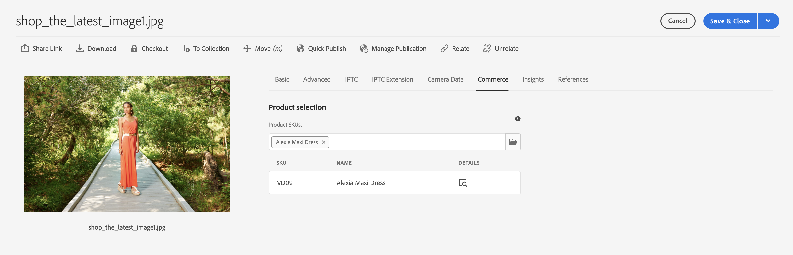
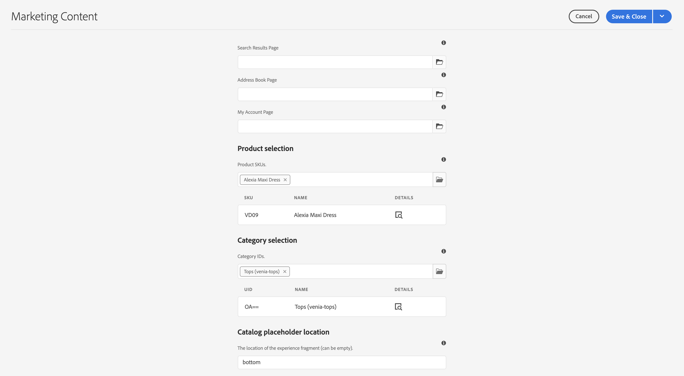
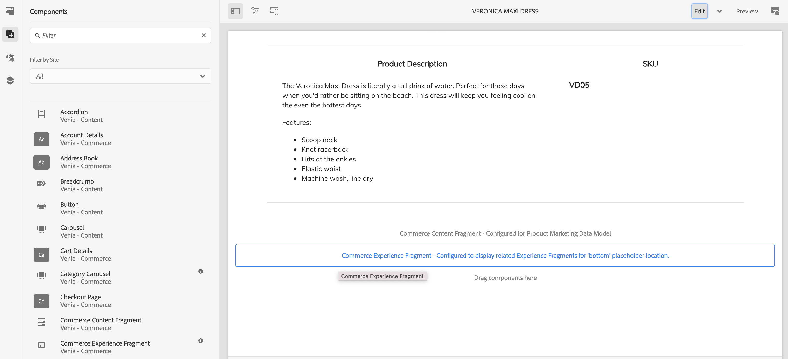
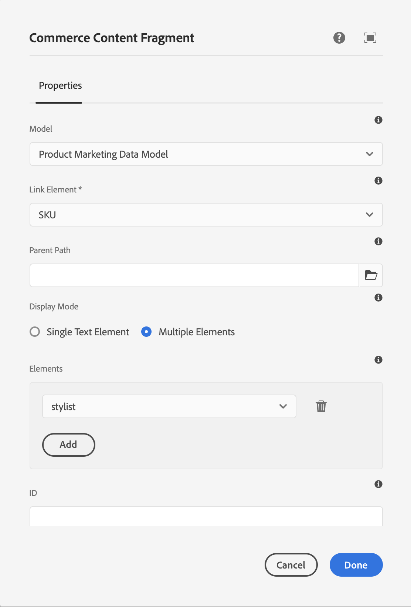

# 製品エクスペリエンスの構築 {#building-experiences}

製品エクスペリエンスの管理方法を説明します。

## これまでの説明内容 {#story-so-far}

Adobe Experience Manager（AEM）コンテンツおよびCommerce ジャーニーの以前のドキュメント [&#x200B; ステージングされた商品カタログエクスペリエンスの管理 &#x200B;](/help/commerce-cloud/cif-storefront/commerce-journeys/aem-commerce-content-author/staged-catalog.md) では、ステージングされた商品カタログエクスペリエンスの管理方法を学びました。

## 目的 {#objective}

このドキュメントは、製品のコンテンツとエクスペリエンスを構築する方法を理解するのに役立ちます。

## 製品エクスペリエンス管理 {#management}

製品エクスペリエンス管理は、（PIM またはコマースソリューションが所有する）製品データを AEM のマーケティングコンテンツで修飾する規律です。このコンテンツを含む拡張された製品データを様々なチャネルで使用して、臨場感のあるショッピングエクスペリエンスを作成できます。

AEM では、様々なタイプのコンテンツを作成し、それらを製品カタログにリンクできます。 関連するコンテンツを容易に見つけて使用することで、高い生産性を実現します。

### アセット {#assets}

製品に関連するアセットには、高いレベルでは、製品とマーケティングの 2 種類があります。製品アセットは、マーチャントが管理し、製品の表示を重視します（背景はニュートラルな色が一般的です）。アセットは、コマースソリューションまたはAEM Assets（コマース/PIM ソリューションへのAssets統合を使用）のいずれかで管理されます。

マーケティングアセットは、マーケティングが所有する製品のプロモーションと使用に関連しています。例としては、複数の製品（「Shop The Look」）、特定のコンテキスト（「秋のアウトドアコレクション」）またはハウツー PDF などがあります。CIF は、あらゆる AEM アセットと製品カタログオブジェクトを簡単にリンクさせる方法を提供します。

アセットのプロパティを開き、 **コマース** タブに切り替えます。このタブでは、製品との関連付けを管理できます。ピッカーの下の表は、リンクされたオブジェクトの追加情報を提供します（選択した場合にのみ表示されます）。詳細アイコンをクリックして、製品コックピットで全景を表示します。新しいオブジェクトを関連付けるには、製品ピッカーアイコン（フォルダーアイコン）をクリックし、オブジェクトを選択してピッカーを閉じます。

### エクスペリエンスフラグメント {#experience-fragments}

エクスペリエンスフラグメントは、再利用可能な、または個々の製品コンテンツを大規模に作成するための優れた方法です。関連付けはアセットと同様に機能します。プロパティを開き、「**コマース**」タブに切り替えます。このタブでは、製品やカテゴリとの関連付けを管理できます。ピッカーの下の表は、リンクされたオブジェクトの追加情報を提供します（選択した場合にのみ表示されます）。詳細アイコンをクリックして、製品コックピットで全景を表示します。新しいオブジェクトを関連付けるには、製品ピッカーアイコン（フォルダーアイコン）をクリックし、オブジェクトを選択してピッカーを閉じます。

### コンテンツフラグメント {#content-fragments}

コンテンツフラグメントは、あらゆる構造化コンテンツに最適なコンテンツタイプです。これは、追加のマーケティングデータで外部の製品データを増強したり、ヘッドレスな方法でコンテンツを作成したりするために使用できます。コンテンツフラグメントと製品カタログオブジェクトの関連付けは、コンテンツフラグメントモデルエディターの製品またはカテゴリの参照タイプを通じて行われます。モデルに適切な参照タイプをドラッグ＆ドロップするだけで、フィールドを設定できます。これらのタイプは、単一選択または複数選択をサポートします。

このモデルに基づいてコンテンツフラグメントを作成する場合、これらの参照タイプを使用すると、それぞれのピッカーを使用して適切なオブジェクトを簡単に選択できます。

### 製品コックピット {#product-cockpit}

以前のモジュールの 1 つで、製品コックピット（またはコンソール）について紹介しました。コックピットを使用すると、商品カタログを参照するだけでなく、関連するすべての AEM コンテンツを 1 か所で簡単に確認できます。製品コンソールに移動し、関連コンテンツを持つ製品のプロパティを開きます。各タブに切り替えて、関連するコンテンツを表示します。

アクションアイコンをクリックすると、そのコンテンツが新しいブラウザータブで開きます。

## 個々の製品およびカテゴリページの拡張 {#enrich}

これまでのモジュールでは、複数の製品カタログテンプレートの使用方法を学びました。複数のテンプレートを使用すると、様々なテンプレートを作成できますが、多くの場合は不要です。多くの場合、同じテンプレートを個々のコンテンツのプレースホルダーと共に使用できます。CIF では、コンテンツフラグメントとエクスペリエンスフラグメントのプレースホルダーをサポートしています。

「エクスペリエンスフラグメント」プレースホルダーから始めます。AEM エディターで製品テンプレートを開きます。**コマースエクスペリエンスフラグメント** コンポーネントをテンプレートにドラッグ＆ドロップしてから、設定ダイアログを開きます。

コンポーネントのダイアログを開き、このプレースホルダーの名前を入力します。プレースホルダー名が必要です。必要な数のプレースホルダーを追加できます。

前の手順で製品に関連付けたエクスペリエンスフラグメントを開きます。プロパティを開き、「コマース」タブに切り替えます。**カタログプレースホルダーの場所**&#x200B;に同じプレースホルダー名を入力します。

次に、 **コマースコンテンツフラグメント** コンポーネントをテンプレートにドラッグ＆ドロップして、設定ダイアログを開きます。

このダイアログボックスは、コアコンポーネントのコンテンツフラグメントダイアログボックスを再利用します。詳しくは、その他のリソースを参照してください。唯一の違いは、コンテンツフラグメントモデルの識別子フィールド（製品 SKU またはカテゴリ UID）を設定する **リンク要素** プロパティです。

コンテンツフラグメントまたはエクスペリエンスフラグメントが関連付けられた製品ページをプレビューします。 AEM でページをレンダリングする際に、エクスペリエンスフラグメントのタイプ（コンテンツまたはエクスペリエンスフラグメント）、識別子、プレースホルダー名に基づいて、すべてのプレースホルダーを検索します。AEM では、URL リゾルバーを使用して識別子（製品の SKU、カテゴリの UID）を取得します。エクスペリエンスまたはコンテンツフラグメントが返された場合、そのエクスペリエンスはプレースホルダーの場所にレンダリングされます。それ以外の場合、プレースホルダーは無視されます。

## コンテンツをショッパブルにする {#making-shoppable}

コマースコンポーネントを追加して、通常の AEM ページをショッパブルにすることもできます。AEM でコンテンツページを作成し、エディターで空のページを開きます。

まず、製品の詳細コンポーネントをページにドラッグ＆ドロップします。次に、アセットサイドバーに切り替え、製品に切り替えて、製品を選択します。製品コンポーネントにその製品をドラッグ＆ドロップします。これにより、コンテンツページに通常の製品コンポーネントが表示されます。

その製品に関連コンテンツを作成した場合は、アセットサイドバーを **関連コマースコンテンツ** に切り替えます。このタブには、この製品に関連付けられたすべての AEM コンテンツが表示されます。これにより、ページに関連コンテンツを素早く埋め込むことができるようになりました。

## ジャーニーの終了 {#end-of-journey}

これで完了です。AEM Content and Commerce Developer ジャーニーが完了しました。その結果、以下を達成できました。

* 任意の AEM コンテンツを製品カタログオブジェクトに関連付ける方法を理解する
* 製品ページとカテゴリページを個別に拡張するためのプレースホルダーを使用する
* コンテンツをショッパブルにし、関連する「コンテンツ」タブを使用する方法を理解する

これで、AEM Content and Commerce を使用して製品エクスペリエンスを管理する準備が整いました。ただし、AEM Content and Commerce には、他にも多くのオプションが用意されています。このジャーニーで説明した機能について詳しくは、[その他のリソース](#additional-resources)の節で紹介しているその他のリソースを参照してください。

## その他のリソース {#additional-resources}

* [コマースエクスペリエンスのオーサリング](/help/commerce-cloud/cif-storefront/authoring/authoring-commerce-experiences.md)
* [製品コックピット](/help/commerce-cloud/cif-storefront/authoring/product-cockpit.md)
* [コンテンツフラグメントコンポーネント](https://experienceleague.adobe.com/docs/experience-manager-core-components/using/wcm-components/content-fragment-component)
