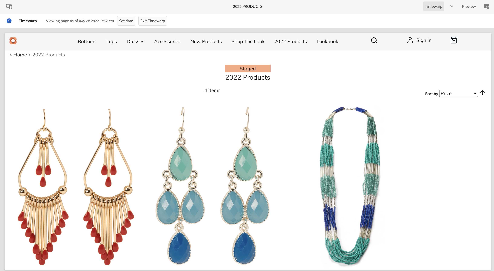
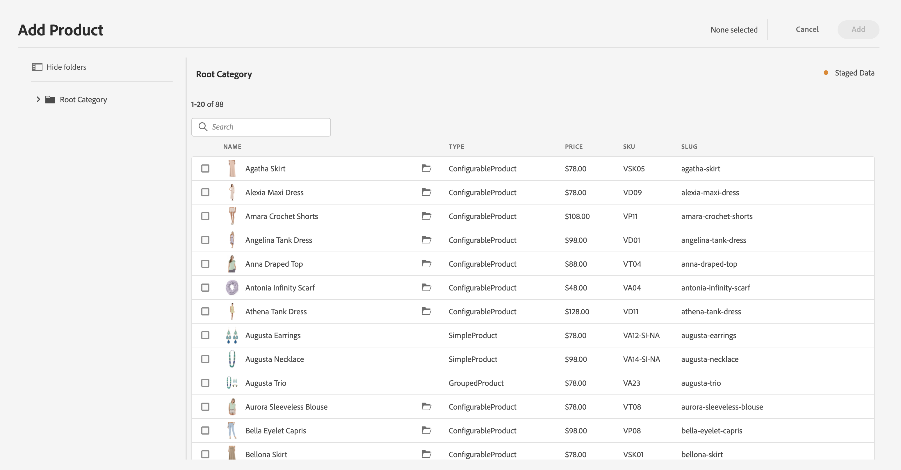

# ステージングされた製品カタログエクスペリエンスの作成 {#building-experiences}

ステージングされた製品カタログエクスペリエンスを管理する方法を説明します。

## これまでの説明内容 {#story-so-far}

AEM コンテンツおよびCommerce ジャーニーの以前のドキュメント [&#x200B; 商品カタログのページとテンプレートの管理 &#x200B;](/help/commerce-cloud/cif-storefront/commerce-journeys/aem-commerce-content-author/catalog-templates.md) では、テンプレートにもとづいて商品カタログエクスペリエンスを管理および作成する方法を学びました。

この記事は、これらの基本事項に基づいて作成されています。

## 目的 {#objective}

このドキュメントは、ステージングされた製品データと AEM ローンチにもとづいて製品カタログエクスペリエンスを管理する方法を理解するのに役立ちます。作成者は、次回の製品ローンチ（新しいアパレルコレクションなど）を並行して準備する必要が何度もあります。これには、ステージング済みの（まだ公開されていない）製品データへのアクセスと、コンテンツの作成機能が必要です。この新しいコンテンツは、製品のローンチと共に公開されます。

>[!NOTE]
>
>この機能は、Adobe Commerce または Cloud Edition およびトークンベースの認証をサポートするサードパーティコネクタでのみ使用できます。詳しくは、[はじめに](/help/commerce-cloud/cif-storefront/getting-started.md)を参照してください。

まず、作成者が CIF を使用してステージングされた製品データにアクセスする方法を説明します。

## ステージングされた製品データの使用 {#staged-product-data}

ステージングされた製品データにアクセスする方法の 1 つは、製品コックピットを使用することです。メイン AEM メニューの「Commerce」アイコンをクリックして、製品カタログを開きます。これで、ライブ製品データにアクセスできるようになります。左側のフィルタータブを開き、「**STAGED CATALOG**」を展開します。プレビューデータを使用して、任意の時点でステージングされた製品データにアクセスできるようになりました。ステージングされたデータには、新しいカテゴリ、製品、更新済みフィールド（価格など）が含まれます。

タイムワープ表示を使用して、ステージングされたデータでストアフロントをプレビューできます。エディターを開き、モードをタイムワープに切り替えます。任意の将来の日付を選択します。エディターの上部に、特定の日付のページを表示している情報が表示されます。

これで、ステージングされたデータを使用してカタログを参照できます。ステージングされたカテゴリまたは製品ページを開くと、エディターに視覚的なインジケーターが表示されます。

>[!NOTE]
>
>オムニサーチにコンテキストがないので、ライブ製品カタログデータのみが返されます

## AEM ローンチ {#launches}

AEM ローンチを使用すると、ステージングされた製品データのコンテンツを作成できます。ローンチについて詳しくは、[&#x200B; その他のリソース」節の下にあるドキュメントリンクにアクセスしてください。](#additional-resources) ローンチ日は、ステージングされた製品データにアクセスするために使用されます。

ピッカーは、右側のステージングされたインジケーターを使用してローンチ日を考慮します。

## 次の手順 {#what-is-next}

これで、ジャーニーのこのステップが完了しました。次のことを行う必要があります。

* ステージングされた製品カタログとローンチを使用したコンテンツの概念を理解する
* 製品コックピットとエディターを通じて、ステージングされた製品カタログデータにアクセスできる

これで、[product エクスペリエンスを管理する準備が整いました。](/help/commerce-cloud/cif-storefront/commerce-journeys/aem-commerce-content-author/product-experience-management.md) ただし、AEM コンテンツとCommerceには、他にも多くのオプションが用意されています。 このジャーニーで説明した機能について詳しくは、[その他のリソース](#additional-resources)の節で紹介しているその他のリソースを参照してください。

## その他のリソース {#additional-resources}

* [製品コックピット](/help/commerce-cloud/cif-storefront/authoring/product-cockpit.md)
* [はじめに](/help/commerce-cloud/cif-storefront/getting-started.md)
* [ローンチ](/help/sites-cloud/authoring/launches/overview.md)
