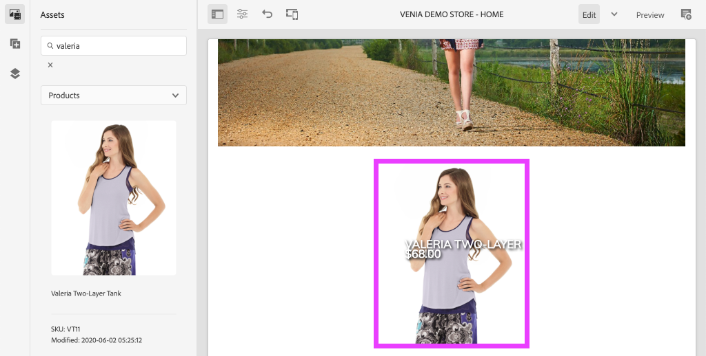

# AEM CIF コアコンポーネントのスタイル設定 {#style-aem-cif-core-components}

[CIF Venia プロジェクト ](https://github.com/adobe/aem-cif-guides-venia) は、[CIF コアコンポーネントを使用するための参照コードベースです。](https://github.com/adobe/aem-core-cif-components) このチュートリアルでは、Venia 参照プロジェクトを調べ、AEM CIF コアコンポーネントで使用される CSS とJavaScriptがどのように整理されているかを理解します。 また、CSS を使用してスタイルを作成し、**製品ティーザー**&#x200B;コンポーネントのデフォルトのスタイルを更新します。

>[!TIP]
>
> 独自のコマース実装を開始する際に [AEM プロジェクトアーキタイプ](https://github.com/adobe/aem-project-archetype)を使用します。

## 作成する内容 {#what-you-will-build}

このチュートリアルでは、カードに似た製品ティーザーコンポーネントに新しいスタイルを実装します。このチュートリアルで学習した内容は、他の CIF コアコンポーネントにも適用できます。


## 前提条件 {#prerequisites}

このチュートリアルを完了するには、ローカルの開発環境が必要です。この環境には、Adobe Commerce インスタンスに設定および接続された AEM の実行インスタンスが含まれます。[AEM as a Cloud Service SDKとのローカル開発のセットアップ ](/help/commerce-cloud/cif-storefront/develop.md) の要件と手順を確認します。

## Venia プロジェクトをクローン {#clone-venia-project}

[Venia プロジェクト ](https://github.com/adobe/aem-cif-guides-venia) を複製してから、デフォルトのスタイルを上書きします。

>[!NOTE]
>
> （CIF を含む AEM プロジェクトアーキタイプに基づく）**既存のプロジェクトを使用**&#x200B;する場合、この節をスキップできます。

1. 次の Git コマンドを実行すると、プロジェクトのクローンを作成できます。

   ```shell
   $ git clone git@github.com:adobe/aem-cif-guides-venia.git
   ```

1. プロジェクトをビルドしてローカル AEM インスタンスにデプロイします。

   ```shell
   $ cd aem-cif-guides-venia/
   $ mvn clean install -PautoInstallPackage,cloud
   ```

1. 必要な OSGi 設定を追加すると、AEM インスタンスを Adobe Commerce インスタンスに接続したり、作成したプロジェクトに設定を追加したりできます。

1. この時点で、Adobe Commerce インスタンスに接続されたストアフロントの作業用のバージョンが必要です。`US`/`Home` ページ（[http://localhost:4502/editor.html/content/venia/us/en.html.](http://localhost:4502/editor.html/content/venia/us/en.html)）に移動します。

   ストアフロントは現在 Venia テーマを使用しています。ストアフロントのメインメニューを展開すると、様々なカテゴリが表示され、Adobe Commerce への接続が機能していることが示されます。

   

## クライアントライブラリと ui.frontend モジュール {#introduction-to-client-libraries}

ストアフロントのテーマ／スタイルのレンダリングを担当する CSS と JavaScript は、AEM で、[クライアントライブラリ](/help/implementing/developing/introduction/clientlibs.md)（clientlib）によって管理されます。クライアントライブラリは、プロジェクトのコード内で CSS と JavaScript を整理し、ページに配信するメカニズムを提供します。

ブランド固有のスタイルは、これらのクライアントライブラリで管理される CSS を追加および上書きして、AEM CIF コアコンポーネントに適用できます。クライアントライブラリが構造化されてページに含まれる方法を理解することが重要です。

[ui.frontend](https://experienceleague.adobe.com/docs/experience-manager-core-components/using/developing/archetype/uifrontend.html?lang=ja) は、プロジェクトのすべてのフロントエンドアセットを管理するための専用の [webpack](https://webpack.js.org/) プロジェクトです。この webpack を使用すると、フロントエンド開発者は、[TypeScript](https://www.typescriptlang.org/)、[Sass](https://sass-lang.com/) など、様々な言語やテクノロジーを使用できます。

`ui.frontend` モジュールは Maven モジュールでもあり、NPM モジュールの [aem-clientlib-generator](https://github.com/wcm-io-frontend/aem-clientlib-generator) を使用して、より大きなプロジェクトに統合されています。ビルド時に、`aem-clientlib-generator` はコンパイル済みの CSS ファイルと JavaScript ファイルをクライアントライブラリの `ui.apps` モジュールにコピーします。


*コンパイル済みの CSS と JavaScript は、Maven のビルド中に `ui.frontend` モジュールから `ui.apps` モジュールにクライアントライブラリとしてコピーされます*

## ティーザースタイルのアップデート {#ui-frontend-module}

次に、ティーザーのスタイルを少し変更して、`ui.frontend` モジュールとクライアントライブラリの動作を確認します。[任意の IDE](https://experienceleague.adobe.com/docs/experience-manager-learn/cloud-service/local-development-environment-set-up/development-tools.html?lang=ja#set-up-the-development-ide) を使用して、Venia プロジェクトをインポートします。使用されているスクリーンショットは、[Visual Studio Code IDE](https://experienceleague.adobe.com/docs/experience-manager-learn/cloud-service/local-development-environment-set-up/development-tools.html?lang=ja#microsoft-visual-studio-code) のものです。

1. **ui.frontend** モジュールに移動して展開し、フォルダー階層を次のように展開します：`ui.frontend/src/main/styles/commerce`。

   

   フォルダーの下に複数の Sass（`.scss`）ファイルがあることに注意してください。これらのファイルは、各 Commerce コンポーネントの Commerce 固有のスタイルです。

1. `_productteaser.scss` ファイルを開きます。

1. `.item__image` ルールをアップデートし、枠線の規則を変更します。

   ```scss
   .item__image {
       border: #ea00ff 8px solid; /* <-- modify this rule */
       display: block;
       grid-area: main;
       height: auto;
       opacity: 1;
       transition-duration: 512ms;
       transition-property: opacity, visibility;
       transition-timing-function: ease-out;
       visibility: visible;
       width: 100%;
   }
   ```

   上記のルールは、製品ティーザーコンポーネントに太いピンク色の枠線を追加します。

1. 新しいターミナルウィンドウを開き、`ui.frontend` フォルダーに移動します。

   ```shell
   $ cd <project-location>/aem-cif-guides-venia/ui.frontend
   ```

1. 次の Maven コマンドを実行します。

   ```shell
   $ mvn clean install
   ...
   [INFO] ------------------------------------------------------------------------
   [INFO] BUILD SUCCESS
   [INFO] ------------------------------------------------------------------------
   [INFO] Total time:  29.497 s
   [INFO] Finished at: 2020-08-25T14:30:44-07:00
   [INFO] ------------------------------------------------------------------------
   ```

   端末出力を検査します。Maven コマンドが `npm run build` を含む、複数の NPM スクリプトを実行したことに留意してください。`npm run build` コマンドは `package.json` ファイルで定義されており、webpack プロジェクトをコンパイルして、クライアントライブラリの生成をトリガーします。

1. `ui.frontend/dist/clientlib-site/site.css` ファイルを検査します。

   

   このファイルは、プロジェクト内のすべての Sass ファイルのコンパイル済みの圧縮バージョンです。

   >[!NOTE]
   >
   > このようなファイルはビルド時に生成されるので、ソース管理からは無視されます。

1. `ui.frontend/clientlib.config.js` ファイルを検査します。

   ```js
   /* clientlib.config.js*/
   ...
   // Config for `aem-clientlib-generator`
   module.exports = {
       context: BUILD_DIR,
       clientLibRoot: CLIENTLIB_DIR,
       libs: [
           {
               ...libsBaseConfig,
               name: 'clientlib-site',
               categories: ['venia.site'],
               dependencies: ['venia.dependencies', 'aem-core-cif-react-components'],
               assets: {
   ...
   ```

   この設定ファイルは [aem-clientlib-generator](https://github.com/wcm-io-frontend/aem-clientlib-generator) 用で、コンパイル済み CSS と JavaScript が AEM クライアントライブラリに変換される場所と方法を決定します。

1. `ui.apps` モジュールで、`ui.apps/src/main/content/jcr_root/apps/venia/clientlibs/clientlib-site/css/site.css` ファイルを検査します。

   

   このファイルは、`ui.apps` プロジェクトにコピーされた `site.css` です。現在は、`venia.site` のカテゴリを持つ `clientlib-site` というクライアントライブラリの一部となっています。ファイルが `ui.apps` モジュールの一部になったら、AEM にデプロイできます。

   >[!NOTE]
   >
   > このようなファイルはビルド時に生成されるので、ソース管理からも無視されます。

1. 次に、プロジェクトで生成された他のクライアントライブラリを検査します。

   

   これらのクライアントライブラリは、`ui.frontend` モジュールでは管理されません。代わりに、これらのクライアントライブラリには、アドビが提供する CSS と JavaScript の依存関係が含まれます。これらのクライアントライブラリの定義は、各フォルダー内の `.content.xml` ファイルにあります。

   **clientlib-base** - [AEM コアコンポーネントから必要な依存関係を単に埋め込む、空のクライアントライブラリです。](https://experienceleague.adobe.com/docs/experience-manager-core-components/using/introduction.html?lang=ja) カテゴリは `venia.base` です。

   **clientlib-cif** - [AEM CIF コアコンポーネントから必要な依存関係を簡単に組み込む、空のクライアントライブラリです。](https://github.com/adobe/aem-core-cif-components) カテゴリは `venia.cif` です。

   **clientlib-grid** - AEM レスポンシブグリッド機能を有効にする CSS が含まれます。AEM グリッドを使用すると、AEM エディターで[レイアウトモード](/help/sites-cloud/authoring/page-editor/responsive-layout.md)が有効になり、コンテンツ作成者はコンポーネントのサイズを変更できます。カテゴリは `venia.grid` で、 `venia.base` ライブラリに埋め込まれます。

1. `ui.apps/src/main/content/jcr_root/apps/venia/components/page` の `customheaderlibs.html` ファイルと `customfooterlibs.html` ファイルを検査します。

   

   これらのスクリプトには、すべてのページの一部として、**venia.base** と **venia.cif** ライブラリが含まれます。

   >[!NOTE]
   >
   > ページスクリプトの一部として「ハードコード」されるのは、ベースライブラリのみです。`venia.site` はこれらのファイルに含まれず、ページテンプレートの一部として含まれるので、柔軟性が高くなります。このプロセスは後で検査されます。

1. ターミナルから、プロジェクト全体を構築し、AEM のローカルインスタンスにデプロイします。

   ```shell
   $ cd aem-cif-guides-venia/
   $ mvn clean install -PautoInstallPackage,cloud
   ```

## 製品ティーザーの作成 {#author-product-teaser}

コードのアップデートがデプロイされたので、AEM オーサリングツールを使用して、製品ティーザーコンポーネントのインスタンスをサイトのホームページに追加します。これにより、更新されたスタイルが表示されます。

1. 新しいブラウザータブを開き、サイトの **ホームページ** に移動します。[http://localhost:4502/editor.html/content/venia/us/en.html.](http://localhost:4502/editor.html/content/venia/us/en.html)

1. **編集**&#x200B;モードでアセットファインダー（サイドレール）を展開します。アセットフィルターを&#x200B;**製品**&#x200B;に切り替えます。

   

1. 新しい製品をメインのレイアウトコンテナのホームページにドラッグ&amp;ドロップします。

   

   先ほど作成した CSS ルールの変更に基づき、製品ティーザーの枠線が明るいピンク色になりました。

## ページ上でのクライアントライブラリの検証 {#verify-client-libraries}

次に、クライアントライブラリがページに含まれていることを確認します。

1. サイトの **ホームページ** に移動します：[http://localhost:4502/editor.html/content/venia/us/en.html.](http://localhost:4502/editor.html/content/venia/us/en.html)

1. **ページ情報**&#x200B;メニューを選択し、「**公開済みとして表示**」をクリックします。

   

   AEM オーサーの JavaScript を読み込むことなく、公開されたサイトに表示されるようにこのページが開きます。URL に `?wcmmode=disabled` クエリパラメーターが追加されていることに注意してください。CSS や JavaScript を開発する場合は、このパラメーターを使用して、AEM オーサーからのコンテンツを含めずに、ページを簡略化することをお勧めします。

1. ページソースを表示し、次のクライアントライブラリをいくつか識別できるようにします。

   ```html
   <!DOCTYPE html>
   <html lang="en-US">
   <head>
       ...
       <link rel="stylesheet" href="/etc.clientlibs/venia/clientlibs/clientlib-base.min.css" type="text/css">
       <link rel="stylesheet" href="/etc.clientlibs/venia/clientlibs/clientlib-site.min.css" type="text/css">
   </head>
   ...
       <script type="text/javascript" src="/etc.clientlibs/venia/clientlibs/clientlib-site.min.js"></script>
       <script type="text/javascript" src="/etc.clientlibs/core/wcm/components/commons/site/clientlibs/container.min.js"></script>
       <script type="text/javascript" src="/etc.clientlibs/venia/clientlibs/clientlib-base.min.js"></script>
   <script type="text/javascript" src="/etc.clientlibs/core/cif/clientlibs/common.min.js"></script>
   <script type="text/javascript" src="/etc.clientlibs/venia/clientlibs/clientlib-cif.min.js"></script>
   </body>
   </html>
   ```

   クライアントライブラリは、ページに配信される際に `/etc.clientlibs` 接頭辞が付けられ、[プロキシ](/help/implementing/developing/introduction/clientlibs.md)経由で提供され、`/apps` や `/libs` で機密事項が公開されないようになります。

   `venia/clientlibs/clientlib-site.min.css` と `venia/clientlibs/clientlib-site.min.js` に注意してください。これらのファイルは、`ui.frontend` モジュールから派生したコンパイル済みの CSS ファイルと JavaScript ファイルです。

## ページテンプレートによるクライアントライブラリの追加 {#client-library-inclusion-pagetemplates}

クライアントサイドライブラリを含める方法には、いくつかのオプションがあります。次に、`clientlib-site` ページテンプレート [ を使用して、生成されたプロジェクトに ](/help/implementing/developing/components/templates.md) ライブラリがどのように含まれているかを調べます。

1. AEM Editor 内のサイトの **ホームページ** に移動します。[http://localhost:4502/editor.html/content/venia/us/en.html.](http://localhost:4502/editor.html/content/venia/us/en.html)

1. **ページ情報**&#x200B;メニューを選択し、「**テンプレートを編集**」をクリックします。

   

   **ホーム**&#x200B;ページの基になる、**ランディングページ**&#x200B;テンプレートが開きます。

   >[!NOTE]
   >
   > AEM 開始画面で使用可能なすべてのテンプレートを表示するには、**ツール**／**一般**／**テンプレート**&#x200B;に移動します。

1. 左上隅の&#x200B;**ページ情報**&#x200B;アイコンを選択し、「**ページポリシー**」をクリックします。

   

1. ランディングページテンプレートのページポリシーが開きます。

   

   右側には、このテンプレートを使用するすべてのページに含まれるクライアントライブラリ&#x200B;**カテゴリ**&#x200B;の一覧が表示されます。

   * `venia.dependencies` - `venia.site` が依存するベンダーライブラリを提供します。
   * `venia.site` - `ui.frontend` モジュールが生成する `clientlib-site` のカテゴリ。

   他のテンプレートも同じポリシー、**コンテンツページ**、**ランディングページ**&#x200B;などを使用しています。同じポリシーを再利用すると、同じクライアントライブラリをすべてのページに確実に含めることができます。

   テンプレートポリシーとページポリシーを使用してクライアントライブラリの組み込みを管理する利点は、テンプレートごとにポリシーを変更できることです。例えば、同じ AEM インスタンス内で 2 つの異なるブランドを管理しているとします。各ブランドには独自のスタイルや&#x200B;*テーマ*&#x200B;がありますが、基本ライブラリとコードは同じです。別の例として、特定のページにのみ表示したい大きなクライアントライブラリがある場合、そのテンプレートにのみ固有のページポリシーを作成できます。

## ローカル WebPack の開発 {#local-webpack-development}

先ほどの演習では、`ui.frontend` モジュール内の Sass ファイルを更新し、Maven ビルドを実行した後に、変更を AEM にデプロイしました。次に、webpack-dev-server を使用して、フロントエンドのスタイルを迅速に開発する方法を説明します。

webpack-dev-server は、AEM のローカルインスタンスから画像と一部の CSS/JavaScript をプロキシしますが、デベロッパーは、`ui.frontend` モジュール内のスタイルと JavaScript を変更できます。

1. ブラウザーで **ホーム** ページに移動し、**公開済みとして表示**:[http://localhost:4502/content/venia/us/en.html?wcmmode=disabled.](http://localhost:4502/content/venia/us/en.html?wcmmode=disabled) を表示します

1. ページのソースとページの生の HTML **コピー**&#x200B;を表示します。

1. `ui.frontend` モジュールで選択した IDE に戻り、`ui.frontend/src/main/static/index.html` ファイルを開きます。 

   

1. `index.html` の内容を上書きして、 前の手順でコピーした HTML を&#x200B;**貼り付けます**。

1. `clientlib-site.min.css` および `clientlib-site.min.js` の「インクルード」を見つけて、**削除**&#x200B;します。

   ```html
   <head>
       <!-- remove this link -->
       <link rel="stylesheet" href="/etc.clientlibs/venia/clientlibs/clientlib-base.min.css" type="text/css">
       ...
   </head>
   <body>
       ...
        <!-- remove this link -->
       <script type="text/javascript" src="/etc.clientlibs/venia/clientlibs/clientlib-site.min.js"></script>
   </body>
   ```

   これらの「インクルード」を削除する理由は、`ui.frontend` モジュールで生成される CSS と JavaScript のコンパイル版だからです。他のクライアントライブラリは、実行中の AEM インスタンスからプロキシされるので、そのままにします。

1. 新しいターミナルウィンドウを開き、`ui.frontend` フォルダーに移動します。`npm start` コマンドを実行します。

   ```shell
   $ cd ui.frontend
   $ npm start
   ```

   このコマンドは、[http://localhost:8080/.](http://localhost:8080/) で webpack-dev-server を開始します

   >[!CAUTION]
   >
   > Sass 関連のエラーが発生した場合は、サーバーを停止し、`npm rebuild node-sass` コマンドを実行して上記の手順を繰り返します。このエラーは、プロジェクト `aem-cif-guides-venia/pom.xml` で指定された `npm` と `node` のバージョンが異なる場合に発生する可能性があります。

1. AEMのログインしたインスタンスと同じブラウザーを使用して、新しいタブで [http://localhost:8080/](http://localhost:8080/) に移動します。 Venia ホームページは webpack-dev-server で確認できます。

   

   webpack-dev-server は実行したままにします。これは、次の演習で使用します。

## 製品ティーザー用のカードスタイルの実装 {#update-css-product-teaser}

次に、`ui.frontend` モジュール内の Sass ファイルを変更し、製品ティーザー用のカードに似たスタイルを実装します。webpack-dev-server は、変更をすぐに確認するために使用します。

IDE と生成されたプロジェクトに戻ります。

1. **ui.frontend** モジュールで、`_productteaser.scss` ファイルを再度開きます（`ui.frontend/src/main/styles/commerce/_productteaser.scss`）。

1. 製品ティーザーの枠線に次の変更を加えます。

   ```diff
       .item__image {
   -       border: #ea00ff 8px solid;
   +       border-bottom: 1px solid #c0c0c0;
           display: block;
           grid-area: main;
           height: auto;
           opacity: 1;
           transition-duration: 512ms;
           transition-property: opacity, visibility;
           transition-timing-function: ease-out;
           visibility: visible;
           width: 100%;
       }
   ```

   変更を保存すると、webpack-dev-server は自動的に新しいスタイルで更新されます。

1. 製品ティーザーにドロップシャドウを追加し、丸い角を付加します。

   ```scss
    .item__root {
        position: relative;
        box-shadow: 0 4px 8px 0 rgba(0,0,0,0.2);
        transition: 0.3s;
        border-radius: 5px;
        float: left;
        margin-left: 12px;
        margin-right: 12px;
   }
   
   .item__root:hover {
      box-shadow: 0 8px 16px 0 rgba(0,0,0,0.2);
   }
   ```

1. 製品名をアップデートして、ティーザーの下部に表示されるようにし、テキストの色を変更します。

   ```css
   .item__name {
       color: #000;
       display: block;
       float: left;
       font-size: 22px;
       font-weight: 900;
       line-height: 1em;
       padding: 0.75em;
       text-transform: uppercase;
       width: 75%;
   }
   ```

1. 製品の価格をアップデートして、ティーザーの下部にも表示されるようにし、テキストの色を変更します。

   ```css
   .price {
       color: #000;
       display: block;
       float: left;
       font-size: 18px;
       font-weight: 900;
       padding: 0.75em;
       padding-bottom: 2em;
       width: 25%;
   
       ...
   ```

1. **992px** 未満の画面に名前と価格を積み重ねるには、下部のメディアクエリを更新します。

   ```css
   @media (max-width: 992px) {
       .productteaser .item__name {
           font-size: 18px;
           width: 100%;
       }
       .productteaser .item__price {
           font-size: 14px;
           width: 100%;
       }
   }
   ```

   カードのスタイルが webpack-dev-server に反映されています。

   

   ただし、変更は AEM にまだデプロイされていません。[ソリューションファイルは、こちらからダウンロード](../assets/style-cif-component/_productteaser.scss)できます。

1. コマンドラインターミナルから、Maven スキルを使用して AEM にアップデートをデプロイします。

   ```shell
   $ cd aem-cif-guides-venia/
   $ mvn clean install -PautoInstallPackage,cloud
   ```

   >[!NOTE]
   >完全な Maven ビルドを実行せずに、プロジェクトファイルをローカル AEM インスタンスに直接同期できる追加の [IDE セットアップとツール](https://experienceleague.adobe.com/docs/experience-manager-learn/foundation/development/set-up-a-local-aem-development-environment.html?lang=ja#set-up-an-integrated-development-environment)があります。

## アップデートされた製品ティーザーを表示 {#view-updated-product-teaser}

プロジェクトのコードを AEM にデプロイした後は、製品ティーザーの変更を確認できるようになります。

1. ブラウザーに戻り、次のホーム ページを更新します：[http://localhost:4502/editor.html/content/venia/us/en.html](http://localhost:4502/editor.html/content/venia/us/en.html) 更新された製品ティーザースタイルが適用されているのが確認できます。

   

1. 製品ティーザーを追加してテストします。複数のティーザーを一列に表示するためには、レイアウトモードを使用して、コンポーネントの幅とオフセットを変更します。

   

## トラブルシューティング {#troubleshooting}

更新された CSS ファイルがデプロイされていることを [CRXDE-Lite](http://localhost:4502/crx/de/index.jsp) で確認できます：[http://localhost:4502/crx/de/index.jsp#/apps/venia/clientlibs/clientlib-site/css/site.css](http://localhost:4502/crx/de/index.jsp#/apps/venia/clientlibs/clientlib-site/css/site.css)

新しい CSS ファイル、JavaScript ファイル、またはその両方をデプロイする場合は、ブラウザーで古いファイルが提供されないようにすることも重要です。ブラウザーキャッシュをクリアするか、新しいブラウザーセッションを開始することで、この潜在的な問題を解消できます。

また、AEM は、パフォーマンスを考慮してクライアントライブラリをキャッシュしようとします。コードがデプロイされた後で、古いファイルが提供されることがあります。[ クライアントライブラリの再ビルド ツールを使用すると、AEMのクライアントライブラリキャッシュを手動で無効にすることができます。](http://localhost:4502/libs/granite/ui/content/dumplibs.rebuild.html) *AEMが古いバージョンのクライアントライブラリをキャッシュしていると思われる場合は、キャッシュを無効にする方法をお勧めします。 「ライブラリのリビルド」は非効率で時間がかかります。*

## これで完了です {#congratulations}

最初の AEM CIF コアコンポーネントのスタイル設定が完了し、webpack 開発サーバーを使用しました。

## ボーナスチャレンジ {#bonus-challenge}

[AEM スタイルシステム](/help/sites-cloud/authoring/page-editor/style-system.md)を使用して、コンテンツ作成者がオン／オフを切り替えることのできる 2 つのスタイルを作成します。[スタイルシステムを使用した開発](https://experienceleague.adobe.com/docs/experience-manager-learn/getting-started-wknd-tutorial-develop/project-archetype/style-system.html?lang=ja)では、このタスクを行う方法に関する詳細な手順と情報が説明されています。


## その他のリソース {#additional-resources}

* [AEM プロジェクトアーキタイプ](https://github.com/adobe/aem-project-archetype)
* [AEM CIF コアコンポーネント](https://github.com/adobe/aem-core-cif-components)
* [ローカル AEM 開発環境の設定](https://experienceleague.adobe.com/docs/experience-manager-learn/cloud-service/local-development-environment-set-up/overview.html?lang=ja)
* [クライアントサイドライブラリ](/help/implementing/developing/introduction/clientlibs.md)
* [AEM Sites 使用の手引き](https://experienceleague.adobe.com/docs/experience-manager-learn/getting-started-wknd-tutorial-develop/overview.html?lang=ja)
* [スタイルシステムを使用した開発](https://experienceleague.adobe.com/docs/experience-manager-learn/getting-started-wknd-tutorial-develop/project-archetype/style-system.html?lang=ja)
