# 製品カタログのページとテンプレートを管理 {#product-catalog}

製品カタログのページとテンプレートの管理方法を説明します。

## これまでの説明内容 {#story-so-far}

AEM Content and Commerce オーサリングジャーニーの前のドキュメントである [AEM CIF オーサリングの基礎知識](getting-started.md) では、CIF オーサリングの基本を確認しました。

この記事は、これらの基本事項に基づいて作成されています。

## 目的 {#objective}

このドキュメントでは、製品カタログのページとテンプレートの管理方法を確認します。読み終えると、次のことができるようになります。

* カタログテンプレートの概念を理解する
* 汎用テンプレートの仕組み
* 個々のテンプレートを作成している

## 基本概念 {#basic-concept}

Venia ストアフロントには、ナビゲーション、ランディング、カテゴリ（PLP）、製品詳細ページ（PDP）などの一般的な製品カタログのエクスペリエンスが付属しています。

カタログページは、AEM CIF カタログテンプレートと製品データを使用して動的に作成されます。製品データは、必要時にコマースエンドポイントからリアルタイムに取得されます。すべてのカタログには、製品ページとカテゴリページ用の汎用テンプレートがあります。
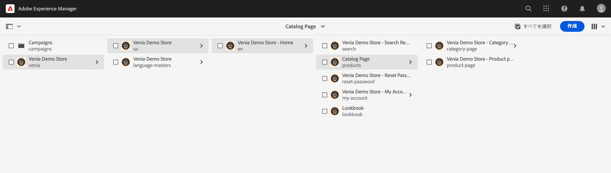

ナビゲーションコンポーネントは、コンテンツページとカタログページを表示します。ナビゲーションには、カタログのランディングページまたは第 1 レベルのカテゴリを表示できます。カテゴリの上にマウスポインターを置くと、第 2 レベルのカテゴリが第 2 行として表示されます。

カテゴリをクリックすると、カテゴリページ（または製品の一覧ページ）が開きます。

製品をクリックすると、製品の詳細ページが開きます。

## テンプレート {#templates}

### 汎用テンプレート {#generic}

汎用の Venia カタログテンプレートは、製品リストコアコンポーネントを使用します。 このコンポーネントは、カテゴリ画像（使用可能な場合）とカテゴリの製品群を表示します。
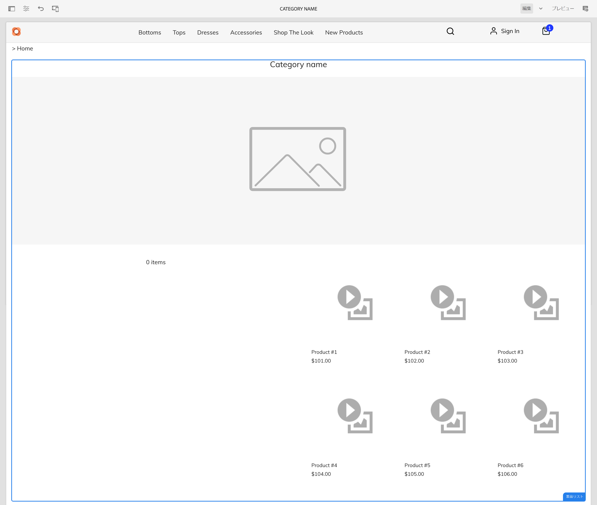

汎用の Venia 製品テンプレートでは、製品詳細コアコンポーネントを使用します。 このコンポーネントは、様々な製品タイプの製品情報と、買い物かごへの追加アクションを表示します。
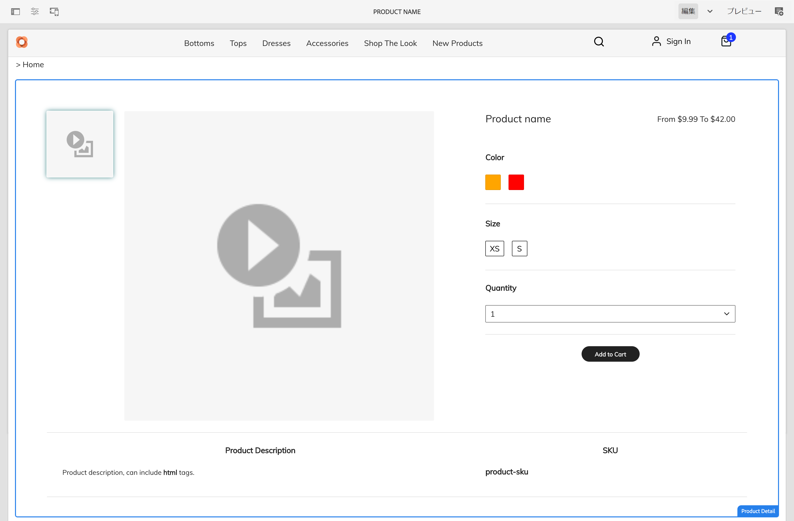

### テンプレートを編集 {#edit-templates}

テンプレートを編集するには、テンプレートページを直接開くか、製品カタログページを参照しながら編集モードに切り替えます。ページを変更すると、製品やカテゴリの特定のページだけでなく、テンプレートが変更されることに注意してください。

### カテゴリまたは製品に固有のテンプレート {#specific}

CIF は、数回のクリックで複数のテンプレートをサポートします。 別のテンプレートを作成するには、それぞれのカテゴリから汎用テンプレートを選択し、「**作成**」アクションを使用してページを作成します。

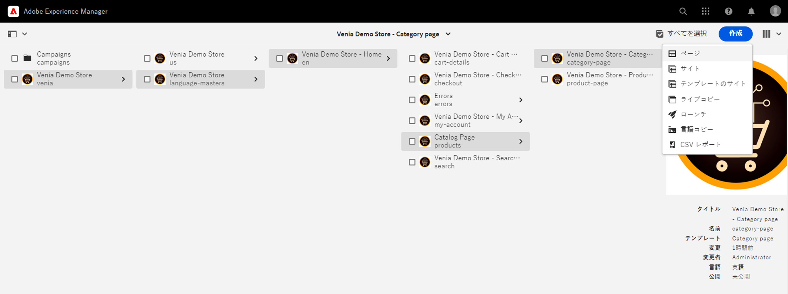

各製品またはカテゴリのテンプレートを選択します。

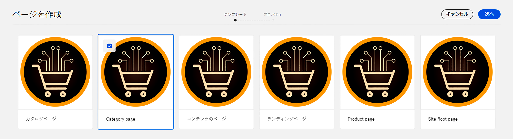

タイトルを入力し、ページを作成します。

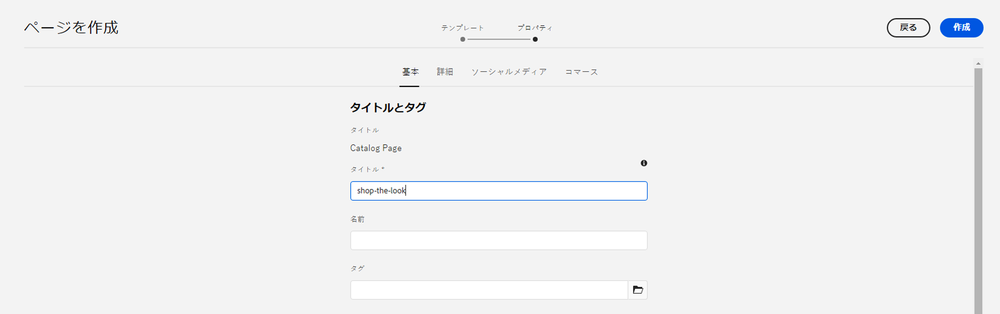

汎用テンプレートの下に特定のテンプレートが作成されました。

テンプレートを開きます。汎用カテゴリテンプレートとまったく同じ外観です。

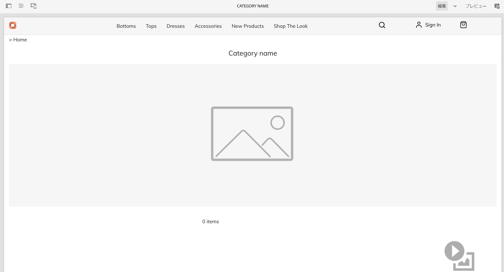

画像をページの上に追加します。

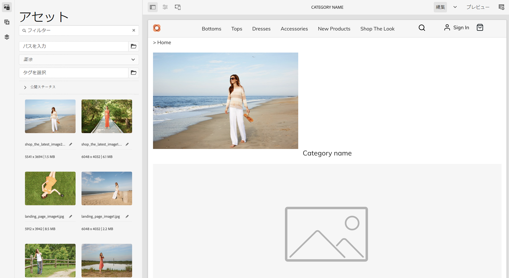

テンプレートは、任意のカテゴリまたは製品でプレビューできます。**ページ情報** を開き、「**カテゴリまたは製品で表示**」を選択します。ピッカーから製品またはカテゴリを選択して、その製品またはカテゴリのプレビューを取得します。更新されたテンプレートのプレビューを取得するには、 **商品の陳列** カテゴリを選択します。

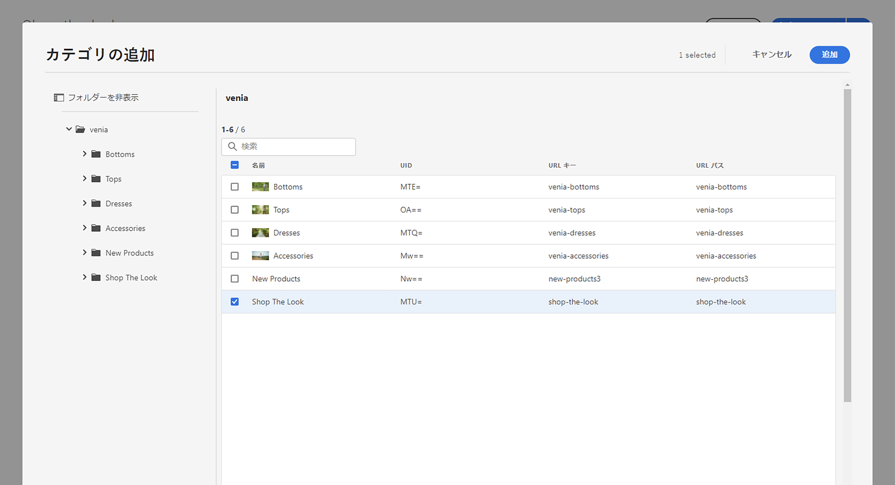

次に、このテンプレートを具体的なカテゴリに割り当てる必要があります。**ページ情報** メニューでプロパティを開き、「コマース」タブに切り替えます。フォルダーアイコンをクリックして、カテゴリピッカーから&#x200B;**商品の陳列**&#x200B;カテゴリを選択します。チェックボックスをオンにすると、1 つのテンプレートに複数のカテゴリを割り当てたり、サブカテゴリも含めたりできます。

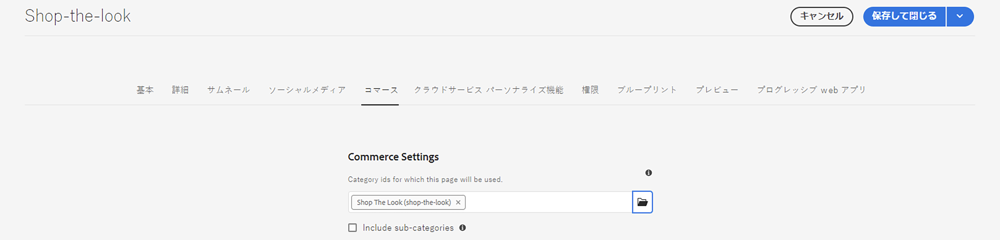

メインのホームページに戻り、 **商品の陳列**&#x200B;カテゴリをクリックして、特定のテンプレートを表示します。その他のカテゴリでは、すべて汎用テンプレートが使用されます。

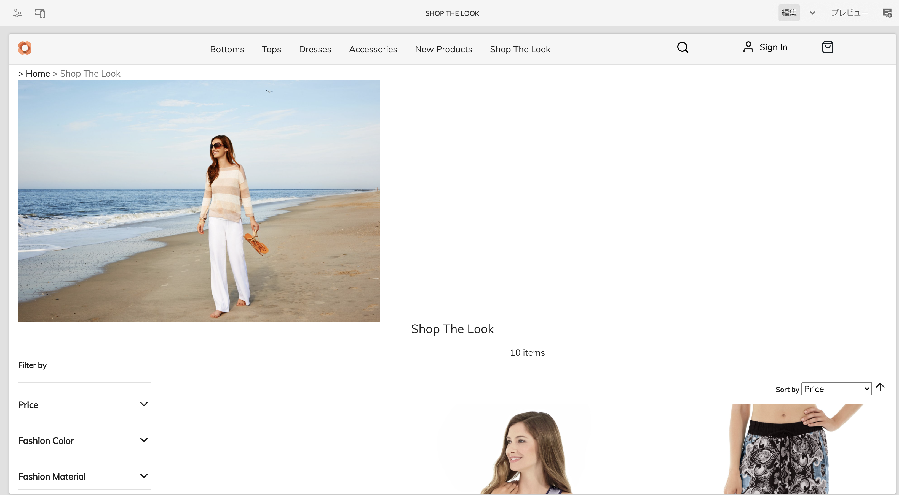

同じワークフローを適用して、個々の製品テンプレートを作成できます。

## 次の手順 {#what-is-next}

これで、ジャーニーのこのステップが完了しました。次のことを行う必要があります。

* カタログテンプレートの概念を理解する
* 汎用テンプレートの仕組み
* 個々のテンプレートを作成している

この知識に基づいて、次は[ステージングされた製品カタログエクスペリエンスを管理](staged-catalog.md)のドキュメントを確認して、ジャーニーを続行してください。そこでは、ステージングされた製品データと AEM ローンチの操作方法を習得します。

## その他のリソース {#additional-resources}

[ステージングされた製品カタログエクスペリエンスを管理](staged-catalog.md) のドキュメントを確認して、ジャーニーの次のパートに進むことをお勧めしますが、以下のリソースではこのドキュメントで取り上げた概念についてより詳しく説明しています。追加的なオプションであり、ジャーニーを続ける上で必須のリソースではありません。

* [複数のカテゴリページと製品ページの作成](/help/commerce-cloud/authoring/multi-template-usage.md)
* [Experience Manager Cloud Service への移行ガイド](/help/commerce-cloud/migration.md) - 古いバージョンから AEM Commerce 統合フレームワーク（CIF）アドオンに移行する方法
