# 製品エクスペリエンスの構築 {#building-experiences}

製品エクスペリエンスの管理方法を説明します。

## これまでの説明内容 {#story-so-far}

以前のドキュメント (AEM Content and Commerce ジャーニー ) では、 [ステージングされた製品カタログエクスペリエンスを管理](staged-catalog.md)では、ステージングされた製品カタログエクスペリエンスの管理方法を学びました。

## 目的 {#objective}

このドキュメントでは、製品のコンテンツとエクスペリエンスを構築する方法を説明します。

## 製品エクスペリエンス管理 {#management}

Product Experience Management は、（PIM またはコマースソリューションが所有する）製品データをAEMのマーケティングコンテンツで修飾する規律です。 このコンテンツを含むエンリッチメントされた製品データを様々なチャネルで使用して、没入感のあるショッピングエクスペリエンスを作成できます。

AEMでは、様々なタイプのコンテンツを作成し、それらを商品カタログにリンクできます。 関連するコンテンツを容易に見つけ出して使用することで、高い生産性を実現します。

### Assets {#assets}

上位レベルでは、製品に関連する 2 種類のアセットがあります。製品とマーケティング。 製品アセットは通常、商人が管理し、製品の表示に注力します（主に中立的な背景の前で）。 アセットは、コマースソリューションまたはAEM Assets（コマース/pim ソリューションへの Assets 統合を使用）で管理されます。

マーケティングアセットは、通常マーケティングが所有する製品のプロモーションと使用に関連しています。 例としては、複数の製品（「ショッピングザルック」）、特定のコンテキスト（「アウトドアフォールコレクション」）、またはハウツー pdf などがあります。 CIF を使用すると、任意のAEMアセットを製品カタログオブジェクトに簡単にリンクできます。

アセットのプロパティを開き、 **コマース** タブをクリックします。 このタブでは、製品との関連付けを管理できます。 ピッカーの下の表は、リンクされたオブジェクトに関する追加情報を提供します（選択したオブジェクトに対してのみ表示されます）。 詳細アイコンをクリックして、製品のコックピットの全画面を表示します。 新しいオブジェクトを関連付けるには、製品ピッカーアイコン（フォルダーアイコン）をクリックし、オブジェクトを選択してピッカーを閉じます。

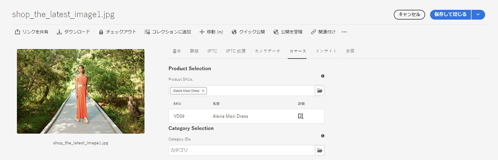

### エクスペリエンスフラグメント {#experience-fragments}

エクスペリエンスフラグメントは、再利用可能な、または個々の製品コンテンツを大規模に作成する優れた方法です。 関連付けはアセットと同様に機能します。 プロパティを開き、 **コマース** タブをクリックします。 このタブでは、製品やカテゴリとの関連を管理できます。 ピッカーの下のテーブルには、リンクされたオブジェクトの追加情報が表示されます（選択したオブジェクトでのみ表示されます）。 詳細アイコンをクリックして、製品のコックピットの全画面を表示します。 新しいオブジェクトを関連付けるには、製品ピッカーアイコン（フォルダーアイコン）をクリックし、オブジェクトを選択してピッカーを閉じます。

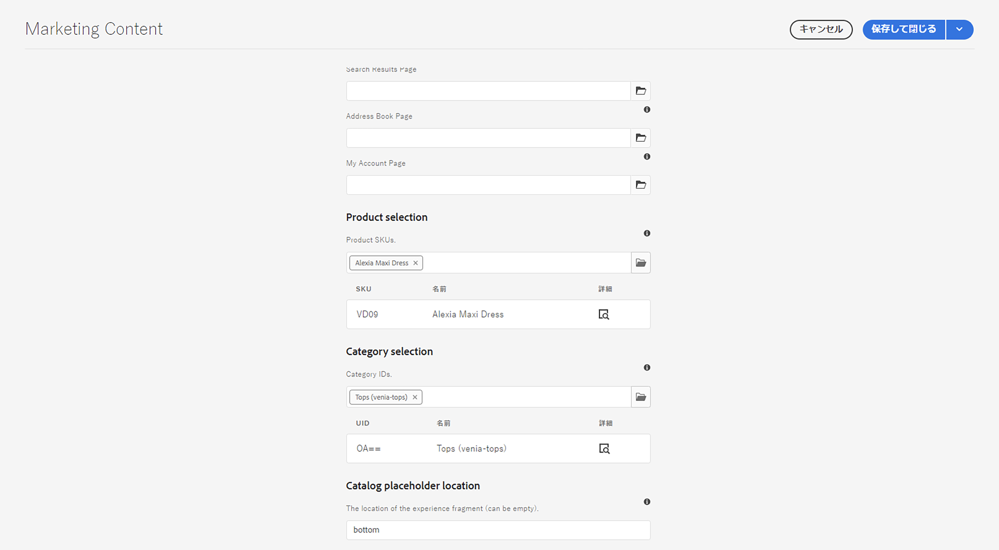

### コンテンツフラグメント {#content-fragments}

コンテンツフラグメントは、構造化されたコンテンツに最適なコンテンツタイプです。 これは、追加のマーケティングデータで外部の製品データを拡張したり、ヘッドレスな方法でコンテンツを作成したりするのに使用できます。 コンテンツフラグメントと商品カタログオブジェクトの関連付けは、コンテンツフラグメントモデルエディターの商品またはカテゴリ参照タイプを通じておこなわれます。 右側の参照タイプをモデルにドラッグ&amp;ドロップし、フィールドを設定します。 これらのタイプは、単一選択または複数選択をサポートします。

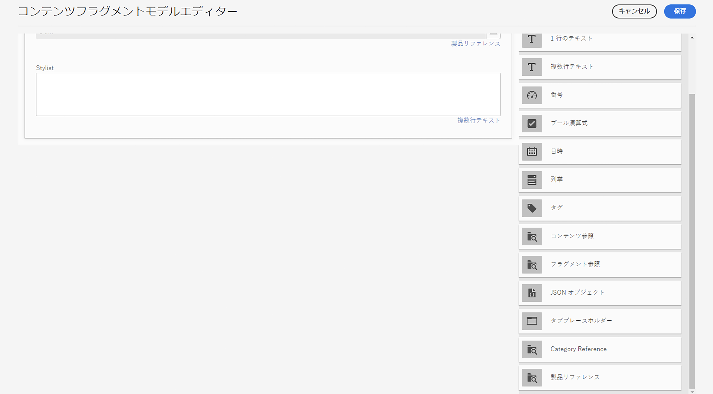

このモデルに基づいて新しいコンテンツフラグメントを作成する場合、これらの参照タイプを使用すると、それぞれのピッカーを使用して適切なオブジェクトを簡単に選択できます。

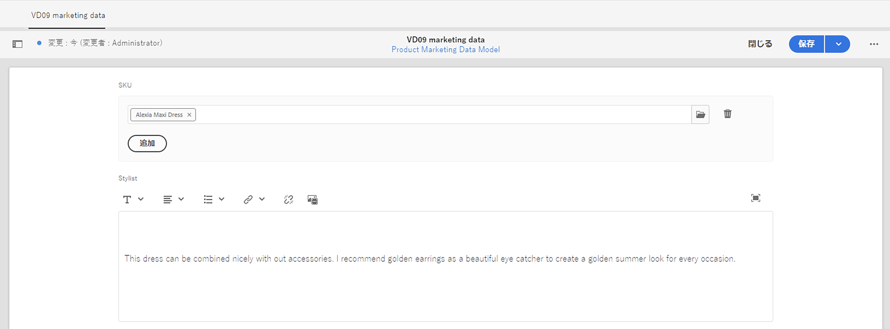

### 製品コックピット {#product-cockpit}

前のモジュールの 1 つに製品コックピット（またはコンソール）を導入しました。 コックピットを使用すると、商品カタログを参照するだけでなく、関連するすべてのAEMコンテンツを 1 か所で簡単に確認できます。 製品コンソールに移動し、関連コンテンツを持つ製品のプロパティを開きます。 各タブに切り替えて、関連するコンテンツを表示します。

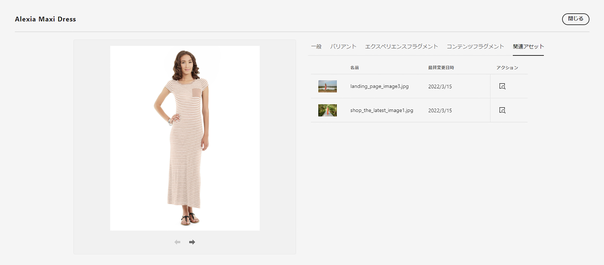

アクションアイコンをクリックすると、そのコンテンツが新しいブラウザータブで開きます。

## 個々の製品およびカテゴリページのエンリッチメント {#enrich}

これまでのモジュールでは、複数の製品カタログテンプレートの使用方法を学びました。 複数のテンプレートを使用すると、様々なテンプレートを作成できますが、多くの場合は不要です。 多くの場合、同じテンプレートを個々のコンテンツのプレースホルダーと組み合わせて使用できます。 CIF では、コンテンツフラグメントとエクスペリエンスフラグメントのプレースホルダーをサポートしています。

「エクスペリエンスフラグメント」プレースホルダーから始めます。 AEMエディターで製品テンプレートを開きます。 次をドラッグ&amp;ドロップ： **コマースエクスペリエンスフラグメント** コンポーネントをテンプレート上に配置し、設定ダイアログを開きます。

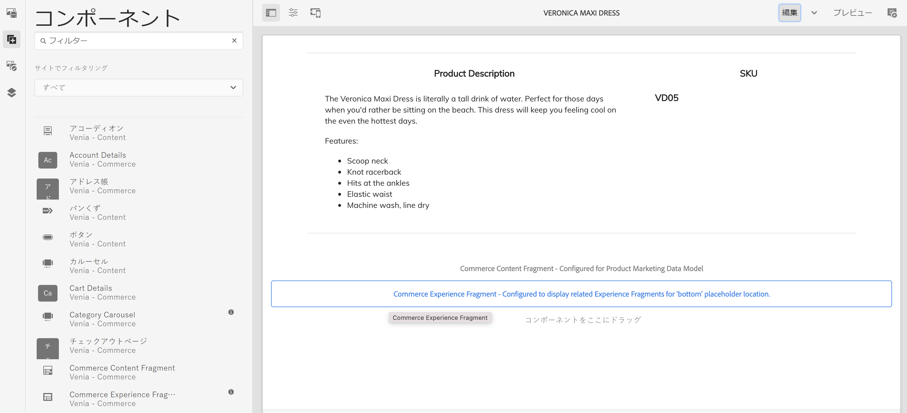

コンポーネントのダイアログを開き、このプレースホルダーの名前を入力します。 プレースホルダー名が必要です。必要な数のプレースホルダーを追加できます。

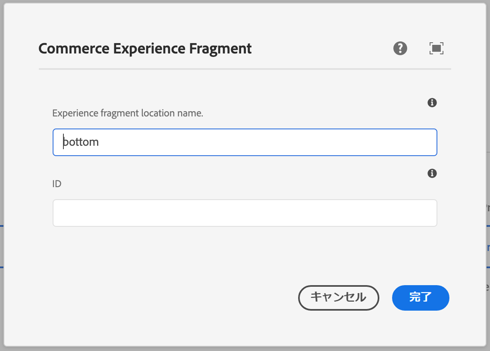

前の手順で製品に関連付けたエクスペリエンスフラグメントを開きます。 プロパティを開き、「コマース」タブに切り替えます。 以下に同じプレースホルダー名を入力してください **カタログプレースホルダーの場所**.

次に、 **コマースコンテンツフラグメント** コンポーネントをテンプレートに追加し、設定ダイアログを開きます。

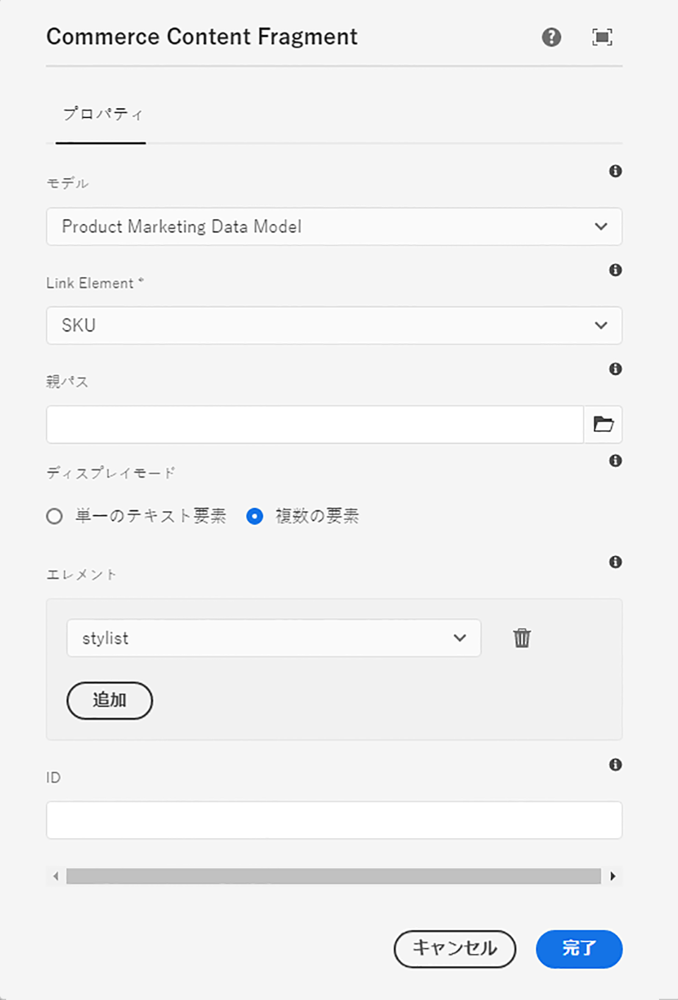

このダイアログは、コアコンポーネントのコンテンツフラグメントダイアログを再利用します。 詳しくは、「その他のリソース」を参照してください。 唯一の違いは **リンク要素** コンテンツフラグメントモデルの識別子フィールド（製品 SKU またはカテゴリ UID）を設定するプロパティ。

コンテンツフラグメントまたはエクスペリエンスフラグメントが関連付けられた製品ページをプレビューします。 AEMでページをレンダリングする際に、エクスペリエンスフラグメントのタイプ（コンテンツまたはエクスペリエンスフラグメント）、識別子、プレースホルダー名に基づいて、すべてのプレースホルダーを検索します。 AEMでは、URL リゾルバーを使用して識別子（製品の SKU、カテゴリの UID）を取得します。 エクスペリエンスまたはコンテンツフラグメントが返された場合、そのエクスペリエンスはプレースホルダーの場所にレンダリングされます。それ以外の場合、プレースホルダーは無視されます。

## コンテンツをショッパブルにする {#making-shoppable}

コマースコンポーネントを追加して、通常のAEMページをショッパブルにすることもできます。 AEMで新しいコンテンツページを作成し、エディターで空のページを開きます。

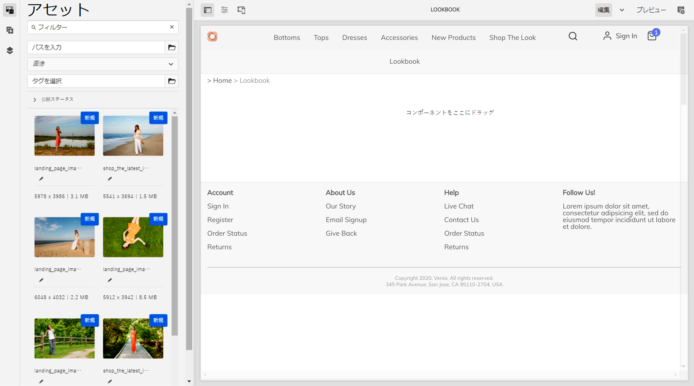

まず、製品の詳細コンポーネントをページにドラッグ&amp;ドロップします。 次に、アセットサイドバーに切り替え、製品に切り替えて、製品を選択します。 製品コンポーネントにその製品をドラッグ&amp;ドロップします。 これにより、コンテンツページに通常の製品コンポーネントが表示されます。

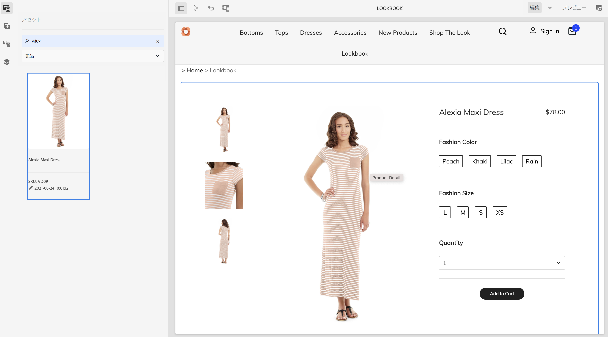

その製品に関連コンテンツを作成した場合は、アセットサイドバーで、 **関連するコマースコンテンツ**. このタブには、この製品に関連付けられたすべてのAEMコンテンツが表示されます。 これにより、ページに関連コンテンツを素早く埋め込むことができるようになりました。

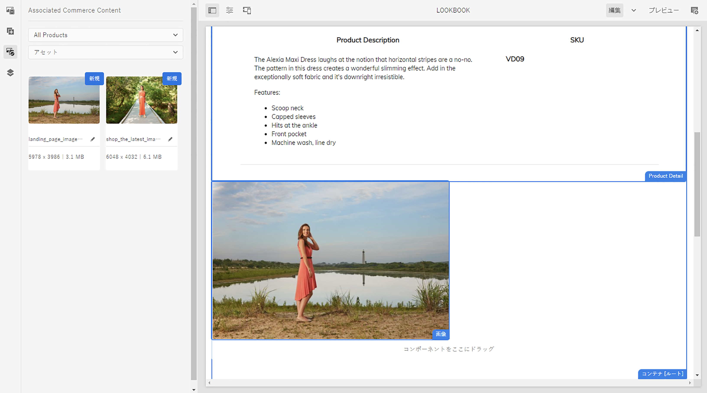

## ジャーニー? {#end-of-journey}

おめでとうございます。AEM Content and Commerce Developer ジャーニーが完了しました。 次の手順を実行します。

* 任意のAEMコンテンツを商品カタログオブジェクトに関連付ける方法を理解する
* 製品ページとカテゴリページを個別にエンリッチメントするためのプレースホルダーを使用
* コンテンツをショッパブルにし、関連する「コンテンツ」タブを使用する方法を理解する

これで、AEMコンテンツとコマースを使用して製品エクスペリエンスを管理する準備が整いました。 ただし、AEM Content と Commerce には、他にも多くのオプションが用意されています。 その他のリソースについては、 [「その他のリソース」セクション](#additional-resources) このジャーニーで確認した機能の詳細を確認するには、以下を参照してください。

## その他のリソース {#additional-resources}

* [コマースエクスペリエンスのオーサリング](/help/commerce-cloud/authoring/authoring-commerce-experiences.md)
* [製品コックピット](/help/commerce-cloud/authoring/product-cockpit.md)
* [コンテンツフラグメントコンポーネント](https://experienceleague.adobe.com/docs/experience-manager-core-components/using/components/content-fragment-component.html?lang=en)
