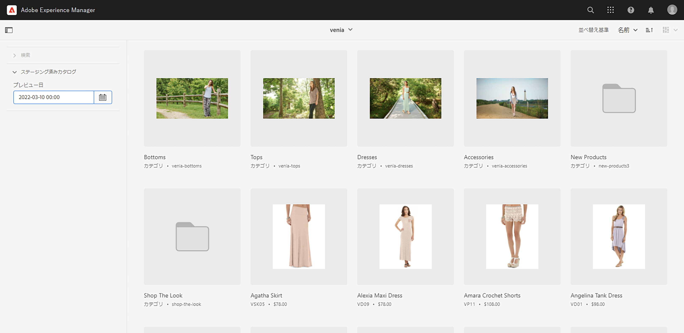
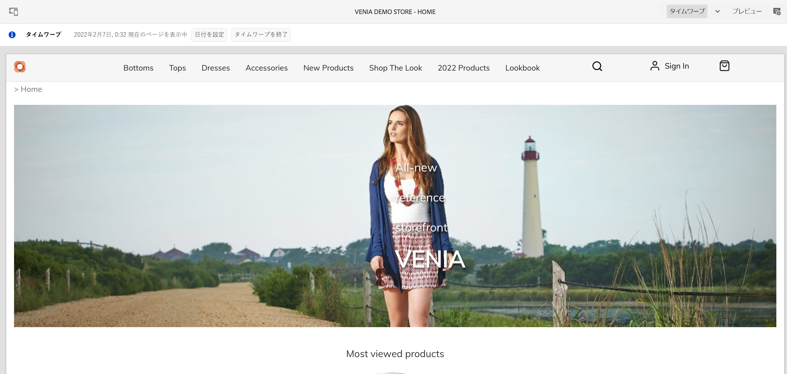
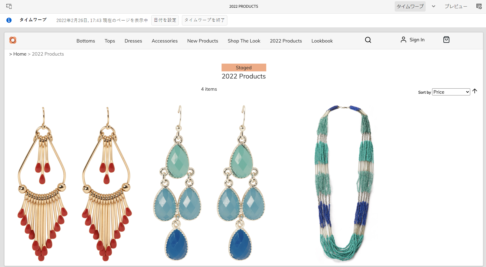
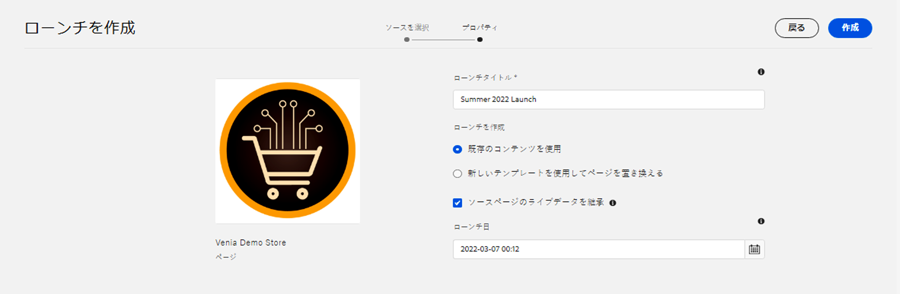
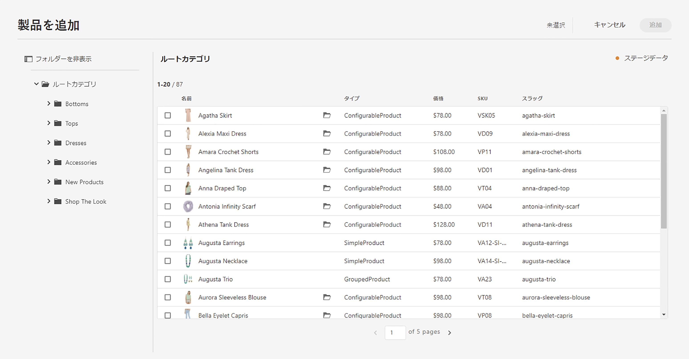

# 段階別の製品カタログエクスペリエンスの構築 {#building-experiences}

ステージングされた製品カタログエクスペリエンスを管理する方法を説明します。

## これまでの説明内容 {#story-so-far}

以前のドキュメント (AEM Content and Commerce ジャーニー ) では、 [製品カタログのページとテンプレートを管理](catalog-templates.md)では、テンプレートに基づいて製品カタログエクスペリエンスを管理および構築する方法を学びました。

この記事は、これらの基本に基づいて構築されます。

## 目的 {#objective}

このドキュメントでは、ステージングされた製品データとAEMローンチに基づいて製品カタログエクスペリエンスを管理する方法を理解するのに役立ちます。 作成者は、次回の製品ローンチ（新しいアパレルコレクションなど）を並行して準備する必要が何度もあります。 これには、ステージング済みの製品データ（まだ公開されていない）へのアクセスと、コンテンツの準備機能が必要です。 この新しいコンテンツは、製品のローンチと共に公開されます。

    >[！注意 ]
    >
    > この機能は、Adobe Commerceまたは Cloud Edition と、トークンベースの認証をサポートするサードパーティコネクタでのみ使用できます。 詳しくは、[ はじめに ](https://experienceleague.adobe.com/docs/experience-manager-cloud-service/content-and-commerce/storefront/getting-started.html) を参照してください。

まず、作成者が CIF を使用してステージングされた製品データにアクセスする方法を見てみましょう。

## ステージング済み製品データの使用 {#staged-product-data}

段階別の製品データにアクセスする方法の 1 つは、製品コックピットを使用することです。 メインAEMメニューのコマースアイコンをクリックして、商品カタログを開きます。 これにより、ライブ製品データにアクセスできるようになります。 左側のフィルタータブを開き、を展開します。 **STAGED CATALOG**. プレビューデータを使用して、任意の時点でステージングされた製品データにアクセスできるようになりました。 ステージング済みデータには、新しいカテゴリ、製品、または価格などの更新済みフィールドが含まれます。

タイムワープビューを使用して、ステージ済みデータを含むストアフロントをプレビューできます。 エディターを開き、モードをタイムワープに切り替えます。 任意の将来の日付を選択します。 エディターの上部に、特定の日付のページを表示している情報が表示されます。

これで、ステージ済みデータを使用してカタログを参照できます。 ステージング済みのカテゴリまたは製品ページを開くと、エディターに視覚的なインジケーターが表示されます。

    >[！注意 ]
    >
    > オムニサーチにコンテキストがないので、ライブ製品カタログデータのみが返される

## AEM ローンチ {#launches}

AEMローンチを使用すると、ステージングされた製品データのコンテンツを作成できます。 ローンチに詳しくない場合は、 [「その他のリソース」セクション](#additional-resources). 次に、「ローンチ日」は、ステージングされた製品データにアクセスするために使用されます。

ピッカーは、右側のステージング済みインジケーターを使用してローンチ日を考慮します。

## 次の手順 {#what-is-next}

これで、ジャーニーのこの部分が完了しました。次の手順を実行します。

* ステージング済みの製品カタログとローンチを使用したコンテンツの概念を理解する
* 製品コックピットとエディターを通じて、段階別の製品カタログデータにアクセスできる

これで、を管理する準備が整いました。 [製品エクスペリエンス](product-experience-management.md). ただし、AEM Content と Commerce には、他にも多くのオプションが用意されています。 その他のリソースについては、 [「その他のリソース」セクション](#additional-resources) このジャーニーで確認した機能の詳細を確認するには、以下を参照してください。

## その他のリソース {#additional-resources}

* [製品コックピット](/help/commerce-cloud/authoring/product-cockpit.md)
* [はじめに](/help/commerce-cloud/getting-started.md)
* [ローンチ](/help/sites-cloud/authoring/launches/overview.md)
