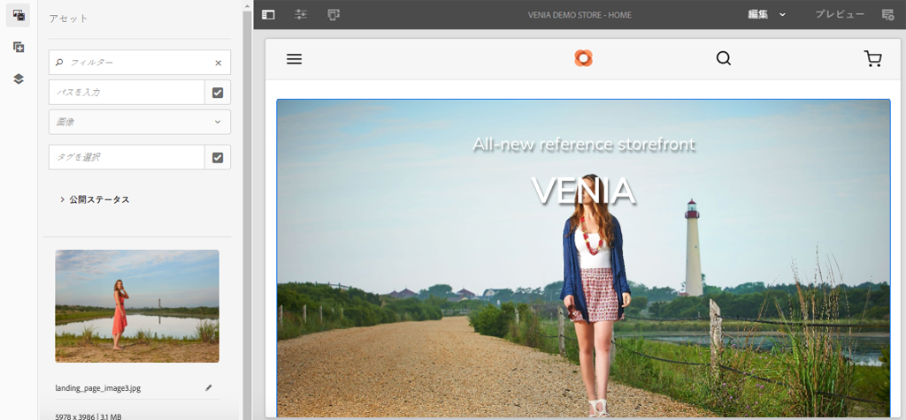
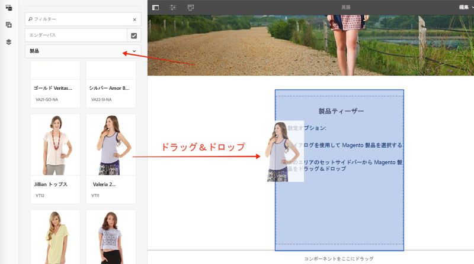
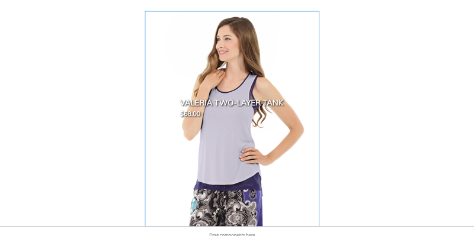

# AEM CIFコアコンポーネントのカスタマイズ {#customize-cif-components}

[CIFベニアプロジェクト](https://github.com/adobe/aem-cif-guides-venia) は、 [CIFコアコンポーネントを使用するためのリファレンスコードベースです](https://github.com/adobe/aem-core-cif-components)。 このチュートリアルでは、 [Product Teaserコンポーネントをさらに拡張して、Magentoのカスタム属性を表示します](https://github.com/adobe/aem-core-cif-components/tree/master/ui.apps/src/main/content/jcr_root/apps/core/cif/components/commerce/productteaser/v1/productteaser) 。 AEMとMagentoのGraphQLの統合、およびCIFコアコンポーネントが提供する拡張フックについても詳しく説明します。

>[!TIP]
>
> 独自のコマース実装を開始する際に [AEMプロジェクトのアーキタイプ](https://github.com/adobe/aem-project-archetype) を使用します。

## 作成する内容

ベニアのブランドは最近、持続可能な材料を使用して一部の製品を製造し始めた。同社は、 **エコフレンドリー** ・バッジを製品ティーザーの一部として表示したいと考えている。 商品が **環境に適した資材を使用しているかどうかを示す新しいカスタム属性がMagentoで作成されます** 。 次に、このカスタム属性がGraphQLクエリの一部として追加され、特定の製品のProduct Teaserに表示されます。


## 前提条件 {#prerequisites}

このチュートリアルを完了するには、ローカル開発環境が必要です。 これには、Magentoインスタンスに設定および接続されたAEMの実行インスタンスが含まれます。 AEMをCloud ServiceSDKとして使用したローカル開発の [セットアップに関する要件と手順を確認します](../develop.md)。 このチュートリアルを完全に実行するには、 [属性をMagento内の製品に追加する権限が必要になります](https://docs.magento.com/user-guide/catalog/product-attributes-add.html) 。

また、コードサンプルやチュートリアルを実行するには、GraphiQL [](https://github.com/graphql/graphiql) 、またはブラウザ拡張などのGraphQL IDEが必要です。 ブラウザー拡張機能をインストールする場合は、その拡張機能にリクエストヘッダーを設定できることを確認してください。 Google Chromeでは、 [Altair GraphQL Client](https://chrome.google.com/webstore/detail/altair-graphql-client/flnheeellpciglgpaodhkhmapeljopja) は、ジョブを実行できる拡張機能の1つです。

## ベニアプロジェクトのコピー {#clone-venia-project}

Venia Project [をコピーし](https://github.com/adobe/aem-cif-guides-venia) 、デフォルトのスタイルを上書きします。

>[!NOTE]
>
> **(CIFを含むAEMプロジェクトアーキタイプに基づく** )既存のプロジェクトを自由に使用し、このセクションをスキップしてください。

1. 次のgitコマンドを実行して、プロジェクトをコピーします。

   ```shell
   $ git clone git@github.com:adobe/aem-cif-guides-venia.git
   ```

1. プロジェクトを構築し、AEMのローカルインスタンスにデプロイします。

   ```shell
   $ cd aem-cif-guides-venia/
   $ mvn clean install -PautoInstallPackage,cloud
   ```

1. AEMインスタンス追加をMagentoインスタンスに接続したり、新しく作成したプロジェクトに設定を追加したりするために必要なOSGi設定。

1. この時点で、Magentoインスタンスに接続されたストアフロントの作業バージョンが必要です。 次の場所にある `US` / `Home` ページに移動します。 [http://localhost:4502/editor.html/content/venia/us/en.html](http://localhost:4502/editor.html/content/venia/us/en.html).

   現在、店頭ではベニアのテーマが使用されていることがわかります。 ストアフロントのメインメニューを展開すると、様々なカテゴリが表示され、接続Magentoが機能していることが示されます。

   

## Product Teaserの作成 {#author-product-teaser}

Product Teaserコンポーネントは、このチュートリアル全体で拡張されます。 最初の手順として、Product Teaserの新しいインスタンスをホームページに追加し、ベースライン機能を理解します。

1. サイトの **ホームページ** : [http://localhost:4502/editor.html/content/acme/us/en.html](http://localhost:4502/editor.html/content/acme/us/en.html)

2. ページのメインレイアウトコンテナに新しい **製品Teaser** コンポーネントを挿入します。

   

3. サイドパネルを展開し（まだ切り替えていない場合）、アセットファインダードロップダウンを **製品に切り替えます**。 これにより、接続されたMagentoインスタンスから使用可能な商品のリストが表示されます。 製品を選択し、ページ上の **製品ティーザー****(Product Teaser** )コンポーネントにドラッグ&amp;ドロップします。

   

   >[!NOTE]
   >
   > 注意：ダイアログ( *レンチ* アイコンをクリック)を使用してコンポーネントを設定することで、表示された製品を設定することもできます。

4. これで、Product Teaserによって製品が表示されます。 製品の名前と製品の価格は、表示されるデフォルトの属性です。

   

## Magento追加のカスタム属性 {#add-custom-attribute}

AEMに表示された商品と商品データはMagentoに格納される。 次に、MagentoUIを使用して設定した製品属性の一部として、 **環境に優しい** 、新しい属性を追加します。

>[!TIP]
>
> 製品属性セットの一部として、既にカスタム **Yes/No** 属性を持っていますか？ 自由に使用して、このセクションをスキップしてください。

1. Magentoインスタンスにログインします。
1. 「 **カタログ** / **製品**」に移動します。
1. 検索フィルタを更新して、前の練習でTeaserコンポーネントに追加した **場合に使用する構成可能な製品** (Configurable Product)を見つけます。 製品を編集モードで開きます。

   

1. 製品の表示で、 **追加属性** / **新しい属性を**&#x200B;作成をクリックします。
1. 次の値を使用して **新規属性** ・フォームに入力します（他の値はデフォルト設定のままにします）。

   | フィールドセット | フィールドラベル | 値 |
   |-----------|-------------|---------|
   | 属性プロパティ | 属性ラベル | **環境に優しい** |
   | 属性プロパティ | カタログ入力タイプ | **はい/いいえ** |
   | 高度な属性プロパティ | 属性コード | **eco_friendly** |

   

   Click **Save Attribute** when finished.

1. 製品の下部までスクロールし、「 **属性** 」見出しを展開します。 新しい **エコフレンドリー** (Eco Friendly)フィールドが表示されます。 切り替えボタンを「 **はい**」に切り替えます。

   

   **製品への変更を保存します** 。

   >[!TIP]
   >
   > 製品属性の管理の詳細については、 [Magentoユーザーガイドを参照してください](https://docs.magento.com/user-guide/catalog/attribute-best-practices.html)。

1. **システム** / **ツール** / ****&#x200B;キャッシュ管理に移動します。 データスキーマは更新されたので、Magento内のキャッシュタイプの一部を無効にする必要があります。
1. 「 **Configuration** 」の横のチェックボックスをオンにして、 **Refresh用にキャッシュタイプを送信します。**

   

   >[!TIP]
   >
   > キャッ [シュ管理の詳細については、Magentoユーザーガイドを参照してください](https://docs.magento.com/user-guide/system/cache-management.html)。

## GraphQL IDEを使用して属性を検証する {#use-graphql-ide}

AEMコードに移る前に、GraphQL [IDEを使用して](https://devdocs.magento.com/guides/v2.4/graphql/) MagentoGraphQLを調べると便利です。 AEMとのMagento統合は、主に一連のGraphQLクエリを介して行われます。 GraphQLクエリの理解と変更は、CIFコアコンポーネントを拡張する主な方法の1つです。

次に、GraphQL IDEを使用して、属性が製品属性セットに追加されたことを確認します。 `eco_friendly` このチュートリアルのスクリーンショットは、 [Altair GraphQL Client](https://chrome.google.com/webstore/detail/altair-graphql-client/flnheeellpciglgpaodhkhmapeljopja).

1. GraphQL IDEを開き、IDEまたは拡張子のURLバー `http://<magento-server>/graphql` にURLを入力します。
2. 追加次の [productsクエリ](https://devdocs.magento.com/guides/v2.4/graphql/queries/products.html) ( `YOUR_SKU` は、前の演習で使用した製品の **SKU** )。

   ```json
     {
       products(
       filter: { sku: { eq: "YOUR_SKU" } }
       ) {
           items {
           name
           sku
           eco_friendly
           }
       }
   }
   ```

3. クエリを実行すると、次のような応答が返されます。

   ```json
   {
   "data": {
       "products": {
           "items": [
               {
               "name": "Valeria Two-Layer Tank",
               "sku": "VT11",
               "eco_friendly": 1
               }
           ]
           }
       }
   }
   ```

   

   「 **はい** 」の値は1の整数です ****。 これは、GraphQLクエリをJavaで記述する場合に役立ちます。

   >[!TIP]
   >
   > GraphQL [Magentoに関する詳細なドキュメントは、こちらを参照してください](https://devdocs.magento.com/guides/v2.4/graphql/index.html)。

## 製品ティーザーのSlingモデルの更新 {#updating-sling-model-product-teaser}

次に、Slingモデルを導入して、製品Teaserのビジネスロジックを拡張します。 [Slingモデル](https://sling.apache.org/documentation/bundles/models.html)(Sling Models)は、コンポーネントで必要なビジネスロジックを実装する注釈駆動の「POJO」(Plain Old Java Objects)です。 Slingモデルは、コンポーネントの一部としてHTLスクリプトと組み合わせて使用されます。 既存のProduct Teaserモデルの一部を拡張できるように、Slingモデルの [委任パターンに従います](https://github.com/adobe/aem-core-wcm-components/wiki/Delegation-Pattern-for-Sling-Models) 。

SlingモデルはJavaとして実装され、生成されたプロジェクトの **コア** モジュールにあります。

任意 [のIDEを使用して](https://docs.adobe.com/content/help/en/experience-manager-learn/cloud-service/local-development-environment-set-up/development-tools.html#set-up-the-development-ide) 、Veniaプロジェクトをインポートします。 使用するスクリーンショットは、 [Visual StudioコードIDE](https://docs.adobe.com/content/help/en/experience-manager-learn/cloud-service/local-development-environment-set-up/development-tools.html#microsoft-visual-studio-code).

1. IDEで、 **コア** ・モジュールの下に移動して、次の操作を行います。 `core/src/main/java/com/venia/core/models/commerce/MyProductTeaser.java`.

   

   `MyProductTeaser.java` は、CIF ProductTeaserインターフェイスを拡張するJava [インターフェイス](https://github.com/adobe/aem-core-cif-components/blob/master/bundles/core/src/main/java/com/adobe/cq/commerce/core/components/models/productteaser/ProductTeaser.java) です。

   製品が「新規」と見なされた場合にバッジ `isShowBadge()` を表示するための新しいメソッドが既に追加されています。

1. 新し追加いメソッド、インターフェイス `isEcoFriendly()` への

   ```java
   @ProviderType
   public interface MyProductTeaser extends ProductTeaser {
       // Extend the existing interface with the additional properties which you
       // want to expose to the HTL template.
       public Boolean isShowBadge();
   
       public Boolean isEcoFriendly();
   }
   ```

   これは、製品の属性が「はい `eco_friendly` 」または「いいえ ********」に設定されているかどうかを示すロジックをカプセル化する新しい方法です。

1. 次に、at. `MyProductTeaserImpl.java``core/src/main/java/com/venia/core/models/commerce/MyProductTeaserImpl.java`

   Slingモデルの [委任パターンを使用すると](https://github.com/adobe/aem-core-wcm-components/wiki/Delegation-Pattern-for-Sling-Models) 、次の `MyProductTeaserImpl` プロパティを介して `ProductTeaser``sling:resourceSuperType` モデルを参照できます。

   ```java
   @Self
   @Via(type = ResourceSuperType.class)
   private ProductTeaser productTeaser;
   ```

   上書きや変更を望まないすべてのメソッドに対して、単にその戻り値を返すだけです `ProductTeaser` 。 次に例を示します。

   ```java
   @Override
   public String getImage() {
       return productTeaser.getImage();
   }
   ```

   これにより、導入で記述する必要のあるJavaコードの量を最小限に抑えることができます。

1. AEM CIFコアコンポーネントが提供する拡張ポイントの1つに、特定の製品属性へのアクセスを提供 `AbstractProductRetriever` するものがあります。 Inspect `initModel()` 法：

   ```java
   import javax.annotation.PostConstruct;
   ...
   @Model(adaptables = SlingHttpServletRequest.class, adapters = MyProductTeaser.class, resourceType = MyProductTeaserImpl.RESOURCE_TYPE)
   public class MyProductTeaserImpl implements MyProductTeaser {
       ...
       private AbstractProductRetriever productRetriever;
   
       /* add this method to intialize the proudctRetriever */
       @PostConstruct
       public void initModel() {
           productRetriever = productTeaser.getProductRetriever();
   
           if (productRetriever != null) {
               productRetriever.extendProductQueryWith(p -> p.createdAt());
           }
   
       }
   ...
   ```

   注 `@PostConstruct` 釈により、Slingモデルが初期化されるとすぐにこのメソッドが呼び出されます。

   製品のGraphQLクエリは、追加の `extendProductQueryWith` 属性を取得するために `created_at` メソッドを使用して既に拡張されています。 この属性は、後で `isShowBadge()` メソッドの一部として使用されます。

1. GraphQLクエリを更新し、属性を部分クエリに含めま `eco_friendly` す。

   ```java
   //MyProductTeaserImpl.java
   
   private static final String ECO_FRIENDLY_ATTRIBUTE = "eco_friendly";
   
   @PostConstruct
   public void initModel() {
       productRetriever = productTeaser.getProductRetriever();
   
       if (productRetriever != null) {
           productRetriever.extendProductQueryWith(p ->
                productRetriever.extendProductQueryWith(p -> p
                   .createdAt()
                   .addCustomSimpleField(ECO_FRIENDLY_ATTRIBUTE)
               );
           );
       }
   }
   ```

   この `extendProductQueryWith` 方法を追加すると、他の製品属性を確実にモデルの残りの部分で使用できるようになります。 また、実行されるクエリの数も最小限に抑えられます。

   上記のコードでは`addCustomSimpleField` 、属性を取得するためにが使用され `eco_friendly` ます。 この例では、Magentoスキーマの一部であるカスタム属性をクエリする方法を説明します。

   >[!NOTE]
   >
   > この `createdAt()` メソッドは、 [製品インターフェイスの一部として実装されています](https://github.com/adobe/commerce-cif-magento-graphql/blob/master/src/main/java/com/adobe/cq/commerce/magento/graphql/ProductInterface.java)。 最も一般的に見つかるスキーマ属性のほとんどは実装されているので、真のカスタム属性 `addCustomSimpleField` に対してのみを使用します。

1. Javaコードのデバッグに役立つロガー追加:

   ```java
   import org.slf4j.Logger;
   import org.slf4j.LoggerFactory;
   ...
   @Model(adaptables = SlingHttpServletRequest.class, adapters = MyProductTeaser.class, resourceType = MyProductTeaserImpl.RESOURCE_TYPE)
   public class MyProductTeaserImpl implements MyProductTeaser {
   
   private static final Logger LOGGER = LoggerFactory.getLogger(MyProductTeaserImpl.class);
   ```

1. 次に、 `isEcoFriendly()` メソッドを実装します。

   ```java
   @Override
   public Boolean isEcoFriendly() {
   
       Integer ecoFriendlyValue;
       try {
           ecoFriendlyValue = productRetriever.fetchProduct().getAsInteger(ECO_FRIENDLY_ATTRIBUTE);
           if(ecoFriendlyValue != null && ecoFriendlyValue.equals(Integer.valueOf(1))) {
               LOGGER.info("*** Product is Eco Friendly**");
               return true;
           }
       } catch (SchemaViolationError e) {
           LOGGER.error("Error retrieving eco friendly attribute");
       }
       LOGGER.info("*** Product is not Eco Friendly**");
       return false;
   }
   ```

   上記のメソッドでは、が製品の取得に `productRetriever` 使用され、 `getAsInteger()` メソッドが `eco_friendly` 属性の値の取得に使用されます。 先ほど実行したGraphQLクエリに基づいて、 `eco_friendly` 属性が「**Yes**」に設定された場合の期待値は、実際には **1の整数であることがわかりました**。

   Slingモデルが更新されたので、Slingモデルに基づいて **環境に優しい** というインジケータを実際に表示するには、コンポーネントマークアップを更新する必要があります。

## Product Teaserのマークアップのカスタマイズ {#customize-markup-product-teaser}

AEMコンポーネントの一般的な拡張機能は、コンポーネントによって生成されたマークアップを変更することです。 これは、コンポーネントがマークアップのレンダリングに使用する [HTLスクリプトを上書きすることで行われます](https://docs.adobe.com/content/help/ja-JP/experience-manager-htl/using/overview.html) 。 HTML Template Language(HTL)は、AEMコンポーネントがオーサリングされたコンテンツに基づいて動的にマークアップをレンダリングし、コンポーネントを再利用する際に使用する、軽量なテンプレート言語です。 例えば、Product Teaserを何度も繰り返し使用して、異なる製品を表示できます。

この例では、ティーザーの上にバナーをレンダリングして、カスタム属性に基づいて製品が「環境に優しい」ことを示します。 コンポーネントのマークアップを [](https://docs.adobe.com/content/help/en/experience-manager-core-components/using/developing/customizing.html#customizing-the-markup) カスタマイズするデザインパターンは、AEM CIFコアコンポーネントだけでなく、すべてのAEMコンポーネントに対して実際に標準です。

1. IDEで、モジュールに移動して展開し、フォルダ階層を展開して次の操作を行います。 `ui.apps``ui.apps/src/main/content/jcr_root/apps/venia/components/commerce/productteaser` ファイルを検査し `.content.xml` ます。

   

   ```xml
   <?xml version="1.0" encoding="UTF-8"?>
   <jcr:root xmlns:sling="http://sling.apache.org/jcr/sling/1.0" xmlns:cq="http://www.day.com/jcr/cq/1.0" xmlns:jcr="http://www.jcp.org/jcr/1.0"
       jcr:description="Product Teaser Component"
       jcr:primaryType="cq:Component"
       jcr:title="Product Teaser"
       sling:resourceSuperType="core/cif/components/commerce/productteaser/v1/productteaser"
       componentGroup="Venia - Commerce"/>
   ```

   上記は、プロジェクトのProduct Teaserコンポーネントのコンポーネント定義です。 プロパティに注目し `sling:resourceSuperType="core/cif/components/commerce/productteaser/v1/productteaser"`ます。 これは、 [プロキシコンポーネントの作成例です](https://docs.adobe.com/content/help/en/experience-manager-core-components/using/get-started/using.html#create-proxy-components)。 AEM CIFコアコンポーネントからすべてのProduct Teaser HTLスクリプトをコピー&amp;ペーストする代わりに、を使用してすべての機能を継承す `sling:resourceSuperType` ることができます。

1. Open the file `productteaser.html`. これは、 `productteaser.html` CIF Product Teaserからの [ファイルのコピーです](https://github.com/adobe/aem-core-cif-components/blob/master/ui.apps/src/main/content/jcr_root/apps/core/cif/components/commerce/productteaser/v1/productteaser/productteaser.html)

   ```html
   <!--/* productteaser.html */-->
   <sly data-sly-use.product="com.venia.core.models.commerce.MyProductTeaser"
       data-sly-use.templates="core/wcm/components/commons/v1/templates.html"
       data-sly-use.actionsTpl="actions.html"
       data-sly-test.isConfigured="${properties.selection}"
       data-sly-test.hasProduct="${product.url}">
   ```

   のSlingモデルが使用され、 `MyProductTeaser``product` 変数に割り当てられていることに注意してください。

1. 前の演習 `productteaser.html` で実装した `isEcoFriendly` メソッドを呼び出すように変更します。

   ```html
   ...
   <div data-sly-test="${isConfigured && hasProduct}" class="item__root" data-cmp-is="productteaser" data-virtual="${product.virtualProduct}">
       <div data-sly-test="${product.showBadge}" class="item__badge">
           <span>${properties.text || 'New'}</span>
       </div>
       <!--/* Insert call to Eco Friendly here */-->
       <div data-sly-test="${product.ecoFriendly}" class="item__eco">
           <span>Eco Friendly</span>
       </div>
   ...
   ```

   Sling ModelメソッドをHTLで呼び出すと、メソッドの `get` および `is` 部分が削除され、最初の文字が小文字に変換されます。 そう `isShowBadge()` なる `.showBadge` と `isEcoFriendly` なる `.ecoFriendly`。 から返されるboolean値に基づいて、が表示されるか `.isEcoFriendly()` どうかを決定 `<span>Eco Friendly</span>` します。

   その他の `data-sly-test` HTLブロック文の詳細については、こちらを参照してください [](https://docs.adobe.com/content/help/en/experience-manager-htl/using/htl/block-statements.html#test)。

1. 変更を保存し、コマンドラインターミナルからMavenスキルを使用してAEMにアップデートを展開します。

   ```shell
   $ cd aem-cif-guides-venia/
   $ mvn clean install -PautoInstallPackage,cloud
   ```

1. 新しいブラウザーウィンドウを開き、AEMに移動し、 **OSGiコンソール** / **ステータス** / **Slingモデル**&#x200B;を選択します。 [http://localhost:4502/system/console/status-slingmodels](http://localhost:4502/system/console/status-slingmodels)

1. を検索す `MyProductTeaserImpl` ると、次のような行が表示されます。

   ```plain
   com.venia.core.models.commerce.MyProductTeaserImpl - venia/components/commerce/productteaser
   ```

   これは、Slingモデルが正しくデプロイされ、正しいコンポーネントにマッピングされていることを示します。

1. Product Teaserが追加された **http://localhost:4502/editor.html/content/venia/us/en.htmlの** Veniaホームページに更新します [](http://localhost:4502/editor.html/content/venia/us/en.html) 。

   

   製品の `eco_friendly` 属性が「 **Yes**」に設定されている場合は、ページに「Eco Friendly」というテキストが表示されます。 異なる製品に切り替えて、動作の変更を確認してください。

1. 次にAEMを開き、追加したログ文 `error.log` を確認します。 は、 `error.log` にあり `<AEM SDK Install Location>/crx-quickstart/logs/error.log`ます。

   AEMログを検索して、Slingモデルに追加されたログ文を確認します。

   ```plain
   2020-08-28 12:57:03.114 INFO [com.venia.core.models.commerce.MyProductTeaserImpl] *** Product is Eco Friendly**
   ...
   2020-08-28 13:01:00.271 INFO [com.venia.core.models.commerce.MyProductTeaserImpl] *** Product is not Eco Friendly**
   ...
   ```

   >[!CAUTION]
   >
   > また、ティーザで使用される製品が属性セットの一部としての `eco_friendly` 属性を持たない場合は、スタックトレースが表示されることがあります。

## 環境に優しいバッジ追加のスタイル {#add-styles}

この時点で、 **環境に優しい** バッジを表示するタイミングのロジックは機能していますが、プレーンテキストでは一部のスタイルが使用される場合があります。 次に、モジュールにアイコンとスタイルを追加し、実装を完了し `ui.frontend` ます。

1. eco_friendly.svg [ファイルをダウンロードします](../assets/customize-cif-components/eco_friendly.svg) 。 これは、 **エコフレンドリー** ・バッジとして使用されます。
1. IDEに戻り、フォル `ui.frontend` ダに移動します。
1. フ追加ァイルを次のフォルダに格納します。 `eco_friendly.svg``ui.frontend/src/main/resources/images`

   

1. Open the file `productteaser.scss` at `ui.frontend/src/main/styles/commerce/_productteaser.scss`.
1. 次のSassルールが `.productteaser` クラス内にあ追加ります。

   ```scss
   .productteaser {
       ...
       .item__eco {
           width: 60px;
           height: 60px;
           left: 0px;
           overflow: hidden;
           position: absolute;
           padding: 5px;
   
       span {
           display: block;
           position: absolute;
           width: 45px;
           height: 45px;
           text-indent: -9999px;
           background: no-repeat center center url('../resources/images/eco_friendly.svg'); 
           }
       }
   ...
   }
   ```

   >[!NOTE]
   >
   > フロントエンドワークフローに関する詳細は、「CIFコアコンポーネントの [スタイル設定](./style-cif-component.md) 」を参照してください。

1. 変更を保存し、コマンドラインターミナルからMavenスキルを使用してAEMにアップデートを展開します。

   ```shell
   $ cd aem-cif-guides-venia/
   $ mvn clean install -PautoInstallPackage,cloud
   ```

1. Product Teaserが追加された **http://localhost:4502/editor.html/content/venia/us/en.htmlの** Veniaホームページに更新します [](http://localhost:4502/editor.html/content/venia/us/en.html) 。

   

## Congratulations {#congratulations}

最初のAEM CIFコンポーネントをカスタマイズしただけです。 完成したソリューションファイルをここにダウンロードし [ます](../assets/customize-cif-components/customize-cif-component-SOLUTION_FILES.zip)。

## ボーナスチャレンジ {#bonus-challenge}

Product Teaserに既に実装されている **新規** バッジの機能を確認します。 作成者が **エコフレンドリ** ・バッジをいつ表示するかを制御するためのチェックボックスを追加します。 でコンポーネントダイアログを更新する必要があり `ui.apps/src/main/content/jcr_root/apps/venia/components/commerce/productteaser/_cq_dialog/.content.xml`ます。


## その他のリソース {#additional-resources}

* [AEMアーキタイプ](https://docs.adobe.com/content/help/ja-JP/experience-manager-core-components/using/developing/archetype/overview.html)
* [AEM CIFコアコンポーネント](https://github.com/adobe/aem-core-cif-components)
* [AEM CIFコアコンポーネントのカスタマイズ](https://github.com/adobe/aem-core-cif-components/wiki/Customizing-CIF-Core-Components)
* [コアコンポーネントのカスタマイズ](https://docs.adobe.com/content/help/en/experience-manager-core-components/using/developing/customizing.html)
* [はじめに —AEM Sites](https://docs.adobe.com/content/help/ja-JP/experience-manager-learn/getting-started-wknd-tutorial-develop/overview.html)