# スタイルAEM CIFコアコンポーネント {#style-aem-cif-core-components}

[CIFベニアプロジェクト](https://github.com/adobe/aem-cif-guides-venia) は、 [CIFコアコンポーネントを使用するためのリファレンスコードベースです](https://github.com/adobe/aem-core-cif-components)。 このチュートリアルでは、ベニアリファレンスプロジェクトを調べ、AEM CIFコアコンポーネントで使用されるCSSとJavaScriptがどのように編成されているかを理解します。 また、CSSを使用して新しいスタイルを作成し、 **Product Teaser** コンポーネントのデフォルトのスタイルを更新します。

>[!TIP]
>
> 独自のコマース実装を開始する際に [AEMプロジェクトのアーキタイプ](https://github.com/adobe/aem-project-archetype) を使用します。

## 作成する内容

このチュートリアルでは、カードに似たProduct Teaserコンポーネントに新しいスタイルを実装します。 このチュートリアルで学習した内容は、他のCIFコアコンポーネントにも適用できます。

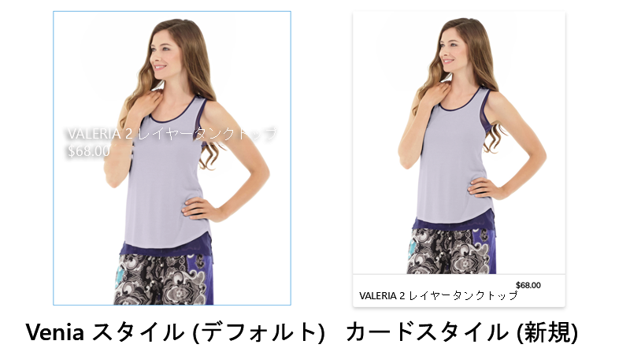

## 前提条件 {#prerequisites}

このチュートリアルを完了するには、ローカル開発環境が必要です。 これには、Magentoインスタンスに設定および接続されたAEMの実行インスタンスが含まれます。 AEMをCloud ServiceSDKとして使用したローカル開発の [セットアップに関する要件と手順を確認します](../develop.md)。

## ベニアプロジェクトのコピー {#clone-venia-project}

Venia Project [をコピーし](https://github.com/adobe/aem-cif-guides-venia) 、デフォルトのスタイルを上書きします。

>[!NOTE]
>
> **(CIFを含むAEMプロジェクトアーキタイプに基づく** )既存のプロジェクトを自由に使用し、このセクションをスキップしてください。

1. 次のgitコマンドを実行して、プロジェクトをコピーします。

   ```shell
   $ git clone git@github.com:adobe/aem-cif-guides-venia.git
   ```

1. プロジェクトを構築し、AEMのローカルインスタンスにデプロイします。

   ```shell
   $ cd aem-cif-guides-venia/
   $ mvn clean install -PautoInstallPackage,cloud
   ```

1. AEMインスタンス追加をMagentoインスタンスに接続したり、新しく作成したプロジェクトに設定を追加したりするために必要なOSGi設定。

1. この時点で、Magentoインスタンスに接続されたストアフロントの作業バージョンが必要です。 次の場所にある `US` / `Home` ページに移動します。 [http://localhost:4502/editor.html/content/venia/us/en.html](http://localhost:4502/editor.html/content/venia/us/en.html).

   現在、店頭ではベニアのテーマが使用されていることがわかります。 ストアフロントのメインメニューを展開すると、様々なカテゴリが表示され、接続Magentoが機能していることが示されます。

   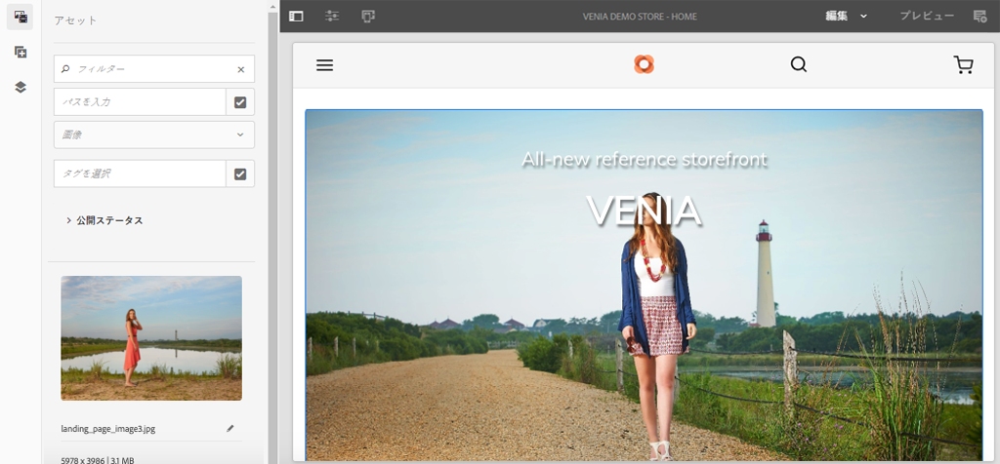

## クライアントライブラリとui.frontendモジュール {#introduction-to-client-libraries}

ストアフロントのテーマ/スタイルのレンダリングを担当するCSSとJavaScriptは、AEMで、 [クライアントライブラリ](https://docs.adobe.com/content/help/ja-JP/experience-manager-65/developing/introduction/clientlibs.html) （短くはclientlib）によって管理されます。 クライアントライブラリは、プロジェクトのコード内でCSSとJavaScriptを整理し、ページに配信するメカニズムを提供します。

ブランド固有のスタイルは、これらのクライアントライブラリで管理されるCSSを追加および上書きして、AEM CIFコアコンポーネントに適用できます。 クライアントライブラリが構造化され、ページに含まれる方法を理解することが重要です。

[ui.frontend](https://docs.adobe.com/content/help/ja-JP/experience-manager-core-components/using/developing/archetype/uifrontend.html) は、プロジェクトのすべてのフロントエンドアセットを管理するための専用の [Webpack](https://webpack.js.org/) プロジェクトです。 これにより、フロントエンド開発者は、TypeScript [、](https://www.typescriptlang.org/)Sassなど、様々な言語やテクノロジーを使用でき [ます](https://sass-lang.com/) 。

この `ui.frontend` モジュールはMavenモジュールでもあり、NPMモジュールの [aem-clientlib-generatorを使用して、より大きなプロジェクトに統合されています](https://github.com/wcm-io-frontend/aem-clientlib-generator)。 ビルド時に、はコンパイル済みのCSSファイルとJavaScriptファイルを `aem-clientlib-generator``ui.apps` モジュールのクライアントライブラリにコピーします。

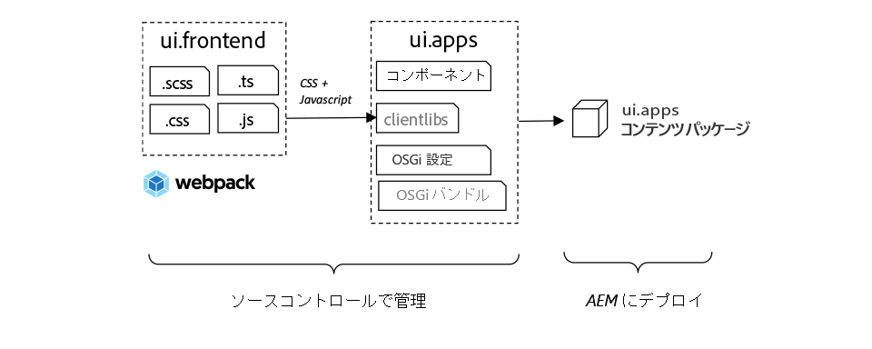

*コンパイル済みのCSSとJavaScriptは、Mavenのビルド中に、`ui.frontend`モジュールからクライアントライブラリとして`ui.apps`モジュールにコピーされます*

## Teaserスタイルを更新する {#ui-frontend-module}

次に、Teaserスタイルを少し変更して、モジュールとクライアントライブラリの動作を確認し `ui.frontend` ます。 任意 [のIDEを使用して](https://docs.adobe.com/content/help/en/experience-manager-learn/cloud-service/local-development-environment-set-up/development-tools.html#set-up-the-development-ide) 、Veniaプロジェクトをインポートします。 使用するスクリーンショットは、 [Visual StudioコードIDE](https://docs.adobe.com/content/help/en/experience-manager-learn/cloud-service/local-development-environment-set-up/development-tools.html#microsoft-visual-studio-code).

1. ui.frontend **** モジュールに移動して展開し、フォルダー階層を次のように展開します。 `ui.frontend/src/main/styles/commerce`:

   

   フォルダーの下に複数のSass (`.scss`)ファイルがあることに注意してください。 これらは、各コマースコンポーネントのコマース固有のスタイルです。

1. Open the file `_productteaser.scss`.

1. ルールを更新し、境界線の `.item__image` 規則を変更します。

   ```scss
   .item__image {
       border: #ea00ff 8px solid; /* <-- modify this rule */
       display: block;
       grid-area: main;
       height: auto;
       opacity: 1;
       transition-duration: 512ms;
       transition-property: opacity, visibility;
       transition-timing-function: ease-out;
       visibility: visible;
       width: 100%;
   }
   ```

   上記のルールは、製品Teaserコンポーネントに非常に太字のピンク色の境界線を追加する必要があります。

1. Open a new terminal window and navigate to the `ui.frontend` folder:

   ```shell
   $ cd <project-location>/aem-cif-guides-venia/ui.frontend
   ```

1. 次のMavenコマンドを実行します。

   ```shell
   $ mvn clean install
   ...
   [INFO] ------------------------------------------------------------------------
   [INFO] BUILD SUCCESS
   [INFO] ------------------------------------------------------------------------
   [INFO] Total time:  29.497 s
   [INFO] Finished at: 2020-08-25T14:30:44-07:00
   [INFO] ------------------------------------------------------------------------
   ```

   端末出力のInspect。 Mavenコマンドが、を含む複数のNPMスクリプトを実行したことがわかり `npm run build`ます。 この `npm run build` コマンドは `package.json` ファイル内で定義され、WebPackプロジェクトをコンパイルしてクライアントライブラリの生成をトリガーする効果があります。

1. Inspectファイル `ui.frontend/dist/clientlib-site/site.css`:

   

   このファイルは、プロジェクト内のすべてのSassファイルの圧縮バージョンです。

   >[!NOTE]
   >
   > このようなファイルはビルド時に生成される必要があるので、ソース管理から無視されます。

1. ファイルをInspect `ui.frontend/clientlib.config.js`。

   ```js
   /* clientlib.config.js*/
   ...
   // Config for `aem-clientlib-generator`
   module.exports = {
       context: BUILD_DIR,
       clientLibRoot: CLIENTLIB_DIR,
       libs: [
           {
               ...libsBaseConfig,
               name: 'clientlib-site',
               categories: ['venia.site'],
               dependencies: ['venia.dependencies', 'aem-core-cif-react-components'],
               assets: {
   ...
   ```

   これは [aem-clientlib-generatorの設定ファイルで](https://github.com/wcm-io-frontend/aem-clientlib-generator) 、コンパイル済みCSSとJavaScriptがAEMクライアントライブラリに変換される場所と方法を決定します。

1. モジュールで、ファイルを `ui.apps` 検査します。 `ui.apps/src/main/content/jcr_root/apps/venia/clientlibs/clientlib-site/css/site.css`:

   

   コピーされた `site.css` ファイルが `ui.apps` プロジェクトにコピーされます。 現在は、のカテゴリを持つクライアントライブラリ `clientlib-site` の一部となり `venia.site`ます。 ファイルがモジュールの一部になったら、AEMにデプロイでき `ui.apps` ます。

   >[!NOTE]
   >
   > このようなファイルはビルド時に生成される必要があるので、ソース管理からも無視されます。

1. 次に、プロジェクトで生成された他のクライアントライブラリを検査します。

   

   これらのクライアントライブラリは、 `ui.frontend` モジュールで管理されません。 代わりに、これらのクライアントライブラリには、Adobeが提供するCSSとJavaScriptの依存関係が含まれます。 これらのクライアントライブラリの定義は、各フォルダーの下の `.content.xml` ファイルにあります。

   **clientlib-base** - [AEM Core Componentsから必要な依存関係を埋め込んだ空のクライアントライブラリ](https://docs.adobe.com/content/help/ja-JP/experience-manager-core-components/using/introduction.html)。 カテゴリは `venia.base`です。

   **clientlib-cif** — これは、 [AEM CIFコアコンポーネントから必要な依存関係を単純に埋め込んだ空のクライアントライブラリでもあり](https://github.com/adobe/aem-core-cif-components)ます。 カテゴリは `venia.cif`です。

   **clientlib-grid** - AEMレスポンシブグリッド機能を有効にするために必要なCSSが含まれます。 AEMグリッドを使用すると、AEMエディターで [レイアウトモード](https://docs.adobe.com/content/help/en/experience-manager-65/administering/operations/configuring-responsive-layout.html#include-the-responsive-css) (Layout Mode)が有効になり、コンテンツ作成者はコンポーネントのサイズを変更できます。 カテゴリはライブラリ `venia.grid` に含まれ、 `venia.base` ライブラリに埋め込まれます。

1. Inspectはファイル `customheaderlibs.html` の下に `customfooterlibs.html` 次のように配置し `ui.apps/src/main/content/jcr_root/apps/venia/components/page`ます。

   

   これらのスクリプトには、 **venia.base** と **** venia.cifライブラリが含まれます。これらはすべてのページの一部です。

   >[!NOTE]
   >
   > ページスクリプトの一部として「ハードコード」されるのは、ベースライブラリのみです。 `venia.site` はこれらのファイルに含まれず、ページテンプレートの一部として含まれるので、柔軟性が高くなります。 これは後で検査します。

1. ターミナルから、プロジェクト全体を構築し、AEMのローカルインスタンスにデプロイします。

   ```shell
   $ cd aem-cif-guides-venia/
   $ mvn clean install -PautoInstallPackage,cloud
   ```

## 製品ティーザーの作成 {#author-product-teaser}

コードの更新が展開されたら、AEMオーサリングツールを使用して、Product Teaserコンポーネントの新しいインスタンスをサイトのホームページに追加します。 これにより、更新されたスタイルの表示が可能になります。

1. 新しいブラウザータブを開き、サイトの **ホームページ** に移動します。 [http://localhost:4502/editor.html/content/venia/us/en.html](http://localhost:4502/editor.html/content/venia/us/en.html).

1. 編集 **モードでアセットファインダー（サイドレール）を展開します** 。 アセットフィルターを **製品に切り替えます**。

   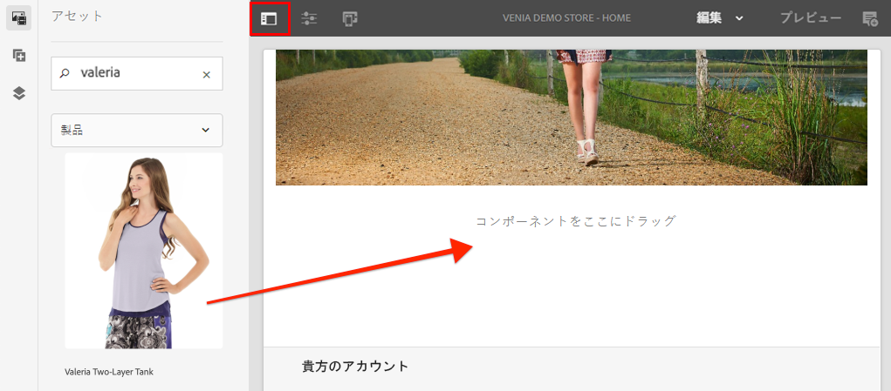

1. 新しい商品をメインのレイアウトコンテナのホームページにドラッグ&amp;ドロップします。

   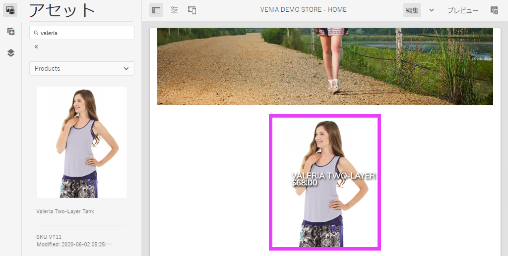

   以前に作成したCSSルールの変更に基づき、Product Teaserの境界が明るいピンク色になりました。

## ページ上のクライアントライブラリの検証 {#verify-client-libraries}

次に、クライアントライブラリがページに含まれていることを確認します。

1. サイトの **ホームページ** : [http://localhost:4502/editor.html/content/venia/us/en.html](http://localhost:4502/editor.html/content/venia/us/en.html).

1. **ページ情報** メニューを選択し、「 **表示は公開済み**」をクリックします。

   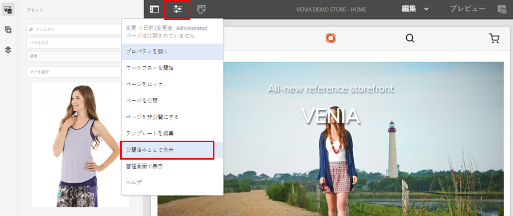

   これにより、AEM作成者のjavascriptが読み込まれずに、公開されたサイトに表示されるので、ページが開きます。 URLにクエリパラメーターが `?wcmmode=disabled` 追加されていることに注意してください。 CSSとJavaScriptを開発する場合は、このパラメーターを使用してAEM作成者が提供した内容を含めてページを簡略化することをお勧めします。

1. ページソースの表示を行い、次のクライアントライブラリをいくつか識別できるようにします。

   ```html
   <!DOCTYPE html>
   <html lang="en-US">
   <head>
       ...
       <link rel="stylesheet" href="/etc.clientlibs/venia/clientlibs/clientlib-base.min.css" type="text/css">
       <link rel="stylesheet" href="/etc.clientlibs/venia/clientlibs/clientlib-site.min.css" type="text/css">
   </head>
   ...
       <script type="text/javascript" src="/etc.clientlibs/venia/clientlibs/clientlib-site.min.js"></script>
       <script type="text/javascript" src="/etc.clientlibs/core/wcm/components/commons/site/clientlibs/container.min.js"></script>
       <script type="text/javascript" src="/etc.clientlibs/venia/clientlibs/clientlib-base.min.js"></script>
   <script type="text/javascript" src="/etc.clientlibs/core/cif/clientlibs/common.min.js"></script>
   <script type="text/javascript" src="/etc.clientlibs/venia/clientlibs/clientlib-cif.min.js"></script>
   </body>
   </html>
   ```

   クライアントライブラリは、ページに配信される際にプレフィックスが付けら `/etc.clientlibs` れ、 [プロキシ](https://docs.adobe.com/content/help/en/experience-manager-65/developing/introduction/clientlibs.html#locating-a-client-library-folder-and-using-the-proxy-client-libraries-servlet) 経由で提供され、またはで機密事項が公開されないようにな `/apps` りま `/libs`す。

   注意 `venia/clientlibs/clientlib-site.min.css` と `venia/clientlibs/clientlib-site.min.js`。 これらは、モジュールから派生したコンパイル済みのCSSファイルとJavaScriptファイルで `ui.frontend` す。

## ページテンプレートによるクライアントライブラリの追加 {#client-library-inclusion-pagetemplates}

クライアント側ライブラリを含める方法には、いくつかのオプションがあります。 次に、 `clientlib-site` ページテンプレートを使用して、生成されたプロジェクトにどのように [ライブラリが含まれるかを調べます](https://docs.adobe.com/content/help/ja-JP/experience-manager-65/developing/platform/templates/page-templates-editable.html)。

1. AEM Editor内でサイトの **ホームページ** に移動します。 [http://localhost:4502/editor.html/content/venia/us/en.html](http://localhost:4502/editor.html/content/venia/us/en.html).

1. 「 **ページ情報** 」メニューを選択し、「テンプレートの **編集**」をクリックします。

   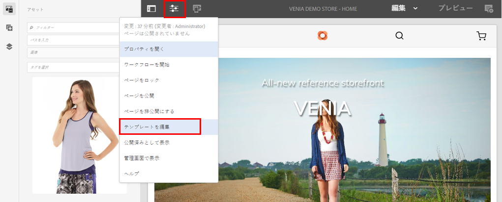

   これにより、 **ホーム** ページの基になる **ランディングページ** ・テンプレートが開きます。

   >[!NOTE]
   >
   > AEM開始画面で使用可能なすべてのテンプレートを表示するには、 **ツール** / **一般** / **テンプレートに移動します**。

1. 左上隅の「 **ページ情報** 」アイコンを選択し、「 **ページポリシー**」をクリックします。

   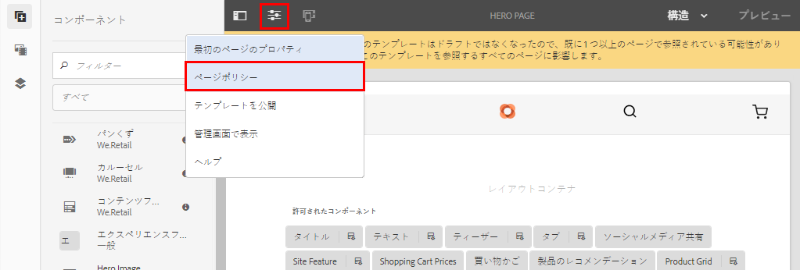

1. これにより、ランディングページテンプレートのページポリシーが開きます。

   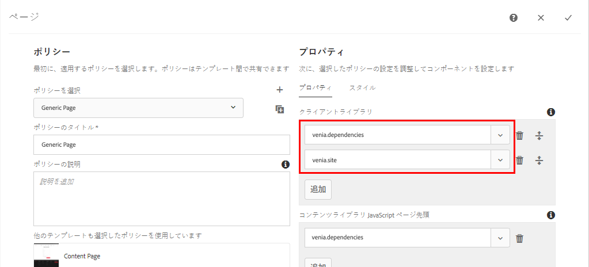

   右側には、このテンプレートを使用するすべてのページに含まれるクライアントライブラリ **カテゴリ** の一覧が表示されます。

   * `venia.dependencies`  — に `venia.site` 依存するベンダーライブラリを提供します。
   * `venia.site`  — これは、 `clientlib-site``ui.frontend` モジュールが生成するカテゴリです。

   他のテンプレートでは、同じポリシー、 **コンテンツページ**、 **ランディングページ**、同じポリシーを再使用すると、すべてのページに同じクライアントライブラリを確実に含めることができます。

   テンプレートとページポリシーを使用してクライアントライブラリの組み込みを管理する利点は、テンプレートごとにポリシーを変更できることです。 例えば、同じAEMインスタンス内で2つの異なるブランドを管理しているとします。 各ブランドには独自のスタイルまたは *テーマがあります* が、基本ライブラリとコードは同じです。 別の例として、特定のページにのみ表示したい大きなクライアントライブラリがある場合、そのテンプレートのみに固有のページポリシーを作成できます。

## ローカルWebPackの開発 {#local-webpack-development}

前の練習では、 `ui.frontend` モジュール内のSassファイルを更新し、Mavenビルドを実行した後に、変更をAEMにデプロイしました。 次に、webpack-dev-serverを活用して、フロントエンドのスタイルを迅速に開発する方法を説明します。

webpack-dev-serverは、AEMのローカルインスタンスから画像と一部のCSS/JavaScriptをプロキシしますが、開発者は、 `ui.frontend` モジュール内のスタイルとJavaScriptを変更できます。

1. ブラウザーで、 **ホーム** ページに移動し、 **表示が「発行済み**」として表示されます。 [http://localhost:4502/content/venia/us/en.html?wcmmode=disabled](http://localhost:4502/content/venia/us/en.html?wcmmode=disabled).

1. ページのソースとページの生HTMLの **コピー** 表示。

1. モジュールの下で選択したIDEに戻り、ファイルを `ui.frontend` 開きます。 `ui.frontend/src/main/static/index.html`

   

1. 前の手順でコピーしたHTMLの内容を上書き `index.html` し **て貼り付けます** 。

1. includes for `clientlib-site.min.css`、 `clientlib-site.min.js` および **remove** 。

   ```html
   <head>
       <!-- remove this link -->
       <link rel="stylesheet" href="/etc.clientlibs/venia/clientlibs/clientlib-base.min.css" type="text/css">
       ...
   </head>
   <body>
       ...
        <!-- remove this link -->
       <script type="text/javascript" src="/etc.clientlibs/venia/clientlibs/clientlib-site.min.js"></script>
   </body>
   ```

   これらは、モジュールで生成されるCSSとJavaScriptのコンパイル版を表すので、削除され `ui.frontend` ます。 他のクライアントライブラリは、実行中のAEMインスタンスからプロキシされるので、そのままにします。

1. Open a new terminal window and navigate into the `ui.frontend` folder. Run the command `npm start`:

   ```shell
   $ cd ui.frontend
   $ npm start
   ```

   これにより、http://localhost:8080/のwebpack-dev-serverが開始され [ます。](http://localhost:8080/)

   >[!CAUTION]
   >
   > Sass関連のエラーが発生した場合は、サーバーを停止し、コマンドを実行して上記の手順 `npm rebuild node-sass` を繰り返します。 これは、の別のバージョンがあり、その後プロジェクトで指定され `npm` た場合 `node` に発生する可能性があり `aem-cif-guides-venia/pom.xml`ます。

1. AEMのログインインスタンスと同じブラウザーを使用して、新しいタブ [http://localhost:8080/](http://localhost:8080/) に移動します。 Veniaホームページはwebpack-dev-serverで確認できます。

   

   webpack-dev-serverは実行したままにします。 次の練習で使用します。

## Product Teaser用のカードスタイルの実装 {#update-css-product-teaser}

次に、 `ui.frontend` モジュール内のSassファイルを変更し、Product Teaser用のカードに似たスタイルを実装します。 webpack-dev-serverは、変更をすぐに確認するために使用されます。

IDEと生成されたプロジェクトに戻ります。

1. ui.frontend **モジュールで、ファイルを再度開** き `_productteaser.scss``ui.frontend/src/main/styles/commerce/_productteaser.scss`ます。

1. 製品のTeaserの境界線に次の変更を加えます。

   ```diff
       .item__image {
   -       border: #ea00ff 8px solid;
   +       border-bottom: 1px solid #c0c0c0;
           display: block;
           grid-area: main;
           height: auto;
           opacity: 1;
           transition-duration: 512ms;
           transition-property: opacity, visibility;
           transition-timing-function: ease-out;
           visibility: visible;
           width: 100%;
       }
   ```

   変更を保存すると、webpack-dev-serverは自動的に新しいスタイルで更新されます。

1. 製品テ追加ィーザーのドロップシャドウと角丸を含むドロップシャドウです。

   ```scss
    .item__root {
        position: relative;
        box-shadow: 0 4px 8px 0 rgba(0,0,0,0.2);
        transition: 0.3s;
        border-radius: 5px;
        float: left;
        margin-left: 12px;
        margin-right: 12px;
   }
   
   .item__root:hover {
      box-shadow: 0 8px 16px 0 rgba(0,0,0,0.2);
   }
   ```

1. 製品名を更新して、ティーザーの下部に表示されるようにし、テキストの色を変更します。

   ```css
   .item__name {
       color: #000;
       display: block;
       float: left;
       font-size: 22px;
       font-weight: 900;
       line-height: 1em;
       padding: 0.75em;
       text-transform: uppercase;
       width: 75%;
   }
   ```

1. 製品の価格を更新して、ティーザーの下部にも表示されるようにし、テキストの色を変更します。

   ```css
   .price {
       color: #000;
       display: block;
       float: left;
       font-size: 18px;
       font-weight: 900;
       padding: 0.75em;
       padding-bottom: 2em;
       width: 25%;
   
       ...
   ```

1. 992px未満の画面に名前と価格を積み重ねるには、下部のメディアクエリを更新し **ます**。

   ```css
   @media (max-width: 992px) {
       .productteaser .item__name {
           font-size: 18px;
           width: 100%;
       }
       .productteaser .item__price {
           font-size: 14px;
           width: 100%;
       }
   }
   ```

   次に、カードのスタイルがwebpack-dev-serverに反映されます。

   

   ただし、変更はAEMにまだ展開されていません。 この [ソリューションファイルは、こちらからダウンロードできます](../assets/style-cif-component/_productteaser.scss)。

1. コマンドラインターミナルから、Mavenスキルを使用してAEMにアップデートを展開します。

   ```shell
   $ cd aem-cif-guides-venia/
   $ mvn clean install -PautoInstallPackage,cloud
   ```

   >[!NOTE]
   >追加の [IDEの設定とツール](https://docs.adobe.com/content/help/en/experience-manager-learn/foundation/development/set-up-a-local-aem-development-environment.html#set-up-an-integrated-development-environment) (完全なMavenビルドを実行することなく、プロジェクトファイルをローカルのAEMインスタンスに直接同期できます)。

## 表示が更新された製品ティーザー {#view-updated-product-teaser}

プロジェクトのコードをAEMに導入した後、Product Teaserの変更を確認できるようになります。

1. ブラウザに戻り、ホームページを再度更新します。 [http://localhost:4502/editor.html/content/venia/us/en.html](http://localhost:4502/editor.html/content/venia/us/en.html). 更新された製品Teaserスタイルが適用されていることが確認できます。

   

1. 製品テーザーを追加してテストします。 レイアウトモードを使用して、複数のティーザーを一列に表示するためにコンポーネントの幅とオフセットを変更します。

   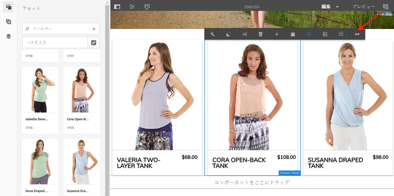

## トラブルシューティング {#troubleshooting}

CRXDE-Liteで、更新されたCSSファイルがデプロイされたこ [とを確認できます](http://localhost:4502/crx/de/index.jsp) 。 [http://localhost:4502/crx/de/index.jsp#/apps/venia/clientlibs/clientlib-site/css/site.css](http://localhost:4502/crx/de/index.jsp#/apps/venia/clientlibs/clientlib-site/css/site.css)

新しいCSSファイルやJavaScriptファイルをデプロイする場合は、ブラウザーで古いファイルが提供されないようにすることも重要です。 これは、ブラウザーのキャッシュをクリアするか、新しいブラウザーセッションを開始することで解消できます。

また、AEMは、パフォーマンスを考慮してクライアントライブラリをキャッシュしようとします。 コードのデプロイメントに従って、古いファイルが提供されることがあります。 [クライアントライブラリの [再構築]ツールを使用して、AEMクライアントライブラリのキャッシュを手動で無効にすることができます](http://localhost:4502/libs/granite/ui/content/dumplibs.rebuild.html)。 *AEMが古いバージョンのクライアントライブラリをキャッシュしていると思われる場合は、「キャッシュを無効にする」をお勧めします。 ライブラリの再構築は非効率で時間がかかります。*

## Congratulations {#congratulations}

最初のAEM CIFコアコンポーネントとWebPackデベロッパーサーバーを使用しただけです。

## ボーナスチャレンジ {#bonus-challenge}

[AEM Styleシステムを使用して](https://docs.adobe.com/content/help/ja-JP/experience-manager-65/developing/components/style-system.html) 、コンテンツ作成者がオン/オフを切り替えることのできる2つのスタイルを作成します。 [スタイルシステムを使用した開発では](https://docs.adobe.com/content/help/en/experience-manager-learn/getting-started-wknd-tutorial-develop/style-system.html) 、この作業を行う方法に関する詳細な手順と情報が説明されています。

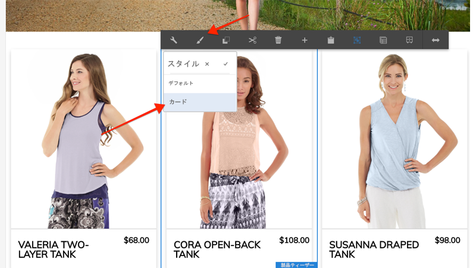

## その他のリソース {#additional-resources}

* [AEM プロジェクトアーキタイプ](https://github.com/adobe/aem-project-archetype)
* [AEM CIFコアコンポーネント](https://github.com/adobe/aem-core-cif-components)
* [ローカルAEM開発環境の設定](https://docs.adobe.com/content/help/en/experience-manager-learn/cloud-service/local-development-environment-set-up/overview.html)
* [クライアント側ライブラリ](https://docs.adobe.com/content/help/ja-JP/experience-manager-65/developing/introduction/clientlibs.html)
* [はじめに —AEM Sites](https://docs.adobe.com/content/help/ja-JP/experience-manager-learn/getting-started-wknd-tutorial-develop/overview.html)
* [スタイルシステムを使用した開発](https://docs.adobe.com/content/help/en/experience-manager-learn/getting-started-wknd-tutorial-develop/style-system.html)
