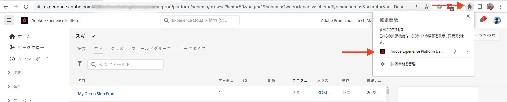

# AEM-CIF コアコンポーネントとAdobe Experience Platformの統合 {#aem-cif-aep-integration}

この [コマース統合フレームワーク (CIF)](https://github.com/adobe/aem-core-cif-components) コアコンポーネントは、 [Adobe Experience Platform](https://experienceleague.adobe.com/docs/experience-platform/landing/platform-overview.html?lang=en) ストアフロントイベントとそのデータを、次のようなクライアント側の操作から転送するには： __買い物かごに追加__.

この [AEM CIF コアコンポーネント](https://github.com/adobe/aem-core-cif-components) プロジェクトは、 [Adobe Commerce用Adobe Experience Platform Connector](https://github.com/adobe/aem-core-cif-components/tree/master/extensions/experience-platform-connector) Commerce ストアフロントからイベントデータを収集します。 このイベントデータはExperience Platformに送信され、Adobe AnalyticsやAdobe Targetなどの他のAdobe Experience Cloud製品で使用されて、カスタマージャーニーに対応する 360 度のプロファイルを作成します。 コマースデータをAdobe Experience Cloud内の他の製品に接続することで、サイトでのユーザー行動の分析、AB テストの実行、パーソナライズされたキャンペーンの作成などのタスクを実行できます。

詳しくは、 [Experience Platformデータ収集](https://experienceleague.adobe.com/docs/experience-platform/collection/home.html) クライアント側のソースから顧客体験データを収集できるテクノロジーのスイート。

## 送信 `addToCart` イベントデータからExperience Platform {#send-addtocart-to-aep}

次の手順で、 `addToCart` イベントデータをAEMレンダリングした製品ページから CIF -Experience Platformコネクタを使用したExperience Platformに送信します。 Adobe Experience Platform Debugger ブラウザー拡張機能を使用して、送信されたデータをテストし、確認できます。


## 前提条件 {#prerequisites}

このデモを完了するには、ローカル開発環境を使用する必要があります。 これには、Adobe Commerce に設定および接続された AEM の実行インスタンスが含まれます。[AEM as Cloud Service SDK を使用してローカル開発をセットアップする](../develop.md)ための要件と手順を確認します。

また、 [Adobe Experience Platform](https://experienceleague.adobe.com/docs/experience-platform/landing/platform-ui/ui-guide.html) データ収集用のスキーマ、データセット、データストリームを作成する権限と権限。 詳しくは、 [権限管理](https://experienceleague.adobe.com/docs/experience-platform/collection/permissions.html).

## AEM Commerceas a Cloud Service設定 {#aem-setup}

作業を行うには __AEM Commerceas a Cloud Service__ 必要なコードと設定を含むローカル環境で、次の手順を実行します。

### ローカル設定

フォロー： [ローカル設定](https://experienceleague.adobe.com/docs/experience-manager-cloud-service/content/content-and-commerce/storefront/developing/develop.html?#local-setup) 動作するAEM Commerceas a Cloud Serviceの環境を作成する手順です。

### プロジェクト設定

フォロー： [AEM Project Archetype](https://experienceleague.adobe.com/docs/experience-manager-cloud-service/content/content-and-commerce/storefront/developing/develop.html?#project) 新しいAEM Commerce(CIF) プロジェクトを作成する手順です。

>[!TIP]
>
>次の例では、AEM Commerce プロジェクトの名前はです。 `My Demo Storefront`ただし、独自のプロジェクト名を選択することもできます。


新しく作成したAEM Commerce プロジェクトをビルドし、プロジェクトのルートディレクトリから次のコマンドを実行して、ローカルのAEM SDK にデプロイします。

```bash
$ mvn clean install -PautoInstallSinglePackage
```

ローカルにデプロイされた `My Demo StoreFront` デフォルトのコードとコンテンツを含むコマースサイトは、次のようになります。


### Peregrine および CIF-AEP コネクタの依存関係のインストール

このAEM Commerce サイトのカテゴリページと製品ページからイベントデータを収集して送信するには、キーをインストールする必要があります `npm` パッケージを `ui.frontend` AEM Commerce プロジェクトのモジュール。

次に移動： `ui.frontend` モジュールを開き、コマンドラインから次のコマンドを実行して、必要なパッケージをインストールします。

```bash
npm i --save lodash.get@^4.4.2 lodash.set@^4.3.2
npm i --save apollo-cache-persist@^0.1.1
npm i --save redux-thunk@~2.3.0
npm i --save @adobe/apollo-link-mutation-queue@~1.1.0
npm i --save @magento/peregrine@~12.5.0
npm i --save @adobe/aem-core-cif-react-components --force
npm i --save-dev @magento/babel-preset-peregrine@~1.2.1
npm i --save @adobe/aem-core-cif-experience-platform-connector --force
```

>[!IMPORTANT]
>
>この `--force` 引数は、 [PWA Studio](https://developer.adobe.com/commerce/pwa-studio/) は、サポートされているピアの依存関係に対して制限を受けます。 通常は、これによって問題が発生することはありません。


### を使用するように Maven を設定 `--force` 引数

Maven のビルドプロセスの一環として、npm clean install( `npm ci`) を呼び出すことができます。 これには、 `--force` 引数。

プロジェクトのルート POM ファイルに移動します。 `pom.xml` と `<id>npm ci</id>` 実行ブロック。 次のようにブロックを更新します。

```xml
<execution>
    <id>npm ci</id>
    <goals>
    <goal>npm</goal>
    </goals>
    <configuration>
    <arguments>ci --force</arguments>
    </configuration>
</execution>
```

### Babel 構成形式を変更

デフォルトから切り替え `.babelrc` ファイルの相対設定ファイル形式 `babel.config.js` 形式 これはプロジェクト全体の設定形式で、プラグインやプリセットを `node_module` より詳細な制御が可能な

1. 次に移動： `ui.frontend` モジュールを作成し、既存の `.babelrc` ファイル。

1. の作成 `babel.config.js` ファイル `peregrine` プリセット。

   ```javascript
   const peregrine = require('@magento/babel-preset-peregrine');
   
   module.exports = (api, opts = {}) => {
       const config = {
           ...peregrine(api, opts),
           sourceType: 'unambiguous'
       } 
   
       config.plugins = config.plugins.filter(plugin => plugin !== 'react-refresh/babel');
   
       return config;
   }
   ```

### Babel を使用するように Webpack を設定

Babel ローダ (`babel-loader`) や webpack の場合は、 `webpack.common.js` ファイル。

次に移動： `ui.frontend` モジュールと `webpack.common.js` ファイルの `module` プロパティ値：

```javascript
{
    test: /\.jsx?$/,
    exclude: /node_modules\/(?!@magento\/)/,
    loader: 'babel-loader'
}
```

### Apollo クライアントを設定

この [Apollo Client](https://www.apollographql.com/docs/react/) は、GraphQLでローカルデータとリモートデータの両方を管理するために使用されます。 また、GraphQLクエリの結果は、ローカルの正規化されたメモリ内キャッシュに格納されます。

の場合 [`InMemoryCache`](https://www.apollographql.com/docs/react/caching/cache-configuration/) 効果的に働くには、 `possibleTypes.js` ファイル。 このファイルを生成するには、 [possibleTypes の自動生成](https://www.apollographql.com/docs/react/data/fragments/#generating-possibletypes-automatically). また、 [PWA Studio参照の実装](https://github.com/magento/pwa-studio/blob/1977f38305ff6c0e2b23a9da7beb0b2f69758bed/packages/pwa-buildpack/lib/Utilities/graphQL.js#L106-L120) そして、 [`possibleTypes.js`](../assets/aep-integration/possibleTypes.js) ファイル。


1. 次に移動： `ui.frontend` モジュール化し、ファイルを `./src/main/possibleTypes.js`

1. を更新します。 `webpack.common.js` ファイルの `DefinePlugin` セクションを使用して、ビルド時に必要な静的変数を置き換えます。

   ```javascript
   const { DefinePlugin } = require('webpack');
   const { POSSIBLE_TYPES } = require('./src/main/possibleTypes');
   
   ...
   
   plugins: [
       ...
       new DefinePlugin({
           'process.env.USE_STORE_CODE_IN_URL': false,
           POSSIBLE_TYPES
       })
   ]
   ```

### Peregrine および CIF コアコンポーネントの初期化

React ベースの Peregrine および CIF コアコンポーネントを初期化するには、必要な設定と JavaScript ファイルを作成します。

1. 次に移動： `ui.frontend` モジュールを作成し、次のフォルダーを作成します。 `src/main/webpack/components/commerce/App`

1. の作成 `config.js` ファイルに次の内容を含めます。

   ```javascript
   // get and parse the CIF store configuration from the <head>
   const storeConfigEl = document.querySelector('meta[name="store-config"]');
   const storeConfig = storeConfigEl ? JSON.parse(storeConfigEl.content) : {};
   
   // the following global variables are needed for some of the peregrine features
   window.STORE_VIEW_CODE = storeConfig.storeView || 'default';
   window.AVAILABLE_STORE_VIEWS = [
       {
           code: window.STORE_VIEW_CODE,
           base_currency_code: 'USD',
           default_display_currency_code: 'USD',
           id: 1,
           locale: 'en',
           secure_base_media_url: '',
           store_name: 'My Demo StoreFront'
       }
   ];
   window.STORE_NAME = window.STORE_VIEW_CODE;
   window.DEFAULT_COUNTRY_CODE = 'en';
   
   export default {
       storeView: window.STORE_VIEW_CODE,
       graphqlEndpoint: storeConfig.graphqlEndpoint,
       // Can be GET or POST. When selecting GET, this applies to cache-able GraphQL query requests only.
       // Mutations will always be executed as POST requests.
       graphqlMethod: storeConfig.graphqlMethod,
       headers: storeConfig.headers,
   
       mountingPoints: {
           // TODO: define the application specific mount points as they may be used by <Portal> and <PortalPlacer>
       },
       pagePaths: {
           // TODO: define the application specific paths/urls as they may be used by the components
           baseUrl: storeConfig.storeRootUrl
       },
       eventsCollector: {
           // Enable the Experience Platform Connector and define the org and datastream to use
           aep: {
               orgId: // TODO: add your orgId
               datastreamId: // TODO: add your datastreamId
           }
       }
   };
   ```

   >[!IMPORTANT]
   >
   >既に [`config.js`](https://github.com/adobe/aem-cif-guides-venia/blob/main/ui.frontend/src/main/components/App/config.js) ファイルから __AEMガイド — CIF Venia プロジェクト__、このファイルに対していくつかの変更が必要です。 まず、任意の __TODO__ コメント。 次に、 `eventsCollector` プロパティを検索するには、 `eventsCollector > aed` オブジェクトを更新し、 `orgId` および `datastreamId` プロパティを正しい値に設定します。 [詳細情報](./aep.md#add-aep-values-to-aem)を参照してください。

1. の作成 `App.js` ファイルの内容を次に示します。 このファイルは、一般的な React アプリケーションの開始点ファイルに似ており、React とカスタムフック、および React Context の使用により、Experience Platformの統合を容易にすることができます。

   ```javascript
   import config from './config';
   
   import React, { useEffect } from 'react';
   import ReactDOM from 'react-dom';
   import { IntlProvider } from 'react-intl';
   import { BrowserRouter as Router } from 'react-router-dom';
   import { combineReducers, createStore } from 'redux';
   import { Provider as ReduxProvider } from 'react-redux';
   import { createHttpLink, ApolloProvider } from '@apollo/client';
   import { ConfigContextProvider, useCustomUrlEvent, useReferrerEvent, usePageEvent, useDataLayerEvents, useAddToCartEvent } from '@adobe/aem-core-cif-react-components';
   import { EventCollectorContextProvider, useEventCollectorContext } from '@adobe/aem-core-cif-experience-platform-connector';
   import { useAdapter } from '@magento/peregrine/lib/talons/Adapter/useAdapter';
   import { customFetchToShrinkQuery } from '@magento/peregrine/lib/Apollo/links';
   import { BrowserPersistence } from '@magento/peregrine/lib/util';
   import { default as PeregrineContextProvider } from '@magento/peregrine/lib/PeregrineContextProvider';
   import { enhancer, reducers } from '@magento/peregrine/lib/store';
   
   const storage = new BrowserPersistence();
   const store = createStore(combineReducers(reducers), enhancer);
   
   storage.setItem('store_view_code', config.storeView);
   
   const App = () => {
       const [{ sdk: mse }] = useEventCollectorContext();
   
       // trigger page-level events
       useCustomUrlEvent({ mse });
       useReferrerEvent({ mse });
       usePageEvent({ mse });
       // listen for add-to-cart events and enable forwarding to the magento storefront events sdk
       useAddToCartEvent(({ mse }));
       // enable CIF specific event forwarding to the Adobe Client Data Layer
       useDataLayerEvents();
   
       useEffect(() => {
           // implement a proper marketing opt-in, for demo purpose we hard-set the consent cookie
           if (document.cookie.indexOf('mg_dnt') < 0) {
               document.cookie += '; mg_dnt=track';
           }
       }, []);
   
       // TODO: use the App to create Portals and PortalPlaceholders to mount the CIF / Peregrine components to the server side rendered markup
       return <></>;
   };
   
   const AppContext = ({ children }) => {
       const { storeView, graphqlEndpoint, graphqlMethod = 'POST', headers = {}, eventsCollector } = config;
       const { apolloProps } = useAdapter({
           apiUrl: new URL(graphqlEndpoint, window.location.origin).toString(),
           configureLinks: (links, apiBase) =>
               // reconfigure the HTTP link to use the configured graphqlEndpoint, graphqlMethod and storeView header
   
               links.set('HTTP', createHttpLink({
                   fetch: customFetchToShrinkQuery,
                   useGETForQueries: graphqlMethod !== 'POST',
                   uri: apiBase,
                   headers: { ...headers, 'Store': storeView }
               }))
       });
   
       return (
           <ApolloProvider {...apolloProps}>
               <IntlProvider locale='en' messages={{}}>
                   <ConfigContextProvider config={config}>
                       <ReduxProvider store={store}>
                           <PeregrineContextProvider>
                               <EventCollectorContextProvider {...eventsCollector}>
                                   {children}
                               </EventCollectorContextProvider>
                           </PeregrineContextProvider>
                       </ReduxProvider>
                   </ConfigContextProvider>
               </IntlProvider>
           </ApolloProvider>
       );
   };
   
   window.onload = async () => {
       const root = document.createElement('div');
       document.body.appendChild(root);
   
       ReactDOM.render(
           <Router>
               <AppContext>
                   <App />
               </AppContext>
           </Router>,
           root
       );
   };
   ```

   この `EventCollectorContext` は次の React Context を書き出します。

   - commerce-events-sdk および commerce-events-collector ライブラリを読み込みます。
   - Experience Platformや ACDS の指定された設定で初期化する
   - Peregrine からすべてのイベントを購読し、イベント SDK に転送します。

   以下の `EventCollectorContext` [ここ](https://github.com/adobe/aem-core-cif-components/blob/3d4e44d81fff2f398fd2376d24f7b7019f20b31b/extensions/experience-platform-connector/src/events-collector/EventCollectorContext.js).

### 更新されたAEMプロジェクトをビルドしてデプロイします。

上記のパッケージのインストール、コードおよび設定の変更が正しいことを確認するには、次の Maven コマンドを使用して、更新されたAEM Commerce プロジェクトを再ビルドし、デプロイします。 `$ mvn clean install -PautoInstallSinglePackage`.

## Experience Platform設定 {#aep-setup}

カテゴリや製品など、AEM Commerce ページからのイベントデータを受け取って保存するには、次の手順を実行します。

>[!AVAILABILITY]
>
>自分が正しい __製品プロファイル__ under __Adobe Experience Platform__ および __Adobe Experience Platform Data Collection__. 必要に応じて、システム管理者と協力して、作成、更新、割り当てをおこないます __製品プロファイル__ の下に [Admin Console](https://adminconsole.adobe.com/).

### コマースフィールドグループを含むスキーマを作成

コマースイベントデータの構造を定義するには、エクスペリエンスデータモデル (XDM) スキーマを作成する必要があります。 スキーマは、データの構造と形式を表し、検証する一連のルールです。

1. ブラウザーで、 __Adobe Experience Platform__ 製品のホームページ。 （例：<https://experience.adobe.com/#/@YOUR-ORG-NAME/sname:prod/platform/home>）。

1. を __スキーマ__ 左側のナビゲーションセクションのメニューで、 __スキーマを作成__ ボタンをクリックし、 __XDM ExperienceEvent__.

   

1. を使用してスキーマに名前を付けます。 __スキーマのプロパティ/表示名__ フィールドを開き、  __構成/フィールドグループ/追加__ 」ボタンをクリックします。

   

1. 内 __フィールドグループの追加__ ダイアログ、検索 `Commerce`を選択し、 __コマースの詳細__ チェックボックスをオンにして、 __フィールドグループの追加__.

   


>[!TIP]
>
>詳しくは、 [スキーマ構成の基本](https://experienceleague.adobe.com/docs/experience-platform/xdm/schema/composition.html) を参照してください。

### データセットを作成

イベントデータを保存するには、スキーマ定義に準拠するデータセットを作成する必要があります。 データセットは、スキーマ（列）とフィールド（行）を含むテーブルなど、データの集まりのストレージと管理の構成体です。

1. ブラウザーで、 __Adobe Experience Platform__ 製品のホームページ。 （例：<https://experience.adobe.com/#/@YOUR-ORG-NAME/sname:prod/platform/home>）。

1. を __データセット__ メニューを開き、 __データセットを作成__ ボタンを使用して、セグメントの特性を設定できます。

   

1. 新しいページで、「 」を選択します。 __スキーマからデータセットを作成__ カード。

   

- 新しいページで、 __検索と選択__ 前の手順で作成したスキーマを選択し、 __次へ__ 」ボタンをクリックします。

   

1. を使用してデータセットに名前を付ける __データセットを設定/名前__ フィールドに入力し、 __完了__ 」ボタンをクリックします。

   

>[!TIP]
>
>詳しくは、 [データセットの概要](https://experienceleague.adobe.com/docs/experience-platform/catalog/datasets/overview.html) を参照してください。


### データストリームを作成

以下の手順を実行して、データストリームをExperience Platformで作成します。

1. ブラウザーで、 __Adobe Experience Platform__ 製品のホームページ。 （例：<https://experience.adobe.com/#/@YOUR-ORG-NAME/sname:prod/platform/home>）。

1. を __データストリーム__ メニューを開き、 __新規データストリーム__ ボタンを使用して、セグメントの特性を設定できます。

   

1. を使用してデータストリームに名前を付けます。 __名前__ 必須フィールド。 以下 __イベントスキーマ__ 「 」フィールドで、新しく作成したスキーマを選択し、 __保存__.

   

1. 新しく作成したデータストリームを開き、 __サービスを追加__.

   

1. 以下 __サービス__ フィールドで、 __Adobe Experience Platform__ オプション。 の下 __イベントデータセット__ フィールドで、前の手順のデータセット名を選択し、 __保存__.

   

>[!TIP]
>
>詳しくは、 [データストリームの概要](https://experienceleague.adobe.com/docs/experience-platform/edge/datastreams/overview.html) を参照してください。

## AEM Commerce 設定に datastream 値を追加 {#add-aep-values-to-aem}

上記のExperience Platform設定が完了したら、 `datastreamId` （データストリームの詳細の左側のレール）と `orgId` の右上隅に __プロファイルの画像/アカウント情報/ユーザー情報__ モーダルです。


1. AEM Commerce プロジェクトの `ui.frontend` モジュール、 `config.js` ファイル、特に `eventsCollector > aep` オブジェクトのプロパティ。

1. 更新されたAEM Commerce プロジェクトをビルドしてデプロイします。


## トリガー `addToCart` イベントとデータ収集の検証 {#event-trigger-verify}

上記の手順は、AEM Commerce とExperience Platformの設定を完了します。 これで、トリガーを `addToCart` イベントを確認し、デバッガーとデータセットを使用してExperience Platform収集を検証します。 __指標とグラフ__ 製品 UI で切り替えます。

イベントをトリガーするには、ローカルセットアップからAEMオーサーまたはパブリッシュサービスを使用します。 この例では、アカウントにログインしてAEM author を使用します。

1. サイトページから、 __My Demo StoreFront > us > en__ ページを開き、「 __編集__ 上部のアクションバー。

1. 上部のアクションバーで、 __公開済みとして表示__&#x200B;をクリックし、ストアフロントのナビゲーションから任意のカテゴリをクリックします。

1. の任意の製品カードをクリックします。 __製品紹介ページ__&#x200B;を選択し、「 __色、サイズ__ 有効にする __買い物かごに追加__ 」ボタンをクリックします。


1. を開きます。 __Adobe Experience Platform Debugger__ ブラウザーの拡張機能パネルから「 」を選択し、 __Experience Platform水型 SDK__ をクリックします。

   


1. に戻る __製品紹介ページ__ をクリックし、 __買い物かごに追加__ 」ボタンをクリックします。 これにより、データがExperience Platformに送信されます。 この __Adobe Experience Platform Debugger__ 拡張機能には、イベントの詳細が表示されます。

   


1. Experience Platform製品 UI 内で、 __データセット/ My Demo StoreFront__、 __データセットアクティビティ__ タブをクリックします。 この __指標とグラフ__ 切り替えを有効にすると、イベントデータ統計が表示されます。

   


## 実装の詳細 {#implementation-details}

この [CIFExperience Platformコネクタ](https://github.com/adobe/aem-core-cif-components/tree/master/extensions/experience-platform-connector) は [Adobe Commerce用Experience Platformコネクタ](https://marketplace.magento.com/magento-experience-platform-connector.html)( [PWA Studio](https://developer.adobe.com/commerce/pwa-studio/) プロジェクト。

PWA Studioプロジェクトを使用すると、Adobe CommerceまたはMagento Open Sourceを利用したProgressive Web Application(PWA) ストアフロントを作成できます。 プロジェクトには、という名前のコンポーネントライブラリも含まれています。 [ペレグリン](https://developer.adobe.com/commerce/pwa-studio/api/peregrine/) ビジュアルコンポーネントにロジックを追加する場合。 この [Peregrin ライブラリ](https://developer.adobe.com/commerce/pwa-studio/api/peregrine/) には、 [Experience Platformコネクタ](https://github.com/adobe/aem-core-cif-components/tree/master/extensions/experience-platform-connector) とExperience Platformをシームレスに統合


## サポートされているイベント {#supported-events}

現時点では、次のイベントがサポートされています。

__エクスペリエンス XDM イベント：__

1. 買い物かごに追加 (AEM)
1. ページを表示 (AEM)
1. 製品を表示 (AEM)
1. 送信された検索リクエスト (AEM)
1. 受信した検索応答 (AEM)

条件 [Peregrine コンポーネント](https://developer.adobe.com/commerce/pwa-studio/guides/packages/peregrine/) は、AEM Commerce プロジェクトで再利用されます。

__エクスペリエンス XDM イベント：__

1. 買い物かごから削除
1. 買い物かごを開く
1. 買い物かごを表示
1. 即時購入
1. チェックアウトを開始
1. チェックアウトの完了

__プロファイル XDM イベント：__

1. サインイン
1. アカウントを作成
1. アカウントを編集


## その他のリソース {#additional-resources}

詳しくは、次のリソースを参照してください。

- [PWA Studio](https://developer.adobe.com/commerce/pwa-studio/)
- [Experience Platformコネクタの概要](https://experienceleague.adobe.com/docs/commerce-merchant-services/experience-platform-connector/overview.html)
- [Experience Platformコネクタイベント](https://experienceleague.adobe.com/docs/commerce-merchant-services/experience-platform-connector/event-forwarding/events.html)
- [Adobe Experience Platformの概要](https://experienceleague.adobe.com/docs/experience-platform/landing/home.html)
