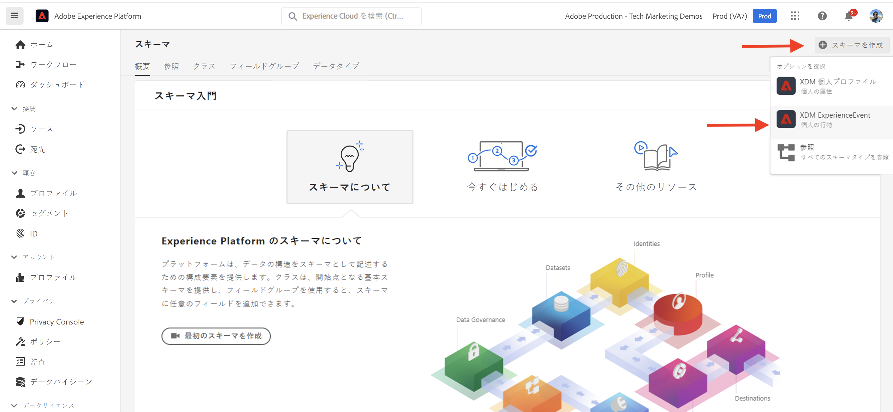
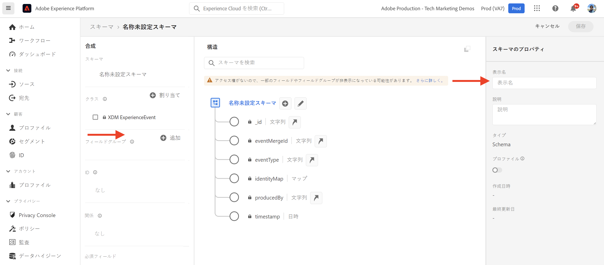
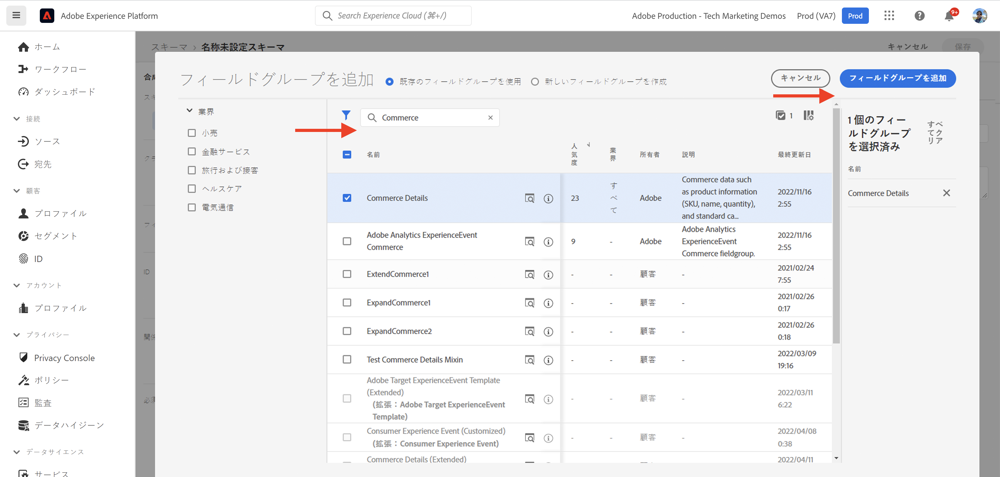
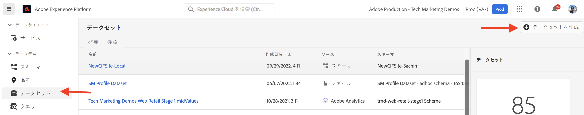
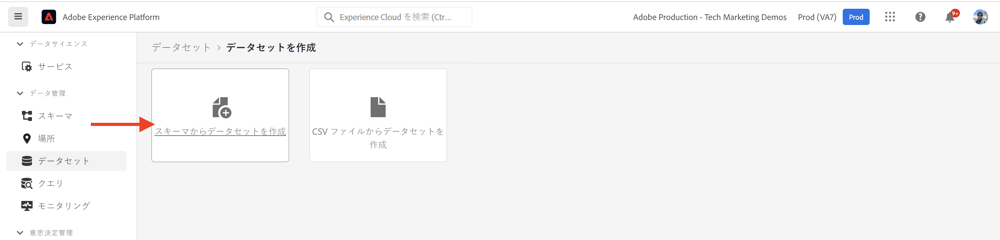
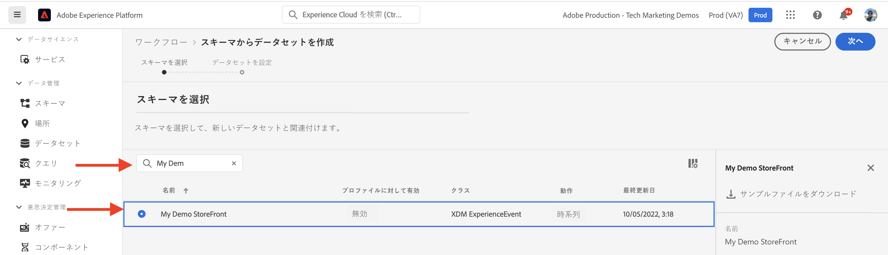
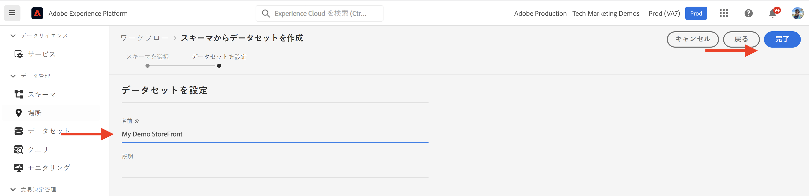

# AEM-CIF コアコンポーネントと Adobe Experience Platform の統合 {#aem-cif-aep-integration}

[コマース統合フレームワーク（CIF）](https://github.com/adobe/aem-core-cif-components)コアコンポーネントは、[Adobe Experience Platform](https://experienceleague.adobe.com/docs/experience-platform/landing/platform-overview.html?lang=ja) とのシームレスな統合を実現して、__買い物かごに追加__&#x200B;などのクライアントサイドのインタラクションで発生するストアフロントイベントとそのデータを転送します。

[AEM CIF コアコンポーネント](https://github.com/adobe/aem-core-cif-components)プロジェクトには、コマースストアフロントからイベントデータを収集するための、[Adobe Commerce 用 Adobe Experience Platform コネクタ](https://github.com/adobe/aem-core-cif-components/tree/master/extensions/experience-platform-connector)と呼ばれる JavaScript ライブラリが用意されています。そのイベント データは Experience Platform に送信され、そこで Adobe Analytics や Adobe Target などの他の Adobe Experience Cloud 製品で使用されて、カスタマージャーニーをカバーする 360 度のプロファイルが構築されます。コマースデータを Adobe Experience Cloud 内の他の製品に接続することにより、サイトでのユーザーの行動の分析、AB テストの実行、パーソナライズされたキャンペーンの作成などのタスクを実行することができます。

クライアントサイドのソースからカスタマーエクスペリエンス データを収集できる Experience Platform データ収集テクノロジースイートについて詳しくは、[こちら](https://experienceleague.adobe.com/docs/experience-platform/collection/home.html?lang=ja)を参照してください。

## Experience Platform への `addToCart` イベントデータの送信 {#send-addtocart-to-aep}

次の手順は、CIF - Experience Platform コネクタを使用して、AEM でレンダリングされた製品ページから Experience Platform に `addToCart` イベントデータを送信する方法を示しています。Adobe Experience Platform デバッガーブラウザー拡張機能を使用すると、送信されたデータをテストおよびレビューすることができます。


## 前提条件 {#prerequisites}

このデモを完了するには、ローカル開発環境を使用します。これには、Adobe Commerce に設定および接続された AEM の実行インスタンスが含まれます。[AEM as Cloud Service SDK を使用してローカル開発をセットアップする](../develop.md)ための要件と手順を確認します。

[Adobe Experience Platform](https://experienceleague.adobe.com/docs/experience-platform/landing/platform-ui/ui-guide.html?lang=ja) へのアクセスと、データ収集用のスキーマ、データセットおよびデータストリームを作成するための権限も必要です。詳しくは、[権限の管理](https://experienceleague.adobe.com/docs/experience-platform/collection/permissions.html?lang=ja)を参照してください。

## AEM Commerce as a Cloud Service の設定 {#aem-setup}

必要なコードと設定を備えた __AEM Commerce as a Cloud Service__ ローカル環境を稼働させるには、次の手順を実行します。

### ローカル設定

AEM Commerce as a Cloud Service 環境を稼働させるには、[ローカル設定](https://experienceleague.adobe.com/docs/experience-manager-cloud-service/content/content-and-commerce/storefront/developing/develop.html?lang=ja#ローカル設定)の手順に従います。

### プロジェクトのセットアップ

新しい AEM Commerce（CIF）プロジェクトを作成するには、[AEM プロジェクトアーキタイプ](https://experienceleague.adobe.com/docs/experience-manager-cloud-service/content/content-and-commerce/storefront/developing/develop.html?lang=ja#project)の手順に従います。

>[!TIP]
>
>次の例では、AEM Commerce プロジェクトの名前は `My Demo Storefront` ですが、独自のプロジェクト名を選択することができます。


プロジェクトのルートディレクトリから次のコマンドを実行して、作成した AEM Commerce プロジェクトをビルドし、ローカルの AEM SDK にデプロイします。

```bash
$ mvn clean install -PautoInstallSinglePackage
```

デフォルトのコードとコンテンツを含んだ、ローカルにデプロイされた `My Demo StoreFront` コマース サイトは次のようになります。


### Peregrine および CIF-AEP コネクタ依存関係のインストール

この AEM Commerce サイトのカテゴリおよび製品ページからイベントデータを収集して送信するには、主要な `npm` パッケージを AEM Commerce プロジェクトの `ui.frontend` モジュールにインストールします。

`ui.frontend` モジュールに移動し、コマンドラインから次のコマンドを実行して、必要なパッケージをインストールします。

```bash
npm i --save lodash.get@^4.4.2 lodash.set@^4.3.2
npm i --save apollo-cache-persist@^0.1.1
npm i --save redux-thunk@~2.3.0
npm i --save @adobe/apollo-link-mutation-queue@~1.1.0
npm i --save @magento/peregrine@~12.5.0
npm i --save @adobe/aem-core-cif-react-components --force
npm i --save-dev @magento/babel-preset-peregrine@~1.2.1
npm i --save @adobe/aem-core-cif-experience-platform-connector --force
```

>[!IMPORTANT]
>
>[PWA Studio](https://developer.adobe.com/commerce/pwa-studio/) は、サポートされているピア依存関係による制限があるので、`--force` 引数が必要になる場合があります。通常は、これによって問題が発生することはありません。


### `--force` 引数を使用するための Maven の設定

Maven ビルドプロセスの一環として、npm クリーンインストール（`npm ci` を使用）がトリガーされます。これには、`--force` 引数も必要です。

プロジェクトのルート POM ファイル `pom.xml` に移動し、`<id>npm ci</id>` 実行ブロックを見つけます。次のようにブロックを更新します。

```xml
<execution>
    <id>npm ci</id>
    <goals>
    <goal>npm</goal>
    </goals>
    <configuration>
    <arguments>ci --force</arguments>
    </configuration>
</execution>
```

### Babel の設定形式の変更

`.babelrc` ファイルのデフォルトの相対設定ファイル形式から `babel.config.js` 形式に切り替えます。これはプロジェクト全体の設定形式であり、プラグインとプリセットを `node_module` に適用して制御を強化できます。

1. `ui.frontend` モジュールに移動し、既存の `.babelrc` ファイルを削除します。

1. `peregrine` プリセットを使用する `babel.config.js` ファイルを作成します。

   ```javascript
   const peregrine = require('@magento/babel-preset-peregrine');
   
   module.exports = (api, opts = {}) => {
       const config = {
           ...peregrine(api, opts),
           sourceType: 'unambiguous'
       } 
   
       config.plugins = config.plugins.filter(plugin => plugin !== 'react-refresh/babel');
   
       return config;
   }
   ```

### Babel を使用するための webpack の設定

Babel ローダー（`babel-loader`）と webpack を使用して JavaScript ファイルをトランスパイルするには、`webpack.common.js` ファイルを編集します。

`module` プロパティ値内に次のルールを含めるには、`ui.frontend` モジュールに移動し、`webpack.common.js` ファイルを更新します。

```javascript
{
    test: /\.jsx?$/,
    exclude: /node_modules\/(?!@magento\/)/,
    loader: 'babel-loader'
}
```

### Apollo クライアントの設定

[Apollo クライアント](https://www.apollographql.com/docs/react/)は、GraphQL でローカルデータとリモートデータの両方を管理するために使用します。また、GraphQL クエリの結果を、正規化されたローカルのメモリ内キャッシュに格納します。

[`InMemoryCache`](https://www.apollographql.com/docs/react/caching/cache-configuration/) が効果的に機能するには、`possibleTypes.js` ファイルが必要です。このファイルを生成するには、[possibleTypes の自動生成](https://www.apollographql.com/docs/react/data/fragments/#generating-possibletypes-automatically)を参照してください。また、[PWA Studio 参照の実装](https://github.com/magento/pwa-studio/blob/1977f38305ff6c0e2b23a9da7beb0b2f69758bed/packages/pwa-buildpack/lib/Utilities/graphQL.js#L106-L120) と [`possibleTypes.js`](../assets/aep-integration/possibleTypes.js) ファイルの例も参照してください。


1. `ui.frontend` モジュールに移動し、ファイルを `./src/main/possibleTypes.js` として保存します。

1. ビルド時に必要な静的変数を置き換えるには、`webpack.common.js` ファイルの `DefinePlugin` セクションを更新します。

   ```javascript
   const { DefinePlugin } = require('webpack');
   const { POSSIBLE_TYPES } = require('./src/main/possibleTypes');
   
   ...
   
   plugins: [
       ...
       new DefinePlugin({
           'process.env.USE_STORE_CODE_IN_URL': false,
           POSSIBLE_TYPES
       })
   ]
   ```

### Peregrine および CIF コアコンポーネントの初期化

React ベースの Peregrine と CIF のコアコンポーネントを初期化するには、必要な設定ファイルと JavaScript ファイルを作成します。

1. `ui.frontend` モジュールに移動し、フォルダー `src/main/webpack/components/commerce/App` を作成します。

1. 次の内容の `config.js` ファイルを作成します。

   ```javascript
   // get and parse the CIF store configuration from the <head>
   const storeConfigEl = document.querySelector('meta[name="store-config"]');
   const storeConfig = storeConfigEl ? JSON.parse(storeConfigEl.content) : {};
   
   // the following global variables are needed for some of the peregrine features
   window.STORE_VIEW_CODE = storeConfig.storeView || 'default';
   window.AVAILABLE_STORE_VIEWS = [
       {
           code: window.STORE_VIEW_CODE,
           base_currency_code: 'USD',
           default_display_currency_code: 'USD',
           id: 1,
           locale: 'en',
           secure_base_media_url: '',
           store_name: 'My Demo StoreFront'
       }
   ];
   window.STORE_NAME = window.STORE_VIEW_CODE;
   window.DEFAULT_COUNTRY_CODE = 'en';
   
   export default {
       storeView: window.STORE_VIEW_CODE,
       graphqlEndpoint: storeConfig.graphqlEndpoint,
       // Can be GET or POST. When selecting GET, this applies to cache-able GraphQL query requests only.
       // Mutations will always be executed as POST requests.
       graphqlMethod: storeConfig.graphqlMethod,
       headers: storeConfig.headers,
   
       mountingPoints: {
           // TODO: define the application specific mount points as they may be used by <Portal> and <PortalPlacer>
       },
       pagePaths: {
           // TODO: define the application specific paths/urls as they may be used by the components
           baseUrl: storeConfig.storeRootUrl
       },
       eventsCollector: {
           eventForwarding: {
               acds: true,
               aep: false,
           }
       }
   };
   ```

   >[!IMPORTANT]
   >
   >__AEM Guides - CIF Venia Project__ の [`config.js`](https://github.com/adobe/aem-cif-guides-venia/blob/main/ui.frontend/src/main/components/App/config.js) ファイルに関して既に精通しているかもしれませんが、このファイルにはいくつかの変更が必要です。まず、__TODO__ コメントを確認します。次に、`eventsCollector` プロパティ内で `eventsCollector > aep` オブジェクトを見つけ、`orgId` および `datastreamId` プロパティを正しい値に更新します。[詳細情報](./aep.md#add-aep-values-to-aem)。

1. 次の内容の `App.js` ファイルを作成します。このファイルは、一般的な React アプリケーションの開始点ファイルに似ており、React およびカスタムフックと、React コンテキストを使用して Experience Platform の統合を簡単にする方法が含まれています。

   ```javascript
   import config from './config';
   
   import React, { useEffect } from 'react';
   import ReactDOM from 'react-dom';
   import { IntlProvider } from 'react-intl';
   import { BrowserRouter as Router } from 'react-router-dom';
   import { combineReducers, createStore } from 'redux';
   import { Provider as ReduxProvider } from 'react-redux';
   import { createHttpLink, ApolloProvider } from '@apollo/client';
   import { ConfigContextProvider, useCustomUrlEvent, useReferrerEvent, usePageEvent, useDataLayerEvents, useAddToCartEvent } from '@adobe/aem-core-cif-react-components';
   import { EventCollectorContextProvider, useEventCollectorContext } from '@adobe/aem-core-cif-experience-platform-connector';
   import { useAdapter } from '@magento/peregrine/lib/talons/Adapter/useAdapter';
   import { customFetchToShrinkQuery } from '@magento/peregrine/lib/Apollo/links';
   import { BrowserPersistence } from '@magento/peregrine/lib/util';
   import { default as PeregrineContextProvider } from '@magento/peregrine/lib/PeregrineContextProvider';
   import { enhancer, reducers } from '@magento/peregrine/lib/store';
   
   const storage = new BrowserPersistence();
   const store = createStore(combineReducers(reducers), enhancer);
   
   storage.setItem('store_view_code', config.storeView);
   
   const App = () => {
       const [{ sdk: mse }] = useEventCollectorContext();
   
       // trigger page-level events
       useCustomUrlEvent({ mse });
       useReferrerEvent({ mse });
       usePageEvent({ mse });
       // listen for add-to-cart events and enable forwarding to the magento storefront events sdk
       useAddToCartEvent(({ mse }));
       // enable CIF specific event forwarding to the Adobe Client Data Layer
       useDataLayerEvents();
   
       useEffect(() => {
           // implement a proper marketing opt-in, for demo purpose you hard-set the consent cookie
           if (document.cookie.indexOf('mg_dnt') < 0) {
               document.cookie += '; mg_dnt=track';
           }
       }, []);
   
       // TODO: use the App to create Portals and PortalPlaceholders to mount the CIF / Peregrine components to the server side rendered markup
       return <></>;
   };
   
   const AppContext = ({ children }) => {
       const { storeView, graphqlEndpoint, graphqlMethod = 'POST', headers = {}, eventsCollector } = config;
       const { apolloProps } = useAdapter({
           apiUrl: new URL(graphqlEndpoint, window.location.origin).toString(),
           configureLinks: (links, apiBase) =>
               // reconfigure the HTTP link to use the configured graphqlEndpoint, graphqlMethod and storeView header
   
               links.set('HTTP', createHttpLink({
                   fetch: customFetchToShrinkQuery,
                   useGETForQueries: graphqlMethod !== 'POST',
                   uri: apiBase,
                   headers: { ...headers, 'Store': storeView }
               }))
       });
   
       return (
           <ApolloProvider {...apolloProps}>
               <IntlProvider locale='en' messages={{}}>
                   <ConfigContextProvider config={config}>
                       <ReduxProvider store={store}>
                           <PeregrineContextProvider>
                               <EventCollectorContextProvider {...eventsCollector}>
                                   {children}
                               </EventCollectorContextProvider>
                           </PeregrineContextProvider>
                       </ReduxProvider>
                   </ConfigContextProvider>
               </IntlProvider>
           </ApolloProvider>
       );
   };
   
   window.onload = async () => {
       const root = document.createElement('div');
       document.body.appendChild(root);
   
       ReactDOM.render(
           <Router>
               <AppContext>
                   <App />
               </AppContext>
           </Router>,
           root
       );
   };
   ```

   `EventCollectorContext` は、以下を行う React コンテキストを書き出します。

   - commerce-events-sdk および commerce-events-collector ライブラリを読み込みます。
   - これらのライブラリを Experience Platform や ACDS の指定の設定で初期化します。
   - Peregrine からのすべてのイベントを購読して、イベント SDK に転送します。

   `EventCollectorContext` の実装の詳細を確認できます。[GitHub の aem-core-cif-components](https://github.com/adobe/aem-core-cif-components/blob/3d4e44d81fff2f398fd2376d24f7b7019f20b31b/extensions/experience-platform-connector/src/events-collector/EventCollectorContext.js) を参照してください。

### 更新された AEM プロジェクトのビルドとデプロイ

上記のパッケージのインストール、コードおよび設定変更が正しいことを確認するには、Maven コマンド `$ mvn clean install -PautoInstallSinglePackage` を使用して、更新された AEM Commerce プロジェクトを再ビルドしてデプロイします。

## Experience Platform の設定 {#aep-setup}

カテゴリや製品など、AEM Commerce ページからのイベントデータを受信して保存するには、次の手順を実行します。

>[!AVAILABILITY]
>
>__Adobe Experience Platform__ および __Adobe Experience Platform データ収集__&#x200B;の正しい&#x200B;__製品プロファイル__&#x200B;に属していることを確認します。必要に応じて、システム管理者と協力して、[Admin Console](https://adminconsole.adobe.com/) で&#x200B;__製品プロファイル__&#x200B;の作成、更新または割り当てを行います。

### Commerce フィールドグループを含んだスキーマの作成

コマースイベントデータの構造を定義するには、エクスペリエンスデータモデル（XDM）スキーマを作成する必要があります。スキーマは、データの構造と形式を表現および検証する一連のルールです。

1. ブラウザーで、__Adobe Experience Platform__ 製品ホームページに移動します。例：<https://experience.adobe.com/#/@YOUR-ORG-NAME/sname:prod/platform/home>

1. 左側のナビゲーションセクションで&#x200B;__スキーマ__&#x200B;メニューを見つけ、右上のセクションから「__スキーマを作成__」ボタンをクリックして、「__XDM ExperienceEvent__」を選択します。

   

1. __スキーマプロパティ／表示名__&#x200B;フィールドを使用してスキーマに名前を付け、__構成／フィールドグループ／追加__&#x200B;ボタンを使用してフィールドグループを追加します。

   

1. __フィールドグループを追加__&#x200B;ダイアログで、`Commerce` を検索し、「__コマースの詳細__」チェックボックスを選択して、「__フィールドグループを追加__」をクリックします。

   


>[!TIP]
>
>詳しくは、[スキーマ構成の基本](https://experienceleague.adobe.com/docs/experience-platform/xdm/schema/composition.html?lang=ja)を参照してください。

### データセットの作成

イベントデータを保存するには、スキーマ定義に準拠するデータセットを作成する必要があります。 データセットは、スキーマ（列）とフィールド（行）を含んだデータコレクション（通常はテーブル）の格納および管理用の構成要素です。

1. ブラウザーで、__Adobe Experience Platform__ 製品ホームページに移動します。例：<https://experience.adobe.com/#/@YOUR-ORG-NAME/sname:prod/platform/home>

1. 左側のナビゲーション セクションで __データセット__&#x200B;メニューを見つけ、右上のセクションから「__データセットを作成__」ボタンをクリックします。

   

1. 新しいページで、__スキーマからデータセットを作成__&#x200B;カードを選択します。

   

   新しいページで、前の手順で作成したスキーマを&#x200B;__検索して選択__&#x200B;し、「__次へ__」ボタンをクリックします。

   

1. __データセットを設定／名前__&#x200B;フィールドを使用してデータセットに名前を付け、「__終了__」ボタンをクリックします。

   

>[!TIP]
>
>詳しくは、[データセットの概要](https://experienceleague.adobe.com/docs/experience-platform/catalog/datasets/overview.html?lang=ja)を参照してください。


### データストリームの作成

Experience Platform でデータストリームを作成するには、次の手順に従います。

1. ブラウザーで、__Adobe Experience Platform__ 製品ホームページに移動します。例：<https://experience.adobe.com/#/@YOUR-ORG-NAME/sname:prod/platform/home>

1. 左側のナビゲーション セクションで&#x200B;__データストリーム__&#x200B;メニューを見つけ、右上のセクションから「__新しいデータストリーム__」ボタンをクリックします。

   

1. 「__名前__」必須フィールドを使用して、データストリームに名前を付けます。 「__イベントスキーマ__」フィールドの下で、作成したスキーマを選択し、「__保存__」をクリックします。

   

1. 作成したデータストリームを開き、「__サービスを追加__」をクリックします。

   

1. 「__サービス__」フィールドで、__Adobe Experience Platform__ オプションを選択します。「__イベントデータセット__」フィールドで、前のステップで指定したデータセット名を選択し、「__保存__」をクリックします。

   

>[!TIP]
>
>詳しくは、[データストリームの概要](https://experienceleague.adobe.com/docs/experience-platform/datastreams/overview.html?lang=ja)を参照してください。

## AEM Commerce 設定へのデータストリーム値の追加 {#add-aep-values-to-aem}

上記の Experience Platform 設定が完了すると、データストリーム詳細の左側のパネルに `datastreamId` が表示され、__プロファイル画像／アカウント情報／ユーザー情報__&#x200B;モーダルの右上隅に `orgId` が表示されます。


1. AEM Commerce プロジェクトの `ui.frontend` モジュールで、 `config.js` ファイル、特に `eventsCollector > aep` オブジェクトのプロパティを更新します。

1. 更新された AEM Commerce プロジェクトをビルドしてデプロイします。


## `addToCart` イベントのトリガーとデータ収集の検証 {#event-trigger-verify}

上記の手順で、AEM Commerce とExperience Platform の設定が完了します。 Google Chrome 拡張機能の _Snowplow Inspector_ と、製品 UI のデータセットの&#x200B;__指標とグラフ__&#x200B;切替スイッチを使用して、`addToCart` イベントをトリガーし、データ収集を検証できるようになりました。

イベントをトリガーするには、ローカル設定から AEM オーサーまたはパブリッシュサービスを使用します。 この例では、アカウントにログインして AEM オーサーを使用します。

1. Sites ページから、 __My Demo StoreFront／us／en__ ページを選択し、上部のアクションバーの「__編集__」クリックします。

1. 上部のアクションバーで、「__公開済みとして表示__」をクリックし、ストアフロントのナビゲーションで任意のカテゴリをクリックします。

1. __製品ページ__&#x200B;で任意の製品カードをクリックし、__色とサイズ__&#x200B;を選択して「__買い物かごに追加__」ボタンを有効にします。


1. ブラウザーの拡張機能パネルから __Snowplow Inspector__ 拡張機能を開き、左側のパネルで __Experience Platform Wed SDK__ を選択します。


1. __製品ページ__&#x200B;に戻り、「__買い物かごに追加__」ボタンをクリックします。これにより、データが Experience Platform に送信されます。 __Adobe Experience Platform デバッガー__&#x200B;拡張機能には、イベントの詳細が表示されます。

   


1. Experience Platform 製品 UI 内で、「__データセットアクティビティ__」タブ下の&#x200B;__データセット／My Demo StoreFront__ に移動します。__指標とグラフ__&#x200B;が有効になっている場合は、イベントデータ統計が表示されます。

   


## 実装の詳細 {#implementation-details}

[CIF Experience Platform コネクタ](https://github.com/adobe/aem-core-cif-components/tree/master/extensions/experience-platform-connector)は、[PWA Studio](https://developer.adobe.com/commerce/pwa-studio/) プロジェクトの一部である [Adobe Commerce 用データ接続](https://commercemarketplace.adobe.com/magento-experience-platform-connector.html)上に構築されています。

PWA Studio プロジェクトを使用すると、Adobe Commerce または Magento Open Source を活用した Progressive Web Application（PWA）ストアフロントを作成できます。プロジェクトには、ビジュアルコンポーネントにロジックを追加するための [Peregrin](https://developer.adobe.com/commerce/pwa-studio/api/peregrine/) というコンポーネントライブラリも含まれています。[Peregrin ライブラリ](https://developer.adobe.com/commerce/pwa-studio/api/peregrine/)には、Experience Platform とシームレスに統合するために [Experience Platform コネクタ](https://github.com/adobe/aem-core-cif-components/tree/master/extensions/experience-platform-connector)で使用されるカスタム React フックも用意されています。


## サポートされているイベント {#supported-events}

現時点では、次のイベントがサポートされています。

__エクスペリエンス XDM イベント：__

1. 買い物かごに追加（AEM）
1. ページを表示（AEM）
1. 製品を表示（AEM）
1. 送信された検索リクエスト（AEM）
1. 受信した検索応答（AEM）

[Peregrine コンポーネント](https://developer.adobe.com/commerce/pwa-studio/guides/packages/peregrine/)が AEM Commerce プロジェクトで再利用されている場合：

__エクスペリエンス XDM イベント：__

1. 買い物かごから削除
1. 買い物かごを開く
1. 買い物かごを表示
1. 即時購入
1. チェックアウトを開始
1. チェックアウトを完了

__プロファイル XDM イベント：__

1. サインイン
1. アカウントを作成
1. アカウントを編集


## その他のリソース {#additional-resources}

詳しくは、次のリソースを参照してください。

- [PWA Studio](https://developer.adobe.com/commerce/pwa-studio/)
- [[!DNL Data Connection]  の概要](https://experienceleague.adobe.com/docs/commerce-merchant-services/data-connection/overview.html?lang=ja)
- [[!DNL Data Connection]  イベント](https://experienceleague.adobe.com/docs/commerce-merchant-services/data-connection/event-forwarding/events.html?lang=ja)
- [Adobe Experience Platform の概要](https://experienceleague.adobe.com/docs/experience-platform/landing/home.html?lang=ja)
