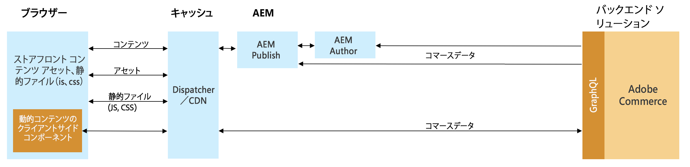

# コマース統合フレームワークを使用した、AEM と Adobe Commerce の統合 {#aem-framework}

Experience Manager と Adobe Commerce は、コマース統合フレームワーク（CIF）を使用してシームレスに統合されます。CIF を使用すると、AEM は Adobe Commerce の [GraphQL API](https://devdocs.magento.com/guides/v2.4/graphql/) を使用して、コマースインスタンスに直接アクセスして通信できます。

>[!NOTE]
>
> サポートされている GraphQL API の最小バージョンは 2.3.5 です。一部の機能は、新しいバージョンでのみ、または Adobe Commerce エディションでのみサポートされています。

>[!NOTE]
>
>GraphQL は現在、Adobe Experience Manager（AEM）as a Cloud Service の、2 つの（個別の）シナリオで使用されています。
>
>* このシナリオでは、CIF が GraphQL を使用してコマースと通信します。
>* [AEM コンテンツフラグメントは、AEM GraphQL API（標準の GraphQL に基づいてカスタマイズされた実装）と連携して、アプリケーションで使用する構造化コンテンツを配信します](/help/headless/graphql-api/content-fragments.md)。

## アーキテクチャの概要 {#overview}

全体的なアーキテクチャは次のとおりです。

CIF 内では、サーバーサイドとクライアントサイドの通信パターンがサポートされます。
サーバーサイド API 呼び出しは、組み込みの汎用的な [GraphQL クライアント](https://github.com/adobe/commerce-cif-graphql-client) と、コマース GraphQL スキーマ用に [生成された一連のデータモデル](https://github.com/adobe/commerce-cif-magento-graphql) を組み合わせたものを使用して実装されます。また、GraphQL クエリや GQL 形式のミューテーションも使用できます。

[React](https://reactjs.org/) を使用して作成されるクライアントサイドコンポーネントの場合は、[Apollo クライアント](https://www.apollographql.com/docs/react/) が使用されます。

## AEM CIF コアコンポーネントのアーキテクチャ {#cif-core-components}

[AEM CIF コアコンポーネント](https://github.com/adobe/aem-core-cif-components)は、[AEM WCM コアコンポーネント](https://github.com/adobe/aem-core-wcm-components)と同様の設計パターンとベストプラクティスに従っています。

AEM CIF コアコンポーネントの Adobe Commerce とのビジネスロジックとバックエンドの通信は、Sling Model で実装されます。プロジェクト固有の要件を満たすために、このロジックをカスタマイズする必要がある場合は、Sling モデルの委任パターンを使用できます。

>[!TIP]
>
>[AEM CIF コアコンポーネントのカスタマイズ](../customizing/customize-cif-components.md)ページには、CIF コアコンポーネントのカスタマイズ方法に関する詳細な例とベストプラクティスが記載されています。

プロジェクト内では、AEM CIF コアコンポーネントとカスタムプロジェクトコンポーネントは、Sling Context-Aware 設定を使用して、AEM ページに関連付けられた Adobe Commerce ストア用に設定されたクライアントを簡単に取得できます。

## 検索 {#search}

CIF は、[Commerce GraphQL API](https://developer.adobe.com/commerce/webapi/graphql/) に基づいてサーバーサイドでレンダリングされた検索エクスペリエンスである[検索コアコンポーネント](https://www.aemcomponents.dev/content/core-components-examples/library/commerce/search.html)を標準で提供します。Commerce のお客様には、代わりに[ライブ検索](https://experienceleague.adobe.com/docs/commerce-merchant-services/live-search/guide-overview.html?lang=ja)を使用するオプションがあります。CIF とライブ検索の統合について詳しくは、この[リンク](/help/commerce-cloud/integrating/live-search-plp.md)に従ってください。

