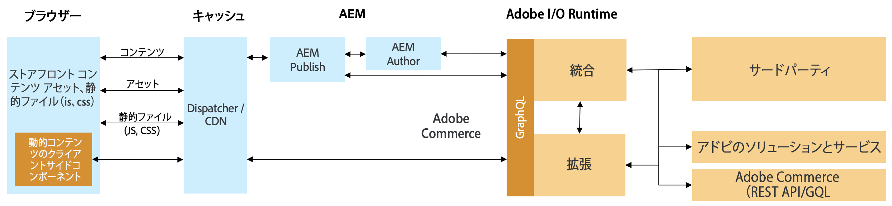

# コマース統合フレームワークを使用した AEM とサードパーティコマースの統合 {#aem-third-party}

Adobe Commerce 以外のソリューションの統合は、CIF の一般的なシナリオです。様々な API やスキーマを持つサードパーティソリューションは、統合レイヤーを介して接続できます。

## アーキテクチャ {#architecture}

全体的なアーキテクチャは次のとおりです。

この統合レイヤーの目的は、サードパーティの API とスキーマを、サポートされている Adobe Commerce GraphQL API と Experience Manager 外のスキーマにマッピングすることです。このカプセル化により、統合のロジックとシステムを、Experience Manager 内のコードを変更することなくアップデートできます。

## 統合のソリューション要件

Experience Manager はデータをオンデマンドで取得するため、製品カタログのリアルタイム API が必要です。

>[!TIP]
>
>リアルタイム API を使用できない場合は、API を使用した外部製品キャッシュを統合に使用する必要があります。[Adobe Commerce オープンソース](https://business.adobe.com/jp/products/magento/open-source.html)の例。

完全な GraphQL スキーマを実装する必要はありません。必要なユースケースを有効にするには、スキーマのオブジェクトだけを実装します。

## バックエンドの使用例

CIF は、製品カタログへのリアルタイムのアクセスと製品エクスペリエンス管理ツールで Experience Manager を拡張しています。このシームレスな統合により、作成者は、必要に応じて、コンテンツのコンテキストを離れることなく、組み込み UI を使用してコマースデータにアクセスできます。

これらのユースケースを可能にするには、製品カタログ API の統合が必要です。

## フロントエンドのユースケース

[AEM CIF コアコンポーネント](https://github.com/adobe/aem-core-cif-components)は、CIF でサポートされている Adobe Commerce API を使用してデータを取得および交換します。コンポーネントを再利用するには、それぞれの API を実装する必要があります。

パフォーマンスが重要なクライアントサイドのコンポーネントでは、サードパーティソリューションと直接通信して遅延を回避することが推奨されます。

## 統合の開発 {#develop-integration}

アドビでは、統合レイヤーの [Adobe Developer Runtime](https://developer.adobe.com/runtime/) を使用することをお勧めします。これは、サードパーティ用の CIF アドオンに含まれています。マイクロサービスに似たアプローチがとられており、簡単に複数のソリューションを統合するのに適しています。

[参照実装](https://github.com/adobe/commerce-cif-graphql-integration-reference)は、コマースソリューションへの統合を構築するための出発点として最適です。GraphQL がサポートされていますが、REST などの他のタイプの API と統合することもできます。

この統合レイヤーは、サードパーティレイヤー（Mulesoft など）が使用可能な場合または統合がサードパーティソリューションの上に構築される場合には必要ありません。

## 事前定義済みコネクタ {#connectors}

コネクタは、プロジェクトを開始するのに適しています。コネクタには、コマースソリューション固有の接続とデフォルトの API マッピングが付属しています。これらのコネクタは、サードパーティによって構築されており、アドビが管理しているわけではありません。詳しくは、各パートナーにお問い合わせください。

* [SAP Commerce](https://github.com/diconium/commerce-cif-graphql-integration-hybris)、Diconium 構築
* [Commercetools](https://github.com/diconium/commerce-cif-graphql-integration-commercetool)、Diconium 構築

>[!TIP]
>
>コネクタは、コマース統合を高速化するプロジェクトを支援しますが、プラグアンドプレイではありません。エンタープライズコマースソリューションは大幅にカスタマイズされており、カスタム統合が必要になります。コマースプラットフォーム、Adobe Commerce GraphQL スキーマ、Adobe I/O Runtime に関する十分な知識が必要です。
