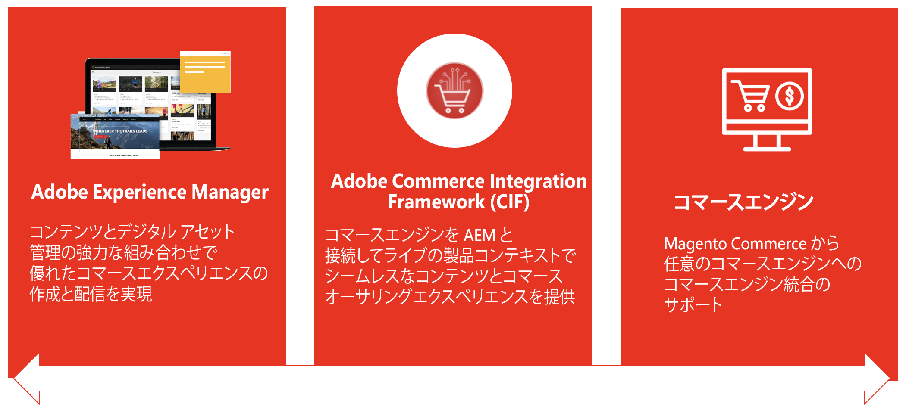

# コンテンツとコマース {#content-commerce}

Adobe Experience Manager の Content and Commerce を使用すると、ブランドはスケーリングとイノベーションをより迅速に行って、コマースエクスペリエンスを差別化し、加速するオンライン消費支出に対応できます。AEM Content and Commerce は、Experience Manager で提供される没入感のあるパーソナライズされたオムニチャネルエクスペリエンスを任意の数のコマースソリューションと組み合わせて、差別化されたエクスペリエンスをショッピングジャーニーのあらゆる部分に提供し、価値創出までの時間を短縮すると共にコンバージョンの向上を促します。

## AEM Content and Commerce が顧客の成功にどのように役立つか {#successful}

オンラインコマースエクスペリエンスに対する顧客の期待がますます高まる中、ブランドは差別化されたエクスペリエンスとより多くのコンテンツをより迅速に提供しなければならないというプレッシャーにさらされています。ただし、コンテンツ管理プラットフォームの実装には、多くの場合、カスタムコンポーネントやオーサリングツールなどの基礎的要素の開発に多くの時間と予算投資が必要で、メンテナンスやアップグレードのコストが発生します。Experience Manager Sites は、Adobe Experience Manager as a Cloud Service のアドオンモジュールとして Content and Commerce を提供します。このアドオンは、標準搭載のコマースコアコンポーネント、オーサリングツール、参照ストアフロントを提供して、運用開始を早め、チーム間のシームレスなコラボレーションを可能にし、コンバージョンを促進します。

ブランドでは、Experience Manager を、Adobe Experience Cloud の一部である Adobe Commerce のほか任意のコマースエンジンと統合できます。Experience Manager Content and Commerce の利用で、ブランドは以下を実現できます。

* スケーリングとイノベーションの迅速化
* エクスペリエンスのパーソナライズによるコンバージョンの促進
* 1 回の作成であらゆる場所に公開
* 顧客のエクスペリエンスの拡充と差別化
* コマースデータへのアクセスによるオーサリングの効率化

## AEM Commerce Integration Framework（CIF）の概要  {#cif-intro}

これらのプロジェクトは、コマースソリューションの統合の複雑さに対処する必要があります。コマースソリューションは、Adobe Commerce Cloud などの商用ソリューションから一連のカスタムコマースサービスまで、何でもかまいません。この統合は、ユースケースとエコシステムに大きく依存しています。通常は、次のように、様々な場所に影響し、様々な種類があります。

* 複雑で動的なエコシステムの統合（例：製品カタログ）
* 製品コンテンツを独自のライフサイクルで効率的かつオムニチャネル方式で管理
* 様々な個人に対応する複雑でパーソナライズされたショッピングジャーニーの構築
* バックエンドとフロントエンドで迅速に適応および革新できる能力
* ピークパフォーマンス（フラッシュセールやブラックフライデーなど）に対応できる、拡張性と安定性に優れた E2E インフラストラクチャの稼働。これには、統合検索やキャッシュ管理などが含まれます。

こうした複雑が、潜在的な障害点、TCO の増加、遅延、価値実現の低下の原因になります。これらの理由により、Experience Manager のアドオンである Commerce Integration Framework（CIF）が開発されました。CIF は、Experience Manager にコマース機能を追加するもので、コマースエンジンとの統合を標準化します。その結果、安定性と拡張性に優れ TCO が少なく将来性の確かなソリューションを実現できるようになりました。それを利用すれば、俊敏性の高いツールおよびシームレスに統合された機能で技術とビジネスのイノベーションを切り拓いて、魅力的なコマースエクスペリエンスを構築できます。

## 2013 年以降の CIF による顧客サポートの成功 {#support}

200 社を超える顧客とのコラボレーションを通じて、CIF は、コンテンツおよびコマースプロジェクトを成功に導くための構成要素としての地位を確立しました。これにより、現在および将来にわたって IT とビジネスに価値がもたらされます。最近の顧客プロジェクトでは、CIF を「プロセスの促進と時間の節約に大きく貢献し多大な価値をもたらすもの」と説明しています。

## CIF の利点 {#cif-benefits}

CIF には、カスタムコードの必要性を軽減する標準搭載のコマースコアコンポーネントが用意されているので、ブランドが市場投入までの時間を短縮できます。すべてのコアコンポーネントは、アドビのクライアントサイドデータレイヤーと標準で統合されており、統合プロファイルなどの顧客プロファイルを改善します。このプロファイルには、訪問者の行動が詳細にとらえられているので、カスタマージャーニーをリアルタイムで予測およびパーソナライズする目的で使用できます。

CIF アドオンは、Experience Manager に製品コンテキストを導入し、製品コンソールや製品／カテゴリピッカーなどのオーサリングツールを提供します。これらのツールをマーケターが利用すれば、開発者に頼らずに Experience Manager でショッパブルエクスペリエンスを作成して提供できます。以下のような利点があります。

### エクスペリエンス {#experiences}

AEM の強力な CIF ツールを使用すると、コンテンツ作成者は、配信にとらわれない拡張可能な形で、機能豊富なパーソナライズされたコマースエクスペリエンスを迅速に構築して、ビジネスチャンスを十分に生かすことができます。

### 価値創出までの時間（TTV） {#ttv}

[AEM コアコンポーネント](https://www.aemcomponents.dev/)、[AEM Venia 参照ストアフロント](https://github.com/adobe/aem-cif-guides-venia)、[AEM プロジェクトアーキタイプ](https://experienceleague.adobe.com/docs/experience-manager-core-components/using/developing/archetype/overview.html?lang=ja)、PWA（プログレッシブ Web アプリ）の統合パターン（ヘッドレスコンテンツおよびコマース）などで、プロジェクトの開発を促進します。

CIF は、常に最新のアドオンを使用した継続的なイノベーションを目的として構築されており、顧客は新機能や改善された機能にアクセスできます。

### 統合 {#integrations}

[Adobe I/O Runtime](https://www.adobe.io/apis/experienceplatform/runtime.html)、マイクロサービスベースのサーバーレス PaaS、[CIF の参照実装](https://github.com/adobe/commerce-cif-graphql-integration-reference)などを使用して、エコシステム（例：コマースソリューション）を Experience Cloud に接続します。

## 実証済みのパターンとベストプラクティス {#proven}

CIF は、ベストプラクティスに基づく標準化された統合パターンで顧客をサポートします。顧客の現在の成功に役立つほか、顧客と共に成長し将来の要件にも対応できる柔軟性を備えています。具体的には次のとおりです。

* 製品カタログの統合に関して発生する可能性のある典型的な問題を排除します。例えば、次のような問題です。
   * カタログの量や複雑さの増大に伴ってパフォーマンスが低下
   * ステージング済みデータにアクセスできない
   * リアルタイムの製品データおよびエクスペリエンスが必要
* デジタル成熟度が高まると、エクスペリエンス管理が必要になります。CIF には、追加の IT 作業を行わずに増分的に組み込むことができる製品エクスペリエンス管理機能が付属しています。
* オムニチャネルに対応：CIF は、パターン、アクセラレーター、コアコンポーネントで様々なタッチポイントテクノロジー（サーバーサイド、ハイブリッド、クライアントサイド）をサポートしています。

## ジャーニー {#journey}

コマースジャーニーを使用している場合は、次の手順に進んでください。

* この [AEM Content Author ジャーニー](/help/commerce-cloud/commerce-journeys/aem-commerce-content-author/getting-started.md)
