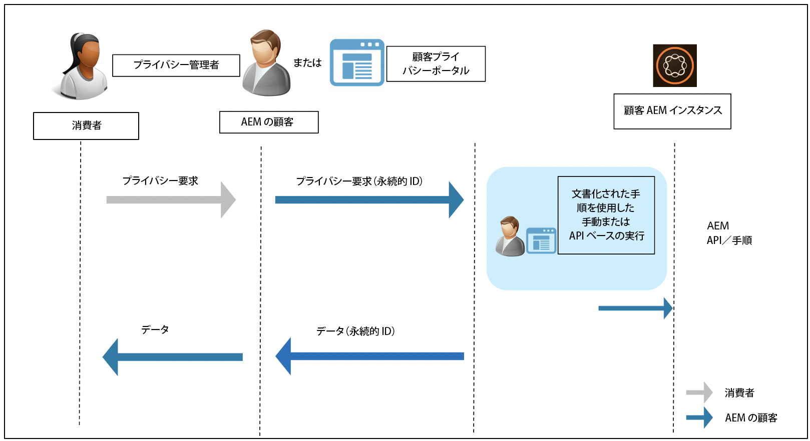

# データ保護およびデータプライバシーに関する規制に対する Adobe Experience Manager as a Cloud Service の対応 {#aem-readiness-for-data-protection-and-data-privacy-regulations}

>[!WARNING]
>
>このドキュメントの内容は法的な助言にはならず、その代用になるものでもありません。
>
>データ保護およびデータプライバシー規制に関するアドバイスについては、自社の法務部門にお問い合わせください。

>[!NOTE]
>
>アドビのプライバシーに関する問題への対応と、アドビのお客様への影響について詳しくは、[アドビのプライバシーセンター](https://www.adobe.com/jp/privacy.html)を参照してください。

アドビをご利用のお客様がこれらの規制に準拠できるよう、アドビでは、お客様のプライバシー管理者および AEM 管理者向けに、ドキュメントと手順（利用可能な場合は API を使用）を提供しています。

* ドキュメントは、管理者がデータ保護やデータプライバシー要求を処理するのに役立ちます。
* 記載されたプロシージャを使用すると、お客様は手動で規制に関する要求を実行したり、外部のポータルやサービスから（利用可能な場合は）API 呼び出しを実行できます。

>[!CAUTION]
>
>ここで説明する内容は、Adobe Experience Manager as a Cloud Service に限定されます。
>
>別のアドビオンデマンドサービスからのデータは、関連するプライバシー要求とともに、そのサービスでのアクションが必要となります。
>
>詳しくは、[アドビのプライバシーセンター](https://www.adobe.com/jp/privacy.html)を参照してください。

## はじめに {#introduction}

Adobe Experience Manager as a Cloud Service のインスタンスおよびそれらで実行されるアプリケーションは、アドビのお客様によって所有および操作されます。

その結果、GDPR、CCPA などのデータ保護規制は、主にお客様の責任となります。

簡単に紹介すると、データのプライバシーと保護に関する規制には、次の役割を担う者が従うべき新しいルールが含まれます。

* 事業体（CCPA）および／またはデータ管理者（GDPR）

* サービスプロバイダー（CCPA）および／またはデータ処理者（GDPR）

このような規則の主な条項は次の通りです。

1. 個人データの定義を拡大してすべての固有の ID を含むようにし、直接および間接的に識別可能なデータとする。

2. 同意に関する要件の強化。

3. 削除権（データ消去）への重点的な取り組み。

4. データの販売のオプトアウト。

Adobe Experience Manager as a Cloud Service の場合：

* インスタンスと、それらに対して実行されるアプリケーションは、顧客が所有および運用します。

   * 所有権は、お客様が事業体やサービスプロバイダー、データ管理者およびデータ処理者などの規制上の役割を事実上管理することを意味します。

   * 次の図に示すように、Adobe Experience Platform Privacy Service は AEM のワークフローの一部ではありません。

* AEM には、顧客のプライバシー管理者や AEM 管理者が、手動または API を使用して（使用可能な場合）、プライバシー規制のリクエストを実行するためのドキュメントと手順が含まれています。

* 新しいサービスや UI は追加されていません。

   * 代わりに、プライバシー規制のリクエストを処理する顧客 UI／ポータルで使用する手順と API が文書化されています。

* AEM には、プライバシー要求ワークフローをサポートする標準のツールは含まれません。

   * アドビは、顧客のプライバシー管理者、AEM 管理者またはその両方に関するドキュメントおよびプロシージャを提供し、プライバシー規制に関連する要求を手動で実行できるようにします。

アドビは、Adobe Experience Manager as a Cloud Service のアクセス、削除およびオプトアウトに関するプライバシー要求を処理するプロシージャを提供しています。場合によっては、自動化に役立つように、顧客が開発したポータルまたはスクリプトから呼び出すことができる API が存在します。

次の図に、プライバシーリクエストワークフローを示します（Adobe Experience Manager 6.5 を使用した例）。

## Adobe Experience Manager as a Cloud Service と規制への対応 {#aem-as-a-cloud-service-and-regulatory-readiness}

AEM as a Cloud Service の製品範囲に関する規制ドキュメントについて詳しくは、以下の節を参照してください。

## Adobe Experience Manager as a Cloud Service の基盤 {#aem-foundation}

「[データ保護およびデータプライバシーに関する規制に対する AEM Foundation の対応](/help/compliance/data-privacy-and-protection-readiness/foundation-readiness.md)」を参照してください

## Adobe Experience Manager Sites as a Cloud Service {#aem-sites}

詳しくは、[データ保護およびデータプライバシーに関する規制に対する AEM Sites の対応](/help/compliance/data-privacy-and-protection-readiness/sites-readiness.md)を参照してください。

## Adobe Experience Manager as a Cloud Service と Adobe Target と Adobe Analytics の統合 {#aem-integration-with-adobe-target-adobe-analytics}

Adobe Experience Manager as a Cloud Service と Adobe Target および Adobe Analytics の統合は、データ保護およびプライバシー（GDPR など）に対応したサービスで実装されています。Adobe Target や Adobe Analytics の個人データは、統合に関連して AEM に保存されません。
詳しくは、次を参照してください。

* [Adobe Target - プライバシーの概要](https://experienceleague.adobe.com/docs/target-dev/developer/implementation/privacy/cmp-privacy-and-general-data-protection-regulation.html?lang=ja)

* [Adobe Analytics データプライバシーのワークフロー](https://experienceleague.adobe.com/docs/analytics/admin/admin-tools/data-governance/an-gdpr-workflow.html?lang=ja)
