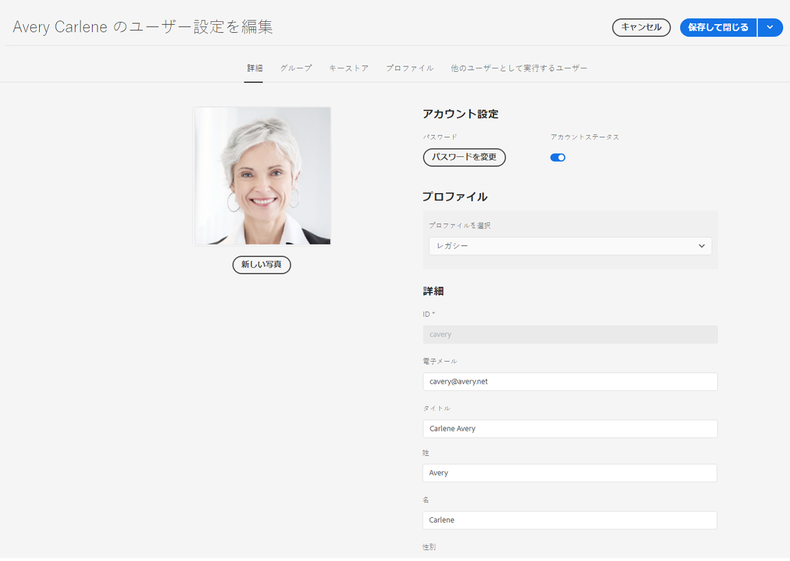

# Adobe Experience Manager as a Data Foundation のデータ保護およびデータプライバシーに関する規制に対する対応 {#aem-foundation-readiness-for-data-protection-and-data-privacy-regulations}

>[!WARNING]
>
>このドキュメントの内容は法的な助言にはならず、その代用になるものでもありません。
>
>データ保護およびデータプライバシー規制に関するアドバイスについては、自社の法務部門にお問い合わせください。

>[!NOTE]
>
>アドビのプライバシーに関する問題への対応と、アドビのお客様への影響について詳しくは、[アドビのプライバシーセンター](https://www.adobe.com/jp/privacy.html)をご覧ください。

## AEM Foundation のデータプライバシーと保護のサポート {#aem-foundation-data-privacy-and-protection-support}

AEM Foundation レベルでは、保存される個人データはユーザープロファイルに保持されます。そのため、この記事では主に、アクセスリクエストと削除リクエストに対処できるように、ユーザープロファイルのアクセス方法と削除方法について説明します。

## ユーザープロファイルへのアクセス {#accessing-a-user-profile}

### 手動の手順 {#manual-steps}

1. ユーザー管理コンソールを開きます。開くには、**[!UICONTROL ツール／セキュリティ／ユーザー]**&#x200B;を参照するか、または `https://<serveraddress>:<serverport>/security/users.html` を直接参照します。

<!--
   
-->

1. 次に、ページの上部にある検索バーに目的のユーザーの名前を入力して検索します。

   

1. 最後に、ユーザープロファイルをクリックして開き、「**[!UICONTROL 詳細]**」タブの下で情報を確認します。

   

### HTTP API {#http-api}

前述したように、自動化を促進するために、アドビではユーザーデータにアクセスするための API を用意しています。利用可能な API には、以下のようにいくつかのタイプがあります。

**UserProperties API**

```shell
curl -u user:password http://localhost:4502/libs/granite/security/search/profile.userproperties.json\?authId\=cavery
```

**Sling API**

**ユーザーホームの検索：**

```xml
curl -g -u user:password 'http://localhost:4502/libs/granite/security/search/authorizables.json?query={"condition":[{"named":"cavery"}]}'
     {"authorizables":[{"type":"user","authorizableId_xss":"cavery","authorizableId":"cavery","name_xss":"Carlene Avery","name":"Carlene Avery","home":"/home/users/we-retail/DSCP-athB1NYLBXvdTuN"}],"total":1}
```

**ユーザーデータを取得する:**

上記のコマンドで返された JSON ペイロードの home プロパティに含まれているノードパスの使用

```shell
curl -u user:password  'http://localhost:4502/home/users/we-retail/DSCP-athB1NYLBXvdTuN/profile.-1.json'
```

```shell
curl -u user:password  'http://localhost:4502/home/users/we-retail/DSCP-athB1NYLBXvdTuN/profiles.-1.json'
```

## ユーザーの無効化と関連プロファイルの削除 {#disabling-a-user-and-deleting-the-associated-profiles}

### ユーザーの無効化 {#disable-user}

1. 前述のように、ユーザー管理コンソールを開き、目的のユーザーを検索します。
2. ユーザーの上にポインタを合わせ、選択アイコンをクリックします。プロファイルがグレーに変わり、選択されたことが示されます。

3. 上部のメニューで、「**無効にする**」をクリックしてユーザーを無効（オフ）にします。

   

4. 最後に、アクションを確認します。

   次のように、プロファイルがグレー表示されてロックが追加されるので、ユーザーアカウントのアクティベーションが解除されたことがわかります。

   

### ユーザープロファイル情報の削除 {#delete-user-profile-information}

>[!NOTE]
>
>AEM as a Cloud Service の場合、CRXDE にアクセスできないので、UI からユーザープロファイルを削除するための手動の手順はありません。

### HTTP API {#http-api-1}

以下の手順では、`curl` コマンドラインツールを使用して **[!UICONTROL cavery]** `userId` を持つユーザーを無効にし、デフォルトの場所にあるそのユーザーのプロファイルを削除する方法を示します。

**ユーザーホームの検索：**

```shell
curl -g -u user:password 'http://localhost:4502/libs/granite/security/search/authorizables.json?query={"condition":[{"named":"cavery"}]}'
     {"authorizables":[{"type":"user","authorizableId_xss":"cavery","authorizableId":"cavery","name_xss":"Carlene Avery","name":"Carlene Avery","home":"/home/users/we-retail/DSCP-athB1NYLBXvdTuN"}],"total":1}
```

**ユーザーの無効化:**

上記のコマンドで返された JSON ペイロードの home プロパティに含まれているノードパスの使用

```shell
curl -X POST -u user:password -FdisableUser="describe the reasons for disabling this user (Data Privacy in this case)" 'http://localhost:4502/home/users/we-retail/DSCP-athB1NYLBXvdTuN.rw.userprops.html'
```

**ユーザープロファイルの削除**

アカウント検索コマンドから返された JSON ペイロードの home プロパティに含まれているノードパス、および既知のデフォルトのプロファイルノード位置を使用：

```shell
curl -X POST -u user:password -H "Accept: application/json,**/**;q=0.9" -d ':operation=delete' 'http://localhost:4502/home/users/we-retail/DSCP-athB1NYLBXvdTuN/profile'
```

```shell
curl -X POST -u user:password -H "Accept: application/json,**/**;q=0.9" -d ':operation=delete' 'http://localhost:4502/home/users/we-retail/DSCP-athB1NYLBXvdTuN/profile'
```
