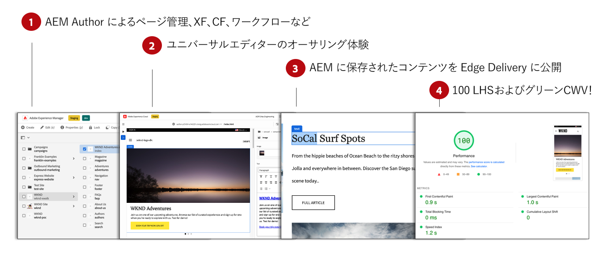
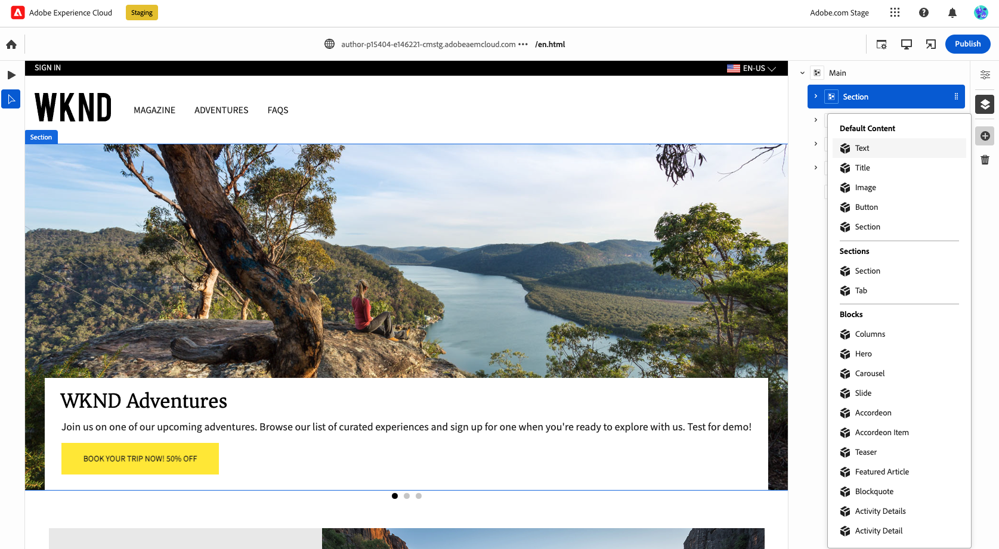

# Edge Delivery Services 向けのコンテンツのオーサリング {#authoring-edge}

Edge Delivery Services を使用すると、オーサリングが簡単、迅速、柔軟に行えます。Edge Delivery Services のコンテンツを作成する方法は 2 つあります。

* [ユニバーサルエディター](#universal-editor)：AEM 内でコンテンツをオーサリングするための最新の UI
* [ドキュメントベースのオーサリング](#document-based)：Microsoft Word や Google Docs など

## ユニバーサルエディターのオーサリング {#universal-editor}

AEM as a Cloud Service で Edge Delivery Services を使用する場合、作成したコンテンツが AEM as a Cloud Service に保持されるという最も基本的なことを必ず理解しておいてください。

1. [AEM オーサリング環境](/help/sites-cloud/authoring/quick-start.md)は、新しいページ、エクスペリエンスフラグメント、コンテンツフラグメントの作成などのコンテンツ管理に使用されます。
   * AEM のすべての機能（ワークフロー、MSM、翻訳、起動など）を使用できます。
1. [ユニバーサルエディター](/help/sites-cloud/authoring/universal-editor/authoring.md)は、AEM で管理されるコンテンツの作成に使用されます。
   * ユニバーサルエディターには、コンテンツオーサリング用の最新の UI が用意されています。
   * オーサリング時に、AEM は HTML をレンダリングしますが、それには、Edge Delivery Services から取得したスクリプト、スタイル、アイコン、その他のリソースが含まれます。
   * ユニバーサルエディターを使用しても、すべての変更は AEM に保持されます。
   * ユニバーサルエディターは現在、AEM ページエディターと同等の機能を備えていないため、AEM の一部の機能はユニバーサルエディターで使用できない場合があります。
1. ユニバーサルエディターで作成し、AEM に保持するコンテンツは、Edge Delivery Services に公開されます。
   * コンテンツは AEM に保存されたままになります。
   * AEM は、取り込みに必要なセマンティック HTML をレンダリングします。
   * コンテンツは Edge Delivery Services に公開されます。
1. [Edge Delivery Services](/help/edge/developer/keeping-it-100.md) は 100% の Lighthouse スコアを確保します。

ブロックは、Edge Delivery Services によって配信されるページの基本的なコンポーネントです。作成者は、アドビが標準で提供するデフォルトブロック、または開発者がプロジェクト用にカスタマイズしたブロックから選択できます。

ユニバーサルエディターには、ブロックをドラッグ＆ドロップしてコンテンツをオーサリングできる最新の直感的な GUI が用意されています。

ブロックの詳細は、プロパティパネルで設定できます。

ユニバーサルエディターを使用したオーサリング方法について詳しくは、[ユニバーサルエディターを使用したコンテンツのオーサリング](/help/sites-cloud/authoring/universal-editor/authoring.md)ドキュメントを参照してください。

AEM と Edge Delivery Services を使用してオーサリングする独自のプロジェクトを開始する方法については、[Edge Delivery Services を使用した AEM オーサリングの開発者向け入門ガイド](/help/edge/aem-authoring/edge-dev-getting-started.md)を参照してください。

## ドキュメントベースのオーサリング  {#document-based}

ドキュメントベースのオーサリングを使用する場合、Microsoft Word のドキュメントや Google Docs のドキュメントなどの様々なソースを扱うことができます。これらのソースからのドキュメントは、web サイト上のページになります。見出し、リスト、画像、フォント要素、ビデオはすべて、初期ソースから web サイトに転送できます。SEO 用にメタデータを追加したり、ブロックを使用して構造化コンテンツを操作したり、機能を追加したりできます。

ドキュメントベースのオーサリングについて詳しくは、[Edge Delivery Services ドキュメントに記載されているこのドキュメント](/help/edge/docs/authoring.md)を参照してください。

