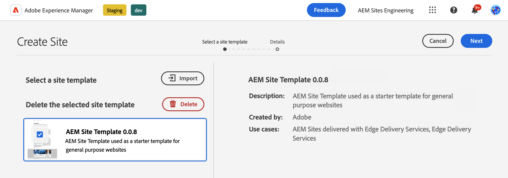
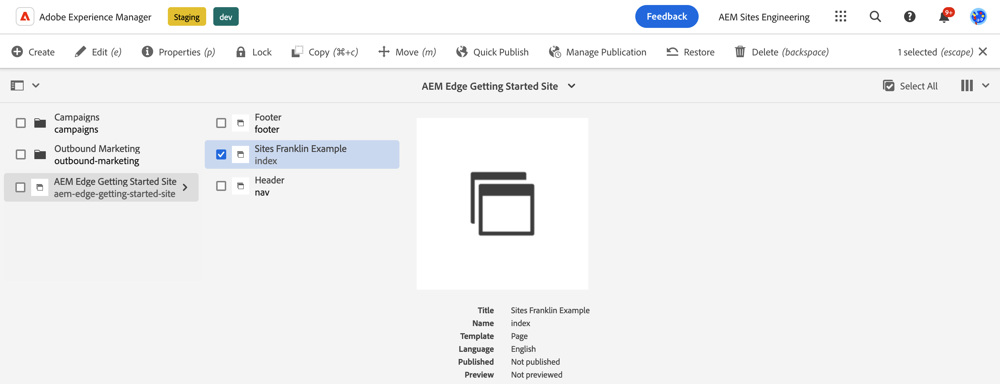

# Edge Delivery Services を使用した AEM オーサリングの開発者向け入門ガイド {#edge-dev-getting-started}

このガイドでは、Edge Delivery Services とコンテンツオーサリング用のユニバーサルエディターを使用して、新しい Adobe Experience Manager サイトを導入および実行する方法について説明します。

## 前提条件 {#prerequisites}

このガイドを始める前に、Edge Delivery Services に関する基本事項を理解し、Edge Delivery Services にアクセス可能な状態にしておく必要があります。次の項目について確認してください。

* [Edge Delivery Service のチュートリアル](/help/edge/developer/tutorial.md)を完了していること。
* [AEM Cloud Service サンドボックス](/help/implementing/cloud-manager/getting-access-to-aem-in-cloud/introduction-sandbox-programs.md)にアクセスできること。
* [同じサンドボックス環境でユニバーサルエディターが有効になっている](/help/implementing/universal-editor/getting-started.md)こと。

## 適切なエディタを選択 {#editor-choice}

AEM には 2 種類の異なるコンテンツエディターが用意されており、状況に応じて、適切なコンテンツエディターを選択して使用します。

* **ユニバーサルエディター** - 新しいサイトのデフォルトの選択肢です。
* **AEM ページエディター** - 既存の AEM Sites から Edge Delivery Services に移行する場合に選択します。　

このガイドでは、ユニバーサルエディターを活用して、Edge Delivery Services を使用した AEM プロジェクトに焦点を当てます。ドキュメントを参照 [AEMでのEdge Delivery Servicesの使用](/help/edge/using.md) 適切なエディターの選択と、既存のAEM サイトのEdge Delivery Servicesへの移行に関する詳細を説明します。

## Edge Delivery Services用に開発する際の中心概念 {#core-concepts}

Edge 配信サービスは、ブロックの概念に基づいています。AEM には、プロジェクトのニーズに合わせて拡張できる事前定義済みのブロックの包括的なライブラリが付属しています。Edge 配信サービスプロジェクトのコードは、GitHub で管理されます。

### ブロック {#blocks}

ブロックは、Edge Delivery Services で配信されるページの最も基本的な部分です。ブロックは、コンテンツページの論理コンポーネントを駆動するスタイルとコードをカプセル化します。

AEM では、プロジェクトのボイラープレート内の製品の一部として標準ブロックが用意されています。このようなブロックには、見出し、テキスト、画像、リンク、リストなどが含まれます。

>[!TIP]
>
>ブロックの詳細と Edge Delivery Services 向けの開発方法については、Edge Delivery Services ドキュメントの[ビルド](/help/edge/developer/block-collection.md)の節を参照してください。

### Edge Delivery Services と GitHub {#github-edge}

Edge Delivery Services では GitHub を活用しているので、GitHub リポジトリから直接コードを管理およびデプロイできます。

作成者は、ドキュメントベースのオーサリングを使用するか、ユニバーサルエディターを使用して AEM のコンテンツを作成できます。開発者は、作成者がコンテンツをどのように作成したかに関係なく、GitHub で CSS と JavaScript を使用してサイトの機能をカスタマイズできます。

コンテンツのプレビューから実稼動環境まで、ブランチごとに web サイトが自動的に作成されます。GitHub リポジトリに配置したすべてのリソースは、ビルドプロセスなしで web サイト上で使用できます。

>[!TIP]
>
>ブロックの詳細と Edge Delivery Services 向けの開発方法については、Edge Delivery Services ドキュメントの[ビルド](/help/edge/developer/block-collection.md)の節を参照してください。

## AEM オーサリングと Edge Delivery Services の概要 {#getting-started}

[前提条件](#prerequisites)を満たし、[ユニバーサルエディターの使用を選択](#editor-choice)したら、独自のプロジェクトを開始できます。

### GitHub プロジェクトを作成 {#create-github-project}

まず、アドビのテンプレートに基づいて、GitHub に新しいプロジェクトを作成する必要があります。

1. [`https://github.com/adobe-rnd/aem-boilerplate-xwalk`](https://github.com/adobe-rnd/aem-boilerplate-xwalk) に移動して「**このテンプレートを使用**」をクリックし、「**新しいリポジトリを作成**」を選択します。

   * このオプションを表示するには、GitHub にログインする必要があります。

   

1. デフォルトでは、リポジトリが割り当てられます。必要に応じてこれを変更し、リポジトリの名前と説明を入力して、「**リポジトリを作成**」をクリックします。

   

1. 同じブラウザーの新しいタブで [`https://github.com/apps/aem-code-sync`](https://github.com/apps/aem-code-sync) に移動し、「**設定**」をクリックします。

   

1. 前の手順で新しいリポジトリを作成した組織の「**設定**」をクリックします。

   

1. AEM Code Sync GitHub ページの&#x200B;**リポジトリアクセス**&#x200B;の下で、「**リポジトリのみを選択**」を選択し、前の手順で作成したリポジトリを選択して、「**保存**」をクリックします。

   

1. AEM Code Sync がインストールされると、確認画面が表示されます。新しいリポジトリの「ブラウザー」タブに戻ります。

   

1. `fstab.yaml` ファイルをクリックして開き、次に、「**このファイルを編集**」アイコンをクリックしてファイルを編集します。

   

1. `fstab.yaml` ファイルを編集して、プロジェクトのマウントポイントを更新します。デフォルトの Google ドキュメント URL を AEM as a Cloud Service オーサリングインスタンスの URL に置き換えて、「**変更をコミット...**」をクリックします。

   * `https://<aem-author>/bin/franklin.delivery/<owner>/<repository>/main`
   * マウントポイントを変更すると、Edge Delivery Services がサイトのコンテンツの場所を特定します。

   

1. 必要に応じてコミットメッセージを追加し、「**変更をコミット**」をクリックして、変更を `main` 分岐に直接コミットします。

   

1. リポジトリのルートに戻り、`paths.json` をクリックして、「**このファイルを編集**」アイコンをクリックします。

   

1. デフォルトのマッピングには、リポジトリの名前が使用されます。 プロジェクトに必要に応じて、以下を使用してデフォルトのマッピングを更新します `/content/<site-name>/:/` をクリックして、 **変更をコミット…**.

   * 独自の `<site-name>` を入力します。後の手順で必要になります。
   * マッピングは、Edge Delivery Services に対して、AEM リポジトリ内のコンテンツをサイトの URL にマッピングする方法を指示します。

   

1. 必要に応じてコミットメッセージを追加し、「**変更をコミット**」をクリックして、変更を `main` 分岐に直接コミットします。

   

### 新しい AEM サイトの作成と編集 {#create-aem-site}

GitHub プロジェクトが完成したら、プロジェクトで使用できる新しい AEM サイトを作成する必要があります。

>[!NOTE]
>
>ユニバーサルエディターを使用してサイトを編集するには、Chromium ベースのブラウザーを使用する必要があります。

1. GitHub から最新のAEM オーサリングとEdge Delivery Servicesのサイトテンプレートを次の場所でダウンロードします。 [`https://github.com/adobe-rnd/aem-boilerplate-xwalk/releases`](https://github.com/adobe-rnd/aem-boilerplate-xwalk/releases).

1. AEM as a Cloud Service オーサリングインスタンスにログインし、サイトコンソールに移動して、**作成**／**テンプレートからサイト**&#x200B;をタップまたはクリックします。

   

1. サイトの作成ウィザードの「**サイトテンプレートを選択**」タブで、「**読み込み**」ボタンをクリックして、新しいテンプレートを読み込みます。

   

1. GitHub からダウンロードしたAEM オーサリングとEdge Delivery Servicesのサイトテンプレートをアップロードします。

   * テンプレートは 1 回だけアップロードする必要があります。 アップロードした後は、再利用して追加のサイトを作成できます。

1. テンプレートが読み込まれると、ウィザードに表示されます。タップまたはクリックして選択し、「**次へ**」をタップまたはクリックします。

   

1. 次のフィールドを入力し、「**作成**」をタップまたはクリックします。

   * **サイトのタイトル** - サイトを説明するタイトルを追加します。
   * **サイトのタイトル** - [前の手順](#create-github-project)で定義した `<site-name>` を使用します。
   * **GitHub URL** - 前の手順で作成した GitHub プロジェクトの URL を使用します。

   

1. AEM にダイアログが表示され、サイトの作成を確認します。「**OK**」をタップまたはクリックして閉じます。

   

1. サイトコンソールで、新しく作成したサイトの `index.html` に移動し、ツールバーの「**編集**」をタップまたはクリックします。

   

1. ユニバーサルエディターが新しいタブで開きます。ページを編集するには、「**アドビでログイン**」をタップまたはクリックして認証する必要がある場合があります。

   

これで、ユニバーサルエディターを使用してサイトを編集できます。詳しくは、[ユニバーサルエディターのドキュメント](/help/sites-cloud/authoring/universal-editor/authoring.md)を参照してください。

### 新しいサイトの公開 {#publishing}

ユニバーサルエディターを使用して新しいサイトの編集が完了したら、コンテンツを公開できます。

1. サイトコンソールで、新しいサイト用に作成したすべてのページを選択し、ツールバーの「**クイック公開**」をタップまたはクリックします。

   

1. 確認ダイアログで「**公開**」をタップまたはクリックして、プロセスを開始します。

   

1. 同じブラウザーで新しいタブを開き、新しいサイトの URL に移動します。

   * `https://main--<site-name>--<owner>.hlx.page`

1. 公開されたコンテンツを確認します。

   

## 次の手順 {#next-steps}

これで、Edge Delivery Services プロジェクトを使用したAEMのオーサリングが完了したので、独自のブロックの作成とスタイル設定を開始できます。

詳細については、[ユニバーサルエディターで使用するために実装されたブロックの作成](/help/edge/aem-authoring/create-block.md)ガイドを参照してください。

>[!TIP]
>
>AEM as a Cloud Service as a コンテンツソースを使用したAEM オーサリングが可能な新しいEdge Delivery Servicesプロジェクトの作成に関するエンドツーエンドのチュートリアルについては、次を参照してください。 [このAEM GEMs ウェビナー](https://experienceleague.adobe.com/en/docs/events/experience-manager-gems-recordings/gems2024/aem-authoring-and-edge-delivery)

