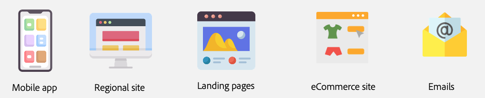

# オーサリング方法の選択 {#authoring-methods}

コンテンツ作成者が最適な決定を行うのに役立つ、AEM でのコンテンツのオーサリング方法を決定する際の重要な考慮事項について説明します。

## 考慮事項の概要 {#overview}

AEM の柔軟性により、ドキュメントベースのオーサリングを選択するか、WYSIWYG オーサリングを選択するかに関係なく、オーサリングのニーズを確実に満たすことができます。考慮を開始する際は、次の点に注意してください。

* **コンテンツ作成者を常に決定に関与させます。** - コンテンツ作成者はエキスパートであり、そのインサイトは非常に重要です。
* **複数のオーサリング方法を実装できます。** - アドビでは、シンプルな作業から開始して、必要に応じて複雑な作業を重ねることをお勧めしますが、複数のオーサリング方法を 1 つのプロジェクトで連携して作業できます。
* **オーサリング方法は、後からいつでも変更できます。** - どのような決定を行っても、それに縛られることはありません。アドビの自動移行ツールを使用すれば、ある方法から別の方法に変更するのは簡単です。
* **実装の前に決定をするのではなく、実装の一部として決定する必要があります。** - AEM は 1 つの統合製品なので、この重要な決定を契約交渉の一部にする必要はありません。AEM を購入すると、これらすべてを取得できます。むしろ、これは実装時の決定です。

アドビでは、実装の一環として、お客様の要件に最適な方法（複数可）を決定するお手伝いをいたします。

## 万能な方法は存在しない {#one-size}

AEM の実装ごとに、独自のワークフローと目標があります。あるプロジェクトには、コンテンツ作成者が自身のパブリケーションを担当するシンプルなオーサリングモデルが含まれる場合があります。一方、別のプロジェクトには、寄稿者と承認の複雑なネットワークが存在する場合があります。

プロジェクトごとに、異なる（複数の）ユースケースがある場合があります。

アドビでは、これを理解しているので、万能な方法のアプローチは提供しません。AEM は、ニーズに最適なコンテンツ配信とコンテンツ作成の様々なアプローチを提供する単一のソリューションです。

最適なアプローチを決定するには、4 つの項目を考慮する必要があります。

1. [コンテンツ配信の環境設定はありますか？](#content-delivery)
1. [コンテンツオーサリングの環境設定はありますか？](#content-authoring)
1. [プロジェクトの目標は何ですか？](#project-goals)
1. [現在、オーサリングはどのような課題に直面していますか？](#authoring-challenges)

## コンテンツ配信の環境設定 {#content-delivery}

まず考慮する必要があるのは、コンテンツの配信方法です。Edge Delivery Services では、非常に高速なサイトを提供しますが、ヘッドレス配信に焦点を合わせている場合があります。次のデシジョンツリーは、オプションを考慮する際に役立ちます。

これは、以下が必要かどうかを決定するのに役立ちます。

* コンテンツフラグメントエディターやユニバーサルエディターを使用する [AEM as a headless CMS](/help/headless/introduction.md)。
* [ ドキュメントベースの編集 ](/help/edge/docs/authoring.md) または [ ユニバーサルエディターを使用したWYSIWYG オーサリング ](/help/edge/wysiwyg-authoring/authoring.md) を使用したAEMEdge Delivery Services。

## コンテンツオーサリングの環境設定 {#content-authoring}

次に考慮する必要があるのは、コンテンツのオーサリング方法です。次のデシジョンツリーは、オプションを考慮する際に役立ちます。

これは、以下が必要かどうかを決定するのに役立ちます。

* [ ドキュメントベースの編集 ](/help/edge/docs/authoring.md) を使用してEdge Delivery ServicesをAEMします。
* [ ユニバーサルエディターを使用したWYSIWYGのオーサリング ](/help/edge/wysiwyg-authoring/authoring.md)。

## プロジェクトの目標 {#project-goals}

オーサリングの成功とは何ですか？プロジェクトの成功はどのように定義しますか？

* より多くの人物にコンテンツを作成できるようにする必要があるが、新しいツールセットに関するトレーニングは回避したいと考えている場合（ドキュメントベースのオーサリングを考慮している場合）。
* 生成するコンテンツの量を増やす必要がある場合（ドキュメントベースのオーサリングを考慮している場合）。
* 視覚的なコンテンツのレイアウトに焦点を合わせる必要があるが、コーディングに関する知識の必要性が最小限に抑えられている場合（WYSIWYG オーサリングを考慮している場合）。

実装の開始時にプロジェクト目標を明確にしておくと、十分な情報に基づいたオーサリング方法の決定を行うのに役立ちます。

## オーサリングにおける課題点 {#authoring-challenges}

最後に、コンテンツのオーサリングを行う際に直面している具体的な課題について考慮します。

* CMS の外部で作成されたコンテンツでは作業が重複し、読み込みまたはコピー＆ペーストが必要になる場合（ドキュメントベースのオーサリングを考慮している場合）。
* CMS の使用方法に関する作成者のトレーニングに必要な時間を短縮する必要がある場合（ドキュメントベースのオーサリングを考慮している場合）。
* 作成者はコンテンツの視覚的なレイアウトを頻繁に編集する必要があり、開発者による継続的なサポートが必要になる場合。（WYSIWYG オーサリングを考慮している場合）。
