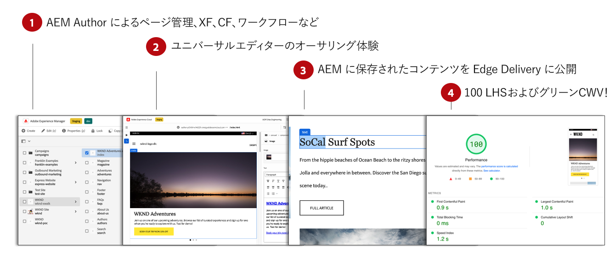
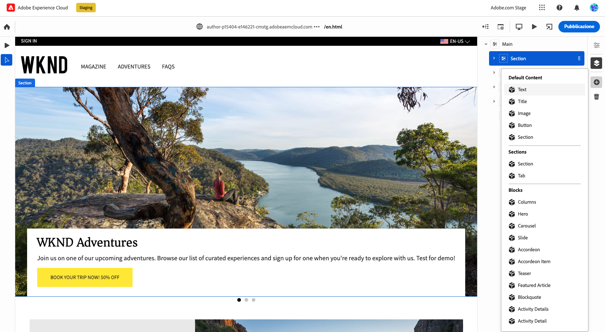
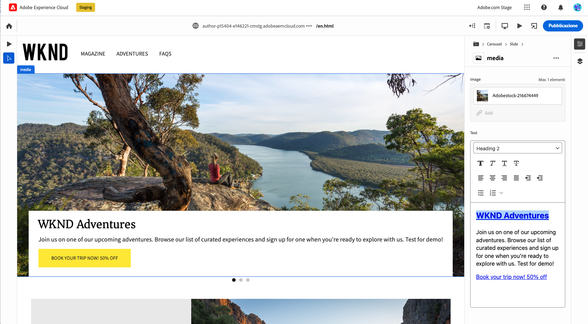

# Edge Delivery Services用コンテンツのオーサリング {#authoring-edge}

Edge 配信サービスを使用すると、オーサリングが簡単、迅速、柔軟に行えます。Edge Delivery Servicesのコンテンツを作成する方法は 2 つあります。

* [ドキュメントベースのオーサリング](#document-based) - Microsoft Word やGoogle Docs など
* [ユニバーサルエディター](#universal-editor) - AEM内でコンテンツをオーサリングするための最新の UI

## ドキュメントベースのオーサリング {#document-based}

ドキュメントベースのオーサリングの場合、Microsoft Word や Google Docs など、様々なソースを使用できます。これらのソースからのドキュメントは、web サイト上のページになります。見出し、リスト、画像、フォント要素、ビデオはすべて、初期ソースから web サイトに転送できます。SEO 用にメタデータを追加したり、ブロックを使用して構造化コンテンツを操作したり、機能を追加したりできます。

ドキュメントベースのオーサリングについて詳しくは、 [このドキュメントは、Edge Delivery Servicesドキュメントに記載されています。](/help/edge/docs/authoring.md)

## ユニバーサルエディターオーサリング {#universal-editor}

AEM as a Cloud ServiceでEdge Delivery Servicesを使用する場合、最も基本的な事実は、作成するコンテンツがAEM as a Cloud Serviceで保持されることです。

1. [AEMオーサリング環境](/help/sites-cloud/authoring/quick-start.md) は、新しいページ、エクスペリエンスフラグメント、コンテンツフラグメントの作成など、コンテンツ管理に使用されます。
   * AEMのすべての機能（ワークフロー、MSM、翻訳、起動など）を使用できます。
1. [ユニバーサルエディター](/help/sites-cloud/authoring/universal-editor/authoring.md) は、AEMで管理されるコンテンツの作成に使用されます。
   * ユニバーサルエディターは、コンテンツオーサリング用の新しい最新の UI を提供します。
   * オーサリング時に、AEMはHTMLをレンダリングしますが、Edge Delivery Servicesのスクリプト、スタイル、アイコン、その他のリソースが含まれます。
   * ユニバーサルエディターが使用されますが、すべての変更がAEMに保持されます。
   * ユニバーサルエディターはまだAEMページエディターと同等ではなく、AEMの一部の機能がユニバーサルエディターで使用できない場合があります。
1. ユニバーサルエディターで作成し、AEMに保持するコンテンツは、Edge Delivery Servicesに公開されます。
   * コンテンツはAEMに保存されたままです。
   * AEMは、取り込みに必要なセマンティックHTMLをレンダリングします。
   * コンテンツがEdge Delivery Servicesに公開される。
1. [Edge Delivery Services](/help/edge/developer/keeping-it-100.md) 100% Lighthouse のスコアを確認します。

ブロックは、ページの基本的な構成要素で、Edge Delivery Servicesが配信します。 作成者は、Adobeが標準として提供するデフォルトブロック、または開発者がプロジェクト用にカスタマイズしたブロックから選択できます。

ユニバーサルエディターは、ブロックをドラッグ&amp;ドロップしてコンテンツをオーサリングするための最新の直感的な GUI を提供します。

ブロックの詳細は、プロパティパネルで設定できます。

ユニバーサルエディターを使用したオーサリング方法の詳細については、ドキュメントを参照してください。 [ユニバーサルエディターを使用したコンテンツのオーサリング。](/help/sites-cloud/authoring/universal-editor/authoring.md)

AEM と Edge 配信サービスを使用してオーサリングする独自のプロジェクトを開始する方法については、[Edge 配信サービスを使用した AEM オーサリングの開発者向け入門ガイド](/help/edge/edge-dev-getting-started.md)を参照してください。

## 使用の手引き {#how-to-get-started}

この機能にアクセスするには、Adobe担当者にお問い合わせください。
