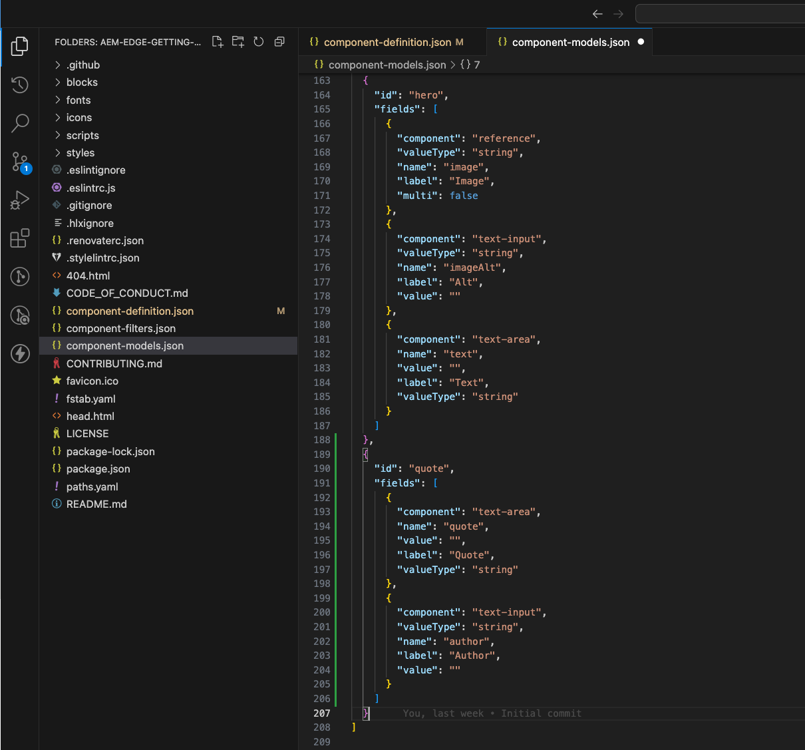
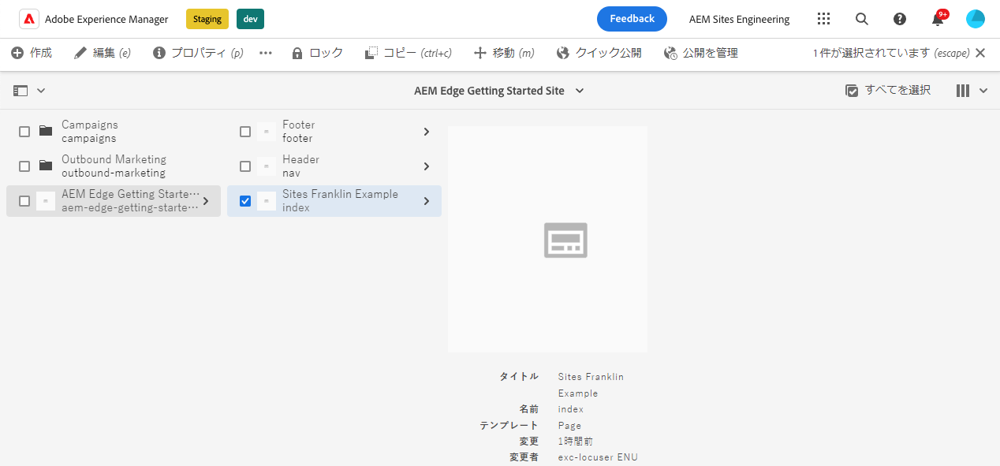
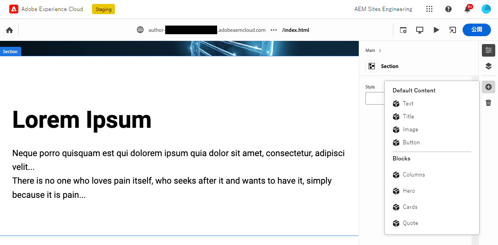
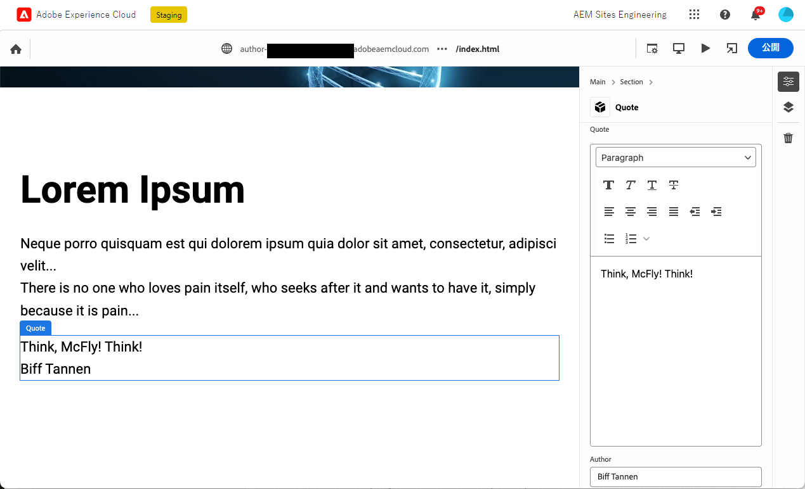
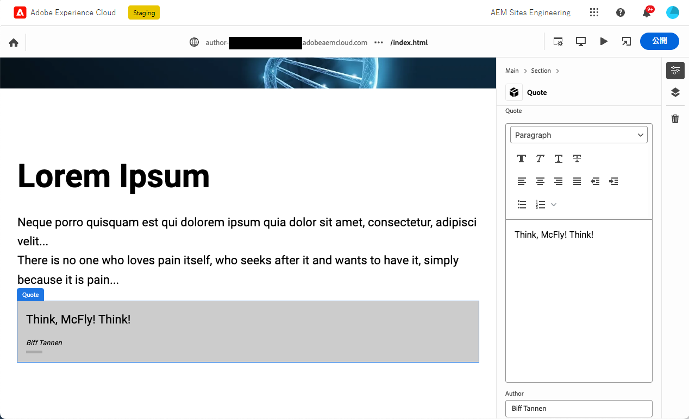

# ユニバーサルエディタで使用するためのブロックの作成 {#create-block}

Edge Delivery Servicesプロジェクトを使用したAEMオーサリングで、ユニバーサルエディターで使用するために実装されたブロックを作成する方法について説明します。

{{aem-authoring-edge-early-access}}

## 前提条件 {#prerequisites}

このガイドでは、Edge Delivery Servicesプロジェクトを使用したAEMオーサリングで、ユニバーサルエディター用に実装されたブロックを作成する手順を説明します。 ここでは、コンポーネントの追加、ユニバーサルエディターでのコンポーネント定義の読み込み、ページの公開、ブロック装飾とスタイルの実装、実稼動環境への変更の反映、および検証について説明します。 このガイドでは、独自のプロジェクト用の新しいブロックを作成してデプロイできます。

このガイドでは、必ずユニバーサルエディターと同様に、Edge Delivery Servicesプロジェクトを使用したAEMのオーサリングに関する既存の知識が必要です。 このガイドを始める前に、既にEdge Delivery Servicesにアクセスし、次のような基本事項を理解しておく必要があります。

* これで [エッジ配信サービスの口座です。](/help/edge/developer/tutorial.md)
* 次に対するアクセス権があります： [AEM Cloud Serviceサンドボックス。](/help/implementing/cloud-manager/getting-access-to-aem-in-cloud/introduction-sandbox-programs.md)
* お持ちの [は、同じサンドボックス環境でユニバーサルエディターを有効にしました。](/help/implementing/universal-editor/getting-started.md)
* これで [Edge Delivery Servicesを使用したAEMオーサリングのための Developer Getting Guide](/help/edge/edge-dev-getting-started.md) ガイド。

このガイドは、 [Edge Delivery Servicesを使用したAEMオーサリングのための Developer Getting Guide](/help/edge/edge-dev-getting-started.md) ガイド。

## プロジェクトへの新しいブロックの追加 {#add-block}

このガイドでは、ページ上に記憶に残る引用符をレンダリングするブロックを作成します。

この例を簡略化するために、 `main` プロジェクトリポジトリのブランチ。 もちろん実際のプロジェクトには [開発のベストプラクティスに従う必要がある](https://www.aem.live/docs/dev-collab-and-good-practices) 別のブランチで開発し、にマージする前にプルリクエストを介してすべての変更をレビューすることで、 `main`.

Adobeでは、次の 3 段階の方法でブロックを作成することをお勧めします。

1. ブロックの定義とモデルを作成し、確認して、実稼動環境に取り込みます。
1. 新しいブロックでコンテンツを作成します。
1. 新しいブロックの装飾とスタイルを実装します。

次の引用ブロックの例は、この方法に従っています。

### ブロック定義とモデルを作成する {#create-block-model}

1. GitHub プロジェクトを、 [Edge Delivery Servicesを使用したAEMオーサリングのための Developer Getting Guide](/help/edge/edge-dev-getting-started.md) ガイドを開き、任意のエディターで開きます。

   * Microsoft Code は、ここで例として使用されます。

   

1. を編集します。 `component-definition.json` ファイルをプロジェクトのルートに追加し、新しい引用符ブロックに次の定義を追加して、ファイルを保存します。

   ```json
   {
     "title": "Quote",
     "id": "quote",
     "plugins": {
       "xwalk": {
         "page": {
           "resourceType": "core/franklin/components/block/v1/block",
           "template": {
             "name": "Quote",
             "model": "quote",
             "quote": "<p>Think, McFly! Think!</p>",
             "author": "Biff Tannen"
           }
         }
       }
     }
   }
   ```

   

1. を編集します。 `component-models.json` ファイルをプロジェクトのルートに作成し、次の内容を追加します。 [モデル定義](/help/implementing/universal-editor/field-types.md#model-structure) 新しい見積もりブロックに対して、ファイルを保存します。

   * ドキュメントを参照してください [コンテンツプロジェクトを使用したAEMオーサリング用のコンテンツモデリングEdge Delivery Services](/help/edge/content-modeling.md) コンテンツモデルを作成する際に考慮すべき重要な事項の詳細については、を参照してください。

   ```json
   {
     "id": "quote",
     "fields": [
        {
          "component": "text-area",
          "name": "quote",
          "value": "",
          "label": "Quote",
          "valueType": "string"
        },
        {
          "component": "text-input",
          "valueType": "string",
          "name": "author",
          "label": "Author",
          "value": ""
        }
      ]
   }
   ```

   

1. を編集します。 `component-filters.json` ファイルをプロジェクトのルートに作成し、見積もりブロックを [フィルター定義](/help/implementing/universal-editor/customizing.md#filtering-components) を使用して、ブロックを任意のセクションに追加し、ファイルを保存できます。

   ```json
   {
     "id": "section",
     "components": [
       "text",
       "image",
       "button",
       "title",
       "hero",
       "cards",
       "columns",
       "quote"
      ]
   }
   ```

   

1. Git を使用して、変更を `main` 分岐。

   * 次にコミット中 `main` は、例としてのみ使用します。 [ベストプラクティスに従う](https://www.aem.live/docs/dev-collab-and-good-practices) 実際のプロジェクト作業にプルリクエストを使用します。

### ブロックを含むコンテンツを作成 {#create-content}

基本的な見積もりブロックが定義され、サンプルプロジェクトにコミットされたので、既存のページに見積もりブロックを追加できます。

1. ブラウザーで、AEM as a Cloud Serviceにログインします。 [サイトコンソールの使用](/help/sites-cloud/authoring/basic-handling.md) で作成したサイトに移動します。 [Edge Delivery Servicesを使用したAEMオーサリングのための Developer Getting Guide](/help/edge/edge-dev-getting-started.md) ガイドを参照し、ページを選択します。

   * この場合、 `index` は、例として使用されます。

   

1. タップまたはクリック **編集** コンソールのツールバーに、ユニバーサルエディターが開きます。

   * ページを読み込むには、タップまたはクリックする必要がある場合があります **ログインとAdobe** を使用して、ユニバーサルエディターでAEMに対して認証を行います。

1. ユニバーサルエディタで、セクションを選択します。 プロパティレールで、「 **追加** アイコンをクリックし、新しい **見積もり** ブロックをメニューから削除します。

   * The **追加** icon はプラス記号です。
   * 選択したオブジェクトの青い輪郭にタブが付いている場合、断面が選択されていることがわかります。 **セクション**.
   * この例では、 **Lorem Ipsum** heading は、見出しと lorem ipsum テキストを含むセクションを選択します。

   

1. ページが再読み込みされ、引用符ブロックが選択したセクションの下部に追加され、 `component-definitions.json` ファイル。

   * 見積もりブロックは、その場で、またはプロパティレールで、他のブロックとして選択および編集できます。
   * スタイル設定は、後の手順で適用します。

   

1. 見積もりの内容に満足したら、「 **公開** ボタンをクリックします。

1. 公開済みのページに移動して、コンテンツが公開されたことを確認します。 リンクは次のようになります。 `https://<branch>--<repo>--<owner>.hlx.page`

   

### ブロックのスタイル設定 {#style-block}

作業用の見積もりブロックが作成されたので、そのブロックにスタイルを適用できます。

1. プロジェクトのエディターに戻ります。

1. の作成 `quote` フォルダーの下に `blocks` フォルダー。

   

1. 新しい `quote` フォルダー、追加 `quote.js` ファイルを編集し、次の JavaScript を追加してブロックデコレーションを実装し、ファイルを保存します。

   ```javascript
   export default function decorate(block) {
     const [quoteWrapper] = block.children;
   
     const blockquote = document.createElement('blockquote');
     blockquote.textContent = quoteWrapper.textContent.trim();
     quoteWrapper.replaceChildren(blockquote);
   }
   ```

   


1. Adobe Analytics の `quote` フォルダー、追加 `quote.css` ファイル：次の CSS コードを追加して、ブロックのスタイルを定義し、ファイルを保存します。

   ```css
   .block.quote {
       background-color: #ccc;
       padding: 0 0 24px;
       display: flex;
       flex-direction: column;
       margin: 1rem 0;
   }
   
   .block.quote blockquote {
       margin: 16px;
       text-indent: 0;
   }
   
   .block.quote > div:last-child > div {
       margin: 0 16px;
       font-size: small;
       font-style: italic;
       position: relative;
   }
   
   .block.quote > div:last-child > div::after {
       content: "";
       display: block;
       position: absolute;
       left: 0;
       bottom: -8px;
       height: 5px;
       width: 30px;
       background-color: darkgray;
   }
   ```

   

1. Git を使用して、変更を `main` 分岐。

   * 次にコミット中 `main` は、例としてのみ使用します。 [ベストプラクティスに従う](https://www.aem.live/docs/dev-collab-and-good-practices) 実際のプロジェクト作業にプルリクエストを使用します。

1. プロジェクトのページを編集していたユニバーサルエディターのブラウザータブに戻り、ページを再読み込みしてスタイルを設定したブロックを表示します。

1. ページ上のスタイル設定された引用符ブロックを表示します。

   

1. 変更が実稼動環境にプッシュされたことを確認するには、公開済みのページに移動します。 リンクは次のようになります。 `https://<branch>--<repo>--<owner>.hlx.page`

   

これですべて完了です。これで、完全に機能し、スタイル設定された見積もりブロックが作成されました。 この例を基に、独自のプロジェクト固有のブロックを設計できます。

## 他の作業ブランチの使用 {#other-branches}

このガイドでは、 `main` 分岐は、簡潔さのために。 サンプルリポジトリで実験を行う場合、これは通常問題にはなりません。 実際のプロジェクト作業の場合、 [開発のベストプラクティスに従う必要がある](https://www.aem.live/docs/dev-collab-and-good-practices) 別のブランチで開発し、にマージする前にプルリクエストを介してすべての変更をレビューすることで、 `main`.

を `main` ブランチを追加するには、 `?ref=<branch>` （ユニバーサルエディターのロケーションバー）を使用して、ブランチからページを読み込みます。 `<branch>` は、プロジェクトのプレビューまたはライブ URL に使用されるブランチ名です。例： `https://<branch>--<repo>--<owner>.hlx.page`.

新しいモデルでのコンテンツの公開は、モデルが `main` 分岐。
