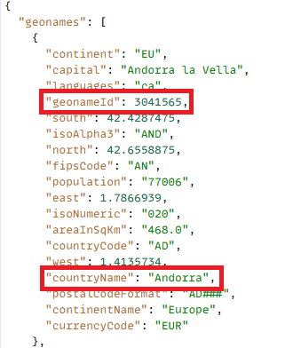
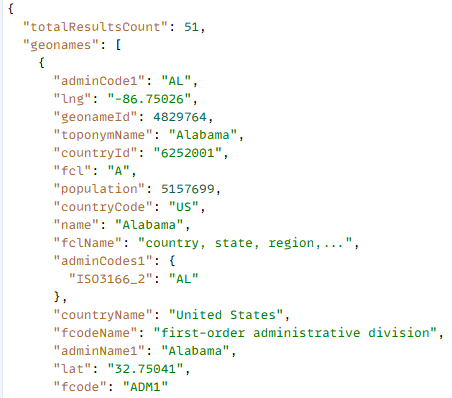

# API 統合を作成

このチュートリアルでは、2 個の API 統合が作成されます。

- GetAllCountries は、国のリストを返します
- GetChildren - geonameId で表される国または都道府県の直下の子を返します

## GetAllCountries - API 統合の設定

- API 統合の設定

   - 表示名：GetAllCountries → システム内のこの API のラベル。

   - API URL：`https://secure.geonames.org/countryInfoJSON` - 呼び出すエンドポイント。

   - HTTP メソッド：GET - シンプルな GET リクエストを作成します。

   - コンテンツタイプ：JSON - 応答は JSON 形式で返されます。

- オプション：

   - 暗号化は必須をオフ -  HTTPS 以外の暗号化レイヤーはありません。

   - クライアントで実行をオン - 呼び出しは、サーバーサイドではなく、クライアント／ブラウザーから実行されます。
- 認証タイプ
   - なし - GeoNames API はヘッダーに OAuth や API キーを必要としないので
- 入力：
   - 入力セクションでは、API に送信される内容を定義します
   - **ユーザー名** → タイプ：文字列、クエリで送信、デフォルト：gbedekar。
   - すべてのリクエストでは、URL に ?username=gbedekar を追加します
- 出力
   - 出力は、JSON 応答から抽出して使用するフィールドを定義します。
GeoNames 応答は次のようになります。

  
   - geonames 配列内から 2 つのフィールドをマッピングしました。

     geonames[*].geonameId → 数値として

     geonames[*].countryName → 文字列として

     [*] は、配列内の国ごとに繰り返されることを意味します。

## GetChildren

geonamesId がクエリパラメーターとして渡される場所の直下の子を GeoNames に要求します

- API 統合の設定

   - 表示名：GetAllCountries → システム内のこの API のラベル。

   - API URL：`https://secure.geonames.org/children` → 呼び出すエンドポイント。

   - HTTP メソッド：GET → シンプルな GET リクエストを作成します。

   - コンテンツタイプ：JSON → 応答は JSON 形式で返されます。

- オプション：

   - 暗号化は必須をオフ → HTTPS 以外の暗号化レイヤーはありません。

   - クライアントで実行をオン → 呼び出しは、サーバーサイドではなく、クライアント／ブラウザーから実行されます。
- 認証タイプ
   - なし - GeoNames API はヘッダーに OAuth や API キーを必要としないので
- 入力：
   - API に送信される内容を定義します
   - **ユーザー名** → タイプ：文字列、クエリで送信、デフォルト：gbedekar。
   - すべてのリクエストでは、URL に ?username=gbedekar を追加します
   - **geonameId** -> タイプ：文字列。geonameId で表される国／都道府県の子を返します
   - **タイプ** =>文字列。JSON に設定すると、応答は JSON 形式で返されます。
- 出力
   - JSON 応答から抽出され、使用されるフィールドを定義します。
GeoNames 応答は次のようになります。

  
   - geonames 配列内から 2 つのフィールドをマッピングしました。

     geonames[*].geonameId → 数値として

     geonames[*].name → 文字列として

     [*] は、配列内の国ごとに繰り返されることを意味します。

